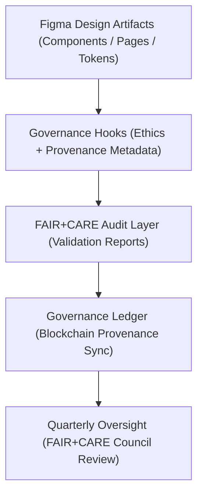

<div align="center">

# ⚖️ Kansas Frontier Matrix — **Figma Governance & Ethical Oversight Framework**
`docs/design/figma/governance/README.md`

**Purpose:**  
Defines the **governance, audit, and ethical validation structure** applied to all Figma-based prototypes and UI assets in the Kansas Frontier Matrix (KFM).  
Ensures each design iteration adheres to **FAIR+CARE**, **ISO 37000**, and **MCP-DL v6.3** governance standards, linking every visual decision to an immutable ethics and provenance record.

[](../../../../docs/standards/faircare-validation.md)
[]()
[]()
[](../../../../LICENSE)

</div>

---

## 📚 Overview

The **Figma Governance & Ethical Oversight Framework** establishes a transparent and traceable system of accountability for UI design, data visualization, and user interaction decisions within the KFM ecosystem.  
This ensures that **design ethics, accessibility, and provenance** are governed with the same rigor as scientific or data-based workflows.

All governance validations are automatically:
- Logged into **FAIR+CARE governance telemetry (`focus-telemetry.json`)**.  
- Audited by the **FAIR+CARE Council** on a quarterly basis.  
- Cross-verified against **ISO 37000 ethical governance** and **ISO 19115 metadata lineage** standards.  

---

## 🧭 Figma Governance Architecture



### Governance Layers

| Layer | Description | Implemented In |
|--------|--------------|----------------|
| **Figma Design Artifacts** | Source files (components, layouts, tokens). | Figma Cloud Library |
| **Governance Hooks** | Embedded metadata: authorship, purpose, provenance, ethics. | Figma Metadata Plugin |
| **Audit Layer** | Automated report validation using FAIR+CARE governance plugin. | `tools/governance/figma-audit.js` |
| **Ledger Sync** | Records change hashes and audit IDs in provenance ledger. | `releases/v9.6.0/focus-telemetry.json` |
| **Oversight Review** | FAIR+CARE Council performs quarterly design ethics audit. | `reports/audit/ui_design_governance.json` |

---

## 🧠 Core Governance Principles for Design

| Principle | Implementation | Verified By |
|------------|----------------|--------------|
| **Transparency** | Every design iteration logged in Figma’s version history and FAIR+CARE ledger. | @kfm-governance |
| **Accountability** | Named validation of each designer for traceability. | @kfm-design |
| **Inclusivity** | Accessibility testing integrated into design review. | @kfm-accessibility |
| **Reproducibility** | All design tokens versioned and auditable. | @kfm-data |
| **Ethics by Design** | Cultural, historical, and ecological sensitivities reviewed before publishing. | @kfm-ethics |
| **Open Governance** | All ethics audits open for council and public verification. | @faircare-council |

---

## 🧩 Figma Governance Metadata Schema

```json
{
  "design_id": "figma_governance_ui_v9.6.0",
  "component": "Governance Drawer",
  "designer": "@kfm-design",
  "audit_cycle": "Q4 2025",
  "a11y_score": 98.7,
  "faircare_certified": true,
  "ethics_review_status": "passed",
  "checksum_sha256": "a4f7b9e93d3c2b8...",
  "governance_ledger_ref": "data/reports/audit/ui_design_governance.json",
  "timestamp": "2025-11-03T18:45:00Z"
}
```

All design changes are cryptographically hashed, signed, and validated through `data/reports/audit/data_provenance_ledger.json`.

---

## ⚙️ Governance Review Workflow

1. **Design Submission** — Figma component or page committed for governance review.  
2. **Automated FAIR+CARE Audit** — Scripts validate accessibility, provenance, and token ethics.  
3. **Human Oversight** — FAIR+CARE Council reviews ethical and inclusivity context.  
4. **Checksum Registration** — Approved design logged to blockchain-based ledger.  
5. **Publication & Traceability** — Final designs versioned and referenced in manifest files.  

---

## 📊 Governance Review Dashboard Metrics

| Metric | Description | Target | Verified By |
|---------|--------------|---------|--------------|
| **Accessibility Coverage** | % of Figma components meeting WCAG 2.2 AA. | ≥ 95% | @kfm-accessibility |
| **FAIR+CARE Certification Rate** | Proportion of audited designs achieving ethical certification. | 100% | @faircare-council |
| **Governance Record Integrity** | Percentage of successful ledger registrations. | 100% | @kfm-governance |
| **Design Token Reuse** | Ratio of reusable tokens across layouts. | ≥ 90% | @kfm-design |
| **Energy Efficiency** | Compute carbon impact of design export/render. | ≤ 10 Wh | @kfm-sustainability |

Telemetry data logged in:  
`releases/v9.6.0/focus-telemetry.json`

---

## ⚖️ FAIR+CARE Design Governance Matrix

| Principle | Implementation | Oversight |
|------------|----------------|------------|
| **Findable** | All design assets indexed by unique checksum IDs. | @kfm-data |
| **Accessible** | Open Figma libraries with accessibility tagging. | @kfm-accessibility |
| **Interoperable** | Tokens synchronized across Figma, CSS, and Tailwind. | @kfm-architecture |
| **Reusable** | Design modules shared across KFM and FAIR+CARE platforms. | @kfm-design |
| **Collective Benefit** | Promotes cultural respect and inclusive representation. | @faircare-council |
| **Authority to Control** | FAIR+CARE Council verifies ethical sign-off for each artifact. | @kfm-governance |
| **Responsibility** | Governance metadata logged per iteration cycle. | @kfm-security |
| **Ethics** | All designs undergo cultural and accessibility sensitivity audits. | @kfm-ethics |

---

## 🔐 Governance Audit Record Example

```json
{
  "audit_id": "gov_audit_figma_ui_v9.6.0_2025Q4",
  "auditor": "@kfm-governance",
  "artifacts_reviewed": 114,
  "issues_detected": 0,
  "certifications_issued": 114,
  "fairstatus": "certified",
  "pgp_signature": "pgp-sha256:<signature-id>",
  "timestamp": "2025-11-03T19:00:00Z"
}
```

Audit logs published quarterly to:  
`releases/governance/ledger_snapshot_2025Q4.json`

---

## 🧩 Governance Design Tokens (Ethics Layer)

| Token | Description | Purpose |
|--------|--------------|----------|
| `--governance-badge-certified` | Gold Diamond⁹ Ω certification color. | Indicates full FAIR+CARE approval. |
| `--ethics-alert-color` | Deep red tone for ethical conflict alerts. | Visual ethics awareness signal. |
| `--provenance-highlight` | Blue accent for checksum display backgrounds. | Provenance visibility. |
| `--audit-pass-color` | Green tone for validated components. | Transparency assurance. |
| `--audit-fail-color` | Amber tone for pending council review. | Ethics workflow cue. |

---

## 🌱 Sustainable Governance Practices

| Practice | Description | Verified By |
|-----------|--------------|--------------|
| **Immutable Ledger Sync** | Blockchain provenance logging for all approved designs. | @kfm-governance |
| **RE100-Backed Compute** | All governance audits powered by renewable infrastructure. | @kfm-sustainability |
| **AI Ethics Validation** | Automated bias and inclusivity scans using explainability models. | @kfm-ai |
| **Governance Audit Retention** | 100% of reports archived permanently for reproducibility. | @kfm-security |

---

## 🧾 Internal Use Citation

```text
Kansas Frontier Matrix (2025). Figma Governance & Ethical Oversight Framework (v9.6.0).
Defines the ethical design governance model integrating FAIR+CARE validation, ISO 37000 oversight, and blockchain-backed provenance tracking for all Figma prototypes and UI assets.
Ensures transparency, accountability, and cultural sensitivity in every visual design decision.
```

---

## 🧾 Version Notes

| Version | Date | Notes |
|----------|------|--------|
| v9.6.0 | 2025-11-03 | Introduced checksum-backed audit and FAIR+CARE Figma governance telemetry. |
| v9.5.0 | 2025-11-02 | Added renewable governance infrastructure validation. |
| v9.3.2 | 2025-10-28 | Established foundational governance metadata for Figma design compliance. |

---

<div align="center">

**Kansas Frontier Matrix** · *Design Integrity × FAIR+CARE Governance × Ethical Transparency*  
[🔗 Repository](https://github.com/bartytime4life/Kansas-Frontier-Matrix) • [🎨 Design Docs](../README.md) • [⚖️ Governance Ledger](../../../../docs/standards/governance/DATA-GOVERNANCE.md)

</div>