<div align="center">

# 🧠 Kansas Frontier Matrix — **Figma Prototypes & Interaction Framework**
`docs/design/figma/prototypes/README.md`

**Purpose:**  
Defines the **prototype structure, interaction design system, and governance integration** for all Figma-based mockups in the Kansas Frontier Matrix (KFM).  
This framework aligns UI prototypes with **FAIR+CARE**, **ISO 9241-210**, and **MCP-DL v6.3** principles, ensuring ethical transparency, accessibility, and provenance across design-to-development workflows.

[](../../../../docs/standards/faircare-validation.md)
[]()
[]()
[](../../../../LICENSE)

</div>

---

## 📚 Overview

The **Figma Prototypes Framework** governs how user interactions, animations, and ethical UI behaviors are modeled and tested in design environments before implementation.  
Every prototype follows FAIR+CARE governance, linking interaction flows to telemetry events, accessibility validations, and blockchain-logged design audits.

This framework supports:
- **End-to-end traceability** from Figma mockups to React components.  
- **Accessibility-first prototyping** using inclusive tokens and auto-annotated metadata.  
- **Governance-linked design decision tracking** for audit readiness.  
- **FAIR+CARE alignment** for ethical design operations and sustainability verification.  

---

## 🧭 Prototype Architecture Framework


### Architectural Layers

| Layer | Description | Source |
|--------|--------------|--------|
| **Design Tokens** | Core design variables defining color, spacing, and motion. | `docs/design/tokens/` |
| **Components** | Modular Figma elements connected to accessibility properties. | `docs/design/figma/components/` |
| **Interactive Frames** | Linked artboards simulating real user journeys. | Figma `@KFM-Prototypes` |
| **Governance Sync** | FAIR+CARE audit layer tracking ethics and validation telemetry. | `releases/v9.6.0/focus-telemetry.json` |

---

## 🧩 Core Prototype Types

| Prototype Type | Description | FAIR+CARE Purpose |
|----------------|--------------|-------------------|
| **Focus Mode Prototype** | Entity-based map and timeline interaction model. | Transparency and contextual learning. |
| **Governance Dashboard Prototype** | Ethics and provenance management interface. | Accountability and oversight. |
| **AI Explainability Panel Prototype** | Explains model reasoning and confidence layers. | Interpretability and fairness. |
| **Data Explorer Prototype** | Navigates tabular, spatial, and temporal datasets. | Accessibility and comprehension. |
| **Storytelling Timeline Prototype** | Synchronizes narrative with spatial data. | Empathy-driven ethical design. |
| **User Settings Prototype** | Configures accessibility and ethical preferences. | Authority to Control. |

---

## ⚙️ Interaction Mapping Workflow

```mermaid
flowchart TD
    A["Prototype Frame Setup"] --> B["Interactive Link Creation (Button / Hover / Transition)"]
    B --> C["Accessibility Validation (Keyboard + Motion)"]
    C --> D["FAIR+CARE Metadata Embedding (Design Tokens + Labels)"]
    D --> E["Telemetry Sync → focus-telemetry.json"]
```



### Interaction Rules

| Rule | Description | Compliance |
|-------|--------------|-------------|
| **All navigation must include tab order sequencing.** | Ensures keyboard-only accessibility. | WCAG 2.1.1 |
| **All transitions respect reduced-motion preferences.** | Auto-detected from OS accessibility settings. | WCAG 2.3.3 |
| **Ethical confirmations required for sensitive modals.** | Applies to governance and AI explainability panels. | FAIR+CARE Authority |
| **Prototypes must define ARIA roles for focusable elements.** | Ensures assistive tech compatibility. | ISO 9241-171 |
| **Governance metadata required for public-facing designs.** | Integrates ethics context within UI frames. | FAIR+CARE Ethics |

---

## 🧠 Prototype Metadata Schema

```json
{
  "prototype_id": "focus_mode_dashboard_v9.6.0",
  "designer": "@kfm-design",
  "frames_count": 128,
  "interaction_flows": 47,
  "a11y_validated": true,
  "motion_reduced_mode": true,
  "faircare_status": "certified",
  "governance_hash": "sha256:5c91b3ad99a88d...",
  "linked_telemetry": "releases/v9.6.0/focus-telemetry.json",
  "timestamp": "2025-11-03T19:45:00Z"
}
```

---

## ♿ Accessibility & Inclusivity Standards

| Standard | Requirement | Implementation |
|-----------|--------------|----------------|
| **WCAG 2.2 AA** | Text contrast ≥ 4.5:1; keyboard operability. | Color tokens, ARIA roles. |
| **ISO 9241-210** | Human-centered interaction design principles. | Iterative feedback testing. |
| **ISO 9241-171** | Accessibility of software interfaces. | Focus and navigation structure. |
| **FAIR+CARE** | Inclusive interaction and cognitive empathy design. | Ethical feedback and validation overlays. |

---

## 🧱 Prototype Composition Patterns

| Pattern | Description | Ethical Purpose |
|----------|--------------|------------------|
| **Split-View Frame** | Combines visual and textual data perspectives. | FAIR Accessibility |
| **Governance Overlay** | Displays provenance and ethical data compliance. | CARE Responsibility |
| **Drift Indicator Animation** | Highlights evolving data states transparently. | ISO 19115 Provenance |
| **AI Explanation Tooltip** | On-hover contextual reasoning popup. | FAIR Transparency |
| **Validation Toasts** | Confirms successful or failed governance operations. | Accountability |
| **Feedback Loop Banner** | Invites ethical or accessibility feedback in context. | Collective Benefit |

---

## 🧩 Figma Interaction Components

| Component | Purpose | Governance Hook |
|------------|----------|-----------------|
| **Button / Link** | Navigation or command trigger. | Telemetry record + ethics tag. |
| **Modal** | Captures focus mode explanations or consent. | Governance audit entry. |
| **Card** | Displays dataset summary or validation badge. | FAIR+CARE certification token. |
| **Sidebar / Drawer** | Lists audit results or provenance details. | Provenance metadata feed. |
| **Timeline Slider** | Scrubs through time-linked data. | Focus telemetry mapping. |
| **Tooltip / Callout** | Contextual explanations tied to AI features. | Explainability log entry. |

---

## ⚖️ FAIR+CARE Prototype Governance Matrix

| Principle | Implementation | Verified By |
|------------|----------------|--------------|
| **Findable** | Prototypes indexed with manifest-linked metadata. | @kfm-data |
| **Accessible** | All prototypes validated under WCAG 2.2 AA. | @kfm-accessibility |
| **Interoperable** | Figma prototypes map to React component structure. | @kfm-architecture |
| **Reusable** | Reusable frames exported for component scaling. | @kfm-design |
| **Collective Benefit** | Prioritizes inclusive design across cultural contexts. | @faircare-council |
| **Authority to Control** | Ethical modals and governance drawers embedded. | @kfm-governance |
| **Responsibility** | All prototypes undergo accessibility and energy audits. | @kfm-telemetry |
| **Ethics** | Storytelling and visuals adhere to cultural respect guidelines. | @kfm-ethics |

---

## 📊 Prototype Validation Telemetry

```json
{
  "event_id": "prototype_validation_focusmode_v9.6.0",
  "frames_tested": 64,
  "interactive_elements": 312,
  "keyboard_nav_pass": true,
  "contrast_ratio_avg": 4.9,
  "motion_reduction_enabled": true,
  "faircare_score": 99.1,
  "governance_logged": true,
  "timestamp": "2025-11-03T19:50:00Z"
}
```

Telemetry validation recorded under:  
`releases/v9.6.0/focus-telemetry.json`

---

## 🌱 Sustainable Design Metrics

| Metric | Target | Verified By |
|---------|---------|--------------|
| Frame Reusability | ≥ 90% | @kfm-design |
| Accessibility Coverage | ≥ 95% | @kfm-accessibility |
| FAIR+CARE Certification | 100% | @faircare-council |
| Energy Consumption per Prototype | ≤ 15 Wh | @kfm-sustainability |

All sustainability metrics monitored through governance telemetry.

---

## 🧾 Internal Use Citation

```text
Kansas Frontier Matrix (2025). Figma Prototypes & Interaction Framework (v9.6.0).
Outlines FAIR+CARE-certified, ISO 9241-compliant methods for designing, validating, and governing interactive prototypes.
Ensures traceable, ethical, and accessible prototyping workflows across the KFM ecosystem.
```

---

## 🧾 Version Notes

| Version | Date | Notes |
|----------|------|--------|
| v9.6.0 | 2025-11-03 | Introduced FAIR+CARE-linked prototype metadata schema and accessibility automation. |
| v9.5.0 | 2025-11-02 | Added governance telemetry and ISO 9241-210 compliance. |
| v9.3.2 | 2025-10-28 | Established baseline interaction and ethical prototyping patterns. |

---

<div align="center">

**Kansas Frontier Matrix** · *Ethical Prototyping × FAIR+CARE Governance × Inclusive Experience Design*  
[🔗 Repository](https://github.com/bartytime4life/Kansas-Frontier-Matrix) • [🎨 Figma Guidelines](../README.md) • [⚖️ Governance Ledger](../../../../docs/standards/governance/DATA-GOVERNANCE.md)

</div>