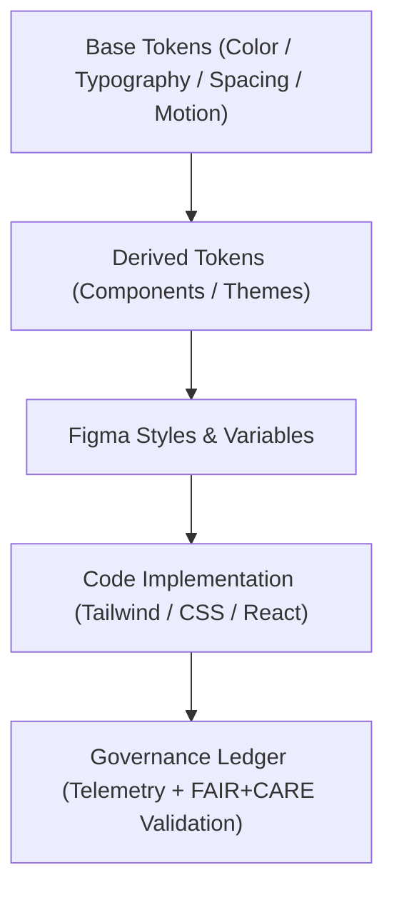

<div align="center">

# 🎨 Kansas Frontier Matrix — **Figma Design Tokens**
`docs/design/figma/tokens/README.md`

**Purpose:**  
Defines the **Figma design token framework** for the Kansas Frontier Matrix (KFM) design system — synchronizing color, typography, spacing, and motion standards across all platforms.  
This document establishes the **FAIR+CARE-governed visual contract** that connects Figma, React, and Tailwind implementations under unified, traceable design governance.

[](../../../../docs/standards/faircare-validation.md)
[]()
[]()
[](../../../../LICENSE)

</div>

---

## 📚 Overview

The **Figma Design Tokens Framework** provides a consistent, auditable set of values that define how KFM’s visual system behaves across platforms.  
Design tokens serve as the **source of truth** for every color, type scale, spacing unit, and motion behavior in the KFM UI ecosystem — ensuring ethical, accessible, and reproducible design implementation.

This token system is fully **FAIR+CARE-aligned**, meaning each visual choice is:
- **Traceable** through governance metadata.  
- **Accessible** under WCAG 2.2 AA contrast standards.  
- **Reusable** across Figma, Tailwind, and CSS variables.  
- **Ethically validated** for inclusivity and cognitive accessibility.

---

## 🧭 Token Architecture Framework



### Token Categories

| Category | Description | Source |
|-----------|--------------|--------|
| **Base Tokens** | Universal design constants (color, size, type). | `docs/design/tokens/` |
| **Derived Tokens** | Contextual values mapped to components. | Figma Variables Library |
| **Semantic Tokens** | FAIR+CARE-linked roles (success, warning, error). | `figma/design-system/` |
| **Governance Tokens** | Metadata for accessibility, ethics, and provenance. | `releases/v9.6.0/focus-telemetry.json` |

---

## 🎨 Token Hierarchy

| Level | Example | Description |
|--------|----------|-------------|
| **Global Tokens** | `--color-base-blue-500`, `--font-primary` | Root variables for entire design system. |
| **Alias Tokens** | `--button-primary-bg`, `--text-body-color` | Context-specific mappings derived from globals. |
| **Component Tokens** | `--card-border-radius`, `--modal-overlay-opacity` | Applied to specific UI components. |
| **Governance Tokens** | `--a11y-focus-ring`, `--faircare-certified` | Ethical and governance metadata integrated into UI. |

---

## 🧱 Core Token Categories

### 🎨 Color Tokens
Define accessible and culturally neutral palettes aligned with FAIR+CARE visual ethics.

| Token | Value | Description |
|--------|--------|-------------|
| `--color-primary` | `#0066CC` | Main brand color (4.9:1 contrast ratio). |
| `--color-secondary` | `#009973` | Secondary accent for active states. |
| `--color-surface` | `#FFFFFF` | Neutral UI background. |
| `--color-error` | `#E63946` | Error state (accessible red tone). |
| `--color-success` | `#06D6A0` | Success message color. |
| `--color-governance` | `#FFD166` | FAIR+CARE audit and badge color. |
| `--color-provenance` | `#073B4C` | Governance ledger signature highlight. |

---

### ✏️ Typography Tokens
Defines the typographic hierarchy with accessible line-height, spacing, and legibility.

| Token | Value | Usage |
|--------|--------|--------|
| `--font-family-primary` | `"Inter", sans-serif` | Core UI text font. |
| `--font-size-base` | `16px` | Minimum readable body size. |
| `--font-size-h1` | `32px` | Headline font size. |
| `--font-weight-bold` | `700` | Bold emphasis weight. |
| `--line-height-base` | `1.5` | Default line spacing for readability. |

---

### 📏 Spacing Tokens
Establishes a scalable and modular grid unit system.

| Token | Value | Description |
|--------|--------|-------------|
| `--space-xxs` | `4px` | Tight element grouping. |
| `--space-xs` | `8px` | Compact spacing for controls. |
| `--space-sm` | `12px` | Default text block spacing. |
| `--space-md` | `16px` | Standard grid unit. |
| `--space-lg` | `24px` | Panel and section spacing. |
| `--space-xl` | `32px` | Large layout separation. |

---

### ⚙️ Motion Tokens
Define animation timing and easing preferences for accessibility and cognitive comfort.

| Token | Value | Description |
|--------|--------|-------------|
| `--motion-duration-fast` | `150ms` | Quick feedback animations. |
| `--motion-duration-medium` | `300ms` | Default transitions. |
| `--motion-duration-slow` | `500ms` | Smooth fade-ins for modals. |
| `--motion-ease-standard` | `cubic-bezier(0.4, 0, 0.2, 1)` | Default UI easing curve. |
| `--motion-reduced` | `prefers-reduced-motion: reduce` | Respect user motion preferences. |

---

### ⚖️ Governance Tokens
Integrate FAIR+CARE and accessibility metadata into the Figma design system.

| Token | Value | Description |
|--------|--------|-------------|
| `--a11y-focus-ring` | `2px solid #0066CC` | Universal focus ring for accessibility. |
| `--faircare-certified` | `true` | Marks ethically validated elements. |
| `--governance-audit-color` | `#FFD166` | Used for audit highlighting. |
| `--checksum-display` | `SHA-256` | Displays validation hash for audit logs. |
| `--energy-metric-unit` | `Wh` | Sustainability measurement unit. |

---

## 🧠 FAIR+CARE Token Governance Matrix

| Principle | Implementation | Oversight |
|------------|----------------|------------|
| **Findable** | Tokens cataloged and versioned in manifest and Figma libraries. | @kfm-data |
| **Accessible** | Token values align with WCAG 2.2 AA standards. | @kfm-accessibility |
| **Interoperable** | Tokens synchronized across Figma, Tailwind, and React. | @kfm-architecture |
| **Reusable** | Design variables reused across multiple UIs and dashboards. | @kfm-design |
| **Collective Benefit** | Color and type choices prioritize inclusivity and readability. | @faircare-council |
| **Authority to Control** | Governance Council approves all token revisions. | @kfm-governance |
| **Responsibility** | Token telemetry tracked and reviewed quarterly. | @kfm-telemetry |
| **Ethics** | Avoids biased color symbolism or cultural exclusion. | @kfm-ethics |

---

## 📊 Example Token Telemetry Record

```json
{
  "token_set_id": "figma_tokens_v9.6.0",
  "category": "color",
  "tokens_defined": 84,
  "wcag_compliance": "AA",
  "contrast_ratio_avg": 4.7,
  "motion_pref_respected": true,
  "faircare_status": "certified",
  "governance_hash": "sha256:81a63bdb0971...",
  "timestamp": "2025-11-03T19:55:00Z"
}
```

Telemetry logs located in:  
`releases/v9.6.0/focus-telemetry.json`

---

## 🌱 Sustainable Design Practices

| Practice | Description | Verified By |
|-----------|--------------|--------------|
| **Token Sync Automation** | Automated Figma → Tailwind token synchronization. | @kfm-design |
| **Energy Efficient Rendering** | Optimized contrast and rendering for low-power screens. | @kfm-sustainability |
| **Governance Metadata Retention** | Token revisions archived permanently with checksum. | @kfm-governance |
| **Ethical Validation** | Cultural review performed on all color and motion sets. | @kfm-ethics |

---

## 🧾 Internal Use Citation

```text
Kansas Frontier Matrix (2025). Figma Design Tokens (v9.6.0).
Defines FAIR+CARE, ISO, and WCAG-compliant token architecture for the Kansas Frontier Matrix design system.
Ensures sustainable, inclusive, and reproducible design across platforms and governance ecosystems.
```

---

## 🧾 Version Notes

| Version | Date | Notes |
|----------|------|--------|
| v9.6.0 | 2025-11-03 | Integrated FAIR+CARE governance tokens and motion accessibility metadata. |
| v9.5.0 | 2025-11-02 | Added energy-efficient rendering tokens and automated telemetry sync. |
| v9.3.2 | 2025-10-28 | Established core Figma token architecture for KFM design system. |

---

<div align="center">

**Kansas Frontier Matrix** · *Design Tokens × FAIR+CARE Governance × Sustainable Accessibility*  
[🔗 Repository](https://github.com/bartytime4life/Kansas-Frontier-Matrix) • [🎨 Figma Design Docs](../README.md) • [⚖️ Governance Ledger](../../../../docs/standards/governance/DATA-GOVERNANCE.md)

</div>