<div align="center">

# 🧩 Kansas Frontier Matrix — **Interaction Patterns**  
`docs/design/interaction-patterns.md`

**Mission:** Define consistent, accessible, and reproducible **interaction behaviors** across all  
Kansas Frontier Matrix (KFM) components — ensuring **time**, **space**, and **story** remain synchronized  
through every user action, on every device, for every audience.

[](../../.github/workflows/docs-validate.yml)
[](../../.github/workflows/site.yml)
[](../../.github/workflows/policy-check.yml)
[](./ui-guidelines.md#-accessibility)
[](../metadata-standards.md)
[](../../LICENSE)

</div>

```yaml
---
title: "Interaction Patterns"
document_type: "Design · Interaction Spec"
version: "v2.3.2"
last_updated: "2025-10-18"
created: "2023-09-14"
owners: ["@kfm-design","@kfm-web","@kfm-accessibility"]
status: "Stable"
maturity: "Production"
license: "CC-BY 4.0"
tags: ["interaction","ux","map","timeline","focus-mode","accessibility","tokens","i18n"]
audit_framework: "MCP-DL v6.3"
semantic_alignment:
  - CIDOC CRM
  - OWL-Time
  - STAC 1.0
  - DCAT 2.0
preservation_policy:
  replication_targets: ["GitHub Repository","Zenodo Snapshot","OSF Backup"]
  checksum_algorithm: "SHA-256"
  revalidation_cycle: "quarterly"
---
````

---

## 🎯 Purpose

Interaction patterns define **how users move through the Frontier Matrix experience** — how they explore data,
trigger actions, and perceive feedback. Each pattern unites **technical reproducibility** with **emotional clarity**,
allowing Kansas history to unfold intuitively through **map**, **timeline**, and **AI-driven storytelling**.

All interactions must:

* Meet **WCAG 2.1 AA** accessibility.
* Use **consistent keyboard, mouse, and touch gestures** (with RTL/i18n considerations).
* Provide **instant, visible feedback** and **clear error/empty states**.
* Remain fully **reproducible and documented** per MCP (tokens, configs, tests, CI reports).

---

## 🧭 Interaction Architecture

```mermaid
flowchart TD
    A["Timeline\n(Canvas/D3)"] -->|Scroll · Zoom · Select| B["Map\n(MapLibre GL)"]
    B -->|Click · Hover · Focus| C["Detail Panel\n(Events · Docs · AI Summaries)"]
    C -->|Back · Close| B
    B -->|Filter · Toggle| D["Legend & Layer Controls"]
    D -->|Update · Sync| A
    A -->|Time Context| E["AI Assistant\n(Narrative Context Engine)"]
```



<!-- END OF MERMAID -->

**Cycle Summary**

1. Timeline scrub/zoom updates **visible layers** and time filters → 2) Map click selects feature → 3) Detail Panel opens
   → 4) Layer Controls reflect state → 5) AI Assistant observes current context and narrates related insights.

---

## 🗺️ Map Interactions (MapLibre GL)

| Action                 | Description               | Feedback / Behavior                                                                |
| :--------------------- | :------------------------ | :--------------------------------------------------------------------------------- |
| **Hover**              | Focus on marker/polygon   | Tooltip after 300 ms; polygon/marker highlight with 2 px focus ring (token color). |
| **Click / Tap**        | Select feature            | Opens Detail Panel with related entities, citations, and actions.                  |
| **Shift + Drag**       | Box zoom                  | Smooth zoom; `Esc` cancels; honor reduced-motion.                                  |
| **Scroll / Pinch**     | Zoom in/out               | Eased zoom; live region announces new bounds.                                      |
| **Keyboard**           | `↑ ↓ ← →` pan; `+ –` zoom | Role=application; `aria-live="polite"` on extent changes.                          |
| **Layer Toggle**       | Enable/disable overlays   | Immediate update; legend badge shows active color token.                           |
| **Long-press (touch)** | Equivalent to hover       | Tooltip pinned; single tap to close.                                               |

**Map Design Rules**

* Cursor: `grab`; `grabbing` while panning; `pointer` over interactive features.
* Maintain **focus ring** on selected feature; keep ring visible in dark/light themes.
* Tooltip ≤ 120 chars; include `aria-describedby`; avoid truncating dates/tribal names.
* **Reduced Motion:** disable inertia/curves when `prefers-reduced-motion` is enabled.
* **Performance budget:** hover < 16 ms to first paint; click→panel < 200 ms.

---

## 🕰️ Timeline Interactions

| Action                          | Description                                     | Visual Response                                 |
| :------------------------------ | :---------------------------------------------- | :---------------------------------------------- |
| **Scroll / Drag**               | Horizontal time navigation                      | Smooth scroll with eased momentum (off if R-M). |
| **Zoom (Ctrl + wheel / pinch)** | Adjust granularity                              | Tick density recalculates; era bands update.    |
| **Click Event Marker**          | Select year/event                               | Marker expands; map filters; AI summary loads.  |
| **Keyboard**                    | `←/→` step year; `Shift+←/→` decade; `Home/End` | Marker outline + status changes announced.      |
| **Hover Tooltip**               | Event title/date                                | Fade-in (200 ms); pinned on focus.              |

```mermaid
sequenceDiagram
    participant User
    participant Timeline
    participant Map
    participant DetailPanel
    participant AI
    User->>Timeline: Scrolls to 1867
    Timeline->>Map: Filter layers where feature.year ≤ 1867
    Map->>User: Highlights Medicine Lodge Treaty polygon
    User->>Map: Click polygon
    Map->>DetailPanel: Load treaty summary + related entities
    DetailPanel->>AI: Request contextual narrative
    AI->>User: "5 treaties active 1850–1870; Kaw & Osage nearby…"
```

<!-- END OF MERMAID -->

**Timeline Rules**

* **Snap-to-significant** years (treaties, hazards) with tokenized markers.
* **Era bands**: e.g., “Territorial Kansas”, “Dust Bowl” with contrasting but AA-compliant fills.
* **Latency**: scrub→layer update < 120 ms; event click→panel < 200 ms.

---

## 🤖 AI Assistant Interactions (Focus Mode Aware)

| Trigger               | Behavior                                       | Example                                     |
| :-------------------- | :--------------------------------------------- | :------------------------------------------ |
| **User Question**     | `POST /ask` → contextual answer with citations | “Show me treaties near the Arkansas River.” |
| **Passive Context**   | Auto-updates summary when map/timeline changes | “5 treaties active between 1850–1870.”      |
| **Highlight Command** | Highlights matching features by rule           | Outline polygons with confidence ≥ 0.9.     |
| **Narrative Mode**    | Story playback synced to timeline              | Narrates events as autoplay scrubs.         |

**Design Notes**

* Assistant opens in **right drawer** (non-modal), `aria-modal="false"`.
* **Focus return**: on close, returns to last focused element.
* Optional **voice output** (Web Speech API) toggle in settings (off by default).
* **Citations** always visible; confidence chips (H/M/L) reflect model certainty.

---

## 🧾 Legend & Layer Controls

| Interaction        | Description                          | Feedback                                                 |
| :----------------- | :----------------------------------- | :------------------------------------------------------- |
| **Toggle**         | Show/hide dataset layer              | Checkbox with token accent; live “Layer on/off” message. |
| **Hover Label**    | Show dataset metadata                | Tooltip (150 ms delay) with source, year, license.       |
| **Shift + Click**  | Solo mode                            | All other layers off; “Solo: Treaties” ARIA update.      |
| **Keyboard**       | Arrow keys navigate; `Enter` toggles | Visible focus outline; `aria-pressed` reflects state.    |
| **Opacity Slider** | Adjust transparency                  | Live `%` update; snap at 0/50/100%.                      |
| **Blend Mode**     | Switch overlay blending              | Preview swatch + example tile; persistent per session.   |

**Tokens**: layer colors from `--kfm-map-*` palette; ensure contrast with base map.

---

## ♿ Accessibility · Keyboard · i18n

**Global Shortcuts**

* `Tab/Shift+Tab` move; `Enter/Space` activate; `Esc` closes drawer/tooltips;
* `Alt+T` focus timeline; `Alt+M` focus map; `Alt+A` open assistant; `?` opens help modal.

**Assistive Semantics**

* Landmarks: `header`, `nav`, `main`, `aside`, `footer`.
* Use `aria-expanded`, `aria-controls` for toggles; `aria-live="polite"` for async updates.
* All color-conveyed states must include **shape, icon, or text**.
* **RTL**: support mirrored layout (logical props: `margin-inline-start`).

**Reduced Motion**

* Respect `prefers-reduced-motion` → disable parallax, long transitions, inertia.
* Provide “Reduce animations” toggle in settings that persists to local storage.

---

## 📱 Responsive Interaction Rules

| Breakpoint      | Behavior                                 | Adjustments                                        |
| :-------------- | :--------------------------------------- | :------------------------------------------------- |
| **≥ 1280 px**   | Dual-pane map+panel, timeline docked     | Hover + keyboard fully available                   |
| **768–1279 px** | Timeline collapsible; panel overlays map | Replace hover with focus-tap                       |
| **< 768 px**    | Full-screen map; timeline bottom sheet   | Swipe up/down to reveal panels; long-press = hover |

**Touch patterns** mirror mouse where sensible; on mobile, **gesture hints** appear on first use.

---

## 🔄 Feedback, Loading, and Error States

| State       | Pattern                                        | Content Rules                       |
| :---------- | :--------------------------------------------- | :---------------------------------- |
| **Loading** | Skeletons for map & panel; spinner in controls | Keep < 1.2 s; show dataset name     |
| **Empty**   | Neutral illustration + guidance                | “No features in this time window.”  |
| **Error**   | Inline error with retry & details link         | Include request ID & timestamp      |
| **Partial** | Badge: “Limited data”                          | Explain confidence or missing attrs |
| **Unsaved** | Toast with action                              | “Copied layer config to clipboard.” |

**Telemetry (privacy-first)**: collect aggregate latencies and error codes **only**; no PII; user can opt-out.

---

## 🧪 Interaction Testing & CI Hooks

| Test            | Tool             | Expected                     |
| :-------------- | :--------------- | :--------------------------- |
| Map hover/click | Playwright       | Tooltip + panel sync         |
| Timeline sync   | Playwright E2E   | Layers update accurately     |
| Keyboard flow   | axe-core/NVDA    | Sequential, visible focus    |
| AI Q&A          | Cypress API mock | Context-aware narrative      |
| Layer toggles   | Jest + DOM       | Visibility toggles correctly |
| Reduced motion  | Browser flag     | Animations disabled          |

**CI**: `design-visual.yml` (visual diffs), `design-a11y.yml` (axe/pa11y), `docs-validate.yml` (lint + YAML), token drift checks.

---

## 🧰 Implementation Notes (Design → Code)

* **Constants** in `/web/src/config/interactions.ts` (delays, durations, keymaps).
* **Tokens** from `style-guide.md` exported to CSS variables and TS types.
* **Contracts** for map/timeline events documented with types (props, callbacks, payloads).
* **Performance budgets** per component (hover <16 ms; panel open <200 ms).
* **Help Modal** lists keyboard shortcuts & gestures (auto-updates from config).

---

## 🧠 Narrative & Story Patterns

* **Storylets** bind to entities (Treaty, Place, Person) with `{time, place, people, sources}`.
* **Context windows** (±N years) cue adjacent events; AI suggests **follow-ups**.
* **Tone**: clear and respectful, especially for Indigenous histories; include **citations** and **confidence**.

---

## 🔗 Related Documentation

| File                               | Description                           |
| :--------------------------------- | :------------------------------------ |
| `README.md`                        | Design index & governance             |
| `style-guide.md`                   | Tokens (color, type, motion), themes  |
| `ui-guidelines.md`                 | Accessibility, grids, i18n, keyboard  |
| `storytelling.md`                  | Narrative patterns & content strategy |
| `../integration/workflows.md`      | End-to-end ETL/AI workflows           |
| `../integration/reviews/README.md` | Review governance & logs              |

---

## 📅 Version History

| Version    | Date       | Author             | Summary                                                                                                                   |
| :--------- | :--------- | :----------------- | :------------------------------------------------------------------------------------------------------------------------ |
| **v2.3.2** | 2025-10-18 | KFM Design Team    | **Fix:** Corrected second Mermaid block end marker to `<!-- END OF MERMAID -->`; YAML fence closed properly.              |
| v2.3.1     | 2025-10-18 | KFM Design Team    | Fixed first Mermaid marker; tightened tokens/ARIA guidance; clarified latency budgets and mobile hints.                   |
| v2.3.0     | 2025-10-18 | KFM Design Team    | Added full keyboard map, error/empty states, tokenized durations, telemetry privacy, i18n/RTL, latency budgets, CI hooks. |
| v2.2.0     | 2025-08-14 | KFM Design Council | Focus Mode interactions refined; blend modes & solo mode.                                                                 |
| v2.0.0     | 2024-11-30 | KFM Web Team       | Core map/timeline interactions; accessibility baseline.                                                                   |
| v1.0.0     | 2023-09-14 | Founding Team      | Initial interaction pattern set.                                                                                          |

---

<div align="center">

### 🕹️ “Interactivity is empathy in motion — it turns data into discovery.”

**Kansas Frontier Matrix Design Council · MCP-DL v6.3**

</div>
