<div align="center">

# 🧩 Kansas Frontier Matrix — **Interaction Patterns**  
`docs/design/interaction-patterns.md`

**Mission:** Define consistent, accessible, and reproducible **interaction behaviors** across all  
Kansas Frontier Matrix (KFM) components — ensuring **time**, **space**, and **story** remain synchronized  
through every user action, on every device, for every audience.

[](../standards/documentation.md)
[](README.md)
[](./ui-guidelines.md#-accessibility)
[](../../.github/workflows/policy-check.yml)
[](../../.github/workflows/docs-validate.yml)
[](../../LICENSE)

</div>

---

```yaml
---
title: "🧩 Kansas Frontier Matrix — Interaction Patterns"
document_type: "README"
version: "v2.4.0"
last_updated: "2025-10-19"
created: "2023-09-14"
owners: ["@kfm-design","@kfm-web","@kfm-accessibility"]
status: "Stable"
maturity: "Production"
license: "CC-BY-4.0"
tags: ["interaction","ux","map","timeline","focus-mode","accessibility","tokens","i18n","a11y","testing"]
alignment:
  - MCP-DL v6.3
  - WCAG 2.1 AA
  - WAI-ARIA 1.2
  - CIDOC CRM
  - OWL-Time
  - STAC 1.0
  - DCAT 2.0
  - FAIR Principles
dependencies:
  - React + MapLibre
  - D3/Canvas Timeline
  - tokens.css Design System
  - FastAPI + Neo4j (events, focus, search)
  - Axe / Lighthouse / Playwright / Jest
review_cycle: "Quarterly"
validation:
  lighthouse_min_score: 95
  axe_blocking_violations: 0
  contrast_min_ratio: 4.5
  keyboard_traps: "none"
  schema_checks: true
provenance:
  reviewed_by: ["@kfm-accessibility", "@kfm-frontend", "@kfm-editorial"]
  workflow_ref: ".github/workflows/site.yml"
  artifact_retention_days: 90
versioning:
  policy: "Semantic Versioning (MAJOR.MINOR.PATCH)"
  major_change: "Breaking interaction, keyboard flows, or accessibility behavior"
  minor_change: "New patterns, tokens, or non-breaking UX"
  patch_change: "Bug fixes, wording, or link corrections"
  example_next_release: "v2.5.0 — Adds gesture hints localization and map HUD presets"
semantic_alignment:
  - CIDOC CRM (interaction provenance mapping)
  - OWL-Time (time scrubbing semantics)
  - STAC 1.0 (layer/legend assets)
  - DCAT 2.0 (dataset descriptors in UI)
preservation_policy:
  replication_targets: ["GitHub Repository","Zenodo Snapshot","OSF Backup"]
  checksum_algorithm: "SHA-256"
  revalidation_cycle: "quarterly"
telemetry:
  metrics_collected: ["Hover→Tooltip Latency","Panel Open Latency","Keyboard vs Pointer Ratio","Reduced-Motion Adoption","Screen Reader Sessions"]
  privacy_policy: "Anonymized aggregates; opt-in analytics; no PII; W3C Privacy Principles"
---
```

---

## 🎯 Purpose

Interaction patterns specify **how users move through the KFM experience** — how they explore data, trigger actions,  
and perceive feedback. Each pattern unites **technical reproducibility** with **emotional clarity**, enabling Kansas history  
to unfold intuitively through **map**, **timeline**, and **AI-driven storytelling**.

**All interactions must:**
- Meet **WCAG 2.1 AA** accessibility.
- Provide **consistent keyboard, mouse, and touch gestures** (including RTL/i18n).
- Offer **immediate visual feedback** and clear **error/empty states**.
- Remain fully **reproducible** (tokens, configs, tests, CI reports).

---

## 🧭 Interaction Architecture

```mermaid
flowchart TD
    A["Timeline\n(Canvas/D3)"] -->|Scroll · Zoom · Select| B["Map\n(MapLibre GL)"]
    B -->|Click · Hover · Focus| C["Detail Panel\n(Events · Docs · AI Summaries)"]
    C -->|Back · Close| B
    B -->|Filter · Toggle| D["Legend & Layer Controls"]
    D -->|Update · Sync| A
    A -->|Time Context| E["AI Assistant\n(Narrative Context Engine)"]
```


%% END OF MERMAID %%

**Cycle Summary**  
1) Timeline scrub/zoom updates **visible layers** → 2) Map click selects a feature → 3) Detail Panel opens →  
4) Legend reflects state → 5) AI Assistant narrates related insights.

---

## 🗺️ Map Interactions (MapLibre GL)

| Action                 | Description               | Feedback / Behavior                                                                |
|:--|:--|:--|
| **Hover**              | Focus on marker/polygon   | Tooltip after 300 ms; 2px focus ring (token color); keyboard focus persists.       |
| **Click / Tap**        | Select feature            | Opens Detail Panel with entities, citations, and actions.                          |
| **Shift + Drag**       | Box zoom                  | Smooth zoom; `Esc` cancels; reduced-motion disables easing.                        |
| **Scroll / Pinch**     | Zoom in/out               | Eased zoom; `aria-live="polite"` announces new bounds.                             |
| **Keyboard**           | `↑ ↓ ← →` pan; `+ –` zoom | Role=application; extent/tile updates announced.                                   |
| **Layer Toggle**       | Enable/disable overlays   | Immediate update; legend shows active color token.                                  |
| **Long-press (touch)** | Equivalent to hover       | Pinned tooltip; single tap to close.                                               |

**Map Design Rules**
- Cursor: `grab`; `grabbing` while panning; `pointer` on interactives.  
- Maintain **focus ring** on selected feature (dark/light compatible).  
- Tooltip ≤ 120 chars; include `aria-describedby`; never truncate dates or tribal names.  
- **Latency budgets**: hover→first paint < **16 ms**; click→panel < **200 ms**.

---

## 🕰️ Timeline Interactions

| Action | Description | Visual Response |
|:--|:--|:--|
| **Scroll / Drag** | Horizontal navigation through time. | Smooth scroll with eased momentum (disabled when `prefers-reduced-motion` is set). |
| **Zoom (Ctrl+wheel / pinch)** | Adjusts the temporal granularity of the timeline. | Tick density and labeled eras recalibrate in real time. |
| **Click Event Marker** | Selects a specific year or historical event. | Marker expands and highlights; linked map layers and AI summaries update. |
| **Keyboard** | `←/→` move by year, `Shift+←/→` move by decade, `Home/End` jump to min/max. | Focus ring highlights active marker; `aria-live="polite"` announces year/event. |
| **Hover Tooltip** | Reveals event name and date on hover/focus. | Tooltip fades in within 200 ms and remains pinned for keyboard users. |

```mermaid
sequenceDiagram
    participant User
    participant Timeline
    participant Map
    participant DetailPanel
    participant AI
    User->>Timeline: Scrolls to 1867
    Timeline->>Map: Filters visible layers where year ≤ 1867
    Map-->>User: Highlights Medicine Lodge Treaty polygon
    User->>Map: Clicks polygon feature
    Map->>DetailPanel: Loads treaty summary and linked entities
    DetailPanel->>AI: Requests contextual narrative summary
    AI-->>User: Returns insight — Five treaties active 1850–1870; Kaw & Osage nearby
    %% END
<!-- END OF MERMAID -->

### Timeline Interaction Rules

* **Snap-to-significant markers:** Treaties, ecological events, and historical hazards receive priority ticks.  
* **Era bands:** Represent broad historical periods (e.g., *Territorial Kansas*, *Dust Bowl*). Colors meet WCAG AA contrast.  
* **Latency targets:**  
  - Scroll/zoom → layer update:  < 120 ms  
  - Event click → panel load:  < 200 ms  
* **Reduced Motion:** When enabled, disables easing and long transitions; all updates occur instantly.  
* **Live Regions:** Announce current visible time range and active selection for screen readers.  
* **Performance Budget:** Timeline render ≤ 16 ms per frame; event focus update ≤ 50 ms.

---


## 🤖 AI Assistant Interactions (Focus Mode Aware)

| Trigger | Behavior | Example |
|:--|:--|:--|
| **User Question** | `POST /ask` → contextual answer with citations | “Show treaties near the Arkansas River.” |
| **Passive Context** | Auto-updates when map/timeline changes | “5 treaties active between 1850–1870.” |
| **Highlight Command** | Outlines matching features by rule | Confidence ≥ 0.9 polygons outlined. |
| **Narrative Mode** | Story playback synchronized to timeline | Narrates as autoplay scrubs. |

**Design Notes**
- Assistant opens in **right drawer** (non-modal), `aria-modal="false"`.  
- **Focus return**: on close, returns to last focused element.  
- Optional **voice output** (off by default).  
- **Citations** always visible; **confidence chips** (H/M/L) reflect certainty.

---

## 🧾 Legend & Layer Controls

| Interaction | Description | Feedback |
|:--|:--|:--|
| **Toggle** | Show/hide dataset layer | Checkbox with token accent; `aria-live` “Layer on/off”. |
| **Hover Label** | Show dataset metadata | Tooltip (150 ms delay) with source, year, license. |
| **Shift + Click** | Solo mode | All other layers off; “Solo: Treaties” ARIA update. |
| **Keyboard** | Arrow keys navigate; `Enter` toggles | Visible focus outline; `aria-pressed`. |
| **Opacity** | Adjust transparency | Live `%` update; snap at 0/50/100%. |
| **Blend Mode** | Change overlay blending | Preview swatch + example tile; session-persistent. |

**Token rule**: layer colors from `--kfm-map-*` palette; verify map contrast.

---

## ♿ Accessibility · Keyboard · i18n

**Global Shortcuts**
- `Tab/Shift+Tab` move; `Enter/Space` activate; `Esc` closes;  
- `Alt+T` focus timeline; `Alt+M` focus map; `Alt+A` open assistant; `?` help modal.

**Assistive Semantics**
- Landmarks: `header`, `nav`, `main`, `aside`, `footer`.  
- Use `aria-expanded` and `aria-controls` for toggles; `aria-live="polite"` for async updates.  
- Color is never the only signal: add shape/icon/text states.  
- **RTL** support with logical properties (`margin-inline-start`).

**Reduced Motion**
- Respect `prefers-reduced-motion`; disable parallax/inertia; keep fades ≤ 200 ms.  
- Provide “Reduce animations” toggle that persists in local storage.

---

## ⌨️ Keyboard Interaction Matrix

| Component | Key | Action | Result |
|:--|:--|:--|:--|
| **Timeline** | `← / →` | Navigate years | Focus shifts to next marker |
|  | `Shift+← / Shift+→` | Jump decades | Large tick focus with announcement |
|  | `Home / End` | Start / End | Snap to earliest/latest |
| **Map** | `↑ / ↓` | Cycle markers | Tooltip + 2px ring on marker |
|  | `+ / -` | Zoom | Extent announced via live region |
| **Drawer** | `Esc` | Close panel | Focus returns to trigger |
| **Legend** | `↑ / ↓` | Move selection | Focus outline on row |
|  | `Enter` | Toggle | `aria-pressed` updated |
| **Global** | `Alt + /` | Help overlay | Shortcut modal opens |

---

## 📱 Responsive Interaction Rules

| Breakpoint | Behavior | Adjustments |
|:--|:--|:--|
| **≥ 1280px** | Timeline visible; dual sidebars allowed | Hover + keyboard supported |
| **768–1279px** | Timeline collapsible; panel overlays map | Replace hover with focus-tap |
| **< 768px** | Full-screen map; timeline as bottom sheet | Swipe up/down to reveal panels |

**Gesture hints** appear on first use; touch patterns mirror mouse where sensible.

---

## 🔄 Feedback, Loading & Error States

| State | Pattern | Content Rules |
|:--|:--|:--|
| **Loading** | Skeletons for map/panel; spinner only in small controls | Keep < 1.2 s; show dataset name |
| **Empty** | Neutral illustration + guidance | “No features in this time window.” |
| **Error** | Inline error with retry + details link | Include request ID & timestamp |
| **Partial** | Badge: “Limited data” | Explain confidence or missing attrs |
| **Unsaved** | Toast with action | “Copied layer config to clipboard.” |

**Telemetry (privacy-first)**: collect aggregate latencies and error codes only; **opt-in**.

---

## 🧪 Interaction Testing & CI Hooks

| Test | Tool | Expected |
|:--|:--|:--|
| Map hover/click | Playwright | Tooltip + panel sync |
| Timeline sync | Playwright E2E | Layers update accurately |
| Keyboard flow | Axe-core + NVDA | Sequential, visible focus |
| AI Q&A | Cypress API mock | Context-aware narrative |
| Layer toggles | Jest + DOM | Visibility toggles correctly |
| Reduced motion | Browser flag | Animations disabled |

**CI pipelines**  
- `design-visual.yml` (visual diffs)  
- `design-a11y.yml` (axe/pa11y)  
- `docs-validate.yml` (links + YAML)  
- **Token drift** checks to guard design consistency.

---

## 🧰 Implementation Notes (Design → Code)

- **Constants**: `/web/src/config/interactions.ts` (delays, durations, keymaps).  
- **Tokens**: `style-guide.md` → `web/src/styles/tokens.css` (CSS variables + TS types).  
- **Contracts**: typed events for map/timeline payloads and callbacks.  
- **Performance budgets**: hover < **16 ms**; panel open < **200 ms**.  
- **Help Modal**: keyboard & gesture cheatsheet auto-generated from config.

---

## 🧠 Narrative Linkage

- **Storylets** bind to entities with `{time, place, people, sources}`.  
- **Context windows** (±N years) surface adjacent events; AI suggests **follow-ups**.  
- Tone: clear, respectful; include **citations** and **confidence** for AI content.

---

## ✅ UX Validation Checklist (MCP)

| Category | Requirement | Verified |
|:--|:--|:--:|
| **Accessibility** | Lighthouse ≥ 95; Axe 0 blocking issues | ✅ |
| **Keyboard** | 100% focusable; no traps | ✅ |
| **Contrast** | ≥ 4.5:1 token pairs validated | ✅ |
| **Responsive** | Breakpoints render correctly | ✅ |
| **Reduced Motion** | All animations disabled on request | ✅ |
| **Localization** | Language tags + RTL mirrored UI | ✅ |
| **Cross-Browser** | Chrome, Firefox, Safari parity | ✅ |

---

## 🔗 Related Documentation

- [🎨 Visual Style Guide](style-guide.md)  
- [🧭 UI/UX Guidelines](ui-guidelines.md)  
- [📖 Storytelling & Narrative Design](storytelling.md)  
- [🧠 Focus Mode & AI Integration](../architecture/focus-mode.md)  
- [⚙️ Accessibility Standards](../standards/accessibility.md)

---

## 🧾 Version History

| Version | Date | Author | Summary | Type |
|:--|:--|:--|:--|:--|
| **v2.4.0** | 2025-10-19 | @kfm-design | Added telemetry policy, compliance grid, and cross-references; standardized YAML to MCP-DL parity. | Minor |
| **v2.3.2** | 2025-10-18 | @kfm-design | Fixed second Mermaid end marker; closed YAML fences. | Patch |
| v2.3.1 | 2025-10-18 | @kfm-design | Tightened tokens/ARIA guidance; clarified latency budgets & mobile hints. | Patch |
| v2.3.0 | 2025-10-18 | @kfm-design | Keyboard map, error/empty states, tokenized durations, i18n/RTL, CI hooks. | Minor |
| v2.2.0 | 2025-08-14 | @kfm-council | Focus Mode interactions refined; blend modes & solo mode. | Minor |
| v2.0.0 | 2024-11-30 | @kfm-web | Core map/timeline interactions; accessibility baseline. | Major |
| v1.0.0 | 2023-09-14 | @kfm-core | Initial interaction pattern set. | Major |

---

<div align="center">

### 🕹️ “Interactivity is empathy in motion — it turns data into discovery.”

**Kansas Frontier Matrix Design Council · MCP-DL v6.3**

</div>
