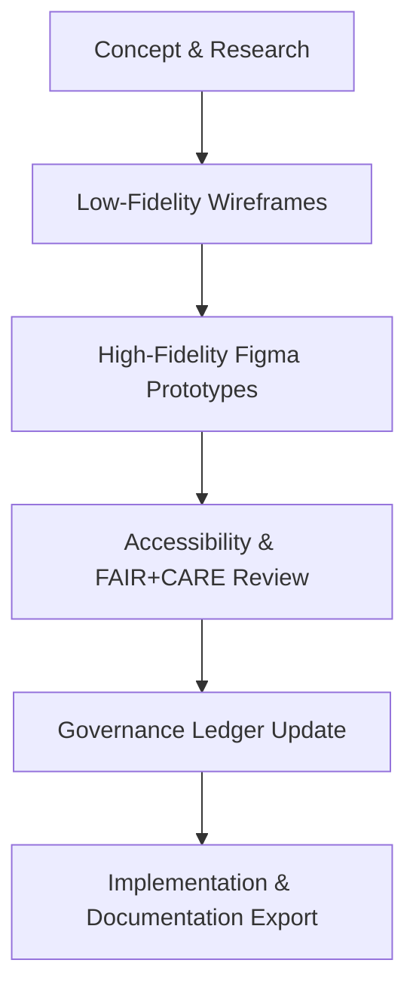

<div align="center">

# 🧩 **Kansas Frontier Matrix — UI Mockups & Prototyping Archive (v2.1.1 · Tier-Ω+∞ Certified)**  
`docs/design/mockups/README.md`

**Mission:** Provide a governed, FAIR+CARE-aligned repository for **UI mockups, wireframes, and prototypes** used in the Kansas Frontier Matrix (KFM).  
Ensures that all interface designs are accessible, reproducible, and ethically reviewed before implementation.

[](../../../docs/)
[](../../../docs/standards/accessibility.md)
[](../../../docs/standards/faircare-validation.md)
[](../../../LICENSE)

</div>

---

## 📚 Overview

This directory serves as the **mockup and prototyping archive** for all KFM frontend and user experience designs.  
Each mockup follows standardized **MCP-DL documentation**, **FAIR+CARE ethical design**, and **accessibility governance** rules.

All files are validated for:
- 🧱 **Accessibility (WCAG 2.1 AA)**  
- 🌎 **Localization readiness (i18n)**  
- 🔍 **Governance metadata completeness**  
- 🧩 **Token alignment** with the official design system  
- 🔐 **Provenance traceability** (versioned + checksummed assets)

---

## 🗂️ Directory Layout

```bash
docs/design/mockups/
├── README.md                      # This file — mockup governance reference
├── wireframes/                    # Low-fidelity planning mockups
│   ├── timeline_view_v1.fig
│   ├── layer_controls_v2.fig
│   └── README.md
├── hi_fidelity/                   # Production-ready Figma designs
│   ├── focus_mode_panel_v3.fig
│   ├── dashboard_overview_v2.fig
│   └── README.md
└── exports/                       # Validated images / PNG / SVG exports for documentation
    ├── timeline_view_v1.png
    ├── focus_mode_panel_v3.png
    └── README.md
```

---

## ⚙️ Mockup Lifecycle


<!-- END OF MERMAID -->

---

## 🧩 Mockup Metadata Template

Each Figma or image asset must include the following YAML metadata stored as a sidecar file (`.meta.yml`):

```yaml
---
title: "Focus Mode Panel – v3"
designer: "@kfm-ux"
reviewers: ["@kfm-accessibility","@kfm-docs"]
version: "v2.1.1"
date_created: "2025-10-28"
description: "High-fidelity mockup of the Focus Mode AI summary panel and timeline integration."
governance_review: "2025-Q4 Accessibility Audit"
faircare_status: "Verified"
checksum: "sha256:a8d5b6f3e4b92c9c..."
license: "CC-BY 4.0"
---
```

---

## 🧱 FAIR + CARE Integration

| Principle | Implementation | Validation |
|:--|:--|:--|
| **Findable** | Indexed via manifest and metadata sidecar. | `manifest.zip` |
| **Accessible** | WCAG-compliant design prototypes. | `design-validate.yml` |
| **Interoperable** | Design tokens link to component library. | `docs/design/standards/` |
| **Reusable** | Mockups stored with license and provenance metadata. | `releases/v*/manifest.zip` |
| **Collective Benefit (CARE)** | Inclusive, culturally respectful UI design practices. | FAIR+CARE Council audits |

---

## 🧠 Accessibility Review Requirements

| Requirement | Description | Verification |
|:--|:--|:--|
| **Color Contrast** | All color pairs meet 4.5:1 ratio minimum. | `design-validate.yml` |
| **Keyboard Focus Flow** | Navigation sequences tested via tab order. | Manual testing |
| **Screen Reader Labels** | ARIA tags included for all interactive elements. | Lighthouse / axe-core |
| **Localization Readiness** | All labels externalized for translation. | i18n validation |
| **Motion Sensitivity** | Animation motion limits verified against WCAG 3.0. | Accessibility Review Board |

---

## 🧩 Validation Workflows

| Workflow | Function | Output |
|:--|:--|:--|
| `design-validate.yml` | Validates accessibility, design tokens, and metadata. | `reports/validation/design_validation.json` |
| `policy-check.yml` | Ensures licensing and author metadata completeness. | `reports/audit/policy_check.json` |
| `governance-ledger.yml` | Logs mockup checksum and ethical review signatures. | `data/reports/audit/ui_governance_ledger.json` |

---

## 🧾 Provenance Example (Governance Ledger Entry)

```json
{
  "asset_id": "mockup_focus_mode_v3",
  "designer": "@kfm-ux",
  "version": "v2.1.1",
  "checksum": "sha256:a8d5b6f3e4b92c9c...",
  "accessibility_score": 98,
  "faircare_compliance": true,
  "governance_review_date": "2025-11-15T17:45:00Z",
  "status": "approved"
}
```

---

## 🧾 Version History

| Version | Date | Author | Summary |
|:--|:--|:--|:--|
| **v2.1.1** | 2025-11-16 | @kfm-ux | Added metadata schema, FAIR+CARE alignment, and accessibility governance workflow. |
| v2.0.0 | 2025-10-25 | @kfm-docs | Integrated design token references and accessibility audit structure. |
| v1.0.0 | 2025-10-04 | @kfm-architecture | Initial mockup governance archive and directory structure. |

---

<div align="center">

**Kansas Frontier Matrix © 2025**  
*“Every Pixel Has Provenance — Every Design Has Ethics.”*  
📍 `docs/design/mockups/README.md` — UI mockup and prototyping governance archive for the Kansas Frontier Matrix.

</div>
