<div align="center">

# 🖼️ Kansas Frontier Matrix — **Design Mockups & Wireframes (v5.1.0 · Tier-Ω+∞ Certified)**  
`docs/design/mockups/README.md`

**Mission:** Maintain a **versioned, FAIR/CARE-compliant, reproducible design archive** of all **UI/UX mockups, wireframes, and prototypes** for the **Kansas Frontier Matrix (KFM)** — ensuring visual artifacts are **auditable, accessible, and traceable** from design to deployed code.  
Each mockup adheres to **Master Coder Protocol (MCP-DL v6.3+)** standards of documentation-first reproducibility and verified accessibility.

[](../style-guide.md)
[](../accessibility/)
[](../../standards/documentation.md)
[](../../standards/fair.md)
[](../../../LICENSE)

</div>

---

```yaml
---
title: "Kansas Frontier Matrix — Design Mockups & Wireframes"
document_type: "Design Archive Index"
version: "v5.1.0"
last_updated: "2025-11-13"
created: "2023-10-01"
owners: ["@kfm-design","@kfm-accessibility","@kfm-web"]
reviewed_by: ["@kfm-design-council","@kfm-ethics"]
status: "Active"
maturity: "Production"
license: "CC-BY-4.0"
tags: ["mockups","wireframes","figma","excalidraw","timeline","map","ai","a11y","tokens","observability","provenance","fair","care","governance"]
alignment:
  - MCP-DL v6.3
  - WCAG 2.1 AA / 3.0 readiness
  - FAIR / CARE
  - ISO 9241-171
  - Section 508 / EN 301 549
validation:
  ci_enforced: true
  metadata_required: true
  alt_text_required: true
  a11y_review_required: true
observability:
  endpoint: "https://metrics.kfm.ai/design/mockups"
  metrics: ["mockup_count","a11y_signoff_rate","token_drift_deltaE","export_integrity_rate","design_quality_index"]
preservation_policy:
  replication_targets: ["GitHub Repository","Zenodo Snapshot","OSF Backup"]
  checksum_algorithm: "SHA-256"
  retention: "Permanent (published) · 3 years (draft)"
ai_validation:
  model: "kfm-gpt-design-a11y-analyzer-v3"
  enabled: true
  scope: ["color_drift","missing_alt","layer_labeling"]
  confidence_threshold: 0.95
review_sla:
  open_to_first_review_hours: 24
  total_to_merge_days: 5
  required_signoffs: ["@kfm-design","@kfm-accessibility","@kfm-web"]
merge_gate:
  requires: ["alt_text_present","contrast_pass","token_usage_verified","traceability_links_present"]
---
```

---

## 🎯 Purpose

The `/docs/design/mockups/` directory is the **visual documentation hub** for KFM.  
Each file—mockup, sketch, or prototype—is treated as **source code for experience design**, linked to accessibility, data, and implementation.

**Every artifact includes:**
- Provenance metadata (author, license, checksum, DOI)
- Accessibility compliance (WCAG 2.1 AA)
- Figma/Excalidraw source linkage
- Design → Implementation traceability
- FAIR JSON-LD registration for machine readability

---

## 🧭 Directory Structure

```text
docs/design/mockups/
├── README.md                   # Index (this file)
├── figma/                      # Figma exports + links
├── excalidraw/                 # Editable sketches
├── timeline/                   # Timeline UI mockups
├── map/                        # Map overlays + legends
├── ai-assistant/               # Chat / narrative assistant
├── panels/                     # Detail panels / modals
├── typography/                 # Text hierarchy & type scales
├── dashboards/                 # Visualization UIs
└── archive/                    # Superseded versions + rationale
```

---

## 🧩 File Naming Convention

```
<feature>_<version>_<author>.<ext>
```

**Examples:**
```
timeline_v2.3_barta.png
map_overlay_v1.2_excalidraw.json
ai_drawer_v1.4_figma.svg
```

Version numbers increment whenever **layout, token, or accessibility rules** change.

---

## 🧠 Design Workflow

```mermaid
flowchart TD
  A["Concept Sketch\n(Figma / Excalidraw)"] --> B["Design Review\n(WCAG · Usability)"]
  B --> C["Export + Annotate\nPNG · SVG · PDF"]
  C --> D["Document Metadata\n(YAML + Checksum)"]
  D --> E["Frontend Implementation\nReact + Tokens"]
  E --> F["Archive + DOI Snapshot\nmockups/archive/"]
```


<!-- END OF MERMAID -->

---

## 🖼️ Metadata Template

```yaml
id: map_overlay_v2.0
title: "Map Overlay & Legend (v2.0)"
author: "andy.barta"
date: 2025-11-05
source:
  tool: figma
  file_key: "AbCdEfGhIjKlMnOp"
  node_id: "1234-5678"
  link: "https://www.figma.com/file/XXXX"
description: >
  Redesigned legend layout with accessible palette, layer toggles,
  and timeline markers synchronized to historical datasets.
alt_text: "Map UI with legend showing high-contrast toggles and time markers."
status: active
accessibility:
  contrast_ratio: "5.2:1"
  keyboard_focus_visible: true
  reduced_motion_supported: true
tokens_used: ["--kfm-color-bg","--kfm-color-accent","--kfm-space-md"]
related_components: ["web/src/components/map/Legend.tsx"]
license: CC-BY-4.0
checksum_sha256: "auto-generated"
privacy_policy:
  faces_blurred: true
  street_addresses_redacted: true
  classroom_media_allowed: false
motion_spec:
  durations_ms: { micro: 100, small: 180, medium: 240, large: 300 }
  easing: { default: "cubic-bezier(0.2, 0, 0, 1)" }
  prefers_reduced_motion: true
fair_linkage:
  zenodo_doi: "10.5281/zenodo.1234589"
  stac_id: "treaties-boundaries-1867"
```

---

## 🧱 Design → Implementation Traceability

| Mockup ID | Component Path | Tokens | Storybook | Status |
|:--|:--|:--|:--|:--:|
| `map_overlay_v2.0` | `web/src/components/map/Legend.tsx` | `--kfm-color-accent` | `stories/map/Legend.stories.tsx` | ✅ |
| `timeline_v2.3` | `web/src/components/timeline/Slider.tsx` | `--kfm-motion-smooth` | `stories/timeline/Slider.stories.tsx` | ⚙️ |
| `ai_drawer_v1.4` | `web/src/components/ai/Drawer.tsx` | `--kfm-radius-lg`,`--kfm-color-bg-dark` | `stories/ai/Drawer.stories.tsx` | ✅ |

---

## 📈 Design Quality Index (DQI)

```yaml
design_quality_index:
  contrast_coverage_pct: 98.7
  focus_visibility_pct: 100
  keyboard_flow_coverage_pct: 95
  token_usage_consistency_pct: 97
  mockup_to_component_alignment_pct: 93
  thresholds:
    min_contrast_coverage: 95
    min_alignment: 90
```

---

## 🧩 Design Token Drift Report

| Token | Figma | CSS | Δ (%) | Status |
|:--|:--|:--|:--:|:--:|
| `--kfm-color-accent` | `#c77d02` | `#c77d03` | 0.8 | ✅ |
| `--kfm-space-md` | `16px` | `16px` | 0 | ✅ |
| `--kfm-font-size-h3` | `1.333rem` | `1.25rem` | 6.2 | ⚠️ |

---

## 🧮 Versioning & Release Governance

```yaml
versioning:
  policy: "Semantic Versioning (MAJOR.MINOR.PATCH)"
  scope: "Design · Accessibility · Token Alignment · Provenance"
  version_control: "Git (semantic tags)"
  snapshot_doi: "Zenodo DOI for each major release"
  history_tracking: true
  audit_trail:
    location: "docs/design/mockups/changelog/"
    format: "YAML + JSON (design_changelog_*.yml)"
  ci_integration:
    tag_pattern: "mockups-v*"
    auto_changelog: true
    create_release_notes: true
```

| Change Type | Description | Example | Trigger |
|:--|:--|:--|:--|
| **Major (X.0.0)** | New structure or accessibility overhaul | Map Overlay redesign | DOI issued + archive old version |
| **Minor (0.Y.0)** | New mockups or features | Added AI Assistant Panel v2 | Metadata merge |
| **Patch (0.0.Z)** | Visual or metadata fixes | Contrast adjustment | CI auto-bump |

### 📘 Version History

| Version | Date | Author | Summary | Type |
|:--|:--|:--|:--|:--|
| **v5.1.0** | 2025-11-13 | @kfm-design | Added versioning section, motion specs, schema CI, privacy, and DQI alignment. | Minor |
| v5.0.0 | 2025-11-11 | @kfm-design | Tier-Ω+∞: Added AI validation, governance tables, FAIR metadata. | Major |
| v4.0.0 | 2025-11-10 | @kfm-web | Added bind maps, token drift CI, Figma API linkage. | Major |
| v3.0.0 | 2025-09-14 | @kfm-accessibility | Introduced accessibility metadata + DQI. | Major |
| v2.0.0 | 2024-11-07 | @kfm-architecture | Migrated to MCP-DL v6.3, added FAIR registry. | Major |
| v1.0.0 | 2023-10-01 | Founding Team | Initial design archive. | Major |

---

## ⚙️ Continuous Integration (Mockup Validation)

```yaml
# .github/workflows/design-mockup-validate.yml
on:
  pull_request:
    paths:
      - "docs/design/mockups/**/*.md"
      - "docs/design/mockups/**/*.{png,svg,webp,pdf}"
jobs:
  design-validation:
    runs-on: ubuntu-latest
    steps:
      - uses: actions/checkout@v4
      - name: Validate YAML Metadata
        run: node tools/mockups/validate-frontmatter.mjs --schema .schemas/mockup.schema.json "docs/design/mockups/**/*.md"
      - name: Figma Metadata Sync
        run: node tools/figma-sync.mjs
      - name: Generate Gallery + Thumbnails
        run: node tools/mockups/build-gallery.mjs --out docs/design/mockups/index.json --thumbs docs/design/mockups/.thumbs
      - name: Check File Budgets
        run: node tools/mockups/check-image-budgets.mjs --maxPngKB 750 --maxSvgKB 400
      - name: Upload Metrics
        run: curl -X POST -d @metrics.json https://metrics.kfm.ai/design/mockups
```

---

## 🌍 Localization & RTL Testing

| Check | Requirement | Status |
|:--|:--|:--:|
| Localized Text | Neutral + pseudo-locale ready | ✅ |
| RTL Layout | Mirrored focus flow verified | ✅ |
| Pseudo-Locale | `en-XA` tested in Figma | ⚙️ |

---

## 📜 Archival Policy

```yaml
archival_policy:
  retention: "Permanent for published; 3 years for drafts"
  audit_frequency: "Quarterly"
  integrity_checksums: true
  external_backup: "Zenodo DOI each major release"
  doi_prefix: "10.5281/zenodo"
```

---

## 🔄 FAIR / CARE JSON-LD Metadata

```json
{
  "@context": "https://schema.org/",
  "@type": "CreativeWorkCollection",
  "name": "KFM — Design Mockups & Wireframes Archive",
  "license": "CC-BY-4.0",
  "version": "v5.1.0",
  "dateModified": "2025-11-13",
  "creator": "Kansas Frontier Matrix Design Council",
  "alignment": ["MCP-DL v6.3","WCAG 2.1 AA","FAIR","CARE","ISO 9241-171"],
  "identifier": "doi:10.5281/zenodo.1234589"
}
```

---

## 🧩 Best Practices

- Commit **source** (`.fig`, `.excalidraw`) + **export** (`.png`, `.svg`).  
- Use real UI copy; no lorem ipsum.  
- Annotate designs with **token callouts**.  
- Add **contrast overlays** + **focus-flow screenshots**.  
- Include short **keyboard navigation demo videos**.  
- Verify **tokens + ARIA flows** before implementation.  
- Submit all design changes through **review + DOI snapshot**.

---

<div align="center">

### 🖌️ *“Design mockups are the archaeology of creativity — they preserve the intent behind every pixel.”*  
**Kansas Frontier Matrix Design Council · MCP-DL v6.3**

<!-- MCP-CERTIFIED: TIER-Ω+∞ -->
<!-- VERIFIED-STANDARDS: [MCP-DL v6.3, WCAG 2.1 AA, FAIR, CARE, ISO 9241-171, EN 301 549] -->
<!-- VALIDATION-HASH: sha256:mockups-readme-v5-1-0-xxxxxxxxxxxxxxxxxxxxxxxxxxxxxxxxxxxx -->

</div>
