<div align="center">

# 🖼️ Kansas Frontier Matrix — **Design Mockups & Wireframes (v4.0.0 — Tier-Ω Certified)**  
`docs/design/mockups/README.md`

**Mission:** Maintain a **version-controlled, FAIR-registered** archive of all **UI/UX mockups, wireframes, and prototypes** for the **Kansas Frontier Matrix (KFM)** — ensuring visual artifacts are **auditable, accessible, and reproducible**.  
Each design asset serves as a node in the **MCP-DL v6.3 provenance chain**, linking creativity to code, accessibility, and governance.

[](../style-guide.md)
[](../accessibility/)
[](../../standards/documentation.md)
[](../../../LICENSE)

</div>

---

```yaml
---
title: "Kansas Frontier Matrix — Design Mockups & Wireframes"
document_type: "Design Archive Index"
version: "v4.0.0"
last_updated: "2025-11-12"
owners: ["@kfm-design","@kfm-accessibility","@kfm-web"]
reviewed_by: ["@kfm-design-council","@kfm-ethics"]
status: "Active"
maturity: "Production"
license: "CC-BY-4.0"
tags: ["mockups","wireframes","figma","excalidraw","timeline","map","ai","a11y","tokens","fair","care","observability"]
alignment:
  - MCP-DL v6.3
  - WCAG 2.1 AA / 3.0 readiness
  - FAIR / CARE Principles
  - ISO 9241-171
  - Section 508 / EN 301 549
validation:
  ci_enforced: true
  metadata_required: true
  alt_text_required: true
  a11y_review_required: true
observability:
  endpoint: "https://metrics.kfm.ai/design/mockups"
  metrics: ["mockup_count","a11y_signoff_rate","token_drift_deltaE","export_integrity_rate","design_quality_index"]
preservation_policy:
  replication_targets: ["GitHub Repository","Zenodo Snapshot","OSF Backup"]
  checksum_algorithm: "SHA-256"
  retention: "Permanent (published) · 3 years (draft)"
ai_validation:
  model: "kfm-gpt-design-a11y-analyzer-v3"
  enabled: true
  scope: ["color_drift","missing_alt","layer_labeling"]
  confidence_threshold: 0.95
---
```

---

## 🎯 Purpose

The `/docs/design/mockups/` directory is KFM’s **visual archive of record**, containing **Figma frames**, **Excalidraw diagrams**, and annotated prototypes for every feature.  
Each mockup is validated for:
- ✅ **Accessibility** (WCAG 2.1AA+ contrast & keyboard flow)  
- ✅ **Token Integrity** (consistent color/typography variables)  
- ✅ **Provenance** (creator, license, checksum, CI metadata)  
- ✅ **Traceability** (links to code, storybook, and design reviews)  

All artifacts follow **Master Coder Protocol (MCP)** — “If it’s not documented, it doesn’t exist.”

---

## 🧭 Directory Layout

```text
docs/design/mockups/
├── README.md                  # Index (this file)
├── figma/                     # Exports + live Figma links
├── excalidraw/                # Editable whiteboards (.excalidraw)
├── timeline/                  # Timeline interactions
├── map/                       # Map overlays + legends
├── ai-assistant/              # Chat + narrative drawer UI
├── panels/                    # Modals + detail panels
├── typography/                # Font hierarchy + rhythm
├── dashboards/                # Metrics visualization mockups
└── archive/                   # Superseded assets + rationale
```

---

## 🧩 File Naming & Versioning

Pattern:
```
<feature>_<version>_<author>.<ext>
```

Examples:
```
timeline_v2.3_barta.png
map_overlay_v1.2_excalidraw.json
ai_drawer_v1.4_figma.svg
```

Version increments when design tokens, layout logic, or accessibility structure change.  
Each mockup is accompanied by **YAML front matter metadata**.

---

## 🧠 Design Workflow

```mermaid
flowchart TD
  A["Concept Sketch\n(Figma / Excalidraw)"] --> B["Design Review\n(WCAG + Usability)"]
  B --> C["Export + Annotate\nPNG · SVG · PDF"]
  C --> D["Document Metadata\n(YAML + Checksum)"]
  D --> E["Frontend Implementation\nReact + Tokens"]
  E --> F["Archive + DOI Snapshot\nmockups/archive/"]
```


<!-- END OF MERMAID -->

---

## 🖼️ Metadata Template

```yaml
id: map_overlay_v2.0
title: "Map Overlay & Legend (v2.0)"
author: "andy.barta"
date: 2025-11-05
source:
  tool: figma
  frame: "Map Overlay v2"
  link: "https://www.figma.com/file/XXXX"
description: >
  Redesigned map overlay UI with high-contrast legend,
  accessible layer toggles, and synchronized timeline markers.
alt_text: "Map interface showing accessible legend and layer toggles."
status: active
accessibility:
  contrast_ratio: "5.2 : 1"
  keyboard_focus_visible: true
  reduced_motion_supported: true
  focus_ring_color: "#3BAFDA"
tokens_used:
  - "--kfm-color-bg"
  - "--kfm-color-accent"
  - "--kfm-space-md"
related_components:
  - "web/src/components/map/Legend.tsx"
  - "web/src/config/layers.json"
license: CC-BY-4.0
checksum_sha256: "auto-generated"
a11y_reviewers:
  - "@kfm-accessibility"
  - "@kfm-design"
ai_validation:
  flagged_layers: 0
  color_drift_deltaE: 0.7
  confidence: 0.97
fair_linkage:
  zenodo_doi: "10.5281/zenodo.1234589"
  stac_id: "treaties-boundaries-1867"
```

---

## 🧮 Accessibility in Visual Design

| Category | Requirement | Verification |
|:--|:--|:--|
| **Color Contrast** | ≥ 4.5 : 1 text; ≥ 3 : 1 UI | Figma Stark / Lighthouse |
| **Keyboard Flow** | Focus outline visible, logical order | Playwright test / manual |
| **Reduced Motion** | Honors `prefers-reduced-motion` | Figma prototype |
| **Alt Text / Caption** | Descriptive summary required | Metadata `alt_text` |
| **Captions / Audio** | Narrated prototypes have transcripts | `.vtt` / `.md` file |

---

## 🧱 Design → Implementation Traceability

| Mockup ID | Component Path | Tokens | Status |
|:--|:--|:--|:--:|
| `map_overlay_v2.0` | `web/src/components/map/Legend.tsx` | `--kfm-color-accent`,`--kfm-space-md` | ✅ |
| `timeline_v2.3` | `web/src/components/timeline/Slider.tsx` | `--kfm-motion-smooth` | ⚙️ QA |
| `ai_drawer_v1.4` | `web/src/components/ai/Drawer.tsx` | `--kfm-radius-lg`,`--kfm-color-bg-dark` | ✅ |

---

## 📈 Design Quality Metrics (DQI)

```yaml
design_quality_index:
  contrast_coverage: 98.7
  focus_visibility: 100
  keyboard_flow_coverage: 95
  token_usage_consistency: 97
  mockup_to_component_alignment: 93
  reviewer_count: 3
```

---

## 🧩 Design Token Drift Report

| Token | Figma | CSS | Δ (%) | Status |
|:--|:--|:--|:--:|:--:|
| `--kfm-color-accent` | `#c77d02` | `#c77d03` | 0.8 | ✅ |
| `--kfm-space-md` | `16 px` | `16 px` | 0 | ✅ |
| `--kfm-font-size-h3` | `1.333 rem` | `1.25 rem` | 6.2 | ⚠️ |

---

## 🧭 Governance & Review Sign-Off

| Reviewer | Role | Standard | Decision | Date |
|:--|:--|:--|:--:|:--|
| @kfm-accessibility | Accessibility Lead | WCAG 2.1 AA / 3.0 | ✅ | 2025-11-10 |
| @kfm-design | Visual Systems Lead | MCP-DL v6.3 | ✅ | 2025-11-10 |
| @kfm-web | Frontend Engineer | React 18 / MapLibre 4.x | ⚙️ | — |

---

## 🧮 Design Token Dependencies


---

## ⚙️ Continuous Integration (Mockup Validation)

```yaml
# .github/workflows/design-mockup-validate.yml
on:
  pull_request:
    paths:
      - "docs/design/mockups/**/*.md"
      - "docs/design/mockups/**/*.png"
jobs:
  design-validation:
    runs-on: ubuntu-latest
    steps:
      - uses: actions/checkout@v4
      - name: Validate YAML Metadata
        run: npx ajv validate -s .schemas/mockup.schema.json -d "docs/design/mockups/**/*.md"
      - name: Run Figma Metadata Sync
        run: node tools/figma-sync.mjs
      - name: Upload Metrics
        run: curl -X POST -d @metrics.json https://metrics.kfm.ai/design/mockups
```

---

## 🌍 Internationalization & RTL Tests

| Check | Requirement | Status |
|:--|:--|:--:|
| Localized Text | Neutral English + pseudo-locale ready | ✅ |
| RTL Layout | Mirrored focus flow verified | ✅ |
| Pseudo-Locale | `en-XA` Figma preview tested | ⚙️ |

---

## 🧾 Archival & Retention Policy

```yaml
archival_policy:
  retention: "Permanent for published designs; 3 years for drafts"
  audit_frequency: "Quarterly"
  integrity_checksums: true
  external_backup: "Zenodo DOI minted each major release"
```

---

## 🔄 FAIR / CARE JSON-LD Metadata

```json
{
  "@context": "https://schema.org/",
  "@type": "CreativeWorkCollection",
  "name": "KFM — Design Mockups & Wireframes Archive",
  "license": "CC-BY-4.0",
  "version": "v4.0.0",
  "dateModified": "2025-11-12",
  "creator": "Kansas Frontier Matrix Design Council",
  "alignment": ["MCP-DL v6.3","WCAG 2.1 AA","FAIR","CARE"],
  "identifier": "doi:10.5281/zenodo.1234589"
}
```

---

## 🧩 Best Practices

- Commit both **editable source** (`.fig`, `.excalidraw`) and **export** (`.png`, `.svg`).  
- Avoid placeholder text; use **authentic UI copy**.  
- Annotate complex screens with numbered callouts.  
- Use tokens from [`style-guide.md`](../style-guide.md).  
- Every artifact must include **accessibility summary**, **checksum**, and **linked code references**.  
- Close each design review with a **Zenodo DOI snapshot** for provenance.

---

<div align="center">

### 🖌️ *“Design mockups are the archaeology of creativity — they preserve the intent behind every pixel.”*  
**Kansas Frontier Matrix Design Council · MCP-DL v6.3**

<!-- MCP-CERTIFIED: TIER-Ω -->
<!-- VERIFIED-STANDARDS: [MCP-DL v6.3, WCAG 2.1 AA, FAIR, CARE, ISO 9241-171, EN 301 549] -->
<!-- VALIDATION-HASH: sha256:mockups-readme-v4-0-0-xxxxxxxxxxxxxxxxxxxxxxxxxxxxxxxxxxxx -->

</div>
