<div align="center">

# 🖼️ Kansas Frontier Matrix — **Design Mockups & Wireframes (Tier-Ω Certified)**  
`docs/design/mockups/README.md`

**Mission:** Maintain a versioned, auditable archive of all **UI/UX mockups, wireframes, and prototypes** for the **Kansas Frontier Matrix (KFM)** — documenting the evolution of interface design, visual storytelling, and accessibility.  
Artifacts here are **evidence-grade**: each asset has metadata, accessibility sign-off, linked code/figma references, and CI-tracked exports.

[](../style-guide.md)
[](../accessibility/templates/)
[](../../standards/documentation.md)
[](../../../LICENSE)

</div>

---

```yaml
---
title: "KFM — Design Mockups & Wireframes"
document_type: "Design Archive Index"
version: "v3.0.0"
last_updated: "2025-11-11"
created: "2023-10-01"
owners: ["@kfm-design","@kfm-accessibility","@kfm-web"]
reviewed_by: ["@kfm-design-council","@kfm-ethics"]
status: "Active"
maturity: "Production"
license: "CC-BY-4.0"
tags: ["mockups","wireframes","figma","excalidraw","timeline","map","ai-assistant","a11y","tokens","observability"]
alignment:
  - MCP-DL v6.3
  - WCAG 2.1 AA / 3.0 readiness
  - FAIR / CARE
validation:
  ci_enforced: true
  alt_text_required: true
  token_usage_required: true
  a11y_review_required: true
observability:
  endpoint: "https://metrics.kfm.ai/design/mockups"
  metrics_exported: ["mockup_count","a11y_signoff_rate","token_drift_deltaE","export_integrity_rate"]
preservation_policy:
  replication_targets: ["GitHub Repository","Zenodo Snapshot","OSF Backup"]
  checksum_algorithm: "SHA-256"
  evidence_retention_days: 365
---
```

---

## 🎯 Purpose

The `/docs/design/mockups/` directory is KFM’s **visual design archive**. It contains wireframes, UI sketches, color explorations, map/timeline mockups, and prototype exports that guide implementation.  
Each artifact is **living documentation** — mapped to features (timeline, map overlay, narrative panels) and accompanied by **YAML metadata**, **a11y results**, and **links to code**.

**MCP Design Rules**
- Every visual includes **alt text / caption** and a **textual rationale**.  
- Source files (Figma/Excalidraw) are **versioned or linked**.  
- **Contrast** and **keyboard/flow** checks are recorded per asset.  
- Provenance (creator, license, last updated) is stored as **front matter**.

---

## 🧭 Directory Structure

```text
docs/design/mockups/
├── README.md                     # Index (this file)
├── figma/                        # PNG/SVG/PDF exports + links to live Figma
├── excalidraw/                   # Editable whiteboards (.excalidraw)
├── timeline/                     # Timeline interactions, markers, playback
├── map/                          # Overlays, legend, layer controls
├── ai-assistant/                 # Chat UI & narrative drawer designs
├── panels/                       # Detail & modal panels
├── typography/                   # Type scale, rhythm, content presentation
└── archive/                      # Superseded designs with rationale
```

---

## 🧩 File Naming & Versioning

Pattern:
```
<feature>_<version>_<author>.<ext>
```

**Examples**
```
timeline_v2.1_barta.png
map_overlay_v1.0_excalidraw.json
ai-assistant_v1.3_figma.png
```

- Increment **version** on layout, behavior, or accessibility changes.  
- Log minor tweaks in the **changelog** (front matter `changelog` array).

---

## 🧠 Workflow Overview

```mermaid
flowchart TD
  A["Concept Sketch\n(Figma/Excalidraw)"] --> B["Design Review\n(WCAG + Usability)"]
  B --> C["Export & Annotate\nPNG · SVG · PDF"]
  C --> D["Document Metadata\n(YAML front matter)"]
  D --> E["Frontend Implementation\nReact + Tokens"]
  E --> F["Archive Previous Version\nmockups/archive/"]
```


<!-- END OF MERMAID -->

---

## 🖼️ Mockup Metadata Template

```yaml
id: map_overlay_v2.0
title: "Map Overlay & Legend Design (v2.0)"
author: andy.barta
date: 2025-10-05
source:
  tool: figma
  file: figma/kansas_frontier_matrix_ui.fig
  frame: "Legend v2"
description: >
  Updated map overlay UI with high-contrast legend, accessible layer toggles,
  and timeline sync markers.
alt_text: "Map UI showing legend on right with high-contrast toggles and time markers."
status: active
accessibility:
  contrast: passed
  focus_visible: true
  reduced_motion: supported
  keyboard_skiplink: present
tokens:
  colors: ["--kfm-color-bg","--kfm-color-text","--kfm-color-accent"]
  typography: ["--kfm-font-sans","--kfm-font-serif"]
  spacing: ["--kfm-space-sm","--kfm-space-md"]
links:
  code_refs:
    - web/src/components/map/Legend.tsx
    - web/src/config/layers.json
  related_docs:
    - ../ui-guidelines.md
    - ../interaction-patterns.md
    - ../../integration/workflows.md
license: CC-BY-4.0
checksum_sha256: "<auto-filled-by-CI>"
changelog:
  - date: 2025-10-05
    change: "Increased contrast for inactive states; added keyboard focus ring."
    reviewer: "@kfm-accessibility"
```

> **Tip:** Store each mockup entry as `mockups/<feature>/<id>.md` with front matter + embedded image.

---

## 🧮 Accessibility in Visual Design

| Category | Requirement | Verification |
|:--|:--|:--|
| **Color Contrast** | Text/icons ≥ **4.5:1** (AA) | Figma plugins / Lighthouse |
| **Keyboard Flow** | Visible focus; predictable order | Manual + Playwright |
| **Reduced Motion** | Prototype supports `prefers-reduced-motion` | Figma Prototype settings |
| **Alt Text / Descriptions** | Every artifact has descriptive text | In front matter `alt_text` |
| **Captions / Transcripts** | Required for narrated/animated assets | VTT/SRT or Markdown transcript |

---

## 🧭 Key Design Areas

| Folder | Purpose | Related Docs |
|:--|:--|:--|
| `timeline/` | Slider, markers, playback | `../ui-guidelines.md`, `../interaction-patterns.md` |
| `map/` | Overlays, toggles, legend | `../ui-guidelines.md`, `../style-guide.md` |
| `ai-assistant/` | Chat, narrative context | `../storytelling.md` |
| `panels/` | Drawers, modals, panels | `../interaction-patterns.md` |
| `typography/` | Type scales & rhythm | `../style-guide.md` |
| `archive/` | Rationale for superseded designs | Release notes |

---

## 🧾 Example Entry — Map Overlay Mockup

**File:** `map_overlay_v2.0_barta.png`  
**Source:** `figma/kansas_frontier_matrix_ui.fig`  

**Description:**  
> A redesigned legend layout with accessible color palette and toggles  
> that align with the layer configuration in `/web/config/layers.json`.  
> Tooltips are keyboard-focusable; WCAG 2.1 AA contrast confirmed.

**Linked Docs:**  
- [`../ui-guidelines.md`](../ui-guidelines.md)  
- [`../interaction-patterns.md`](../interaction-patterns.md)

---

## 🧰 Tools & Export Settings

| Tool | Purpose | Export | Notes |
|:--|:--|:--|:--|
| **Figma** | Primary interface mockups | `.png`, `.svg`, `.pdf` | Export @1x and @2x; include slices for states. |
| **Excalidraw** | Concept diagrams & flows | `.json`, `.png` | Commit both source + export. |
| **Miro / Draw.io** | Architecture & flows | `.svg`, `.png` | Store vector for diffs. |
| **Inkscape/Illustrator** | Print-ready graphics | `.svg`, `.pdf` | Used for publications. |

**Export CI** (auto-fill checksum & index):
```yaml
export_pipeline:
  optimize_svg: true
  retina_2x: true
  write_checksum_sha256: true
  update_index_json: "docs/design/mockups/index.json"
```

---

## 🧮 Change Management & Review

| Step | Owner | Output |
|:--|:--|:--|
| Create Mockup | Designer / Contributor | `.fig` / `.excalidraw` |
| Annotate | Contributor | Front-matter + alt text |
| Review | Design Council | A11y + UX signoff |
| Implement | Engineer | React components + tokens |
| Archive | Maintainer | Move previous to `/archive/` with notes |

> Log all decisions in `/docs/design/reviews/` and link back to **mockup IDs**.

---

## 🧭 Example Review Log (Excerpt)

`/docs/design/reviews/2025-10-05_map_overlay_v2.0.md`
```yaml
design_id: map_overlay_v2.0
reviewers: ["@ui_researcher","@frontend_dev"]
status: "approved"
notes: >
  Approved after WCAG 2.1 contrast audit.
  Keyboard navigation confirmed in prototype.
timestamp: "2025-10-05T21:45:00Z"
```

---

## 📈 Observability / Dashboard Hooks

```yaml
mockup_metrics:
  export_to: "https://metrics.kfm.ai/design/mockups"
  fields: ["mockup_count","a11y_signoff_rate","token_drift_deltaE","export_integrity_rate"]
  retention_days: 365
```

---

## 🔄 FAIR / CARE Registration (JSON-LD)

```json
{
  "@context": "https://schema.org/",
  "@type": "CreativeWorkCollection",
  "name": "KFM — Design Mockups & Wireframes Archive",
  "license": "CC-BY-4.0",
  "version": "v3.0.0",
  "dateModified": "2025-11-11",
  "creator": "Kansas Frontier Matrix Design Council",
  "alignment": ["MCP-DL v6.3","WCAG 2.1 AA","FAIR","CARE"]
}
```

---

## 🧩 Best Practices

- Commit **editable sources** & **exports** together; no “image-only” submissions.  
- Avoid placeholder lorem ipsum; **write meaningful UI copy** in mockups.  
- Use **callouts/keys** on complex diagrams to guide developers.  
- Reference color/type **tokens** from the style guide.  
- Include an **accessibility summary** for every artifact.

---

<div align="center">

### 🖌️ “Design mockups are the archaeology of creativity — they preserve the intent behind every pixel.” 
**— Kansas Frontier Matrix Design Team**

</div>
