<div align="center">

# 🖼️ Kansas Frontier Matrix — Design Mockups & Wireframes  
`docs/design/mockups/README.md`

**Mission:** Maintain a versioned archive of all **UI/UX mockups, sketches, and prototypes**  
for the **Kansas Frontier Matrix (KFM)** — documenting the evolution of interface design,  
visual storytelling, and accessibility considerations.

[](../)
[](../)
[](../../)
[](../../../LICENSE)

</div>

---

## 🎯 Purpose

The `/docs/design/mockups/` directory serves as the **visual design archive** of the Kansas Frontier Matrix.  
It contains wireframes, UI sketches, color explorations, map mockups, and prototype exports  
that inform and guide front-end implementation.  

Design artifacts here are **living documentation** — each mockup corresponds to  
an architectural feature (timeline, map overlay, narrative panel, etc.) and must include  
metadata describing version, authorship, and accessibility validation.

All visual content follows **Master Coder Protocol (MCP)** documentation-first principles:
- Every visual has a textual explanation or caption.  
- All source files (Figma/Excalidraw) are versioned or linked.  
- Accessibility and color-contrast compliance are recorded per asset.  
- Provenance (creator, license, last updated) is attached as YAML front matter.

---

## 🧭 Directory Structure

```text
docs/design/mockups/
├── README.md                  # Index (this file)
├── figma/                     # Exports and shared links to live prototypes
├── excalidraw/                # Editable whiteboard diagrams (.excalidraw)
├── timeline/                  # Timeline mockups, interactions, event markers
├── map/                       # Map overlays, legend, and layer control mockups
├── ai-assistant/              # Chat UI and AI narrative drawer designs
├── panels/                    # Detail and modal panel mockups
├── typography/                # Text styling, layout, and content presentation
└── archive/                   # Deprecated or historical mockups for reference
````

---

## 🧩 File Naming & Versioning

Each visual artifact follows this naming schema:

```
<feature>_<version>_<author>.<ext>
```

**Example:**

```
timeline_v2.1_barta.png
map_overlay_v1.0_excalidraw.json
ai-assistant_v1.3_figma.png
```

Version number increments when significant layout or accessibility changes occur.
Minor visual tweaks or typography refinements are tracked in the accompanying changelog.

---

## 🧠 Workflow Overview

```mermaid
flowchart TD
    A["Concept Sketch\n(Excalidraw / Figma)"] --> B["Design Review\n(WCAG + Usability Check)"]
    B --> C["Export & Annotate\nPNG · SVG · PDF"]
    C --> D["Document Metadata\n(YAML / README entry)"]
    D --> E["Frontend Implementation\nReact + CSS Tokens"]
    E --> F["Archive Previous Version\nmockups/archive/"]
```



<!-- END OF MERMAID -->

---

## 🖼️ Mockup Metadata Template

Every mockup should include metadata in YAML or Markdown form (stored as `*.md` or front matter).

```yaml
id: map_overlay_v2.0
title: Map Overlay & Legend Design (v2.0)
author: andy.barta
date: 2025-10-05
source: figma/kansas_frontier_matrix_ui.fig
description: >
  Updated map overlay UI with high-contrast legend, accessible layer toggles,
  and timeline sync markers.
status: active
accessibility:
  contrast_test: passed
  keyboard_focus: true
  reduced_motion: supported
license: CC-BY-4.0
related_docs:
  - ../ui-guidelines.md
  - ../interaction-patterns.md
  - ../../integration/workflows.md
```

---

## 🧮 Accessibility in Visual Design

| Category                    | Requirement                                            | Verification                        |
| :-------------------------- | :----------------------------------------------------- | :---------------------------------- |
| **Color Contrast**          | Minimum 4.5:1 for all text and icons.                  | Contrast checker or Figma plugin.   |
| **Keyboard Flow**           | Ensure visible focus indicators in prototype.          | Manual check during design review.  |
| **Reduced Motion**          | All transitions test in “reduce motion” mode.          | Figma prototype accessibility mode. |
| **Alt Text / Descriptions** | Each mockup must include a text summary.               | Markdown or metadata field.         |
| **Captioning**              | Narrated or animated prototypes must include captions. | Embedded or transcript file.        |

---

## 🧭 Key Design Areas

| Folder          | Purpose                                         | Related Docs                                  |
| :-------------- | :---------------------------------------------- | :-------------------------------------------- |
| `timeline/`     | Timeline slider, markers, playback controls.    | `ui-guidelines.md`, `interaction-patterns.md` |
| `map/`          | Map overlay layouts, layer toggles, legends.    | `ui-guidelines.md`, `style-guide.md`          |
| `ai-assistant/` | Narrative assistant chat and Q&A interface.     | `storytelling.md`                             |
| `panels/`       | Side panels and modal popups.                   | `interaction-patterns.md`                     |
| `typography/`   | Text hierarchy, paragraph rhythm, font pairing. | `style-guide.md`                              |
| `archive/`      | Deprecated or replaced designs, with notes.     | N/A                                           |

---

## 🧾 Example Entry — Map Overlay Mockup

**File:** `map_overlay_v2.0_barta.png`
**Source:** `figma/kansas_frontier_matrix_ui.fig`
**Description:**

> A redesigned legend layout with accessible color palette and toggles
> that align with the updated layer configuration from `/web/config/layers.json`.
>
> Includes tooltips with keyboard focus support and WCAG 2.1 AA contrast compliance.

**Linked Docs:**

* [`ui-guidelines.md`](../ui-guidelines.md)
* [`interaction-patterns.md`](../interaction-patterns.md)

---

## 🧰 Tools & Export Settings

| Tool                       | Purpose                            | Export Format          | Notes                                 |
| :------------------------- | :--------------------------------- | :--------------------- | :------------------------------------ |
| **Figma**                  | Primary interface mockups.         | `.png`, `.svg`, `.pdf` | Export @1x and @2x for retina.        |
| **Excalidraw**             | Concept diagrams and UX flows.     | `.json`, `.png`        | Editable source + image export.       |
| **Miro / Draw.io**         | System architecture or flowcharts. | `.svg`, `.png`         | Used for design reviews.              |
| **Inkscape / Illustrator** | High-resolution print visuals.     | `.svg`, `.pdf`         | Only for public presentation exports. |

---

## 🧮 Change Management & Review

| Step          | Responsible            | Output                          |
| :------------ | :--------------------- | :------------------------------ |
| Create Mockup | Designer / Contributor | `.fig` or `.excalidraw` file    |
| Annotate      | Contributor            | `README.md` entry with metadata |
| Review        | Design Board           | Accessibility + UX signoff      |
| Implement     | Developer              | Component or style update       |
| Archive       | Maintainer             | Move old version to `/archive/` |

All major design changes must be logged in `/docs/design/reviews/`.

---

## 🧭 Example Review Log (Excerpt)

`/docs/design/reviews/2025-10-05_map_overlay_v2.0.md`

```yaml
design_id: map_overlay_v2.0
reviewers:
  - ui_researcher
  - frontend_dev
status: approved
notes: >
  Approved after WCAG 2.1 contrast audit.
  Keyboard navigation confirmed functional in prototype.
timestamp: 2025-10-05T21:45:00Z
```

---

## 🧩 Best Practices

* Always store **editable source files** (`.fig`, `.excalidraw`) with **exports**.
* Keep mockup text content meaningful — avoid “Lorem Ipsum.”
* Annotate all diagrams with **callouts or numbered keys** for developer clarity.
* Use color tokens from [`style-guide.md`](../style-guide.md).
* Each mockup submission must include an accessibility summary.

---

<div align="center">

### 🖌️ “Design mockups are the archaeology of creativity —

they preserve the intent behind every pixel.”
**— Kansas Frontier Matrix Design Team**

</div>
