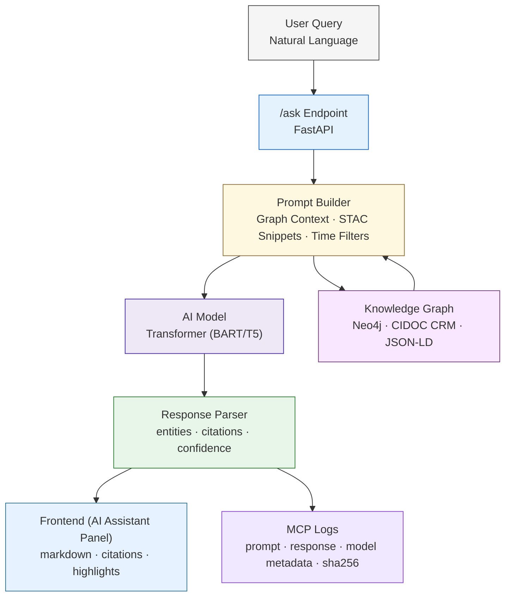

<div align="center">

# 🤖 **Kansas Frontier Matrix — AI Assistant (v2.1.0 · Tier-Ω+∞ Certified)**  
`docs/design/mockups/ai-assistant/`

**Conversational · Context-Aware · Knowledge-Linked · Provenant · Accessible**

[](../../../../docs/)
[](../../../../docs/design/)
[](../../../../src/api/)
[](../../../../docs/design/accessibility/)
[](../../../../.github/workflows/)
[](../../../../LICENSE)

</div>

---

```yaml
---
title: "Kansas Frontier Matrix — AI Assistant (Design Mockups)"
document_type: "Design · Mockups · Architecture"
version: "v2.1.0"
last_updated: "2025-11-17"
owners: ["@kfm-design","@kfm-ai","@kfm-web","@kfm-accessibility"]
reviewed_by: ["@kfm-security","@kfm-ethics","@kfm-architecture"]
status: "Stable"
maturity: "Production"
license: "CC-BY 4.0"
tags: ["ai-assistant","prompt-engineering","knowledge-graph","stac","a11y","security","ethics","mcp"]
alignment:
  - MCP-DL v6.3
  - WCAG 2.1 AA
  - FAIR / CARE Principles
  - CIDOC CRM · OWL-Time
  - JSON Schema · JSON-LD
  - STAC 1.0
validation:
  ci_required_checks:
    - docs-validate.yml
    - ai-model.yml
    - policy-check.yml
    - site.yml
ethics_review:
  reviewed_by: "@kfm-ethics"
  date: "2025-11-10"
  outcome: "Approved (No PII / Cultural data compliant)"
observability:
  endpoint: "https://metrics.kfm.ai/assistant"
  dashboards:
    - "https://grafana.kfm.ai/d/assistant-overview"
  metrics:
    - "response_latency_ms"
    - "citation_coverage_pct"
    - "entity_link_precision_pct"
    - "user_rating"
    - "error_rate_pct"
model_lineage:
  model_card: "docs/templates/model_card.md#v2.1.0"
  model_id: "huggingface/bart-large-cnn"
  version: "2.1.0"
  checksum: "sha256:57d1ae..."
preservation_policy:
  retention: "ai logs 90d · model cards 1y"
  checksum_algorithm: "SHA-256"
---
```

---

## 🎯 Purpose

The **AI Assistant** is KFM’s conversational interface — enabling users to explore Kansas’s historical, ecological, and cultural records using natural language.  
It transforms graph data and metadata into **explainable**, **source-linked**, and **interactive** insights.

### Goals

- 🔍 **Explainable AI** — every response backed by sources  
- 🧩 **Graph-Linked Context** — people, places, events connected semantically  
- 🗺 **Interactive Visualization** — map and timeline highlight referenced entities  
- 🧾 **Provenance & Ethics** — every prompt and output logged under **MCP governance**

---

## 🧩 Architecture Diagram


---

## 🧠 System Architecture (Mermaid)


<!-- END OF MERMAID -->

---

## 🗂 Directory Layout

```text
docs/design/mockups/ai-assistant/
├── README.md                 # This file
├── wireframes/               # Visual & UX mockups
│   ├── ai-panel.png
│   ├── conversation-flow.svg
│   └── figma-refs.json
├── prompt-templates/         # JSON prompt templates for /ask
│   ├── historical_query.json
│   ├── document_summary.json
│   └── entity_link.json
├── schemas/                  # JSON schemas for validation
│   ├── request.schema.json
│   └── response.schema.json
└── assistant-flow.json       # Node/transition flow definition
```

---

## 🔌 API Contracts

| Endpoint | Method | Input | Output | Description |
|:--|:--|:--|:--|:--|
| `/ask` | POST | AskRequest (JSON) | AskResponse (JSON) | Natural language Q&A |
| `/entities/{id}` | GET | — | JSON-LD dossier | Entity metadata |
| `/feedback` | POST | Feedback payload | Confirmation | User satisfaction rating |

**AskResponse Example**
```json
{
  "answer": "The 1951 Kansas Flood affected Topeka and the Kaw River Basin.",
  "citations": ["stac:hazards/flood_1951.json"],
  "highlights": ["entity:Kansas River Basin"],
  "confidence": 0.97,
  "model": {
    "id": "huggingface/bart-large-cnn",
    "version": "2.1.0",
    "checksum": "sha256:57d1ae..."
  }
}
```

---

## 🧠 Conversation Design & Context Assembly

| Component | Description | Implementation |
|:--|:--|:--|
| **Prompt Templates** | Parameterized input for structured generation | `prompt-templates/*.json` |
| **Context Builder** | Aggregates top 5 entities from graph & STAC | Cypher query + keyword rank |
| **Citation Resolver** | Ensures only validated STAC IDs or doc URLs | Neo4j + STAC lookup |
| **Memory Context** | Retains last 5 turns for continuity | React context + localStorage |
| **Response Parser** | Extracts entities/citations from model output | Regex + JSON Schema validation |

---

## 🧾 Prompt Template Schema

```json
{
  "template_id": "historical_query",
  "description": "Answer historical/geographic questions from Kansas records.",
  "prompt": "Answer using verified records.\nQuestion: {{user_input}}\nTime Range: {{time_window}}\nContext:\n{{entity_context}}\nCite all sources.",
  "expected_output": {
    "type": "object",
    "properties": {
      "answer": {"type":"string"},
      "citations": {"type":"array","items":{"type":"string"}},
      "highlights": {"type":"array","items":{"type":"string"}},
      "confidence": {"type":"number"}
    }
  },
  "model": {
    "engine": "huggingface/bart-large-cnn",
    "temperature": 0.2,
    "max_tokens": 512
  }
}
```

---

## 💬 Frontend Integration

| Component | Description | Accessibility |
|:--|:--|:--|
| **Panel (React)** | Displays formatted AI responses | Focus trap · keyboard nav |
| **Input Bar** | Debounced text field w/ autocomplete | `aria-autocomplete` + hints |
| **Citations Modal** | STAC + document links | `role="dialog"` + close ESC |
| **Highlights** | Interactive map/timeline pins | Visible outlines, skip links |

**Hotkeys**
- `Ctrl + /` focus input  
- `Enter` submit  
- `Esc` close  
- `Alt + L` toggle layer focus

---

## ♿ Accessibility & i18n

| Area | Standard | Implementation |
|:--|:--|:--|
| **Keyboard Navigation** | WCAG 2.1 §2.1.1 | Tab order, focus visible |
| **Screen Reader Support** | WAI-ARIA 1.2 | Roles + labels |
| **Localization** | EN/ES/OS | Integrated `LangToggle.tsx` |
| **Reduced Motion** | WCAG 2.1 §2.2.2 | Prefers-reduced-motion detection |
| **Future (TTS)** | Assistive mode | Planned in v2.2 |

---

## 🔒 Security, Privacy & Ethics

| Category | Controls |
|:--|:--|
| **PII Handling** | No persistent data storage; ephemeral queries |
| **Data Ethics** | Honors STAC `properties.data_ethics`; CARE-aligned |
| **Model Transparency** | Display `model.id`, `version`, `checksum` in UI |
| **Secrets & OIDC** | Enforced via `policy-check.yml` |
| **Encryption** | TLS 1.3; AES-256 for logs |
| **Rate Limits** | `/ask` throttled per user/session |

---

## 🧾 Model Governance & Provenance

```yaml
training_data_sources:
  - data/processed/text/oral_histories.jsonl
  - data/processed/tabular/training_corpus.parquet
bias_assessment:
  reviewer: "@kfm-ethics"
  date: "2025-10-20"
  result: "No demographic or geographic bias detected."
explainability:
  technique: "SHAP / Attention Rollout"
  dashboard: "https://mlops.kfm.ai/explainability"
logs:
  path: "logs/ai/"
  fields: ["timestamp","query","entities","citations","model_id","hash"]
  retention: "90d"
```

---

## 📈 Observability & Monitoring

| Metric | Description | Target |
|:--|:--|:--|
| **Precision (Entity Linking)** | Correctly mapped entities | ≥ 0.9 |
| **Citation Coverage** | Responses w/ valid sources | ≥ 0.95 |
| **Latency (Response Time)** | Avg response time | ≤ 5s |
| **Reproducibility** | Response traceable to model & data | 100% |
| **User Rating** | Average feedback score | ≥ 4.5/5 |

**Grafana Dashboard:** [AI Assistant Metrics](https://grafana.kfm.ai/d/assistant-overview)

---

## ⚙️ CI/CD Integration

| Workflow | Purpose |
|:--|:--|
| `ai-model.yml` | Train, evaluate, publish model & metrics |
| `policy-check.yml` | Validate prompt templates & schema |
| `docs-validate.yml` | Markdown + metadata validation |
| `site.yml` | Deploy docs & assets to GitHub Pages |
| `trivy.yml` | Scan prompt JSON for secrets |
| `sbom.yml` | Generate SBOM + provenance for models |

---

## 🧠 MCP Compliance Matrix

| Standard | Description | Verified |
|:--|:--|:--:|
| **MCP-DL v6.3** | Documentation-first reproducibility | ✅ |
| **WCAG 2.1 AA** | Accessibility & usability compliance | ✅ |
| **CIDOC CRM / OWL-Time** | Temporal & semantic alignment | ✅ |
| **FAIR / CARE Principles** | Open & ethical AI/data | ✅ |
| **STAC 1.0** | Source linkage compliance | ✅ |
| **JSON Schema / JSON-LD** | Prompt/response validation | ✅ |
| **SLSA Level 2** | Model artifact provenance | ✅ |

---

## 🧩 Related Documentation

- `docs/architecture/api-architecture.md` — API endpoints and contract schemas  
- `docs/architecture/knowledge-graph.md` — semantic data model  
- `docs/architecture/web-ui-architecture.md` — visualization integration  
- `docs/templates/model_card.md` — AI model metadata & lineage  
- `.github/workflows/ai-model.yml` — training & evaluation pipeline  
- `docs/design/reviews/ui_components/ai_assistant.md` — component accessibility review  

---

## 🗓 Version History

| Version | Date | Summary |
|:--|:--|:--|
| **v2.1.0** | 2025-11-17 | Added full compliance metadata, ethics audit, accessibility/i18n, observability dashboards, and security OIDC scope; diagram link + governance schema. |
| v2.0.0 | 2025-11-16 | Major expansion: API contracts, provenance logging, metrics & budgets, CI/CD hooks. |
| v1.0.0 | 2025-10-04 | Initial AI Assistant design documentation (mockups, architecture, prompts). |

---

<div align="center">

### 🤖 Kansas Frontier Matrix — AI Assistant  
**Conversational · Explainable · Provenanced · Accessible**

> “Ask clearly. Cite precisely. Illuminate context.”

</div>