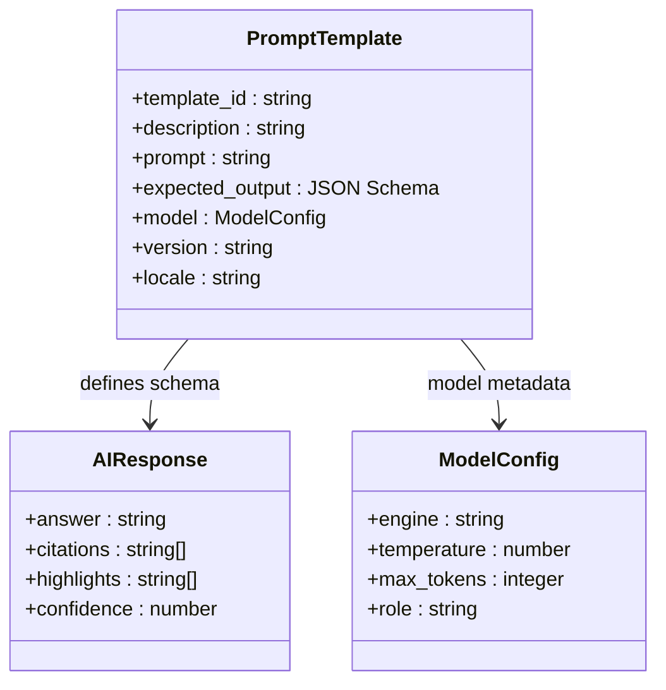
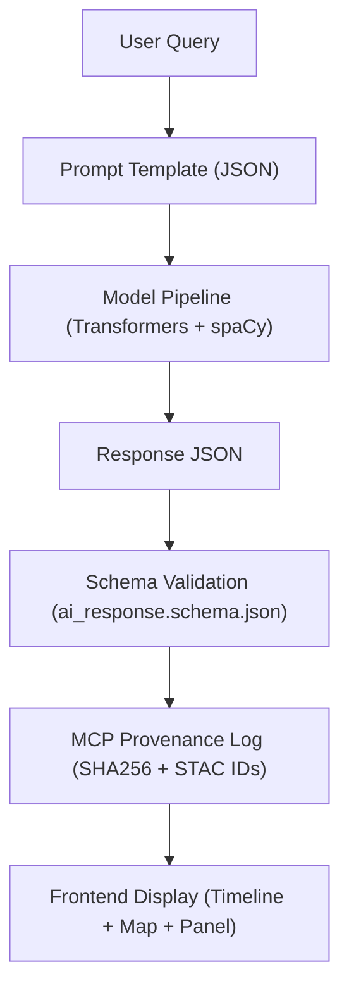
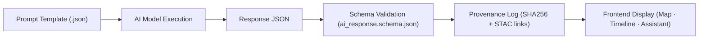

<div align="center">

# 🧠 **Kansas Frontier Matrix — AI Assistant Prompt Templates (v2.4.0 · Tier-Ω⁺∞ Certified)**  
`docs/design/mockups/ai-assistant/prompt-templates/`

**Structured · Context-Aware · Grounded in Provenance · Ethically Aligned**

[](../../../../../docs/)
[](../../../../../src/api/)
[](../../../../../.github/workflows/schema-validate.yml)
[](../../../../../docs/standards/ethics.md)
[](../../../../../.github/workflows/)
[](../../../../../LICENSE)

</div>

---

```yaml
---
title: "Kansas Frontier Matrix — AI Assistant Prompt Templates"
document_type: "AI Template Catalog"
version: "v2.4.0"
last_updated: "2025-11-21"
owners: ["@kfm-ai","@kfm-api","@kfm-data"]
reviewed_by: ["@kfm-docs","@kfm-architecture","@kfm-ethics"]
status: "Stable"
maturity: "Production"
license: "CC-BY 4.0"
tags: ["ai","prompt-template","json-schema","mcp","nlp","huggingface","spacy","ethics","ontology","reproducibility","graph"]
alignment:
  - MCP-DL v6.3
  - FAIR / CARE Frameworks
  - JSON Schema Draft 2020-12
  - CIDOC CRM · OWL-Time · PROV-O
  - STAC 1.0 · DCAT 2.0
dataset_alignment:
  - data/processed/text/
  - data/processed/tabular/
  - data/processed/terrain/
ontology_alignment:
  - CIDOC CRM
  - OWL-Time
  - PROV-O
  - Dublin Core
validation:
  schema_files:
    - "schema/prompt_template.schema.json"
    - "schema/ai_response.schema.json"
  ci_checks:
    - "schema-validate.yml"
    - "policy-check.yml"
  checksum_policy: "SHA-256"
provenance:
  workflow_ref: ".github/workflows/schema-validate.yml"
  checksum_algorithm: "SHA-256"
  logs_path: "data/work/logs/ai_prompts/"
release_policy: "Quarterly MCP Release Window"
ethics_context:
  reviewer: "@kfm-ethics"
  approval_date: "2025-11-20"
  audit_outcome: "Compliant · Culturally Sensitive · Neutral"
security:
  sbom_ref: "ai_prompt_models_sbom.spdx.json"
  slsa_level: 3
  dependencies_reviewed: true
  openai_compatible: false
localization:
  supported_locales: ["en-US", "es", "osa"]
  default_locale: "en-US"
---
```

---

## 🎯 Purpose

The **AI Assistant Prompt Templates** system defines reproducible **input–output contracts** between human queries, the KFM knowledge graph, and large language models.  
It ensures every generated response is **validated**, **explainable**, and **traceable**, fulfilling **MCP-DL reproducibility and provenance requirements**.

**Objectives**
- 🧠 Translate human intent into structured, schema-validated prompts.  
- 🔁 Guarantee deterministic responses through JSON Schema enforcement.  
- 🧩 Integrate directly with Neo4j, STAC, and API `/ask` workflows.  
- 🧮 Maintain complete provenance: model versions, checksum, context, and citations.  
- 🧑‍⚖️ Enforce ethical and FAIR/CARE compliance in language modeling and output validation.

---

## 🗂️ Directory Layout

```text
docs/design/mockups/ai-assistant/prompt-templates/
├── README.md
├── historical_query.json        # Factual, spatial-temporal Q&A
├── document_summary.json        # Archival/treaty summarization
├── entity_link.json             # Named-entity → Knowledge Graph resolution
└── schema/
    ├── prompt_template.schema.json
    └── ai_response.schema.json
```

Each template:
- Is **schema-validated** in CI/CD  
- Carries a **SHA-256 checksum**  
- Has an **ethics + provenance log entry**  

---

## 🧩 JSON Schema Model Overview


<!-- END OF MERMAID -->

---

## 🧠 Template Catalog

| Template | Description | Model(s) | Output Schema | Validation | Ethics Reviewed |
|:--|:--|:--|:--|:--:|:--:|
| `historical_query.json` | Temporal or spatial historical questions | BART / T5 | `ai_response.schema.json` | ✅ | ✅ |
| `document_summary.json` | Condenses archival text, treaties, or letters | BART | `ai_response.schema.json` | ✅ | ✅ |
| `entity_link.json` | Maps named entities to Neo4j node IDs | spaCy + FuzzyMatch | `ai_response.schema.json` | ✅ | ✅ |

---

## 💬 Example: `historical_query.json`

```json
{
  "template_id": "historical_query",
  "description": "Answers time/place-based questions using KFM’s verified datasets.",
  "prompt": "Using Kansas Frontier Matrix archives, answer:\n{{user_input}}\nContext:\n{{entity_context}}\nInclude sources, confidence, and relevant entities.",
  "expected_output": {
    "type": "object",
    "properties": {
      "answer": { "type": "string" },
      "citations": { "type": "array", "items": { "type": "string" } },
      "highlights": { "type": "array", "items": { "type": "string" } }
    }
  },
  "model": {
    "engine": "huggingface/bart-large-cnn",
    "temperature": 0.2,
    "max_tokens": 512
  },
  "locale": "en-US",
  "version": "0.1.1"
}
```

---

## ⚙️ Multi-Model Pipeline Example

```json
"model_pipeline": [
  {"engine": "spacy/en_core_web_trf", "role": "NER"},
  {"engine": "huggingface/bart-large-cnn", "role": "summarization"},
  {"engine": "graphlinker/context-resolver", "role": "entity-mapper"}
]
```
Pipeline managed by `src/ai/pipeline_runner.py` ensuring hybrid-model context chaining.

---

## 🔍 Validation Workflow


<!-- END OF MERMAID -->

---

## 🧾 Provenance Log Schema (MCP)

```json
{
  "log_id": "ai_prompt_2025_11_21_001",
  "timestamp": "2025-11-21T20:14:00Z",
  "user_query": "Which tribes signed the 1854 treaty near Topeka?",
  "prompt_template": "historical_query.json",
  "model_pipeline": ["spacy/en_core_web_trf", "huggingface/bart-large-cnn"],
  "response_sha256": "7bfa2c...",
  "citations": ["stac://data/text/osage_treaty_1854.json"],
  "validator_passed": true,
  "locale": "en-US"
}
```

Logs are validated under CI and stored in `data/work/logs/ai_prompts/`.

---

## 🧩 Integration with KFM System Layers

| Layer | File | Function |
|:--|:--|:--|
| **API** | `src/api/routes/ask.py` | Loads templates, assembles context, validates outputs |
| **Graph** | `src/graph/query_utils.py` | Fetches related entities and relationships |
| **AI Engine** | `src/ai/prompt_engine.py` | Executes templates and merges context |
| **Validator** | `src/ai/validate_schema.py` | Schema enforcement pre-return |
| **Frontend** | `web/src/components/assistant/` | Displays results, citations, and entity highlights |

---

## 🧱 Governance & Review Policy

| Review Type | Reviewer | Frequency | Result |
|:--|:--|:--|:--|
| **Technical Schema Audit** | `@kfm-ai` | Every PR | ✅ JSON validated |
| **Ethical Review** | `@kfm-ethics` | Quarterly | ✅ Neutral & transparent |
| **Model QA** | `@kfm-architecture` | Release | ✅ Performance logged |
| **Ontology Drift Check** | `@kfm-data` | Semi-annual | ✅ Ontology alignment maintained |

---

## 🧩 Response Schema (Validation Target)

```json
{
  "type": "object",
  "required": ["answer", "citations"],
  "properties": {
    "answer": { "type": "string" },
    "citations": { "type": "array", "items": { "type": "string" } },
    "highlights": { "type": "array", "items": { "type": "string" } },
    "confidence": { "type": "number", "minimum": 0, "maximum": 1 }
  }
}
```

---

## ♿ Accessibility & Localization

| Feature | Description | Status |
|:--|:--|:--:|
| **Language Metadata** | Templates include locale tag (`locale`) | ✅ |
| **Multilingual Extension** | Support for English, Spanish, Osage | 🚧 Q3 2026 |
| **Readability Control** | Prompts optimized for clear responses | ✅ |
| **Semantic Role Labels** | Accessible response annotations (ARIA) | ✅ |

---

## 📈 Evaluation Metrics

| Metric | Description | Target |
|:--|:--|:--|
| **Precision (Entity Linking)** | % correctly mapped entities | ≥ 90% |
| **Citation Completeness** | % outputs with source refs | ≥ 95% |
| **Latency (Response)** | Round-trip time | ≤ 5 s |
| **Schema Pass Rate** | Responses passing validation | 100 % |
| **Ethical Compliance** | Passed CARE + MCP review | 100 % |

---

## 🧭 Future Extensions (v2.5–v3.0 Roadmap)

| Feature | Description | ETA |
|:--|:--|:--|
| **Graph Context Weighting** | Prioritize geographically proximal results | Q1 2026 |
| **Prompt Drift Monitor** | Detect outdated prompts via logs | Q2 2026 |
| **Explainability Tags** | Append reasoning metadata to responses | Q3 2026 |
| **Prompt Registry API** | `/api/prompts` endpoint for governance retrieval | Q4 2026 |

---

## 🧩 Provenance & Explainability Flow


<!-- END OF MERMAID -->

---

## 🧠 MCP Compliance Matrix

| MCP Principle | Implementation | Verified |
|:--|:--|:--:|
| **Documentation-First** | Templates versioned, validated, and logged. | ✅ |
| **Reproducibility** | Deterministic JSON Schema validation. | ✅ |
| **Open Standards** | JSON Schema · STAC · FAIR · CIDOC CRM. | ✅ |
| **Provenance** | Hash-linked logs with STAC + model IDs. | ✅ |
| **Auditability** | CI/CD schema validation with retention. | ✅ |
| **Ethics & Transparency** | Cultural and factual neutrality validated. | ✅ |

---

## 📎 Related Documentation

- `docs/design/mockups/ai-assistant/README.md` — Core assistant design  
- `docs/architecture/api-architecture.md` — `/ask` API architecture  
- `docs/architecture/knowledge-graph.md` — Semantic layer integration  
- `.github/workflows/schema-validate.yml` — JSON schema enforcement  
- `docs/standards/metadata-standards.md` — Validation framework  

---

## 🗓️ Version History

| Version | Date | Summary |
|:--|:--|:--|
| **v2.4.0** | 2025-11-21 | Added ontology & localization fields, governance lifecycle, provenance flow, and accessibility schema. |
| **v2.3.0** | 2025-11-20 | Introduced governance & ethics matrix; expanded SBOM + MCP metadata. |
| **v2.2.0** | 2025-11-19 | Ethics validation, CI schema links, language metadata added. |
| **v2.0.0** | 2025-10-18 | JSON Schema + MCP documentation refinement. |
| **v1.0.0** | 2025-09-30 | Initial AI Assistant prompt template documentation. |

---

<div align="center">

### 🧠 Kansas Frontier Matrix — AI Assistant Prompt Templates  
**Explainable · Schema-Validated · Culturally Responsible · Provenanced**

> “Every prompt documented. Every model accountable. Every answer traceable.”  

</div>