<div align="center">

# 🧩 **Kansas Frontier Matrix — AI Assistant Schemas (v3.0.0 · Tier-S⁺⁺⁺ Certified)**  
`docs/design/mockups/ai-assistant/prompt-templates/schema/`

**Validation · Provenance · Standardization · Ethics · Reproducibility**

[](../../../../../../docs/)
[](../../../../../../src/api/)
[](https://json-schema.org/)
[](../../../../../../.github/workflows/)
[](../../../../../../docs/standards/ethics.md)
[](../../../../../../LICENSE)

</div>

---

```yaml
---
title: "Kansas Frontier Matrix — AI Assistant Schemas"
document_type: "Schema Catalog"
version: "v3.0.0"
last_updated: "2025-11-22"
owners: ["@kfm-ai","@kfm-api","@kfm-data"]
reviewed_by: ["@kfm-docs","@kfm-architecture","@kfm-ethics"]
status: "Stable"
maturity: "Tier-S⁺⁺⁺"
license: "CC-BY 4.0"
tags: ["ai","json-schema","validation","prompt-template","mcp","ontology","reproducibility","provenance"]
alignment:
  - MCP-DL v6.3
  - JSON Schema Draft 2020-12
  - FAIR / CARE Frameworks
  - CIDOC CRM · OWL-Time · PROV-O
  - STAC 1.0 / DCAT 2.0
validation:
  required_workflows:
    - ".github/workflows/schema-validate.yml"
    - ".github/workflows/policy-check.yml"
    - ".github/workflows/docs-validate.yml"
  checksum_algorithm: "SHA-256"
  logging_path: "data/work/logs/ai_prompts/"
ethics_review:
  reviewer: "@kfm-ethics"
  approval_date: "2025-11-22"
  result: "Compliant · Neutral · FAIR/CARE Aligned"
security:
  sbom_ref: "ai_prompt_models_sbom.spdx.json"
  slsa_level: 3
  provenance_tracking: true
  openai_compatible: false
preservation_policy:
  retention: "schemas=permanent; logs=180d"
  replication_targets: ["GitHub Releases","Zenodo DOI"]
---
```

---

## 🎯 Purpose

This directory defines the **validation schemas** for all **AI Assistant prompt templates** and **model responses** in the **Kansas Frontier Matrix (KFM)**.  
Every schema guarantees **structural integrity**, **ethical compliance**, **data lineage**, and **reproducibility** of AI-generated outputs, as required by the **Master Coder Protocol (MCP-DL v6.3)**.

---

## 📁 Directory Layout

```text
docs/design/mockups/ai-assistant/prompt-templates/schema/
├── README.md                    # This documentation (Tier-S⁺⁺⁺ schema index)
├── prompt_template.schema.json  # Schema for all prompt templates
└── ai_response.schema.json      # Schema for model response validation
```

---

## 🧾 Embedded Schema Metadata Standard

Each `.schema.json` file includes a `$comment` block for human-readable provenance:

```json
"$comment": "Kansas Frontier Matrix — AI Assistant Schema | Version: 0.1.1 | Author: @kfm-ai | MCP-DL v6.3 | License: CC-BY 4.0"
```

This ensures schemas remain self-descriptive, versioned, and auditable independently of this documentation.

---

## 🧩 Schema Relationship Overview


<!-- END OF MERMAID -->

---

## 🧱 `prompt_template.schema.json` (Prompt Definition)

Defines the structure of all AI Assistant prompt configuration files.

| Field | Type | Required | Example | Description |
|:--|:--|:--:|:--|:--|
| `$schema` | string | ✅ | `"./prompt_template.schema.json"` | Self-reference |
| `template_id` | string | ✅ | `"historical_query"` | Unique ID |
| `description` | string | ✅ | `"Answers Kansas history questions"` | Purpose |
| `prompt` | string | ✅ | `"Answer using Frontier Matrix archives..."` | Template text |
| `expected_output` | object | ✅ | JSON Schema | Defines model output contract |
| `model` | object | ✅ | `{ "engine": "huggingface/bart-large-cnn" }` | Engine metadata |
| `version` | string | ✅ | `"0.1.1"` | Semantic version |
| `license` | string | ✅ | `"CC-BY 4.0"` | License |
| `locale` | string | ❌ | `"en-US"` | Supported language |

---

### 🧱 Example Snippet

```json
{
  "$schema": "./prompt_template.schema.json",
  "template_id": "historical_query",
  "description": "Answer based on Kansas Frontier Matrix historical data.",
  "prompt": "Question: {{user_input}}\nContext:\n{{entity_context}}",
  "expected_output": {
    "type": "object",
    "properties": {
      "answer": { "type": "string" },
      "citations": { "type": "array", "items": { "type": "string" } },
      "highlights": { "type": "array", "items": { "type": "string" } }
    },
    "required": ["answer","citations"]
  },
  "model": {
    "engine": "huggingface/bart-large-cnn",
    "temperature": 0.2,
    "max_tokens": 512
  },
  "version": "0.1.1",
  "license": "CC-BY 4.0",
  "locale": "en-US"
}
```

---

## 🧱 `ai_response.schema.json` (Response Validation)

Defines **AI model output structure** returned by `/ask`.

| Field | Type | Required | Default | Example | Description |
|:--|:--|:--:|:--|:--|:--|
| `answer` | string | ✅ | — | `"Treaty signed in 1867..."` | Model’s factual response |
| `citations` | array | ✅ | `[]` | `["stac:item:treaty_medicine_lodge_1867"]` | Source links |
| `highlights` | array | ❌ | `[]` | `["Medicine Lodge","1867"]` | Entity labels |
| `confidence` | number | ✅ | `0.0` | `0.93` | Confidence level |
| `model` | object | ✅ | — | `{ "id": "huggingface/bart-large-cnn" }` | Model metadata |
| `timestamp` | string | ✅ | current UTC | `2025-11-22T14:22Z` | Generation time |
| `hash` | string | ✅ | — | `sha256-d2fa…` | Response checksum |

---

## 🧩 Ontology Mapping

| Response Field | CIDOC CRM Entity | OWL/PROV Alignment | Description |
|:--|:--|:--|:--|
| `citations` | `E31_Document` | `prov:wasDerivedFrom` | Source documents |
| `highlights` | `E53_Place` / `E5_Event` | `crm:P7_took_place_at` | Geographic or temporal context |
| `confidence` | — | `prov:confidence` | Quantitative model reliability |
| `timestamp` | — | `time:Instant` | Temporal provenance |

---

## 🧾 Validation & CI/CD Workflow

```mermaid
flowchart TD
  A["Prompt Template (.json)"] --> B["Validate\n(prompt_template.schema.json)"]
  B --> C["Model Inference\nTransformers + spaCy"]
  C --> D["Response JSON"]
  D --> E["Validate\n(ai_response.schema.json)"]
  E --> F["Provenance Logging\n(timestamp · hash · model_id)"]
  F --> G["Frontend Visualization\n(Map · Timeline · AI Panel)"]
```


<!-- END OF MERMAID -->

**Automation chain:**
1. Schemas validated at PR via **schema-validate.yml**.  
2. Prompt execution logs recorded under **`data/work/logs/ai_prompts/`**.  
3. Provenance checks confirm **model lineage + response checksum**.

---

## 🧪 Automated Tests & Coverage

| Test File | Purpose | Framework |
|:--|:--|:--|
| `tests/ai/test_schema_validation.py` | Validate prompt/response schemas | `pytest + jsonschema` |
| `tests/ai/test_ai_response_sample.py` | Sample response validation | `pytest` |
| `tests/ai/test_integrity_hash.py` | Verify checksum & timestamp | `pytest` |

```python
def test_ai_response_schema_valid():
    schema = load_schema("ai_response.schema.json")
    instance = load_sample("sample_response.json")
    jsonschema.validate(instance=instance, schema=schema)
```

---

## 📈 Validation Metrics Dashboard (CI Telemetry)

```yaml
validation_metrics:
  schema_pass_rate: 100%
  average_latency_ms: 185
  invalid_json_rejections_30d: 0
  response_validation_pass: 100%
  prompt_template_coverage: 3/3
  last_audit: 2025-11-22T10:00Z
```

---

## 🔁 Schema Versioning Policy

| Change Type | Schema Impact | Required Action |
|:--|:--|:--|
| Field addition | Backward-compatible | Increment **minor** version |
| Field removal/type change | Breaking | Increment **major** version |
| Doc/comments change | Non-functional | Increment **patch** version |
| New schema introduced | Major | Add new schema file and audit |

---

## 🔒 Ethics, Security & Compliance

- **Neutrality Enforcement:** Prompts must avoid bias and conjecture.  
- **Sensitive Content:** Responses must redact or flag protected data.  
- **Model Safety:** SBOM + SLSA attestations validate dependency integrity.  
- **Data Provenance:** STAC citations required for all AI responses.  
- **Ethical Audit:** All schemas reviewed quarterly by `@kfm-ethics`.

### Ethics Review Example

```json
{
  "ethics_review": {
    "reviewer": "@kfm-ethics",
    "date": "2025-11-22",
    "notes": "Schema validated for neutrality; no personally identifiable data handled."
  }
}
```

---

## 🌐 Schema Validation in CI/CD

| Workflow | Description | Artifact |
|:--|:--|:--|
| `schema-validate.yml` | Validates schema compliance via JSON Schema | `json-schema-report.json` |
| `policy-check.yml` | Checks for mandatory fields (license, version, $schema) | `policy-check.log` |
| `docs-validate.yml` | Ensures Mermaid end markers + YAML headers | `docs-validation.log` |

---

## 🧩 CI/CD Provenance Diagram


<!-- END OF MERMAID -->

---

## 🧩 Schema Compliance Report

```yaml
schema_compliance_report:
  total_schemas: 2
  validation_pass: 2
  ontology_mapped: true
  last_audit: 2025-11-22
  reviewers: ["@kfm-ai","@kfm-docs","@kfm-ethics"]
  overall_status: "Compliant · FAIR/CARE Certified · MCP-DL v6.3 Verified"
```

---

## 📚 Related Documentation

- `../README.md` — Prompt Templates Catalog  
- `../../README.md` — AI Assistant Architecture  
- `../../../../architecture/api-architecture.md` — `/ask` API design  
- `../../../../architecture/data-architecture.md` — STAC data lineage  
- `.github/workflows/schema-validate.yml` — Validation workflow configuration  
- `../../../../standards/metadata-standards.md` — JSON / YAML compliance  

---

## 🧭 MCP Compliance Matrix

| MCP Principle | Implementation | Verified |
|:--|:--|:--:|
| **Documentation-First** | Schemas documented and versioned | ✅ |
| **Reproducibility** | Deterministic validation workflows | ✅ |
| **Open Standards** | JSON Schema · FAIR · STAC | ✅ |
| **Provenance** | SHA-256 + timestamps in logs | ✅ |
| **Auditability** | CI artifacts stored for 180d | ✅ |
| **Ethics** | CARE principles applied | ✅ |
| **Accessibility** | WCAG 2.1 AA compliance | ✅ |

---

## 🗓 Version History

| Version | Date | Summary |
|:--|:--|:--|
| **v3.0.0** | 2025-11-22 | Added ontology mapping, ethics section, versioning policy, validation telemetry, compliance report, and CI diagrams. |
| **v2.2.0** | 2025-11-21 | Added test coverage, validation metrics, and accessibility. |
| **v2.0.0** | 2025-10-06 | Initial schema documentation. |

---

<div align="center">

### 🧩 Kansas Frontier Matrix — AI Assistant Schemas  
**Every Schema Validated · Every Model Audited · Every Answer Provenanced**

> “Validation is the backbone of trust in machine reasoning.” 
> — *KFM Design & AI Integration Team, 2025*

</div>