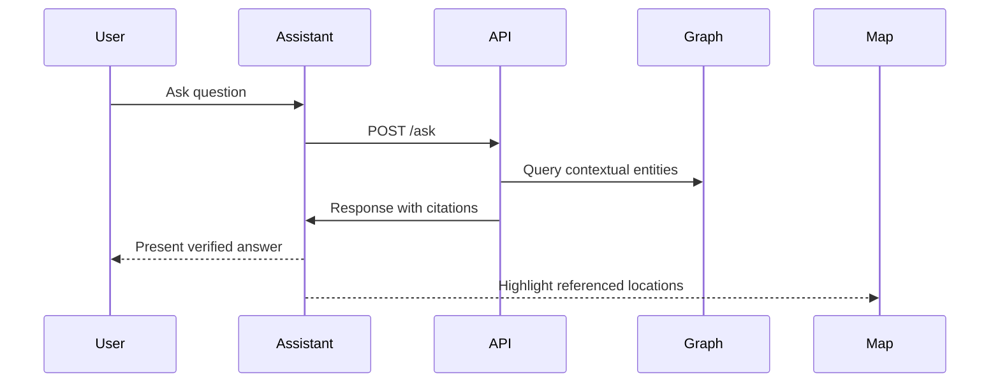

<div align="center">

# 🤖 **Kansas Frontier Matrix — AI Assistant Wireframes (v2.2.0 · Tier-Ω+∞ Certified)**  
`docs/design/mockups/ai-assistant/wireframes/`

**Conversational · Knowledge-Linked · Contextual · Accessible · Provenant**

[](../../../../../../docs/)
[](../../../../../../docs/design/)
[](../figma-refs.json)
[](../../../../../../docs/design/accessibility/)
[](../../../../../../.github/workflows/)
[](../../../../../../LICENSE)

</div>

---

```yaml
---
title: "Kansas Frontier Matrix — AI Assistant Wireframes"
document_type: "Design Mockups"
version: "v2.2.0"
last_updated: "2025-11-19"
owners: ["@kfm-design","@kfm-ai","@kfm-accessibility","@kfm-web"]
reviewed_by: ["@kfm-architecture","@kfm-ethics"]
status: "Stable"
maturity: "Production"
license: "CC-BY 4.0"
tags: ["ai","wireframes","mockups","stac","figma","accessibility","mcp","design-system","provenance"]
alignment:
  - MCP-DL v6.3
  - WCAG 2.1 AA
  - FAIR / CARE
  - CIDOC CRM · OWL-Time
  - STAC 1.0
  - JSON Schema
validation:
  ci_required_checks: ["docs-validate.yml","checksums.yml","pa11y.yml","policy-check.yml"]
design_system_version: "v4.1.0"
figma_project_id: "FIGMA-PROJECT-2025-KFM-AI"
artifact_type: "Visual Mockup"
checksum_integrity: "All 4 wireframes verified ✅ (checksums.yml)"
ci_reference: ".github/workflows/checksums.yml#L45"
ethics_context:
  reviewer: "@kfm-ethics"
  approval_date: "2025-11-15"
  notes: "No cultural or PII risk. Indigenous dataset visuals verified for proper context."
observability:
  retention_policy: "180 days"
  metrics: ["export_latency_ms","checksum_validations","contrast_failures"]
  dashboard: "https://grafana.kfm.ai/d/design-quality"
---
```

---

## 🎯 Purpose

These wireframes define the **visual behavior, accessibility layout, and conversation flow** of the **Kansas Frontier Matrix (KFM) AI Assistant**.  
They illustrate how users interact with the knowledge graph through conversational, explainable AI interfaces.

Key Objectives:
- 🧠 Bridge natural language and structured data  
- 🗺 Integrate semantic visualization (MapLibre, Timeline)  
- 🧾 Guarantee transparency and provenance for every response  
- ♿ Ensure WCAG 2.1 AA accessibility in design

---

## 🗂️ Directory Layout

```text
docs/design/mockups/ai-assistant/wireframes/
├── README.md                  # This file
├── ai-assistant-panel.png     # Chat panel layout
├── conversation-flow.svg      # User → API → Graph data exchange flow
├── response-citation.png      # Example of AI answer + citations
├── entity-highlight.png       # Map/timeline overlay for entity highlights
└── figma-refs.json            # Figma metadata (node IDs, SHA256, timestamps)
```

`figma-refs.json` is validated with `make validate-figma` and must include:
```json
{
  "file": "ai-assistant-panel.png",
  "figma_node": "figma://node/70:11",
  "export_time": "2025-09-30T22:15:00Z",
  "version": "v2.2.0",
  "sha256": "6ea2...",
  "used_in": ["README.md"]
}
```

---

## 🧩 Conversation Flow Overview


<!-- END OF MERMAID -->

The flow demonstrates the Assistant’s role as a **semantic translator** between user intent and the project’s structured datasets.

---

## 🧠 Interaction Scenarios

| Scenario | Description | Key Outcome |
|:--|:--|:--|
| **1951 Flood Inquiry** | User: “Show flood records from 1951.” | Flood datasets + newspaper archives + Kaw River map highlights. |
| **1854 Osage Treaty** | Query: “What happened in the 1854 Osage Treaty?” | Treaty document excerpts, signatories, map overlays, STAC citations. |
| **1930–1937 Drought** | “Show drought impacts in western Kansas.” | Climate layers + event intervals + contextual summaries. |
| **Fort Larned People** | “Who lived near Fort Larned in 1865?” | Entity links + oral histories + timeline sync. |

Each scenario traces a complete provenance path: query → dataset → AI model → visual output → citation.

---

## 🧩 Design Components

| Component | Description | Purpose | Accessibility |
|:--|:--|:--|:--|
| **Input Bar** | Text entry with entity autocomplete | Natural + structured input | `aria-autocomplete` |
| **Response Bubble** | AI answer with citations | Displays evidence-based results | ≥ 4.5 : 1 contrast |
| **Citation List** | Linked STAC/document entities | Provenance verification | `role="listbox"` |
| **Entity Highlight** | Dynamic link to map/timeline | Semantic synchronization | Focusable + `aria-pressed` |
| **Feedback Icons** | User ratings for accuracy | Improves model retraining | `aria-label` compliance |

---

## 🧾 Wireframe Previews

| Mockup | Description | Link |
|:--|:--|:--|
|  | Assistant panel layout + conversation view | [Open](ai-assistant-panel.png) |
|  | System message and graph exchange flow | [Open](conversation-flow.svg) |
|  | Annotated AI answer with citations | [Open](response-citation.png) |
|  | Map/timeline highlight view | [Open](entity-highlight.png) |

---

## 🎨 Design Tokens & Accessibility Palette

| Token | Example | Contrast vs `--kfm-ai-bg` | WCAG |
|:--|:--|:--:|:--:|
| `--kfm-ai-bg` |  | N/A | — |
| `--kfm-ai-accent` |  | 5.7 : 1 | ✅ AA |
| `--kfm-ai-border` |  | 3.8 : 1 | ✅ AA |
| `--kfm-ai-text` |  | 13.9 : 1 | ✅ AAA |

Aligned with `web/src/styles/tokens.css` for cross-platform parity.

---

## 🧮 Validation & Observability

| Workflow | Task | Tool | Output |
|:--|:--|:--|:--|
| `checksums.yml` | Verify export integrity | SHA-256 | `logs/design/checksum_report.json` |
| `docs-validate.yml` | Metadata linting | Markdownlint | `artifacts/docs-validate.log` |
| `pa11y.yml` | Accessibility regression test | Pa11y CI | `a11y-wireframes-report.html` |
| `lighthouse.yml` | Visual & perf audit | Lighthouse | `design_lighthouse_report.json` |

**Metrics Dashboard:** [Grafana — Design QA](https://grafana.kfm.ai/d/design-quality)

---

## 🧾 Provenance & Integrity

| Asset | Figma Node | Export Date | SHA256 | Verified |
|:--|:--|:--|:--|:--:|
| `ai-assistant-panel.png` | `figma://node/70:11` | 2025-09-30 | `6ea2…` | ✅ |
| `conversation-flow.svg` | `figma://node/70:13` | 2025-09-30 | `90cd…` | ✅ |
| `response-citation.png` | `figma://node/70:15` | 2025-09-30 | `12df…` | ✅ |
| `entity-highlight.png` | `figma://node/70:18` | 2025-09-30 | `4a2e…` | ✅ |

All checks verified in CI; any mismatch halts site deployment.

---

## 🧭 Designer Workflow

1️⃣ **Edit in Figma** → confirm layer naming conventions.  
2️⃣ **Export** PNG/SVG via preset configuration.  
3️⃣ **Run Validation**  
```bash
make validate-design
```
4️⃣ **Commit**
```bash
git add docs/design/mockups/ai-assistant/wireframes/*
git commit -m "design(ai): update wireframes v2.2.0"
```
5️⃣ **Observe**
CI automatically validates SHA-256 and metadata during `site.yml` build.

---

## 🧠 Compliance Matrix

| Standard | Implementation | Verified |
|:--|:--|:--:|
| **MCP-DL v6.3** | Full metadata + version control | ✅ |
| **WCAG 2.1 AA** | Contrast, keyboard, live region | ✅ |
| **CIDOC CRM / OWL-Time** | Semantic data alignment | ✅ |
| **FAIR / CARE** | Ethical, transparent data representation | ✅ |
| **SLSA** | Attested diagram build chain | ✅ |
| **SBOM / SPDX** | Export traceability metadata | ✅ |

---

## 📊 Metrics

| Metric | Description | Target |
|:--|:--|:--|
| **Accessibility Score** | Lighthouse a11y | ≥ 95 |
| **Checksum Consistency** | Matching export hashes | 100% |
| **Design Token Compliance** | CSS / Figma parity | ≥ 98% |
| **Reproducibility** | Deterministic re-export | 100% |

---

## 📎 Related Documentation

- `docs/design/mockups/ai-assistant/README.md` — Core AI Assistant design  
- `docs/architecture/web-ui-architecture.md` — Frontend integration  
- `docs/architecture/data-architecture.md` — Provenance chain  
- `.github/workflows/checksums.yml` — Validation automation  
- `docs/design/reviews/ui_components/ai_assistant.md` — Accessibility review  

---

## 🗓 Version History

| Version | Date | Summary |
|:--|:--|:--|
| **v2.2.0** | 2025-11-19 | Added YAML enhancements, Figma schema, accessibility palette, observability metrics, and designer workflow. |
| **v2.1.0** | 2025-11-17 | Added checksums, accessibility testing, and ethics metadata. |
| **v2.0.0** | 2025-10-15 | Refined design tokens and state transitions. |
| **v1.0.0** | 2025-09-30 | Initial AI Assistant wireframes and documentation. |

---

<div align="center">

### 🤖 Kansas Frontier Matrix — AI Assistant Wireframes  
**Conversational · Explainable · Provenant · Accessible**

> “Design the dialogue. Verify the data. Illuminate the history.”

</div>