<div align="center">

# 🗂️ Kansas Frontier Matrix — Archive Interface  
`docs/design/mockups/archive/`

**Browse · Filter · Discover Historical Datasets**

[](../../../../docs/)
[](../../../../docs/design/)
[](./figma-refs.json)
[](../../../../data/stac/)
[](../../../../LICENSE)

</div>

---

## 📚 Table of Contents
- [🧭 Context & Scope](#-context--scope)
- [🎯 Purpose](#-purpose)
- [🧩 Interface Overview](#-interface-overview)
- [🗂️ Directory Layout](#️-directory-layout)
- [🧭 User Flow](#-user-flow)
- [🧠 Design Principles](#-design-principles)
- [🧮 UI Components](#-ui-components)
- [⚙️ Integration Notes](#️-integration-notes)
- [🤖 AI Focus Mode Integration](#-ai-focus-mode-integration)
- [🎨 Design Tokens Reference](#-design-tokens-reference)
- [♿ Accessibility & Performance Targets](#-accessibility--performance-targets)
- [🧩 Data & Graph Linkage](#-data--graph-linkage)
- [🔍 Provenance & Integrity](#-provenance--integrity)
- [🕰 Version History](#-version-history)
- [🔗 Related Documents](#-related-documents)
- [📜 License & Credits](#-license--credits)

---

## 🧭 Context & Scope

The **Archive Interface** is part of the **KFM Web Frontend subsystem**, bridging the **STAC catalog (`data/stac/`)**,  
the **Neo4j Knowledge Graph**, and the **React + MapLibre** web client.  
It supports the **data discovery workflow**, **metadata transparency**, and **AI Focus Mode**,  
serving as the primary entry point for users to locate and understand datasets across the Kansas Frontier Matrix ecosystem.

---

## 🎯 Purpose

The **Archive Interface** acts as the **visual gateway** to Kansas Frontier Matrix’s STAC-based data backbone.  
It allows users to **browse, filter, and preview** all datasets and layers in the project’s historical corpus,  
enabling transparent discovery of every element in the knowledge system.

Users can:
- Explore datasets by **category, time period, and geography**
- View **dataset metadata, provenance, and licensing**
- Preview map/layer **thumbnails, bounding boxes, and time spans**
- Filter by **file type** (GeoTIFF, GeoJSON, CSV, Text) and **data period**
- Launch a dataset directly in **MapLibre or Timeline views**

The Archive embodies **MCP-DL principles** of *documentation-first*, *provenance transparency*, *discoverability*, and *reproducibility*.

---

## 🧩 Interface Overview

```mermaid
flowchart LR
  A["Archive Browser\n(dataset grid · filters)"] --> B["Dataset Details\nmetadata · preview · provenance"]
  A --> C["Search Bar\nkeyword + entity auto-complete"]
  B --> D["Open in Map/Timeline\nlink to interactive viewer"]
  B --> E["Download / API Access\nCOG · GeoJSON · CSV"]
  B --> F["Citations & Provenance\nsource links · checksums · license"]
  C --> G["Backend / STAC Catalog\n(data/stac/catalog.json)"]
```



The Archive functions as the **data discovery layer** between users and the **ETL + STAC + Graph** ecosystem.  
Each item corresponds to a STAC *Item* or *Collection*, dynamically loaded from `data/stac/catalog.json`  
and cross-linked with graph entities to maintain semantic context.

---

## 🗂️ Directory Layout

```
docs/design/mockups/archive/
├── README.md                 # This document
├── wireframes/               # Figma-derived blueprints
│   ├── archive-browser.png
│   ├── dataset-detail.svg
│   └── filter-panel.png
├── thumbnails/               # Optimized visual samples
│   ├── archive-grid-thumb.png
│   └── dataset-preview-thumb.png
└── figma-refs.json           # Figma node metadata & export hashes
```

Each visual asset is traceable via **Figma node ID** and **SHA256 hash** recorded in `figma-refs.json`,  
ensuring reproducible design provenance.

---

## 🧭 User Flow

| Step | Action | Result |
|:----:|:--------|:--------|
| **1** | Open Archive Browser | Loads dataset grid from STAC metadata |
| **2** | Apply filters or search | Filters datasets by category, era, or file type |
| **3** | Click a dataset card | Opens detailed dataset view (title, bbox, summary) |
| **4** | Review provenance | Displays license, source URL, ETL version, checksum |
| **5** | Click “Open in Map” | Loads selected layer in MapLibre/Timeline |
| **6** | Click “Download” | Opens file endpoint or API URL |

---

## 🧠 Design Principles

| Principle | Implementation |
|:-----------|:----------------|
| **Transparency** | Every dataset exposes license, checksum, and provenance (STAC + MCP fields). |
| **Discoverability** | Search and filter across dataset titles, time periods, and keywords. |
| **Semantic Context** | Each STAC item links to graph entities (Place, Event, Document). |
| **Reproducibility** | Dataset pages display version history and hash integrity. |
| **Accessibility** | Meets WCAG 2.1 AA; includes keyboard nav and ARIA roles. |

---

## 🧮 UI Components

| Component | Function |
|:-----------|:----------|
| **Archive Grid** | Displays dataset cards with title, type, thumbnail, and time span. |
| **Filter Sidebar** | Filters by Category, Time Range, File Type, Confidence, and License. |
| **Search Bar** | Autocomplete using STAC keywords and Knowledge Graph entities. |
| **Dataset Detail Panel** | Expands to show description, bounding box preview, and metadata. |
| **Provenance Drawer** | Lists checksums, STAC JSON, and ETL provenance chain. |
| **Map-Link Button** | Loads the dataset layer in MapLibre or the Timeline view. |

<p align="center">
  <br>
  <em>Figure 1 — Archive grid and filter panel layout from Figma prototype.</em>
</p>

---

## ⚙️ Integration Notes

- **Backend Endpoint:** `/api/stac` serves parsed STAC Items as JSON.  
- **Graph Linkage:** Each dataset maps to a Neo4j node (`type: Dataset`) linked by `stac_id`.  
- **Frontend Component:** Implemented under `web/src/components/archive/`.  
- **Testing:** Visual regression tests in `tests/ui/archive/` validate rendering.  
- **ETL Sync:** STAC metadata auto-updated by `make data` during pipeline rebuild.  

---

## 🤖 AI Focus Mode Integration

The Archive Interface integrates directly with **AI Focus Mode** for contextual exploration.  
When a dataset becomes the active focus, the interface:
- Filters all related graph entities (linked Places, Events, and Documents).  
- Displays an AI-generated synopsis summarizing relevance and connections.  
- Highlights related items across the map and timeline, dimming unrelated content.  
- Offers semantic expansion suggestions (e.g., “related floods”, “adjacent treaties”).  

Focus Mode ensures that every dataset can act as a semantic hub for AI-driven research.

---

## 🎨 Design Tokens Reference

| Token Group | File Reference |
|:-------------|:----------------|
| **Colors** | `design/tokens/colors.json` |
| **Typography** | `design/tokens/typography.json` |
| **Layout & Spacing** | `design/tokens/layout.json` |
| **Elevation & Shadows** | `design/tokens/elevation.json` |

All token files follow the **Design System v2.1** schema and are validated under `make docs-validate`.

---

## ♿ Accessibility & Performance Targets

- WCAG 2.1 AA color contrast compliance  
- Screen reader-friendly labeling and ARIA tags  
- Keyboard navigation for filter and dataset card focus  
- Timeline/map synchronization latency ≤ 300ms  
- Archive grid initial load (50 datasets) ≤ 2.0s on 50 Mbps connection  
- Mobile responsiveness verified for 768px breakpoints  

---

## 🧩 Data & Graph Linkage

```mermaid
flowchart TD
  A["STAC Item (dataset.json)"] --> B["Knowledge Graph Node\n(type: Dataset)"]
  B --> C["Linked Entities\nPlace · Event · Document"]
  B --> D["Web UI Components\nArchive Card · Map Layer"]
```



Each dataset maintains a **semantic linkage chain** across STAC, graph, and UI layers —  
ensuring synchronized provenance between data discovery and visualization.

---

## 🔍 Provenance & Integrity

| File | Type | Source | Exported | SHA256 |
|:-----|:------|:--------|:----------|:--------|
| `archive-browser.png` | PNG | figma://node/40:17 | 2025-09-28 | `sha256-4f7b...` |
| `dataset-detail.svg` | SVG | figma://node/40:19 | 2025-09-28 | `sha256-67cd...` |
| `filter-panel.png` | PNG | figma://node/40:23 | 2025-09-28 | `sha256-89ae...` |

All asset hashes verified in CI (`docs-validate.yml`) to maintain design reproducibility.  
Figma exports tracked via node hashes in `figma-refs.json`.

---

## 🕰 Version History

| Version | Date | Author(s) | Summary |
|:---------|:------|:-----------|:----------|
| **v1.5.0** | 2025-10-20 | @kfm-design | Added metadata header, integration, and Focus Mode link |
| **v1.4.2** | 2025-10-18 | @kfm-data | MCP-DL v6.3 patch; improved semantic linkage section |
| **v1.3.0** | 2025-09-28 | @kfm-ui | Added Figma exports and checksum tracking |
| **v1.0.0** | 2025-07-12 | @kfm-architecture | Initial UI layout and directory structure draft |

---

## 🔗 Related Documents

- [🧭 Web UI Architecture](../../../architecture/web-frontend.md)
- [🏗 System Architecture Overview](../../../architecture/README.md)
- [📊 STAC Catalog Specification](../../../../data/stac/README.md)
- [🎨 Design System Tokens](../../tokens/README.md)
- [🤖 AI Focus Mode Specification](../../../ai/focus-mode.md)
- [🧾 Markdown Rules & Styling](../../../standards/markdown_rules.md)

---

## 📜 License & Credits

Design © 2025 Kansas Frontier Matrix Project.  
Licensed under **Creative Commons Attribution 4.0 International (CC BY 4.0)**.  
Created and maintained by the **KFM Design & Interaction Team**, under the  
**Master Coder Protocol (MCP-DL v6.3)** — ensuring every artifact is documented, reproducible, and auditable.  

**Checksum:** `sha256:9b17cce37a44c6fb103af9e92d7b8cc9c632a72eabcff1a7a60dbe5e86dcd5b7`