<div align="center">

# 🗂️ Kansas Frontier Matrix — Archive Interface  
`docs/design/mockups/archive/`

**Browse · Filter · Discover Historical Datasets**

[](../../../../docs/)
[](../../../../docs/design/)
[](./figma-refs.json)
[](../../../../data/stac/)
[](#-accessibility--performance-targets)
[](../../../../LICENSE)

</div>

---

## 📚 Table of Contents
- [🧭 Context & Scope](#-context--scope)
- [🎯 Purpose](#-purpose)
- [🧩 Interface Overview](#-interface-overview)
- [🗂️ Directory Layout](#️-directory-layout)
- [🧭 User Flow](#-user-flow)
- [🧠 Design Principles](#-design-principles)
- [🧮 UI Components](#-ui-components)
- [🗺️ STAC → UI Field Mapping](#️-stac--ui-field-mapping)
- [📦 API Contract (Archive Endpoints)](#-api-contract-archive-endpoints)
- [⚙️ Integration Notes](#️-integration-notes)
- [🧪 Test Matrix & CI Gates](#-test-matrix--ci-gates)
- [♿ Accessibility & Performance Targets](#-accessibility--performance-targets)
- [⌨️ Keyboard Shortcuts](#️-keyboard-shortcuts)
- [🌐 i18n/L10n Readiness](#-i18nl10n-readiness)
- [🧰 Error, Empty & Edge States](#-error-empty--edge-states)
- [🔐 Security, Privacy & Licensing Indicators](#-security-privacy--licensing-indicators)
- [🔎 Analytics & Telemetry Events](#-analytics--telemetry-events)
- [🔗 Deep Links, Routing & URL State](#-deep-links-routing--url-state)
- [🎨 Design Tokens Reference](#-design-tokens-reference)
- [🤖 AI Focus Mode Integration](#-ai-focus-mode-integration)
- [🧩 Data & Graph Linkage](#-data--graph-linkage)
- [🔍 Provenance & Integrity](#-provenance--integrity)
- [🕰 Version History](#-version-history)
- [🔗 Related Documents](#-related-documents)
- [📜 License & Credits](#-license--credits)

---

## 🧭 Context & Scope

The **Archive Interface** is part of the **KFM Web Frontend** and bridges three layers:
1) **STAC catalog** (`data/stac/`),  
2) **Neo4j knowledge graph** (Dataset/Place/Event/Document nodes), and  
3) **React + MapLibre** client (timeline + map).  

It delivers **search, browse, filters, previews, and provenance** for all published datasets, and is the **launch point** to the interactive map/timeline and **AI Focus Mode**.

---

## 🎯 Purpose

Provide a **transparent, reproducible, and accessible** way to find and assess datasets before loading them into map/timeline workflows:
- Browse by **theme, period, geography, file type, license**  
- Inspect **metadata, provenance, checksums, and version history**  
- **Open-in-Map** and **Download/API** routes  
- Maintain **semantic links** to graph entities and AI features

---

## 🧩 Interface Overview

```mermaid
flowchart LR
  A["Archive Browser\n(dataset grid · filters)"] --> B["Dataset Details\nmetadata · preview · provenance"]
  A --> C["Search Bar\nkeyword + entity auto-complete"]
  B --> D["Open in Map/Timeline\nlink to interactive viewer"]
  B --> E["Download / API Access\nCOG · GeoJSON · CSV"]
  B --> F["Citations & Provenance\nsource links · checksums · license"]
  C --> G["Backend / STAC Catalog\n(data/stac/catalog.json)"]
```



The Archive is the **data discovery layer** across **ETL → STAC → Graph → UI**. Items correspond to STAC *Items*/*Collections*, enriched with graph links.

---

## 🗂️ Directory Layout

```
docs/design/mockups/archive/
├── README.md                 # This document
├── wireframes/               # Figma-derived blueprints
│   ├── archive-browser.png
│   ├── dataset-detail.svg
│   └── filter-panel.png
├── thumbnails/               # Optimized visual samples
│   ├── archive-grid-thumb.png
│   └── dataset-preview-thumb.png
└── figma-refs.json           # Figma node metadata & export hashes
```

Each visual asset is **traceable** via Figma node ID + **SHA256** (`figma-refs.json`) to ensure reproducible design provenance.

---

## 🧭 User Flow

| Step | Action | Result |
|:----:|:------ |:------ |
| **1** | Open Archive Browser | Loads dataset grid from STAC metadata |
| **2** | Apply filters / search | Refines by category, era, file type, license |
| **3** | Click a dataset card | Opens details (title, summary, bbox, time) |
| **4** | Review provenance | Shows license, source URL, ETL version, checksum |
| **5** | Open in Map | Loads selected layer in MapLibre & Timeline |
| **6** | Download/API | Direct link to file or service endpoint |

---

## 🧠 Design Principles

| Principle | Implementation |
|:--|:--|
| **Transparency** | Expose license, checksum, provenance chain (STAC + MCP fields). |
| **Discoverability** | Search, sort and filter across titles, keywords, periods, file types. |
| **Semantic Context** | STAC items link to Graph entities (Place/Event/Document). |
| **Reproducibility** | Show version history, ETL logs, STAC JSON, SHA256. |
| **Accessibility** | WCAG 2.1 AA UI; keyboard navigable and screen-reader friendly. |
| **Performance** | Fast-first paint and snappy filtering; see budgets below. |

---

## 🧮 UI Components

| Component | Function |
|:--|:--|
| **Archive Grid** | Cards (title, type, period, thumbnail), virtualized list, pagination/inf-scroll. |
| **Filter Sidebar** | Category, Time Range (datetime), File Type, Confidence, License, Spatial BBox. |
| **Search Bar** | Debounced search with autocomplete from STAC keywords & graph entities. |
| **Dataset Detail Panel** | Summary, bbox mini-map, time extent, files, services, license, provenance. |
| **Provenance Drawer** | Checksums, STAC JSON, ETL pipeline/log links, source citations. |
| **Map-Link Button** | Deep-link to map/timeline with dataset selected and filters carried over. |

<p align="center">
  <br>
  <em>Figure 1 — Archive grid and filter panel layout (Figma prototype).</em>
</p>

---

## 🗺️ STAC → UI Field Mapping

| UI Element | STAC Field(s) | Notes |
|:--|:--|:--|
| Card Title | `item.properties.title` or `collection.title` | Fallback to `id` when missing |
| Summary | `item.properties.description` | Truncated; full in details panel |
| Time Span | `item.properties.datetime` or `start_datetime`/`end_datetime` | Range badge if interval |
| File Type Tags | `assets.*.type`, `assets.*.roles` | Dedup across assets |
| Thumbnail | `assets.thumbnail.href` or `item.links[rel=preview]` | Placeholder when absent |
| BBox Mini-Map | `item.bbox` | GeoJSON preview when available |
| License Badge | `item.license` or `collection.license` | Map to known badge palette |
| Source Link | `links[rel=via]` / `assets.*.href` | Prefer canonical source |
| Checksums | `assets.*.checksum:sha256` | Surface in provenance drawer |
| Keywords | `item.keywords` or `collection.keywords` | Feed autocomplete index |

**Fallback behavior:** If required STAC fields are missing, render a neutral placeholder and log a **validation warning** to the console + telemetry (see Analytics).

---

## 📦 API Contract (Archive Endpoints)

**Base:** `/api/stac`

- `GET /api/stac/items`  
  **Query params:**  
  - `q` (string), `keywords` (csv), `license` (string), `datetime` (RFC3339 or `start/end`),  
  - `bbox` (`west,south,east,north`), `filetype` (csv: `cog,geojson,csv,text`),  
  - `sort` (`relevance|title|newest|oldest`), `page` (int), `limit` (int ≤ 100)

- `GET /api/stac/items/{id}` → returns STAC Item JSON (enriched with `graph_links[]`)

- `GET /api/stac/collections` → list Collections

- `GET /api/stac/validate/{id}` → returns `{"valid": boolean, "errors": []}`

**Response extension fields (server-enriched):**
```json
{
  "id": "ks_hydro_1890",
  "type": "Feature",
  "properties": { "title": "Kansas Hydrology (1890)", "keywords": ["hydrology","ks"] },
  "assets": { "cog": { "href": "..." }, "thumbnail": { "href": "..." } },
  "graph_links": [
    { "type": "Place", "id": "place:cheyenne_bottoms" },
    { "type": "Event", "id": "event:flood_1903" }
  ]
}
```

---

## ⚙️ Integration Notes

- **Data Source:** `data/stac/catalog.json` served via FastAPI at `/api/stac`.  
- **Graph Linkage:** Each item maps to Neo4j `(:Dataset { stac_id })` and relations to `(:Place|:Event|:Document)`.  
- **Frontend:** React components at `web/src/components/archive/*`.  
- **State:** Filters persist via URL query + localStorage snapshot for restore.  
- **Images:** Thumbnails lazy-loaded; responsive sources for HiDPI.  
- **Testing:** Cypress for E2E; Playwright optional headless suite; Jest/RTL for units.  
- **ETL Sync:** `make data` updates STAC; `make stac-validate` runs in CI.

---

## 🧪 Test Matrix & CI Gates

| Area | Tooling | CI Gate |
|:--|:--|:--|
| Docs Lint/Style | `make docs-validate` | **Required** |
| STAC Validation | `make stac-validate` | **Required** |
| Link Check | `make link-check` | **Required** |
| Unit Tests | Jest/RTL (React), PyTest (API) | **Required** |
| E2E/Smoke | Cypress (grid, filters, navigation) | **Required** |
| Accessibility | Pa11y/axe (key screens) | **Required** |
| Visual Regr. | Chromatic/Storybook or Percy | Optional (warn) |
| Bundle Size | webpack-bundle-analyzer | Budget warn ≥ target |

---

## ♿ Accessibility & Performance Targets

**Accessibility**
- WCAG 2.1 AA: color contrast, focus outlines, visible skip links  
- ARIA roles: `role="grid"`, `role="search"`, `role="region"` for panels, labelled buttons  
- Announce results count on filter/search updates (aria-live=polite)  
- All interactive elements reachable via **Tab**/**Shift+Tab** (no keyboard traps)

**Performance Budgets**
- First contentful paint (archive grid): **≤ 1.5s** (50 Mbps)  
- Filter interaction to rendered update: **≤ 200ms**  
- Initial dataset fetch (50 items, 30 fields): **≤ 2.0s**  
- Map/timeline deep-link transition: **≤ 300ms**

---

## ⌨️ Keyboard Shortcuts

| Shortcut | Action |
|:--|:--|
| `/` | Focus search bar |
| `f` | Toggle filter sidebar |
| `Enter` | Open selected dataset card |
| `o` | Open-in-Map |
| `d` | Download menu |
| `?` | Show shortcuts help |

---

## 🌐 i18n/L10n Readiness

- All user-visible strings extracted to `web/src/i18n/*.json`  
- Locale switch via `?lang=en|es|fr` (persist to localStorage)  
- Date/time formatted with `Intl.DateTimeFormat` per locale  
- Number formats (`,`/`.`) and units via `Intl.NumberFormat`

---

## 🧰 Error, Empty & Edge States

| Case | UX |
|:--|:--|
| **No results** | Show empty-state illustration + hints; clear-filters CTA |
| **Network error** | Non-blocking toast + retry button; exponential backoff |
| **Malformed STAC** | Render neutral placeholders; provenance warning banner|
| **Missing thumbnail** | Fallback icon; “No preview available” |
| **Large result set** | Server-side pagination + infinite scroll (virtualized list) |

---

## 🔐 Security, Privacy & Licensing Indicators

- License badge per dataset (e.g., **CC-BY**, **PDDL**, **ODbL**, **MIT**, **Public Domain**)  
- Respect robots/noindex on private previews (if any)  
- Signed URLs or token-gated downloads supported via `assets.*.href` indirection (when required)  
- Display **license terms** and **attribution requirements** alongside Download buttons

---

## 🔎 Analytics & Telemetry Events

| Event | Payload (min) |
|:--|:--|
| `archive.search` | `{ q, filters, resultsCount }` |
| `archive.filter.apply` | `{ filtersBefore, filtersAfter }` |
| `archive.card.open` | `{ stacId }` |
| `archive.openInMap` | `{ stacId, route }` |
| `archive.download` | `{ stacId, assetType }` |
| `archive.validation.warn` | `{ stacId, field, message }` |

All PII-free; aggregate only. Telemetry governed by KFM privacy policy.

---

## 🔗 Deep Links, Routing & URL State

- **Archive page:** `/archive?q=&keywords=&license=&datetime=&bbox=&filetype=&page=&sort=`  
- **Dataset detail:** `/archive/{stacId}`  
- **Map deep-link:** `/map?dataset={stacId}&t={start/end}&bbox=...` (preserve filters)  
- URL changes reflect current filters; copying the URL **shares the current view**.

---

## 🎨 Design Tokens Reference

| Token Group | File |
|:--|:--|
| Colors | `design/tokens/colors.json` |
| Typography | `design/tokens/typography.json` |
| Layout & Spacing | `design/tokens/layout.json` |
| Elevation & Shadows | `design/tokens/elevation.json` |

Validated via `make docs-validate`.

---

## 🤖 AI Focus Mode Integration

When a dataset is **focused**:
- The **graph** returns linked Places, Events, and Documents.  
- The **side panel** shows an AI-generated summary + “related paths” suggestions.  
- The **map/timeline** highlight relevant context, dimming unrelated features.  
- **Explore outward**: adjacent periods, nearby places, thematically similar datasets.

---

## 🧩 Data & Graph Linkage

```mermaid
flowchart TD
  A["STAC Item (dataset.json)"] --> B["Knowledge Graph Node\n(:Dataset {stac_id})"]
  B --> C["Linked Entities\n(:Place) · (:Event) · (:Document)"]
  B --> D["Web UI Components\nArchive Card · Map Layer"]
```



Integrity is preserved across **STAC ⇄ Graph ⇄ UI** with stable identifiers (`stac_id`, `entity_id`).

---

## 🔍 Provenance & Integrity

| File | Type | Source | Exported | SHA256 |
|:--|:--|:--|:--|:--|
| `archive-browser.png` | PNG | figma://node/40:17 | 2025-09-28 | `sha256-4f7b...` |
| `dataset-detail.svg` | SVG | figma://node/40:19 | 2025-09-28 | `sha256-67cd...` |
| `filter-panel.png` | PNG | figma://node/40:23 | 2025-09-28 | `sha256-89ae...` |

- Asset hashes verified in CI (`docs-validate.yml`).  
- STAC items validated via `make stac-validate` (STAC 1.0 schema).  
- Any mismatch fails CI and blocks merge (MCP-DL integrity).

---

## 🕰 Version History

| Version | Date | Author(s) | Summary |
|:--|:--|:--|:--|
| **v1.6.0** | 2025-10-20 | @kfm-design | Added API contract, mapping table, a11y/perf, errors, analytics, routing, testing |
| **v1.5.0** | 2025-10-20 | @kfm-design | Metadata header, Focus Mode integration, tokens, deep links |
| **v1.4.2** | 2025-10-18 | @kfm-data | MCP-DL v6.3 patch; semantic linkage section |
| **v1.3.0** | 2025-09-28 | @kfm-ui | Figma exports + checksum tracking |
| **v1.0.0** | 2025-07-12 | @kfm-architecture | Initial layout & directory structure draft |

---

## 🔗 Related Documents

- [🧭 Web UI Architecture](../../../architecture/web-frontend.md)
- [🏗 System Architecture Overview](../../../architecture/README.md)
- [📊 STAC Catalog Specification](../../../../data/stac/README.md)
- [🎨 Design System Tokens](../../tokens/README.md)
- [🤖 AI Focus Mode Specification](../../../ai/focus-mode.md)
- [🧾 Markdown Rules & Styling](../../../standards/markdown_rules.md)

---

## 📜 License & Credits

Design © 2025 Kansas Frontier Matrix Project.  
Licensed under **Creative Commons Attribution 4.0 International (CC BY 4.0)**.  
Created and maintained by the **KFM Design & Interaction Team**, under the **Master Coder Protocol (MCP-DL v6.3)**.  

**Document checksum:** `sha256:a7533030d1c7de068f4fd0b3eba7d1a0e86d3a5425d0b026f3a9b6b70b4d83f1`