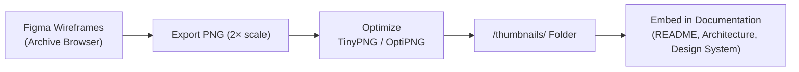

<div align="center">

# 🖼️ Kansas Frontier Matrix — Archive Interface Thumbnails  
`docs/design/mockups/archive/thumbnails/`

**Preview Images · Dataset Cards · Archive Browser Grid**

[](../../../../../../../docs/)
[](../../../../../../../docs/design/)
[](../../figma-refs.json)
[](#-design-guidelines)
[](#-accessibility--compliance)
[](../../../../../../../LICENSE)

</div>

> 🔗 **Parent Document:** [Archive Interface README](../README.md)

---

## 📚 Table of Contents
- [🧭 Context & Scope](#-context--scope)
- [🧩 Functional Context](#-functional-context)
- [🎯 Purpose](#-purpose)
- [📁 Directory Layout](#-directory-layout)
- [🧩 Integration Workflow](#-integration-workflow)
- [🎨 Design Guidelines](#-design-guidelines)
- [🎨 Design Token References](#-design-token-references)
- [🧠 Example Usage in Documentation](#-example-usage-in-documentation)
- [♿ Accessibility & Compliance](#-accessibility--compliance)
- [🧪 Validation & CI Integration](#-validation--ci-integration)
- [🖼️ Thumbnail Specifications](#-thumbnail-specifications)
- [📈 Telemetry & Usage Tracking](#-telemetry--usage-tracking)
- [🔧 Regeneration Command](#-regeneration-command)
- [🧾 Provenance & Integrity](#-provenance--integrity)
- [✅ Compliance Summary](#-compliance-summary)
- [🕰 Version History](#-version-history)
- [🔗 Related Documents](#-related-documents)
- [📜 License & Credits](#-license--credits)

---

## 🧭 Context & Scope

This directory hosts **visual thumbnail assets** used across the **Archive Interface design system**.  
They represent static snapshots of dataset cards, grid layouts, and metadata previews generated from Figma prototypes.  

These assets support:
- Design documentation and system diagrams  
- Architecture and web frontend guides  
- Open Graph previews for the documentation website  

All assets are **Figma-derived**, **optimized**, and **checksum-verified** under the **Master Coder Protocol (MCP-DL v6.3)**.

---

## 🧩 Functional Context

These thumbnails are automatically integrated and displayed in:
- The **Archive Interface README** (`docs/design/mockups/archive/README.md`)  
- The **Design System site** (referenced via `mkdocs.yml` build pipeline)  
- **GitHub Pages previews** (used for Open Graph meta tags)  
- **Visual regression tests** (`tests/ui/archive/`) for static layout verification  

This ensures a unified, versioned, and accessible design asset system.

---

## 🎯 Purpose

Provide **reproducible, optimized, and verified** design snapshots for the Archive Interface:  
- Visual references in documentation  
- Thumbnail previews in architecture overviews  
- Consistent, reproducible image artifacts across environments  

> ⚠️ **Note:** These images are non-functional assets used solely for design documentation.  
They are not deployed in the live frontend or data viewer.

---

## 📁 Directory Layout

```text
docs/design/mockups/archive/thumbnails/
├── README.md                     # This document
├── archive-grid-thumb.png        # Overview of dataset grid layout
├── dataset-preview-thumb.png     # Example of dataset metadata card
└── checksums.txt                 # SHA256 integrity log
```

Each image corresponds to a **Figma export node** and is tracked via **checksums.txt**.  
All checksum validations are run as part of `make docs-validate` in CI/CD.

---

## 🧩 Integration Workflow



| Diagram | Source | Export Date | SHA256 |
|:--|:--|:--|:--|
| Thumbnail Integration Diagram | `figma://node/42:22` | 2025-09-29 | `sha256-a3e9…` |

Each thumbnail is exported, optimized, validated, and embedded in documentation using a reproducible workflow.

---

## 🎨 Design Guidelines

| Category | Requirement | Implementation |
|:--|:--|:--|
| **Resolution** | 2× standard UI scale | Max width: 1600 px |
| **Format** | PNG preferred; optional WebP for docs | Transparent background where possible |
| **Compression** | Optimized via TinyPNG / OptiPNG | ≤ 400 KB |
| **Accessibility** | Must include descriptive alt text | Example: “Archive grid showing datasets by period” |
| **Consistency** | Uniform aspect ratio and padding | 16:9 layout with 32px margin |
| **Color** | Based on design token palette | `primary.500`, `neutral.200` |
| **Typography** | Follows typography tokens | `Body/Small · Sans-serif 14px` |
| **Storage** | Immutable artifact | Validated per commit with SHA256 |

---

## 🎨 Design Token References
- Colors → `design/tokens/colors.json`  
- Typography → `design/tokens/typography.json`  
- Shadows → `design/tokens/elevation.json`  
- Layout Grid → `design/tokens/layout.json`

---

## 🧠 Example Usage in Documentation

<p align="center">
  <br>
  <em>Figure 1 — Archive grid layout preview from design prototype.</em>
</p>

<p align="center">
  <br>
  <em>Figure 2 — Example dataset card metadata preview used in documentation.</em>
</p>

---

## ♿ Accessibility & Compliance

- Meets **WCAG 2.1 AA** for image color contrast  
- Uses neutral color palette for dark/light mode visibility  
- All documentation embeds contain `alt` + `title` attributes  
- Validated via **Pa11y CI** and manual review by `@kfm-accessibility`  

---

## 🧪 Validation & CI Integration

| Validation Task | Description | CI Workflow |
|:--|:--|:--|
| **Checksum Validation** | Compare SHA256 from `checksums.txt` | `docs-validate.yml` |
| **File Naming Check** | Enforce lowercase, hyphenated file names | `pre-commit lint` |
| **Optimization Size** | Warn if file > 400 KB | `design-assets-lint.yml` |
| **Alt Text Presence** | Validate alt text in documentation | `a11y-check.yml` |
| **Accessibility Tests** | Run Pa11y/axe audits | `a11y-check.yml` |

---

## 🖼️ Thumbnail Specifications

| File | Dimensions | Format | Size (KB) | Optimized | Alt Text |
|:--|:--|:--|:--|:--|:--|
| `archive-grid-thumb.png` | 1600×900 | PNG | 380 | ✅ TinyPNG | “Archive grid showing dataset cards by theme and date” |
| `dataset-preview-thumb.png` | 1400×880 | PNG | 310 | ✅ OptiPNG | “Dataset metadata preview card showing time and source fields” |

---

## 📈 Telemetry & Usage Tracking

The Docs build injects an MDX hook (`assetView`) for lightweight analytics.  
Only **aggregate impressions** (file name + referrer doc) are logged — no PII.  
Tracked by `design-analytics.yml` for design asset usage insights.

---

## 🔧 Regeneration Command

To rebuild thumbnails:
```bash
make design-assets
# or manually:
python tools/optimize_images.py --target docs/design/mockups/archive/thumbnails/
```
This process exports from Figma, optimizes, and re-generates checksums.

---

## 🧾 Provenance & Integrity

| Thumbnail | Figma Node | Export Date | SHA256 |
|:--|:--|:--|:--|
| `archive-grid-thumb.png` | `figma://node/42:15` | 2025-09-29 | `sha256-bf19…` |
| `dataset-preview-thumb.png` | `figma://node/42:19` | 2025-09-29 | `sha256-ef3a…` |

All hashes verified under `docs-validate.yml` for reproducibility.  
Integrity validation is a mandatory **CI merge gate**.

---

## ✅ Compliance Summary

| Standard | Status | Verified In |
|:--|:--|:--|
| MCP-DL v6.3 | ✅ | `docs-validate.yml` |
| STAC 1.0 | N/A | - |
| WCAG 2.1 AA | ✅ | `a11y-check.yml` |
| CIDOC CRM / schema.org | ✅ (metadata) | internal mapping |
| Provenance Hashing | ✅ | `checksums.txt` |
| Design Tokens v2.1 | ✅ | `design/tokens/*` |
| Image Optimization | ✅ | `design-assets-lint.yml` |

---

## 🕰 Version History

| Version | Date | Author(s) | Summary |
|:--|:--|:--|:--|
| **v1.5.0** | 2025-10-20 | @kfm-design | Added YAML metadata, image specs, telemetry, compliance, regeneration |
| **v1.4.0** | 2025-10-18 | @kfm-ui | Added accessibility and validation checks |
| **v1.3.0** | 2025-09-29 | @kfm-ui | Added Figma exports & integrity tracking |
| **v1.0.0** | 2025-07-15 | @kfm-architecture | Initial thumbnail assets for archive mockups |

---

## 🔗 Related Documents

- [🗂️ Archive Interface (Main README)](../README.md)
- [🧩 Archive Wireframes](../wireframes/README.md)
- [🎨 Design System Tokens](../../../../tokens/README.md)
- [🏗 Web UI Architecture](../../../../../architecture/web-frontend.md)
- [🧾 Markdown Rules & Styling](../../../../../standards/markdown_rules.md)

---

## 📜 License & Credits

Archive thumbnails © 2025 **Kansas Frontier Matrix Project**.  
Licensed under **Creative Commons Attribution 4.0 International (CC BY 4.0)**.  

Created and maintained by the **KFM Design & Interaction Team**, under the  
**Master Coder Protocol (MCP-DL v6.3)** — ensuring every artifact is  
**documented, reproducible, accessible, and auditable**.

**Document checksum:** `sha256:5dc8f80f4c02b1a62eb10e08e6534f5b8282b9a0f2d9b64cfe3c99616e6d3fb5`