<div align="center">

# 🖼️ Kansas Frontier Matrix — Archive Interface Thumbnails  
`docs/design/mockups/archive/thumbnails/`

**Preview Images · Dataset Cards · Archive Browser Grid**

[](../../../../../../../docs/)
[](../../../../../../../docs/design/)
[](../../figma-refs.json)
[](#-design-guidelines)
[](../../../../../../../LICENSE)

</div>

---

## 📚 Table of Contents
- [🧭 Context & Scope](#-context--scope)
- [🎯 Purpose](#-purpose)
- [📁 Directory Layout](#-directory-layout)
- [🧩 Integration Workflow](#-integration-workflow)
- [🎨 Design Guidelines](#-design-guidelines)
- [🧠 Example Usage in Documentation](#-example-usage-in-documentation)
- [♿ Accessibility & Compliance](#-accessibility--compliance)
- [🧪 Validation & CI Integration](#-validation--ci-integration)
- [🧾 Provenance & Integrity](#-provenance--integrity)
- [🕰 Version History](#-version-history)
- [🔗 Related Documents](#-related-documents)
- [📜 License & Credits](#-license--credits)

---

## 🧭 Context & Scope

This directory hosts **visual thumbnail assets** used in the **Archive Interface design system**.  
Thumbnails represent snapshots of dataset cards, grid layouts, and metadata previews from the Archive Browser mockups.  

They are used throughout:
- `docs/design/mockups/archive/README.md`  
- `docs/architecture/web-frontend.md`  
- UI overviews, system diagrams, and GitHub previews  

All images are derived from **Figma exports**, optimized for clarity and reproducibility, and verified through **checksum validation** per the Master Coder Protocol (MCP-DL v6.3).

---

## 🎯 Purpose

These thumbnails provide:
- Quick **visual references** for documentation and architecture overviews  
- Standardized **small-format previews** for UI representation  
- Visual **consistency** across all GitHub and publication contexts  

> ⚠️ **Note:** These are *non-functional assets* used solely for design documentation and are not deployed in the production UI.

---

## 📁 Directory Layout

```text
docs/design/mockups/archive/thumbnails/
├── README.md                     # This document
├── archive-grid-thumb.png        # Overview of dataset grid layout
├── dataset-preview-thumb.png     # Example of dataset metadata card
└── checksums.txt                 # SHA256 integrity log
```

Each image corresponds to a **Figma frame export**, versioned and referenced in `figma-refs.json`.  
Checksums ensure provenance and reproducibility in all CI pipelines.

---

## 🧩 Integration Workflow

```mermaid
flowchart LR
  A["Figma Wireframes\n(Archive Browser)"] --> B["Export PNG (2× scale)"]
  B --> C["Optimize\nTinyPNG / OptiPNG"]
  C --> D["/thumbnails/ Folder"]
  D --> E["Embed in Documentation\n(README, Architecture, Design System)"]
```



Each thumbnail follows this process:
1. **Export** from Figma at 2× scale for clarity  
2. **Optimize** using TinyPNG or OptiPNG  
3. **Store** under `/thumbnails/` with stable file name  
4. **Verify** checksum and link in documentation  

---

## 🎨 Design Guidelines

| Category | Requirement | Implementation |
|:--|:--|:--|
| **Resolution** | 2× standard UI scale | Max width: 1600 px |
| **Format** | PNG for clarity; optional WebP for previews | Transparent background preferred |
| **Compression** | Optimized via TinyPNG or OptiPNG | ≤ 400 KB each |
| **Accessibility** | Descriptive `alt` text required | Example: *"Archive grid showing datasets by time period"* |
| **Consistency** | Uniform aspect ratio and padding | 16 : 9 layout · 32 px internal margin |
| **Color** | Matches Design Tokens `colors.json` | Use `primary.500` + `neutral.200` palette |
| **Typography** | Captions match `typography.json` | Sans-serif 14 px bold label |
| **Storage** | Immutable artifacts under version control | Checksum verified per commit |

---

## 🧠 Example Usage in Documentation

<p align="center">
  <br>
  <em>Figure 1 — Archive grid layout preview from design prototype.</em>
</p>

<p align="center">
  <br>
  <em>Figure 2 — Example dataset card metadata preview used in documentation.</em>
</p>

These thumbnails are embedded in documentation for visual context, quick scanning, and alignment with design system specifications.

---

## ♿ Accessibility & Compliance

- Complies with **WCAG 2.1 AA** image contrast and alt text standards  
- Thumbnails use neutral palettes for visibility in light/dark modes  
- Embedded images include `alt` and `title` attributes  
- Documentation validated with **Pa11y** accessibility tests in CI  

---

## 🧪 Validation & CI Integration

| Validation Task | Description | CI Workflow |
|:--|:--|:--|
| **Checksum Validation** | Compare SHA256 from `checksums.txt` | `docs-validate.yml` |
| **File Naming Check** | Verify consistent lowercase, hyphenated names | `pre-commit lint` |
| **Optimization Size** | Warn if file > 400 KB | `design-assets-lint.yml` |
| **Alt Text Presence** | Ensures each image has alt/title in docs | `a11y-check.yml` |

All design assets must pass **MCP reproducibility gates** before merge.

---

## 🧾 Provenance & Integrity

| Thumbnail | Figma Node | Export Date | SHA256 |
|:--|:--|:--|:--|
| `archive-grid-thumb.png` | `figma://node/42:15` | 2025-09-29 | `sha256-bf19…` |
| `dataset-preview-thumb.png` | `figma://node/42:19` | 2025-09-29 | `sha256-ef3a…` |

- All hashes verified in CI/CD (`docs-validate.yml`).  
- Changes to images require checksum updates.  
- Integrity checks enforce immutability across releases.

---

## 🕰 Version History

| Version | Date | Author(s) | Summary |
|:--|:--|:--|:--|
| **v1.4.0** | 2025-10-20 | @kfm-design | Full MCP-DL upgrade, added validation & a11y sections |
| **v1.3.0** | 2025-09-29 | @kfm-ui | Added Figma exports & integrity tracking |
| **v1.0.0** | 2025-07-15 | @kfm-architecture | Initial thumbnail creation for archive mockups |

---

## 🔗 Related Documents

- [🗂️ Archive Interface (Main README)](../README.md)
- [🧩 Archive Wireframes](../wireframes/README.md)
- [🎨 Design System Tokens](../../../../tokens/README.md)
- [🏗 Web UI Architecture](../../../../../architecture/web-frontend.md)
- [🧾 Markdown Rules & Styling](../../../../../standards/markdown_rules.md)

---

## 📜 License & Credits

Archive thumbnails © 2025 **Kansas Frontier Matrix Project**.  
Licensed under **Creative Commons Attribution 4.0 International (CC BY 4.0)**.  

Created and maintained by the **KFM Design & Interaction Team**, under the  
**Master Coder Protocol (MCP-DL v6.3)** — ensuring every artifact is  
**documented, reproducible, accessible, and auditable**.

**Document checksum:** `sha256:2a8f1db1e36a423b5e0b9ecf88489c3b63e2b8e4c5464ab6748f76a33dbb4bda`