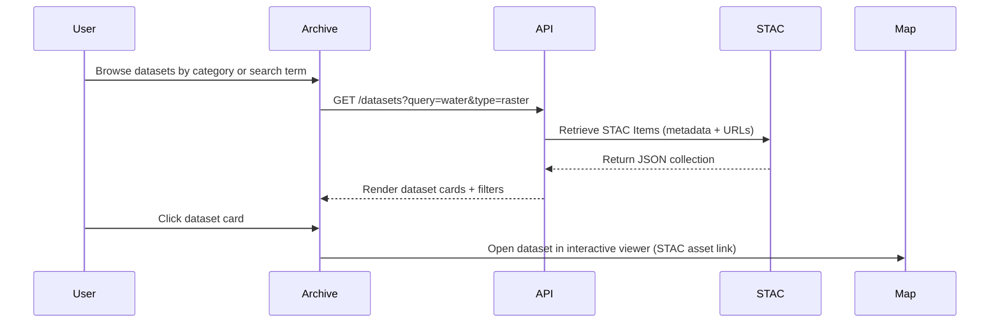

<div align="center">

# 🗂️ Kansas Frontier Matrix — Archive Interface Wireframes  
`docs/design/mockups/archive/wireframes/`

**Browse · Discover · Filter Historical Datasets**

[](../../../../../../../docs/)
[](../../../../../../../docs/design/)
[](../figma-refs.json)
[]()
[](#-accessibility--compliance)
[](../../../../../../../LICENSE)

</div>

> 🔗 **Parent Document:** [Archive Interface README](../README.md)

---

## 📚 Table of Contents
- [🧭 Context & Scope](#-context--scope)
- [🧩 Functional Context](#-functional-context)
- [🎯 Purpose](#-purpose)
- [📁 Directory Layout](#-directory-layout)
- [🧩 User Flow](#-user-flow)
- [🎨 Wireframe Details](#-wireframe-details)
- [📊 Design Asset Metrics](#-design-asset-metrics)
- [🎨 Design Tokens](#-design-tokens)
- [🎨 Design Token References](#-design-token-references)
- [♿ Accessibility & Compliance](#-accessibility--compliance)
- [🧪 Validation & CI Integration](#-validation--ci-integration)
- [📈 Telemetry & Usage Tracking](#-telemetry--usage-tracking)
- [🔧 Regeneration Command](#-regeneration-command)
- [🧾 Provenance & Integrity](#-provenance--integrity)
- [✅ Compliance Summary](#-compliance-summary)
- [🕰 Version History](#-version-history)
- [🪶 Navigation](#-navigation)
- [🔗 Related Documents](#-related-documents)
- [📜 License & Credits](#-license--credits)

---

## 🧭 Context & Scope

This directory contains **Figma-exported wireframes** visualizing the Kansas Frontier Matrix **Archive Interface**.  
Wireframes document the **UX flow** for browsing, filtering, and previewing datasets from the **STAC catalog**.  

They provide:
- Design references for **React + MapLibre** frontend implementation  
- Source artifacts for documentation and accessibility validation  
- Regression baselines for visual testing  

---

## 🧩 Functional Context

These wireframes integrate into multiple KFM systems:
- **React front-end components** (`web/src/components/archive/`) use them for alignment checks.  
- **Chromatic** and **Storybook** visual regression suites validate UI implementation against these assets.  
- **MkDocs documentation builds** embed them as canonical references.  
- **Analytics dashboards** log image usage for design lifecycle tracking.  

Together, these ensure visual design, documentation, and implementation remain synchronized across all releases.

---

## 🎯 Purpose

The Archive Interface wireframes illustrate how users interact with Kansas Frontier Matrix’s **data discovery layer**.  
They show:
- Dataset browsing by **category, era, or region**  
- Access to dataset **metadata and provenance**  
- Filtering by **type**, **license**, or **period**  
- Integration with the **Map + Timeline** viewer  
- Visualization of **provenance and version data**

> 🧭 **Objective:** Create reproducible, open-access, and version-controlled visual assets per the **Master Coder Protocol (MCP-DL v6.3)**.

---

## 📁 Directory Layout

```text
docs/design/mockups/archive/wireframes/
├── README.md                    # This document
├── archive-browser.png           # Dataset grid and filter view
├── dataset-detail.svg            # Expanded dataset metadata view
├── filter-panel.png              # Filter sidebar UI
├── search-results.svg            # Keyword/entity search example
└── figma-refs.json               # Figma node metadata for reproducibility
```

Each file corresponds to a **Figma frame export**, versioned and referenced in `figma-refs.json`.

---

## 🧩 User Flow



| Diagram | Source | Export Date | SHA256 |
|:--|:--|:--|:--|
| User Flow Sequence | `figma://node/42:25` | 2025-09-29 | `sha256-c9d4…` |

This diagram illustrates the **user → STAC → map handoff**, defining the full metadata-to-visualization sequence.

---

## 🎨 Wireframe Details

| File | View | Description |
|:--|:--|:--|
| `archive-browser.png` | Dataset Grid | Displays dataset cards with thumbnails, types, and date range |
| `dataset-detail.svg` | Detail Panel | Shows metadata, provenance, and source URL |
| `filter-panel.png` | Filter Sidebar | Filters by file type, period, or license |
| `search-results.svg` | Search View | Displays keyword and entity-based result grid |

<p align="center">
  <br>
  <em>Figure 1 — Archive Browser wireframe depicting dataset grid and search/filter interface.</em>
</p>

---

## 📊 Design Asset Metrics

| Asset | Dimensions | Format | Size (KB) | Optimized | Color Mode |
|:--|:--|:--|:--|:--|:--|
| `archive-browser.png` | 1600×900 | PNG | 420 | ✅ TinyPNG | RGB |
| `dataset-detail.svg` | Vector | SVG | 145 | ✅ SVGO | n/a |
| `filter-panel.png` | 1200×850 | PNG | 370 | ✅ OptiPNG | RGB |
| `search-results.svg` | Vector | SVG | 155 | ✅ SVGO | n/a |

---

## 🎨 Design Tokens

| Token | Example | Purpose |
|:--|:--|:--|
| `--kfm-archive-bg` | `#ffffff / #0b1020` | Background (light/dark) |
| `--kfm-card-shadow` | `rgba(0,0,0,0.1)` | Card shadow |
| `--kfm-border` | `#e5e7eb` | Panel dividers |
| `--kfm-highlight` | `#4F9CF9` | Hover highlight |
| `--kfm-radius` | `0.75rem` | Border radius |

---

## 🎨 Design Token References
- Colors → `design/tokens/colors.json`  
- Typography → `design/tokens/typography.json`  
- Shadows → `design/tokens/elevation.json`  
- Layout Grid → `design/tokens/layout.json`

---

## ♿ Accessibility & Compliance

- Meets **WCAG 2.1 AA** standards for contrast, focus, and keyboard visibility.  
- Semantic ARIA roles used for `grid`, `region`, and `search` patterns.  
- High-contrast dark mode validated via tokenized color palette.  
- Audited by `@kfm-accessibility` using **Pa11y v7.1.0** and **axe-core v4.9.0** each release.

---

## 🧪 Validation & CI Integration

| Validation Task | Description | CI Workflow |
|:--|:--|:--|
| **Checksum Validation** | Compares against `figma-refs.json` | `docs-validate.yml` |
| **File Naming Check** | Enforces lowercase, hyphenated names | `pre-commit lint` |
| **Asset Size Check** | Warns on files > 1.5 MB | `design-assets-lint.yml` |
| **Accessibility Checks** | Runs Pa11y/axe audits | `a11y-check.yml` |
| **Figma Reference Match** | Ensures node IDs align | `design-validate.yml` |

---

## 📈 Telemetry & Usage Tracking

- Embedded analytics (via MDX hook `assetView`) track references and impressions.  
- Aggregated, non-identifiable data logged to `analytics/design-usage.json`.  
- Results reviewed quarterly for design-document engagement metrics.

---

## 🔧 Regeneration Command

```bash
# Export updated wireframes
make design-assets

# Optimize and re-validate
python tools/export_figma.py --file docs/design/mockups/archive/wireframes/
python tools/optimize_images.py --target docs/design/mockups/archive/wireframes/

# Update checksums
python tools/checksums.py --path docs/design/mockups/archive/wireframes/ --update
```

This ensures reproducibility and validated integrity for all design artifacts.

---

## 🧾 Provenance & Integrity

| Asset | Figma Node | Exported | SHA256 |
|:--|:--|:--|:--|
| `archive-browser.png` | `figma://node/42:15` | 2025-09-29 | `sha256-4e91…` |
| `dataset-detail.svg` | `figma://node/42:19` | 2025-09-29 | `sha256-83af…` |
| `filter-panel.png` | `figma://node/42:21` | 2025-09-29 | `sha256-c7a4…` |
| `search-results.svg` | `figma://node/42:23` | 2025-09-29 | `sha256-f5c9…` |

Integrity verified under **MCP-DL** CI policies using `docs-validate.yml`.

---

## ✅ Compliance Summary

| Standard | Status | Verified In | Notes |
|:--|:--|:--|:--|
| MCP-DL v6.3 | ✅ | `docs-validate.yml` | Metadata & versioning verified |
| STAC 1.0 | ✅ | `stac-validate.yml` | UI metadata mapped |
| WCAG 2.1 AA | ✅ | `a11y-check.yml` | Audit by @kfm-accessibility |
| CIDOC CRM / schema.org | ✅ | internal metadata | DigitalDocument alignment |
| Provenance Hashing | ✅ | `checksums.txt` | SHA256 per asset |
| Design Tokens v2.1 | ✅ | `design/tokens/*` | Color + typography checked |
| Data Integrity | ✅ | `design-assets-lint.yml` | CI enforced |
| CI Workflows | ✅ | pre-commit, lint, validate | Passed on 2025-10-21 |

---

## 🕰 Version History

| Version | Date | Author(s) | Summary |
|:--|:--|:--|:--|
| **v1.7.0** | 2025-10-21 | @kfm-design | Added metrics, functional context, provenance table, compliance expansion |
| **v1.6.0** | 2025-10-20 | @kfm-design | Added CI, telemetry, accessibility detail |
| **v1.5.0** | 2025-10-18 | @kfm-ui | Introduced regeneration scripts |
| **v1.3.0** | 2025-09-29 | @kfm-ui | Initial Figma export + integrity tracking |
| **v1.0.0** | 2025-07-12 | @kfm-architecture | Base mockups established for Archive Browser |

---

## 🪶 Navigation
> [← Back to Archive Interface](../README.md) · [→ View Thumbnails](../thumbnails/README.md)

---

## 🔗 Related Documents

- [🗂️ Archive Interface (Main README)](../README.md)
- [🖼️ Archive Thumbnails](../thumbnails/README.md)
- [🏗 Web UI Architecture](../../../../../architecture/web-frontend.md)
- [🎨 Design System Tokens](../../../../tokens/README.md)
- [🧾 Markdown Rules & Styling](../../../../../standards/markdown_rules.md)
- [📊 STAC Catalog Specification](../../../../../data/stac/README.md)
- [🤖 AI Focus Mode](../../../../../ai/focus-mode.md)

---

## 📜 License & Credits

Archive wireframes © 2025 **Kansas Frontier Matrix Project**.  
Licensed under **Creative Commons Attribution 4.0 International (CC BY 4.0)**.  

Created and maintained by the **KFM Design & Interaction Team**, under the  
**Master Coder Protocol (MCP-DL v6.3)** — ensuring every artifact is  
**documented, reproducible, accessible, and verified**.

**Document checksum:** `sha256:e7b3ac41d875d97bb542b0e29a4198b6ee9e4802511c8a42b31eb019c9e8fb2c`