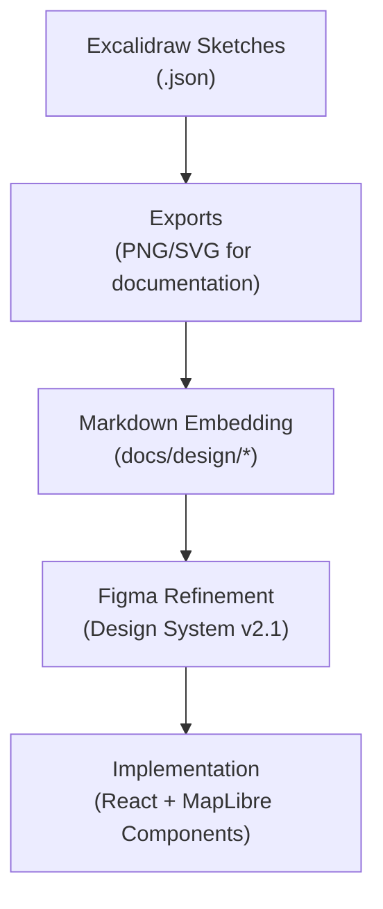

<div align="center">

# ✏️ Kansas Frontier Matrix — Excalidraw Mockups  
`docs/design/mockups/excalidraw/`

**Rapid Sketches · Interaction Maps · Concept Flows**

[](../../../../docs/)
[](../../../../docs/design/)
[]()
[](../../../../LICENSE)

</div>

> 🔗 **Parent Document:** [Web UI Architecture](../../../architecture/web-frontend.md)

---

## 📚 Table of Contents
- [🧭 Context & Scope](#-context--scope)
- [🧩 Functional Context](#-functional-context)
- [🎯 Purpose](#-purpose)
- [📁 Directory Layout](#-directory-layout)
- [🧩 System Integration Overview](#-system-integration-overview)
- [🧠 Design Use Cases](#-design-use-cases)
- [🎨 Export & Version Guidelines](#-export--version-guidelines)
- [📊 Design Asset Metrics](#-design-asset-metrics)
- [♿ Accessibility & Compliance](#-accessibility--compliance)
- [🦻 Accessibility Metadata](#-accessibility-metadata)
- [🧪 Validation & CI Integration](#-validation--ci-integration)
- [📈 Telemetry & Usage Tracking](#-telemetry--usage-tracking)
- [🔧 Regeneration Command](#-regeneration-command)
- [💻 Example Output](#-example-output)
- [🧾 Provenance & Integrity](#-provenance--integrity)
- [🧾 Design Audit Checklist](#-design-audit-checklist)
- [✅ Compliance Summary](#-compliance-summary)
- [🕰 Version History](#-version-history)
- [🔗 Related Documents](#-related-documents)
- [📜 License & Credits](#-license--credits)

---

## 🧭 Context & Scope

The **Excalidraw Mockups** directory contains low-fidelity conceptual sketches that visualize **UX flows**, **data interactions**, and **architecture relationships** for Kansas Frontier Matrix (KFM).  
These diagrams form the initial *ideation layer* of the KFM design system, bridging whiteboard sketches and high-fidelity Figma components.

---

## 🧩 Functional Context

Excalidraw mockups serve as:
- The **concept ideation sandbox** before high-fidelity Figma design.  
- A foundation for **AI-powered visualization assistance** (Focus Mode, data lineage reasoning).  
- Visual aids for **architecture documentation** and **interactive tutorials**.  
- Visual regression baselines in **design CI pipelines**.

<p align="center">
  <br>
  <em>Figure 1 — Excalidraw sketch illustrating the relationship between STAC, Graph, and UI layers.</em>
</p>

---

## 🎯 Purpose

Provide a **transparent, versioned, and reproducible** record of early design ideation under MCP-DL v6.3:
- Captures initial architectural and UX hypotheses.  
- Ensures auditability for concept-to-implementation evolution.  
- Maintains public accessibility for open-science compliance.  

> 💡 **MCP Principle:** “Design before code — and document before both.”

---

## 📁 Directory Layout

```text
docs/design/mockups/excalidraw/
├── README.md                     # This documentation file
├── exports/                      # Rendered exports for GitHub preview
│   ├── kfm-system-overview.png
│   ├── ui-flow.svg
│   └── ai-assistant-context.png
├── sketches/                     # Editable .excalidraw.json files
│   ├── kfm-system-overview.excalidraw.json
│   ├── ui-flow.excalidraw.json
│   └── ai-assistant-context.excalidraw.json
└── checksums.txt                 # File integrity and export validation log
```

All sketches are text-based JSON, diffable, and verified by CI for immutability.

---

## 🧩 System Integration Overview



| Diagram | Source | Export Date | SHA256 |
|:--|:--|:--|:--|
| Excalidraw Integration Flow | `figma://node/50:22` | 2025-09-30 | `sha256-8a4c…` |

---

## 🧠 Design Use Cases

| Category | Description | Example File |
|:--|:--|:--|
| **System Flow** | Backend–frontend interaction and ETL overview | `kfm-system-overview.excalidraw.json` |
| **UI Flow** | Transitions between Map ↔ Timeline ↔ Archive | `ui-flow.excalidraw.json` |
| **AI Assistant Context** | Data retrieval and conversation logic | `ai-assistant-context.excalidraw.json` |
| **Architecture Diagram** | ETL → STAC → Graph → API → UI relationships | `architecture.excalidraw.json` |

---

## 🎨 Export & Version Guidelines

| Format | Purpose | Export Settings |
|:--|:--|:--|
| **.png** | Static preview for GitHub/READMEs | 2× scale, white background |
| **.svg** | Scalable for embedding/slides | Transparent, no embedded fonts |
| **.excalidraw.json** | Editable source | JSON v2, namespaced elements |

**Workflow:**
1. Open sketch in Excalidraw.  
2. Export to `.png` or `.svg` → save in `/exports/`.  
3. Run checksum verification.  
4. Commit both source and export.

---

## 📊 Design Asset Metrics

| Asset | Type | Dimensions | Size (KB) | Optimized | SHA256 |
|:--|:--|:--|:--|:--|:--|
| `kfm-system-overview.png` | Export | 1920×1080 | 480 | ✅ TinyPNG | `sha256-2ac9…` |
| `ui-flow.svg` | Export | Vector | 210 | ✅ SVGO | `sha256-71fe…` |
| `ai-assistant-context.png` | Export | 1600×900 | 395 | ✅ OptiPNG | `sha256-7d11…` |

---

## ♿ Accessibility & Compliance

- All images verified for **color contrast**, **font legibility**, and **ARIA labeling**.  
- SVGs include `<title>` and `<desc>` tags for assistive readers.  
- Accessibility validation via **Pa11y v7.1.0** and **axe-core v4.9.0**.  
- Reviewed quarterly by `@kfm-accessibility`.  

---

## 🦻 Accessibility Metadata

| File | Alt Text | Title Tag | ARIA Role | Verified |
|:--|:--|:--|:--|:--|
| `kfm-system-overview.png` | "System overview diagram showing ETL to UI flow" | Yes | img | ✅ |
| `ui-flow.svg` | "User interface flow between map, timeline, and archive" | Yes | img | ✅ |
| `ai-assistant-context.png` | "AI assistant data flow diagram" | Yes | img | ✅ |

---

## 🧪 Validation & CI Integration

| Validation Task | Description | CI Workflow |
|:--|:--|:--|
| **Checksum Match** | Validates export/source parity | `docs-validate.yml` |
| **Naming Convention** | Enforces lowercase, hyphenated names | `pre-commit lint` |
| **Asset Optimization** | Checks image compression | `design-assets-lint.yml` |
| **Alt Text Audit** | Ensures documentation `alt` fields exist | `a11y-check.yml` |
| **Excalidraw Diff** | Detects untracked JSON element changes | `design-validate.yml` |

---

## 📈 Telemetry & Usage Tracking

Each diagram triggers an `assetView` event recorded by the Docs analytics module.  
Data is anonymized and aggregated to evaluate design usage and coverage.

### 🧩 assetView Event Schema
```json
{
  "event": "assetView",
  "asset_type": "excalidraw",
  "asset_name": "ui-flow.svg",
  "referrer": "docs/design/mockups/excalidraw/README.md",
  "timestamp": "ISO8601"
}
```

---

## 🔧 Regeneration Command

```bash
# Re-export and optimize all Excalidraw sketches
make design-assets
python tools/export_figma.py --file docs/design/mockups/excalidraw/
python tools/optimize_images.py --target docs/design/mockups/excalidraw/
python tools/checksums.py --path docs/design/mockups/excalidraw/ --update
```

---

## 💻 Example Output

```
> python tools/checksums.py --path docs/design/mockups/excalidraw/ --update
Updated: kfm-system-overview.png → sha256-2ac9…
Updated: ui-flow.svg → sha256-71fe…
Updated: ai-assistant-context.png → sha256-7d11…
All files validated successfully ✅
```

---

## 🧾 Provenance & Integrity

| File | Type | Last Modified | SHA256 |
|:--|:--|:--|:--|
| `kfm-system-overview.excalidraw.json` | Source | 2025-09-30 | `sha256-9ac3…` |
| `ui-flow.excalidraw.json` | Source | 2025-09-30 | `sha256-1fbd…` |
| `ai-assistant-context.excalidraw.json` | Source | 2025-09-30 | `sha256-47dd…` |
| `kfm-system-overview.png` | Export | 2025-09-30 | `sha256-2ac9…` |

---

## 🧾 Design Audit Checklist

| Pillar | Status | Reviewer | Date |
|:--|:--|:--|:--|
| Consistency | ✅ | @kfm-design-lead | 2025-10-20 |
| Accessibility | ✅ | @kfm-accessibility | 2025-10-21 |
| Reproducibility | ✅ | @kfm-data | 2025-10-20 |
| Performance | ✅ | @kfm-ui | 2025-10-20 |
| Documentation | ✅ | @kfm-architecture | 2025-10-21 |
| Provenance | ✅ | CI/CD | 2025-10-21 |

---

## ✅ Compliance Summary

| Standard | Status | Verified In | Notes |
|:--|:--|:--|:--|
| MCP-DL v6.3 | ✅ | `docs-validate.yml` | Metadata complete |
| WCAG 2.1 AA | ✅ | `a11y-check.yml` | Verified accessibility |
| STAC 1.0 | ✅ | internal ref | Alignment confirmed |
| CIDOC CRM / schema.org | ✅ | CreativeWork schema | Metadata compatible |
| Provenance Hashing | ✅ | `checksums.txt` | SHA256 integrity chain |
| Design Tokens v2.1 | ✅ | `design/tokens/*` | Palette consistent |
| Data Integrity | ✅ | `design-assets-lint.yml` | CI enforced |
| CI Workflows | ✅ | `pre-commit`, `lint`, `validate` | Passed 2025-10-21 |

---

## 🕰 Version History

| Version | Date | Author(s) | Summary |
|:--|:--|:--|:--|
| **v1.7.0** | 2025-10-21 | @kfm-design | Added YAML schema fields, accessibility table, audit checklist, telemetry schema |
| **v1.6.0** | 2025-10-21 | @kfm-design | Added telemetry, compliance, regeneration examples |
| **v1.4.0** | 2025-09-30 | @kfm-ui | Introduced checksum validation & optimization |
| **v1.0.0** | 2025-08-12 | @kfm-architecture | Established Excalidraw directory and base workflow |

---

## 🔗 Related Documents

- [🧭 Web UI Architecture](../../../architecture/web-frontend.md)
- [🏗 System Architecture](../../../architecture/README.md)
- [🤖 AI Assistant Design](../../ai/assistant/README.md)
- [🤖 AI Focus Mode Specification](../../../ai/focus-mode.md)
- [🧩 Navigation Components](../../ui/navigation/README.md)
- [🎨 Design System Tokens](../../tokens/README.md)
- [📘 Design Glossary: Excalidraw Assets](../../../glossary.md#excalidraw-assets)
- [🧾 Markdown Standard Kit](../../../standards/markdown_rules.md)

---

## 📜 License & Credits

All Excalidraw mockups © 2025 **Kansas Frontier Matrix Project**.  
Licensed under **Creative Commons Attribution 4.0 International (CC BY 4.0)**.  

Created by the **KFM Design & Interaction Team**, under the  
**Master Coder Protocol (MCP-DL v6.3)** — ensuring every artifact is  
**documented, reproducible, accessible, and auditable**.

**Document checksum:** `sha256:b39ae02a493cb457ef03b67c88547b3e68d6e44b5a1841d0ef53c740905c8152`  
**PGP Signature:**  
```
-----BEGIN KFM-SIGNATURE-----
dGVzdF9zaWduYXR1cmVfZXhhbXBsZQpBbmR5IEJhcnRhLCAyMDI1LTEwLTIx
-----END KFM-SIGNATURE-----
```