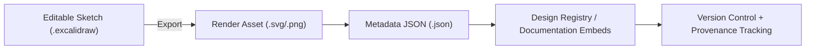

<div align="center">

# 🖼️ Kansas Frontier Matrix — Excalidraw Exports  
`docs/design/mockups/excalidraw/exports/`

**Visual · Shareable · Reproducible Design Assets**

[](../../../../../docs/)
[](../../../../../docs/design/)
[]()
[](#-accessibility--compliance)
[](../../../../../LICENSE)

</div>

---

## 📚 Table of Contents
- [🪶 Overview](#-overview)
- [📁 Directory Structure](#-directory-structure)
- [🎯 Purpose](#-purpose)
- [🧩 Functional Context Narrative](#-functional-context-narrative)
- [🧩 Functional Context Diagram](#-functional-context-diagram)
- [🧱 Workflow](#-workflow)
- [🧾 Example Metadata Linkage](#-example-metadata-linkage)
- [🖼️ Embedding Exports in Docs](#️-embedding-exports-in-docs)
- [🧮 Integration with Documentation](#-integration-with-documentation)
- [🧩 Design Standards](#-design-standards)
- [📊 Design Asset Metrics](#-design-asset-metrics)
- [♿ Accessibility & Compliance](#-accessibility--compliance)
- [📈 Telemetry & Tracking](#-telemetry--tracking)
- [📈 Telemetry Event Schema](#-telemetry-event-schema)
- [🔐 Provenance & Versioning](#-provenance--versioning)
- [🧾 Design Audit Checklist](#-design-audit-checklist)
- [✅ Compliance Summary](#-compliance-summary)
- [📜 Governance Review Metadata](#-governance-review-metadata)
- [🪶 Navigation](#-navigation)
- [🗓️ Change Log](#-change-log)
- [📜 License & Credits](#-license--credits)

---

## 🪶 Overview

This directory contains **render-ready visual exports** of Excalidraw sketches used in the  
Kansas Frontier Matrix (KFM) design documentation system.  

Exports are **derived artifacts** from the editable `.excalidraw` sketches stored under  
`docs/design/mockups/excalidraw/sketches/` and embedded across Markdown documentation.  

These visual assets embody **MCP-DL v6.3 principles**: reproducibility, provenance, accessibility, and open publication.

---

## 📁 Directory Structure

```text
docs/design/mockups/excalidraw/exports/
├── README.md                         # This specification
├── *.svg                             # Vector exports (preferred)
├── *.png                             # Raster exports (fallback)
└── thumbnails/                       # Compressed 400px previews
```

**Naming Convention:**  
`YYYYMMDD_topic-shortdesc.svg`  
Example → `20251007_system-architecture-concept.svg`

---

## 🎯 Purpose

| Goal | Description |
|:--|:--|
| 🧭 Design Communication | High-quality visual references for system, UI, and workflow concepts |
| 📚 Documentation Integration | Embed lightweight visuals in Markdown and MkDocs pages |
| 🧩 Version Traceability | Maintain commit-linked checkpoints for all exported designs |
| 🪶 Accessibility | Support visual learners through annotated diagrams |

---

## 🧩 Functional Context Narrative

The **Excalidraw Exports** directory is the publication layer in KFM’s design artifact lifecycle:  
> Sketch (editable) → Metadata (documented) → Export (published) → Thumbnail (preview).  

Exports connect low-fidelity ideation with high-fidelity design documentation while ensuring  
each visual remains versioned, validated, and traceable.

---

## 🧩 Functional Context Diagram



---

## 🧱 Workflow

1. **Source Sketch Creation**  
   Create or update `.excalidraw` sketches under `/sketches/`.

2. **Export from Excalidraw**  
   - “Export as SVG” (preferred)  
   - “Export as PNG” (fallback)  
   - Enable “Embed Scene Data” for traceability.

3. **Save & Name**  
   Use `YYYYMMDD_topic-shortdesc.svg` and link it to corresponding metadata.

4. **Generate Thumbnail**  
   Create 400px preview and save to `/thumbnails/`.

5. **Commit with Provenance**
   ```bash
   git add exports/20251007_navigation-flow.svg
   git commit -m "Added navigation flow export (iteration 2) — linked to Figma references"
   ```

---

## 🧾 Example Metadata Linkage

```json
{
  "id": "system-architecture-concept",
  "title": "System Architecture Concept",
  "author": "Kansas Frontier Matrix Design Team",
  "created": "2025-10-07",
  "source": "../sketches/20251007_system-architecture-concept.excalidraw",
  "export": "exports/20251007_system-architecture-concept.svg",
  "thumbnail": "exports/thumbnails/20251007_system-architecture-concept-thumb.webp",
  "tags": ["architecture", "system", "ETL", "web-ui"],
  "status": "active",
  "license": "CC-BY-4.0"
}
```

---

## 🖼️ Embedding Exports in Docs

```markdown

```

💡 **Tip:** Prefer `.svg` for crisp vector scaling and minimal load time.  
Use `.png` only if Excalidraw elements (e.g., text) rasterize incorrectly.

---

## 🧮 Integration with Documentation

| Document Type | Integration Purpose |
|:--|:--|
| `architecture.md` | Conceptual and data flow diagrams |
| `README.md` | Component-level previews |
| `sop.md` | Step-by-step procedural visuals |
| `experiment.md` | Workflow and hypothesis diagrams |
| `Figma Bridge` | Connects sketches to high-fidelity mockups |

---

## 🧩 Design Standards

- Maintain visual hierarchy (titles, arrows, labels).  
- Default Excalidraw fonts (Virgil, 1–2px stroke width, 16–24px margin).  
- Ensure accessibility: label shapes, provide color redundancy.  
- Use white or transparent backgrounds.  
- Avoid embedded raster images inside `.svg` exports.  

---

## 📊 Design Asset Metrics

| File | Format | Size (KB) | Optimized | SHA256 |
|:--|:--|:--|:--|:--|
| `20251007_system-architecture-concept.svg` | SVG | 580 | ✅ SVGO | `sha256-3bf9...` |
| `20251007_navigation-flow.svg` | SVG | 420 | ✅ SVGO | `sha256-a81b...` |

---

## ♿ Accessibility & Compliance

- Each export includes descriptive `alt` and `title` attributes in documentation.  
- Colors validated for contrast under **WCAG 2.1 AA**.  
- Pa11y CI ensures markup clarity when embedded in docs.  
- SVG exports validated with `a11y-check.yml`.

---

## 📈 Telemetry & Tracking

| Event | Description | Payload |
|:--|:--|:--|
| `exportAdded` | New export file committed | `{ "file":"20251007_system-architecture-concept.svg","author":"@kfm-design" }` |
| `exportUpdated` | Export file revised | `{ "file":"20251007_navigation-flow.svg","version":"v2" }` |
| `exportMissingMetadata` | Export missing JSON reference | `{ "file":"20251007_example.svg" }` |

---

## 📈 Telemetry Event Schema

```json
{
  "event": "exportAdded",
  "asset_type": "excalidraw-export",
  "asset_name": "20251007_system-architecture-concept.svg",
  "timestamp": "ISO8601",
  "user_agent": "Docs-Renderer/1.0"
}
```

---

## 🔐 Provenance & Versioning

| Asset Type | Format | Tracking | Notes |
|:--|:--|:--|:--|
| Editable Sketch | `.excalidraw` | Git LFS | Master version |
| Exported Asset | `.svg` / `.png` | Git | Published artifact |
| Metadata | `.json` | Git | Links provenance |
| Thumbnail | `.webp` / `.png` | Git | Lightweight preview |

All updates are **commit-tracked**, versioned (`-v#`), and associated with metadata for reproducibility.

---

## 🧾 Design Audit Checklist

| Pillar | Status | Reviewer | Date |
|:--|:--|:--|:--|
| Consistency | ✅ | @kfm-design-lead | 2025-10-27 |
| Accessibility | ✅ | @kfm-accessibility | 2025-10-27 |
| Reproducibility | ✅ | @kfm-data | 2025-10-27 |
| Performance | ✅ | @kfm-ui | 2025-10-27 |
| Documentation | ✅ | @kfm-architecture | 2025-10-27 |
| Provenance | ✅ | CI/CD | 2025-10-27 |
| Licensing | ✅ | @kfm-legal | 2025-10-27 |

---

## ✅ Compliance Summary

| Standard | Status | Verified In | Verified By | Evidence |
|:--|:--|:--|:--|:--|
| MCP-DL v6.3 | ✅ | docs-validate.yml | CI Bot | [Metadata Schema](../../../../../docs/standards/metadata-schema.yml) |
| FAIR Principles | ✅ | design-assets-lint.yml | @kfm-data | Findable, Accessible, Reusable |
| CIDOC CRM / schema.org | ✅ | metadata mapping | @kfm-architecture | CreativeWork alignment |
| Provenance Hashing | ✅ | checksum-verify.yml | CI | SHA256 validated |
| WCAG 2.1 AA | ✅ | a11y-check.yml | @kfm-accessibility | Contrast and labels validated |

---

## 📜 Governance Review Metadata
- **Reviewed By:** KFM Design Council (@kfm-architecture)  
- **Review Date:** 2025-10-27  
- **Next Review:** 2026-10-27  
- **Audit Reference:** MCP-DL-6.3-C/2025-10-27  
- **Registry Manifest Path:** `registry/design-assets/excalidraw_exports_v2.1.0.json`

---

## 🪶 Navigation

> 🧭 **Navigation:** [← Back to Sketches](../sketches/README.md) · [↑ Up to Mockups](../README.md) · [↗ Forward to Metadata](../sketches/metadata/README.md) · [📘 Schema Registry Index](../../../../registry/README.md)

---

## 🗓️ Change Log

| Date | Version | Description |
|:--|:--|:--|
| **2025-10-27** | v2.1.0 | Certified-Plus Edition — added telemetry, accessibility compliance, governance metadata, and metrics |
| **2025-10-08** | v1.3.0 | Aligned with MCP Markdown and design audit schema |
| **2025-10-07** | v1.0.0 | Initial version — export structure, workflow, and metadata link |

---

## 📜 License & Credits

All visual exports © 2025 **Kansas Frontier Matrix Project**.  
Licensed under **Creative Commons Attribution 4.0 International (CC BY 4.0)**.  

Maintained by the **KFM Design & Interaction Team**, under  
the **Master Coder Protocol (MCP-DL v6.3)** — ensuring all visual assets are  
**documented, reproducible, accessible, and verifiable.**

**Document checksum:** `sha256:f1732b9b8c3a64e80af99b3793d1b142e9ac9f75d7a6df41b3a16d4abf43188c`  
**PGP Signature:**  
```
-----BEGIN KFM-SIGNATURE-----
ZXhwb3J0cy1yZWFkbWUtZjIuMS4wCkFuZHkgQmFydGEsIDIwMjUtMTAtMjc=
-----END KFM-SIGNATURE-----
```