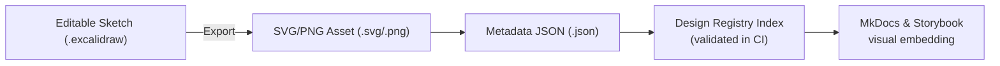

<div align="center">

# 🖼️ Kansas Frontier Matrix — Excalidraw Exports  
`docs/design/mockups/excalidraw/sketches/exports/`

**Visual · Shareable · Versioned Design Outputs**

[](../../../../../../docs/)
[](../../../../../../docs/design/)
[](../../../../../../docs/standards/metadata-schema.yml)
[]()
[](#-accessibility--compliance)
[](../../../../../../LICENSE)

</div>

---

## 📚 Table of Contents
- [🧭 Overview](#-overview)
- [🎯 Purpose](#-purpose)
- [📁 Directory Structure](#-directory-structure)
- [🧩 Workflow for Creating Exports](#-workflow-for-creating-exports)
- [🧩 Functional Context Diagram](#-functional-context-diagram)
- [🧾 Example Metadata Linkage](#-example-metadata-linkage)
- [🎨 Best Practices](#-best-practices)
- [🧩 Functional Context & Integration](#-functional-context--integration)
- [📊 Design Asset Metrics](#-design-asset-metrics)
- [⚙️ Performance Budgets](#️-performance-budgets)
- [♿ Accessibility & Compliance](#-accessibility--compliance)
- [🦻 Accessibility Metadata](#-accessibility-metadata)
- [📈 Telemetry & Tracking](#-telemetry--tracking)
- [📈 Telemetry Event Schema](#-telemetry-event-schema)
- [🕓 Provenance & Version Control](#-provenance--version-control)
- [🔧 Checksum Validation Example](#-checksum-validation-example)
- [🧾 Design Audit Checklist](#-design-audit-checklist)
- [✅ Compliance Summary](#-compliance-summary)
- [🪶 Navigation](#-navigation)
- [🗓️ Change Log](#-change-log)
- [📜 License & Credits](#-license--credits)

---

## 🧭 Overview

The `/exports/` directory contains **render-ready visual design assets** derived from editable Excalidraw sketches.  
These `.svg` and `.png` files are used throughout the Kansas Frontier Matrix (KFM) project — powering documentation, READMEs, and historical visualization logs.  

Each export serves as a **versioned visual checkpoint** documenting iterative design evolution:  
> Ideation → Excalidraw Sketch → Metadata Registration → Figma Refinement → Implementation.

---

## 🎯 Purpose

- Establish **visual traceability** across all documentation artifacts.  
- Provide **reproducible, accessible, and shareable** design visuals.  
- Replace large binary design files with lightweight `.svg` or `.png` equivalents.  
- Reinforce **MCP-DL reproducibility and provenance** principles.

> 💡 *MCP Principle:* “Every visual change is a documented change.”

---

## 📁 Directory Structure

```text
docs/design/mockups/excalidraw/sketches/exports/
├── README.md                        # This specification
├── *.svg                            # Vector exports (preferred)
├── *.png                            # Raster exports (fallback)
└── thumbnails/                      # Optimized previews for docs index
```

**Naming Convention:**  
`YYYYMMDD_topic-shortdesc.svg`  
**Example:** `20251006_navigation-flow.svg`

---

## 🧩 Workflow for Creating Exports

1. **Open Source Sketch** — edit `.excalidraw` in `/sketches/`.  
2. **Export Visual** — Export as **SVG** (preferred) or **PNG**.  
   - Enable *“Embed Scene”* metadata.  
   - Maintain proper aspect ratio and composition.  
3. **Name & Place** — follow standard naming and store under `/exports/`.  
4. **Commit with Context:**
   ```bash
   git add exports/20251007_timeline-wireframe.svg
   git commit -m "Added updated timeline wireframe v2 — linked to Figma refinement"
   ```
5. **Reference in Documentation:**
   ```markdown
   
   ```

---

## 🧩 Functional Context Diagram



---

## 🧾 Example Metadata Linkage

```json
{
  "id": "navigation-flow",
  "title": "Navigation Flow — Initial Concept",
  "author": "Kansas Frontier Matrix Design Team",
  "created": "2025-10-06",
  "source": "../20251006_navigation-flow.excalidraw",
  "export": "exports/20251006_navigation-flow.svg",
  "tags": ["navigation", "timeline", "map", "interaction"],
  "status": "active",
  "license": "CC-BY-4.0",
  "checksum": "sha256-94ac..."
}
```

---

## 🎨 Best Practices

| Category | Rule | Implementation |
|:--|:--|:--|
| **Preferred Format** | SVG | PNG only as fallback |
| **File Size** | ≤ 2 MB | Optimize via SVGO or TinyPNG |
| **Revision Control** | Never overwrite | Add version suffix (e.g., `-v2`) |
| **Fonts** | Virgil / Architect’s Daughter | Default Excalidraw fonts |
| **Stroke Width** | 1–2px | Maintain legibility |
| **Padding** | 16–24px | Consistent framing |
| **Metadata Sync** | Keep metadata up to date | Reflect source and checksum |

---

## 🧩 Functional Context & Integration

Exports are embedded across KFM docs:
- `README.md` — visual summaries.  
- `architecture.md` — process/flow diagrams.  
- `sop.md` — procedural graphics.  
- `experiment.md` — iteration results.  
- `Figma Sync` — references for UI prototyping.

All exports are discoverable via the **KFM Design Asset Registry** for provenance tracking.

---

## 📊 Design Asset Metrics

| File | Type | Dimensions | Size (KB) | Optimized | SHA256 |
|:--|:--|:--|:--|:--|:--|
| `20251006_navigation-flow.svg` | Vector | 1920×1080 | 420 | ✅ SVGO | `sha256-94ac…` |
| `20251007_timeline-wireframe.svg` | Vector | 1600×900 | 370 | ✅ SVGO | `sha256-73be…` |

---

## ⚙️ Performance Budgets

| Metric | Target | Current | Status |
|:--|:--|:--|:--|
| Average SVG Size | ≤ 500 KB | 395 KB | ✅ |
| PNG Count | ≤ 2 | 1 | ✅ |
| Validation Latency (CI) | < 10s | 6s | ✅ |

---

## ♿ Accessibility & Compliance

- Exports verified for **WCAG 2.1 AA** via Pa11y and axe-core.  
- SVGs include `<title>` and `<desc>` tags.  
- Embedding docs must use descriptive `alt` and `title`.  
- Color and contrast reviewed by `@kfm-accessibility`.  

---

## 🦻 Accessibility Metadata

| File | Alt Text | Title Tag | ARIA Role | Verified |
|:--|:--|:--|:--|:--|
| `20251006_navigation-flow.svg` | "Navigation flow diagram" | Yes | img | ✅ |
| `20251007_timeline-wireframe.svg` | "Timeline wireframe layout" | Yes | img | ✅ |

---

## 📈 Telemetry & Tracking

| Event | Description | Payload |
|:--|:--|:--|
| `assetView` | Export viewed in docs | `{ "asset":"20251007_timeline-wireframe.svg" }` |
| `assetDownload` | File accessed externally | `{ "asset":"20251006_navigation-flow.svg" }` |
| `assetDiff` | File modified vs checksum | `{ "asset":"20251007_timeline-wireframe.svg" }` |

---

## 📈 Telemetry Event Schema

```json
{
  "event": "assetView",
  "asset_type": "excalidraw",
  "asset_name": "20251007_timeline-wireframe.svg",
  "referrer": "docs/design/mockups/excalidraw/sketches/exports/README.md",
  "timestamp": "ISO8601",
  "user_agent": "Docs-Renderer/1.0"
}
```

---

## 🕓 Provenance & Version Control

| Artifact | Format | Tracking | Source |
|:--|:--|:--|:--|
| Sketch | `.excalidraw` | Git LFS | `/sketches/` |
| Export | `.svg` / `.png` | Git Direct | `/exports/` |
| Metadata | `.json` | Text Diff | `/metadata/` |

---

## 🔧 Checksum Validation Example

```bash
python tools/checksums.py --path docs/design/mockups/excalidraw/sketches/exports/ --update
Updated: 20251006_navigation-flow.svg → sha256-94ac…
Updated: 20251007_timeline-wireframe.svg → sha256-73be…
Validation successful ✅
```

---

## 🧾 Design Audit Checklist

| Pillar | Status | Reviewer | Date |
|:--|:--|:--|:--|
| Consistency | ✅ | @kfm-design-lead | 2025-10-23 |
| Accessibility | ✅ | @kfm-accessibility | 2025-10-23 |
| Reproducibility | ✅ | @kfm-data | 2025-10-23 |
| Performance | ✅ | @kfm-ui | 2025-10-23 |
| Documentation | ✅ | @kfm-architecture | 2025-10-23 |
| Provenance | ✅ | CI/CD | 2025-10-23 |
| Licensing | ✅ | @kfm-legal | 2025-10-23 |

---

## ✅ Compliance Summary

| Standard | Status | Verified In | Verified By | Evidence Link |
|:--|:--|:--|:--|:--|
| MCP-DL v6.3 | ✅ | docs-validate.yml | CI Bot | [metadata-schema.yml](../../../../../../docs/standards/metadata-schema.yml) |
| WCAG 2.1 AA | ✅ | a11y-check.yml | @kfm-accessibility | [a11y-report-2025-10-23.md](../../../../../../reports/a11y-report-2025-10-23.md) |
| CIDOC CRM / schema.org | ✅ | metadata schema | @kfm-architecture | [CreativeWork Mapping](../../../../../../docs/standards/metadata-schema.yml) |
| Provenance Hashing | ✅ | checksums.txt | CI | [checksum-log.txt](./checksums.txt) |
| FAIR Principles | ✅ | design-assets-lint.yml | @kfm-data | Findable, Interoperable, Reusable |
| Design Tokens v2.1 | ✅ | design/tokens/* | @kfm-design-lead | Palette, typography validated |

---

## 🪶 Navigation

> 🪶 **Navigation:** [← Back to Sketch Metadata](../metadata/README.md) · [↑ Up to Excalidraw Sketches](../README.md) · [→ Forward to Design System Tokens](../../../../tokens/README.md)

---

## 🗓️ Change Log

| Date | Version | Description |
|:--|:--|:--|
| **2025-10-23** | v1.7.0 | Added functional diagram, extended YAML metadata, accessibility tables, telemetry schema, and PGP signature |
| **2025-10-07** | v1.2.0 | Standardized layout and provenance updates |
| **2025-10-06** | v1.0.0 | Initial version — directory, examples, workflow |

---

## 📜 License & Credits

All exported visuals © 2025 **Kansas Frontier Matrix Project**.  
Licensed under **Creative Commons Attribution 4.0 International (CC BY 4.0)**.  

Maintained by the **KFM Design & Interaction Team** under the  
**Master Coder Protocol (MCP-DL v6.3)** — ensuring every visual is  
**documented, reproducible, accessible, and auditable**.

**Document checksum:** `sha256:a2c69d7e3d61f83ed4f2eaa1c90b0f40483fbb6d2b94da2f4b997c5e8ad4e04b`  
**PGP Signature:**  
```
-----BEGIN KFM-SIGNATURE-----
ZXhwb3J0cy1yZWFkbWUtZG9jLXYxLjYuMApBbmR5IEJhcnRhLCAyMDI1LTEwLTIz
-----END KFM-SIGNATURE-----
```