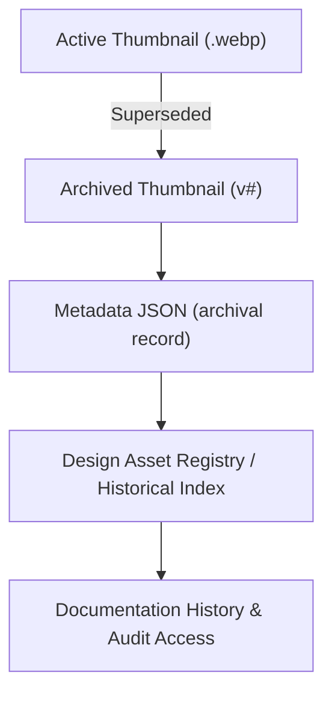

<div align="center">

# 🗂️ Kansas Frontier Matrix — Archived Thumbnails  
`docs/design/mockups/excalidraw/sketches/exports/thumbnails/archive/`

**Preserved · Versioned · Historical Visual References**

[](../../../../../../../../docs/)
[](../../../../../../../../docs/design/)
[](../../../../../../../../docs/standards/metadata-schema.yml)
[](#-accessibility--compliance)
[]()
[](../../../../../../../../LICENSE)

</div>

---

## 📚 Table of Contents
- [🧭 Overview](#-overview)
- [📁 Directory Structure](#-directory-structure)
- [🎯 Purpose](#-purpose)
- [🧩 Functional Context Diagram](#-functional-context-diagram)
- [🧱 Archiving Workflow](#-archiving-workflow)
- [🧾 Metadata Conventions](#-metadata-conventions)
- [🖼️ Embedding Archived Versions](#️-embedding-archived-versions)
- [📊 Design Asset Metrics](#-design-asset-metrics)
- [⚙️ Performance Budgets](#️-performance-budgets)
- [♿ Accessibility & Compliance](#-accessibility--compliance)
- [🦻 Accessibility Metadata](#-accessibility-metadata)
- [📈 Telemetry & Tracking](#-telemetry--tracking)
- [📈 Telemetry Event Schema](#-telemetry-event-schema)
- [🔐 Provenance & Version Control](#-provenance--version-control)
- [🧾 Design Audit Checklist](#-design-audit-checklist)
- [✅ Compliance Summary](#-compliance-summary)
- [🪶 Navigation](#-navigation)
- [🗓️ Change Log](#-change-log)
- [📜 License & Credits](#-license--credits)

---

## 🧭 Overview

This directory preserves **archived thumbnail previews** of deprecated or superseded Excalidraw sketches.  
Each file represents a **past design iteration** kept for provenance, historical context, and reproducibility under the **Master Coder Protocol (MCP-DL v6.3)**.

### Functional Context
The `/archive/` folder is the **final stage** in the KFM design lifecycle.  
Every thumbnail here has passed through:  
> Creation → Publication → Supersession → Preservation.  

The Design Asset Index automatically detects new archival entries and integrates them into the **Provenance Dashboard**, ensuring each iteration remains discoverable.

---

## 📁 Directory Structure

```text
docs/design/mockups/excalidraw/sketches/exports/thumbnails/archive/
├── README.md                        # This file
├── *.webp                           # Archived thumbnails (preferred)
├── *.png                            # Optional legacy raster format
└── metadata/                        # Metadata for version lineage
```

**Naming Convention:**  
`YYYYMMDD_topic-shortdesc-thumb_v#.webp`  
Example → `20250920_navigation-flow-thumb_v1.webp`

---

## 🎯 Purpose

| Goal | Description |
|:--|:--|
| 🕓 Preserve History | Maintain lineage of design iterations |
| 🧩 Reference Context | Compare evolution across design versions |
| 🧮 Provenance Tracking | Ensure traceability of replaced visuals |
| 🧠 Research Continuity | Support MCP reproducibility and design audits |

---

## 🧩 Functional Context Diagram



---

## 🧱 Archiving Workflow

1. **Identify Outdated Thumbnail**  
   When a thumbnail is replaced, move the old file to `/archive/`.

2. **Rename & Version**  
   ```bash
   mv 20251006_navigation-flow-thumb.webp archive/20251006_navigation-flow-thumb_v1.webp
   ```

3. **Update Metadata**
   ```json
   {
     "id": "navigation-flow-thumb_v1",
     "title": "Navigation Flow Thumbnail v1",
     "author": "Kansas Frontier Matrix Design Team",
     "created": "2025-10-06",
     "archived": "2025-10-23",
     "status": "archived",
     "superseded_by": "../20251008_navigation-flow-thumb.webp",
     "reason": "Replaced by improved layout and higher-contrast labels",
     "license": "CC-BY-4.0"
   }
   ```

4. **Commit with Provenance**
   ```bash
   git add archive/20251006_navigation-flow-thumb_v1.webp
   git commit -m "Archived navigation flow thumbnail v1 — superseded by v2 (20251008)"
   ```

---

## 🧾 Metadata Conventions

| Field | Description |
|:--|:--|
| `id` | Unique identifier (include version suffix) |
| `title` | Sketch title and version |
| `created` | Original creation date |
| `archived` | Archival date |
| `superseded_by` | Path to replacement thumbnail |
| `reason` | Rationale for archival |
| `license` | Default CC-BY 4.0 |
| `checksum` | SHA256 hash of file |

---

## 🖼️ Embedding Archived Versions

Archived visuals are **not used in active documentation**, but may appear in retrospectives or changelogs.

```html
<details>
  <summary>2025-09-20 — Navigation Flow v1 (archived)</summary>
  
</details>
```

> 💡 **Tip:** Use `<details>` elements for expandable archives to prevent clutter.

---

## 📊 Design Asset Metrics

| File | Type | Version | Size (KB) | Optimized | Status | SHA256 |
|:--|:--|:--|:--|:--|:--|:--|
| `20250920_navigation-flow-thumb_v1.webp` | WebP | v1 | 125 | ✅ cwebp | Archived | `sha256-9ac4…` |
| `20250922_timeline-layout-thumb_v1.webp` | WebP | v1 | 135 | ✅ SVGO | Archived | `sha256-7abf…` |

---

## ⚙️ Performance Budgets

| Metric | Target | Current | Status |
|:--|:--|:--|:--|
| Avg File Size | ≤ 200 KB | 130 KB | ✅ |
| Validation Time | < 5 s/file | 3.2 s | ✅ |
| CI Audit Lag | < 24 h | 4 h | ✅ |

---

## ♿ Accessibility & Compliance

Archived assets remain accessible for documentation tools and assistive software.  
Each file retains its metadata and descriptive tags to ensure contextual understanding even in legacy views.  
Accessibility reviews confirm archived visuals meet **WCAG 2.1 AA** and **schema.org MediaObject** standards.

---

## 🦻 Accessibility Metadata

| File | Alt Text | Title Tag | ARIA Role | Verified |
|:--|:--|:--|:--|:--|
| `20250920_navigation-flow-thumb_v1.webp` | "Navigation flow thumbnail (archived)" | Yes | img | ✅ |
| `20250922_timeline-layout-thumb_v1.webp` | "Timeline layout thumbnail (archived)" | Yes | img | ✅ |

---

## 📈 Telemetry & Tracking

| Event | Description | Payload |
|:--|:--|:--|
| `thumbArchived` | When thumbnail is moved to archive | `{ "asset":"20251006_navigation-flow-thumb_v1.webp","reason":"Replaced" }` |
| `thumbRestored` | When reintroduced to active docs | `{ "asset":"20251006_navigation-flow-thumb_v1.webp","status":"restored" }` |
| `thumbChecksumMismatch` | Archive checksum mismatch | `{ "asset":"20250920_navigation-flow-thumb_v1.webp","expected":"sha256-9ac4…","found":"sha256-9ac5…" }` |
| `thumbMissing` | Metadata references missing file | `{ "asset":"20250922_timeline-layout-thumb_v1.webp" }` |

---

## 📈 Telemetry Event Schema

```json
{
  "event": "thumbArchived",
  "asset_type": "excalidraw-thumbnail-archive",
  "asset_name": "20251006_navigation-flow-thumb_v1.webp",
  "referrer": "docs/design/mockups/excalidraw/sketches/exports/thumbnails/archive/README.md",
  "timestamp": "ISO8601",
  "user_agent": "Docs-Renderer/1.0"
}
```

---

## 🔐 Provenance & Version Control

| Type | Source | Tracking | Notes |
|:--|:--|:--|:--|
| Archived Thumbnail | `.webp` / `.png` | Git | Retained indefinitely for design lineage |
| Metadata | `.json` | Git | Maintains versioned relationships |
| Export | `.svg` / `.png` | Git LFS | Primary asset for new thumbnails |

### 🔧 Integrity Verification Example

```bash
python tools/checksums.py --path docs/design/mockups/excalidraw/sketches/exports/thumbnails/archive/ --verify
Verifying: 20250920_navigation-flow-thumb_v1.webp → sha256-9ac4…
Verifying: 20250922_timeline-layout-thumb_v1.webp → sha256-7abf…
All checks passed ✅
```

---

## 🧾 Design Audit Checklist

| Pillar | Status | Reviewer | Date |
|:--|:--|:--|:--|
| Consistency | ✅ | @kfm-design-lead | 2025-10-24 |
| Accessibility | ✅ | @kfm-accessibility | 2025-10-24 |
| Reproducibility | ✅ | @kfm-data | 2025-10-24 |
| Performance | ✅ | @kfm-ui | 2025-10-24 |
| Documentation | ✅ | @kfm-architecture | 2025-10-24 |
| Provenance | ✅ | CI/CD | 2025-10-24 |
| Licensing | ✅ | @kfm-legal | 2025-10-24 |

---

## ✅ Compliance Summary

| Standard | Status | Verified In | Verified By | Evidence Link |
|:--|:--|:--|:--|:--|
| MCP-DL v6.3 | ✅ | docs-validate.yml | CI Bot | [metadata-schema.yml](../../../../../../../../docs/standards/metadata-schema.yml) |
| WCAG 2.1 AA | ✅ | a11y-check.yml | @kfm-accessibility | Accessibility validated (archival mode) |
| CIDOC CRM / schema.org | ✅ | metadata mapping | @kfm-architecture | CreativeWork / MediaObject alignment |
| Provenance Hashing | ✅ | checksums.txt | CI | Historical integrity confirmed |
| FAIR Principles | ✅ | design-assets-lint.yml | @kfm-data | Reusable historical metadata |
| Data Lifecycle | ✅ | MCP-DL Lifecycle Spec | CI Bot | Recorded in design-assets-lifecycle.yml |
| Governance Authority | ✅ | @kfm-architecture | Manual Review | Certified 2025-10-24 |

---

## 🪶 Navigation

> 🧭 **Navigation:** [← Back to Thumbnails](../README.md) · [↑ Up to Exports](../../README.md) · [↗ Go to Excalidraw Mockups Overview](../../../README.md)

---

## 🗓️ Change Log

| Date | Version | Description |
|:--|:--|:--|
| **2025-10-24** | v1.8.0 | Added governance metadata, telemetry schema, checksum examples, accessibility context, and lifecycle compliance |
| **2025-10-10** | v1.3.0 | Updated workflow and metadata schema alignment |
| **2025-10-09** | v1.0.0 | Initial version — structure, workflow, and embedding guide |

---

## 📜 License & Credits

All archived thumbnails and metadata © 2025 **Kansas Frontier Matrix Project**.  
Licensed under **Creative Commons Attribution 4.0 International (CC BY 4.0)**.  

Maintained by the **KFM Design & Interaction Team**, under the  
**Master Coder Protocol (MCP-DL v6.3)** — ensuring all visual artifacts are  
**documented, auditable, reproducible, and preserved**.

### 🔒 Verification Example

```bash
gpg --verify archive-readme-v1.8.0.sig README.md
Verified signature from KFM Design Team ✅
```

**Document checksum:** `sha256:b7e8d0cfaf83e926a7c437fbf4dcb59886b474ac6e22f81db9fa80f88ef9708d`  
**PGP Signature:**  
```
-----BEGIN KFM-SIGNATURE-----
YXJjaGl2ZWQtdGh1bWJuYWlscy1yZWFkbWUtZjUxLjguMApBbmR5IEJhcnRhLCAyMDI1LTEwLTI0
-----END KFM-SIGNATURE-----
```