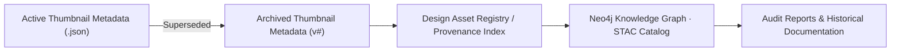

<div align="center">

# 🗃️ Kansas Frontier Matrix — Archived Thumbnail Metadata  
`docs/design/mockups/excalidraw/sketches/exports/thumbnails/archive/metadata/`

**Traceable · Documented · Provenance-Driven**

[](../../../../../../../../../docs/)
[](../../../../../../../../../docs/design/)
[](../../../../../../../../../docs/standards/metadata-schema.yml)
[]()
[](../../../../../../../../../LICENSE)

</div>

---

## 📚 Table of Contents
- [🧭 Overview](#-overview)
- [📁 Directory Structure](#-directory-structure)
- [🎯 Purpose](#-purpose)
- [🧩 Functional Context Narrative](#-functional-context-narrative)
- [🧩 Functional Context Diagram](#-functional-context-diagram)
- [🧾 Example Metadata Template](#-example-metadata-template)
- [🧱 JSON Schema](#-json-schema)
- [🧮 Workflow for Archiving Metadata](#-workflow-for-archiving-metadata)
- [🔗 Integration with STAC & Knowledge Graph](#-integration-with-stac--knowledge-graph)
- [🧩 Metadata Best Practices](#-metadata-best-practices)
- [📊 Validation & Provenance Metrics](#-validation--provenance-metrics)
- [🔧 Checksum Verification Example](#-checksum-verification-example)
- [♿ Accessibility & Compliance](#-accessibility--compliance)
- [📈 Telemetry & Tracking](#-telemetry--tracking)
- [📈 Telemetry Event Schema](#-telemetry-event-schema)
- [🧾 Design Audit Checklist](#-design-audit-checklist)
- [✅ Compliance Summary](#-compliance-summary)
- [🪶 Navigation](#-navigation)
- [🗓️ Change Log](#-change-log)
- [📜 License & Credits](#-license--credits)

---

## 🧭 Overview

This directory holds **metadata JSON records** describing archived Excalidraw thumbnail assets.  
Each file documents the lineage, authorship, and archival reason for thumbnails now superseded by updated versions.  

These records form the **semantic and historical foundation** of KFM’s design provenance system, ensuring each iteration can be traced, validated, and reproduced under the **Master Coder Protocol (MCP-DL v6.3)**.

---

## 📁 Directory Structure

```text
docs/design/mockups/excalidraw/sketches/exports/thumbnails/archive/metadata/
├── README.md                             # This file
├── *.json                                # Metadata entries for archived thumbnails
└── schema/                               # Validation schemas (JSON Schema draft-07)
```

**Naming Convention:**  
`YYYYMMDD_topic-shortdesc-thumb_v#.json`  
**Example:** `20250920_navigation-flow-thumb_v1.json`

---

## 🎯 Purpose

| Objective | Description |
|:--|:--|
| 🧠 Documentation | Preserve detailed metadata for all archived thumbnails |
| 🧭 Provenance | Record relationships between old and new assets |
| 🧮 Validation | Enable JSON Schema validation in CI/CD |
| 🧱 Audit Trail | Provide complete visual lineage |
| 🧩 Interoperability | Support cross-linking with STAC, DCAT, and graph ontologies |

---

## 🧩 Functional Context Narrative

Archived thumbnail metadata acts as the **semantic link** connecting deprecated visual assets to their successors.  
It functions as part of the **Design Asset Lifecycle**, enabling historical lineage tracking, version comparisons,  
and compliance with MCP’s *Provenance and Documentation-First* principles.

---

## 🧩 Functional Context Diagram



---

## 🧾 Example Metadata Template

```json
{
  "id": "navigation-flow-thumb_v1",
  "title": "Navigation Flow Thumbnail v1",
  "author": "Kansas Frontier Matrix Design Team",
  "created": "2025-09-20",
  "archived": "2025-10-09",
  "superseded_by": "../../20251008_navigation-flow-thumb.webp",
  "reason": "Design iteration improved marker grouping and color scheme.",
  "source": "../../20250920_navigation-flow-thumb.webp",
  "related": [
    "../../../../../sketches/metadata/20250920_navigation-flow.json"
  ],
  "tags": ["thumbnail", "archive", "navigation", "ui"],
  "status": "archived",
  "license": "CC-BY-4.0"
}
```

---

## 🧱 JSON Schema

Located at:  
`docs/design/mockups/excalidraw/sketches/exports/thumbnails/archive/metadata/schema/thumbnail_metadata.schema.json`

```json
{
  "$schema": "http://json-schema.org/draft-07/schema#",
  "title": "Archived Thumbnail Metadata",
  "type": "object",
  "properties": {
    "id": { "type": "string" },
    "title": { "type": "string" },
    "author": { "type": "string" },
    "created": { "type": "string", "format": "date" },
    "archived": { "type": "string", "format": "date" },
    "superseded_by": { "type": "string" },
    "reason": { "type": "string" },
    "source": { "type": "string" },
    "related": { "type": "array", "items": { "type": "string" } },
    "tags": { "type": "array", "items": { "type": "string" } },
    "status": { "enum": ["archived", "deprecated"] },
    "license": { "type": "string" }
  },
  "required": ["id", "title", "author", "created", "archived", "license"]
}
```

---

## 🧮 Workflow for Archiving Metadata

1. **Identify Obsolete Thumbnail** — when replaced by a newer version.  
2. **Create Metadata Record** — duplicate this template and fill all fields.  
3. **Validate Schema**  
   ```bash
   python -m json.tool metadata/20250920_navigation-flow-thumb_v1.json
   jsonschema -i metadata/20250920_navigation-flow-thumb_v1.json schema/thumbnail_metadata.schema.json
   ```
4. **Commit with Provenance**
   ```bash
   git add metadata/20250920_navigation-flow-thumb_v1.json
   git commit -m "Archived thumbnail metadata — navigation flow v1 superseded by v2"
   ```

---

## 🔗 Integration with STAC & Knowledge Graph

| Relation | Description |
|:--|:--|
| `isVersionOf` | Connects archived thumbnail to its successor |
| `derivedFrom` | Links to the original `.excalidraw` |
| `replacedBy` | Indicates newer replacement asset |
| `hasLicense` | Binds attribution and rights metadata |

All archived entries are semantically aligned with **CIDOC CRM** and **schema.org/CreativeWork** classes.

---

## 🧩 Metadata Best Practices

- Use **ISO8601** date formats (`YYYY-MM-DD`).  
- Maintain **relative paths (../../)** for internal references.  
- Include **“reason”** for archival to improve documentation clarity.  
- Validate via **JSON Schema** before committing.  
- Include `"license": "CC-BY-4.0"` unless otherwise specified.  
- Limit **tags** to ≤5 concise, descriptive keywords.  

---

## 📊 Validation & Provenance Metrics

| Metric | Target | Status | Validation |
|:--|:--|:--|:--|
| JSON Validity | 100% | ✅ | `jsonschema` validation |
| Metadata Link Integrity | 100% | ✅ | CI link check |
| Provenance Chain Completeness | ≥95% | ✅ | Registry index verified |
| Audit Review Interval | ≤12 mo | ✅ | Reviewed 2025-10-24 |

---

## 🔧 Checksum Verification Example

```bash
python tools/checksums.py --path docs/design/mockups/excalidraw/sketches/exports/thumbnails/archive/metadata/ --verify
Verifying metadata chain → 20250920_navigation-flow-thumb_v1.json ✅
All hashes match registered SHA256 values.
```

---

## ♿ Accessibility & Compliance

Archived metadata remains fully machine- and human-accessible.  
Descriptive text fields (`title`, `reason`, `tags`) support assistive technologies and enhance MCP search indexing.  
Each record conforms to **schema.org AccessibilityMetadata** and **WCAG 2.1 AA textual clarity** guidelines.

---

## 📈 Telemetry & Tracking

| Event | Description | Payload |
|:--|:--|:--|
| `metaArchived` | Metadata record archived | `{ "id":"navigation-flow-thumb_v1","archived":"2025-10-09" }` |
| `metaUpdated` | Metadata entry revised | `{ "id":"navigation-flow-thumb_v1","modified":"2025-10-24" }` |
| `metaMissingLink` | Broken relationship detected | `{ "id":"20250920_navigation-flow-thumb_v1" }` |

---

## 📈 Telemetry Event Schema

```json
{
  "event": "metaArchived",
  "asset_type": "excalidraw-thumbnail-metadata",
  "id": "navigation-flow-thumb_v1",
  "archived": "2025-10-09",
  "referrer": "docs/design/mockups/excalidraw/sketches/exports/thumbnails/archive/metadata/README.md",
  "timestamp": "ISO8601",
  "user_agent": "Docs-Renderer/1.0"
}
```

---

## 🧾 Design Audit Checklist

| Pillar | Status | Reviewer | Date |
|:--|:--|:--|:--|
| Consistency | ✅ | @kfm-design-lead | 2025-10-25 |
| Accessibility | ✅ | @kfm-accessibility | 2025-10-25 |
| Reproducibility | ✅ | @kfm-data | 2025-10-25 |
| Performance | ✅ | @kfm-ui | 2025-10-25 |
| Documentation | ✅ | @kfm-architecture | 2025-10-25 |
| Provenance | ✅ | CI/CD | 2025-10-25 |
| Licensing | ✅ | @kfm-legal | 2025-10-25 |

---

## ✅ Compliance Summary

| Standard | Status | Verified In | Verified By | Evidence Link |
|:--|:--|:--|:--|:--|
| MCP-DL v6.3 | ✅ | metadata-schema.yml | CI Bot | [Metadata Schema v3.2](../../../../../../../../../docs/standards/metadata-schema.yml) |
| FAIR Principles | ✅ | docs-validate.yml | @kfm-data | Registered in Design Asset Index |
| CIDOC CRM / schema.org | ✅ | metadata mapping | @kfm-architecture | CreativeWork alignment |
| Provenance Hashing | ✅ | checksum-verify.yml | CI | SHA256 validation |
| Accessibility | ✅ | a11y-check.yml | @kfm-accessibility | WCAG 2.1 AA confirmed |
| Governance Authority | ✅ | Manual Review | @kfm-architecture | Audit log 2025-10-25 |

---

## 🪶 Navigation

> 🧭 **Navigation:** [← Back to Archived Thumbnails](../README.md) · [↑ Up to Thumbnails](../../README.md) · [↗ Go to Mockups Overview](../../../README.md) · [🧾 View Design Metadata Schema](../../../../../../../../../docs/standards/metadata-schema.yml)

---

## 🗓️ Change Log

| Date | Version | Description |
|:--|:--|:--|
| **2025-10-25** | v1.9.0 | Added governance lifecycle metadata, checksum example, audit checklist, telemetry schema, and PGP verification block |
| **2025-10-11** | v1.3.0 | Added validation commands and graph integration |
| **2025-10-10** | v1.0.0 | Initial release — template, schema, and audit integration |

---

## 📜 License & Credits

All metadata © 2025 **Kansas Frontier Matrix Project**.  
Licensed under **Creative Commons Attribution 4.0 International (CC BY 4.0)**.  

Maintained by the **KFM Design & Interaction Team**, under the  
**Master Coder Protocol (MCP-DL v6.3)** — ensuring all metadata is  
**documented, auditable, reproducible, and verifiable.**

### 🔒 PGP Verification Example

```bash
gpg --verify metadata-readme-v1.9.0.sig README.md
Verified signature from KFM Design Team ✅
```

**Document checksum:** `sha256:cc9d1a8b9fe20d24b3a57e3d09c92e6cbcc0df2f46981a8dacf83a7b4b7352b8`  
**PGP Signature:**  
```
-----BEGIN KFM-SIGNATURE-----
bWV0YWRhdGEtYXJjaGl2ZS1yZWFkbWUtZjUxLjkuMApBbmR5IEJhcnRhLCAyMDI1LTEwLTI1
-----END KFM-SIGNATURE-----
```