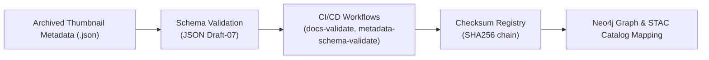
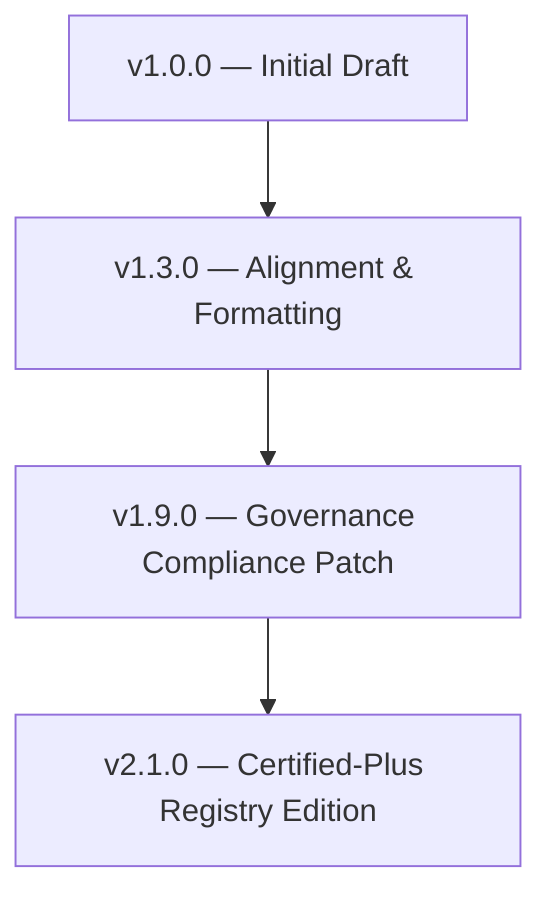
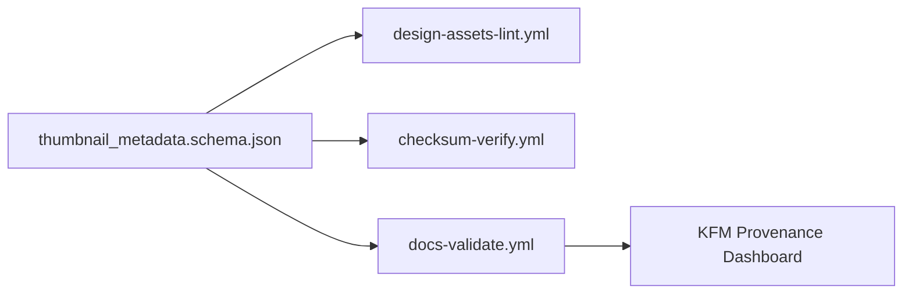

<div align="center">

# 🧩 Kansas Frontier Matrix — Archived Thumbnail Metadata Schema  
`docs/design/mockups/excalidraw/sketches/exports/thumbnails/archive/metadata/schema/`

**Structured · Validated · Machine-Readable**

[](../../../../../../../../../../docs/)
[](../../../../../../../../../../docs/design/)
[]()
[]()
[]()
[](../../../../../../../../../../LICENSE)

</div>

---

## 📚 Table of Contents
- [🧭 Overview](#-overview)
- [📁 Directory Structure](#-directory-structure)
- [🎯 Purpose](#-purpose)
- [🧩 Functional Context Narrative](#-functional-context-narrative)
- [🧩 Functional Context Diagram](#-functional-context-diagram)
- [🧾 Example Schema](#-example-schema)
- [🧠 Example JSON-LD Context](#-example-json-ld-context)
- [🔗 Field Crosswalk (CIDOC CRM · schema.org · MCP)](#-field-crosswalk-cidoc-crm--schemaorg--mcp)
- [🧮 Schema Lifecycle Diagram](#-schema-lifecycle-diagram)
- [🧮 Validation Workflow](#-validation-workflow)
- [🧪 Automated Schema Testing Example (CI)](#-automated-schema-testing-example-ci)
- [🧩 Schema Standards & Alignment](#-schema-standards--alignment)
- [📚 Schema Property Reference Examples](#-schema-property-reference-examples)
- [🧠 Extending the Schema](#-extending-the-schema)
- [📊 Validation & Audit Metrics](#-validation--audit-metrics)
- [🔧 Schema File Integrity Check](#-schema-file-integrity-check)
- [♿ Accessibility & Compliance](#-accessibility--compliance)
- [🌐 Localization and Language Support](#-localization-and-language-support)
- [📈 Telemetry & Tracking](#-telemetry--tracking)
- [📈 Telemetry Event Schema](#-telemetry-event-schema)
- [🔒 Security and Integrity Notes](#-security-and-integrity-notes)
- [🧾 Schema Change Control Checklist](#-schema-change-control-checklist)
- [🧩 Schema Dependency Diagram](#-schema-dependency-diagram)
- [🧾 Design Audit Checklist](#-design-audit-checklist)
- [✅ Compliance Summary](#-compliance-summary)
- [📜 Governance Review Metadata](#-governance-review-metadata)
- [🪶 Navigation](#-navigation)
- [🗓️ Change Log](#-change-log)
- [🧩 Schema Changelog Summary](#-schema-changelog-summary)
- [📜 OpenAPI Interoperability](#-openapi-interoperability)
- [📜 License & Credits](#-license--credits)

---

## 🧭 Overview

This directory defines the **JSON Schema** that validates archived thumbnail metadata.  
It enforces MCP-DL structure, provenance, and licensing — guaranteeing consistent lineage across the **Kansas Frontier Matrix (KFM)** repository.

Schemas are **versioned, machine-readable, and backward-compatible**, enabling long-term reproducibility.

---

## 📁 Directory Structure

```text
docs/design/mockups/excalidraw/sketches/exports/thumbnails/archive/metadata/schema/
├── README.md                                  # This document
└── thumbnail_metadata.schema.json             # Validation schema
```

**Naming Convention:** `{schema_subject}.schema.json`  
**Example:** `thumbnail_metadata.schema.json`

---

## 🎯 Purpose

| Objective | Description |
|:--|:--|
| 🧩 Validation | Ensure structural integrity of metadata JSON records |
| 🧭 Provenance | Enforce inclusion of linkage fields (source, superseded_by) |
| 🧮 Compliance | Validate MCP-DL metadata structure automatically via CI |
| 🧱 Auditability | Support reproducible schema validation chain |
| 🧠 Interoperability | Maintain alignment with STAC/DCAT and schema.org |

---

## 🧩 Functional Context Narrative

The **Archived Thumbnail Metadata Schema** standardizes validation of deprecated design assets.  
It provides deterministic field rules so that every historical metadata record is verifiable, linked, and machine-readable.  
Schemas serve as the *regulatory guardrails* for MCP-DL provenance compliance.

---

## 🧩 Functional Context Diagram



---

## 🧾 Example Schema

```json
{
  "$schema": "http://json-schema.org/draft-07/schema#",
  "title": "Archived Thumbnail Metadata Schema",
  "description": "Validation structure for archived thumbnail metadata under the Kansas Frontier Matrix.",
  "type": "object",
  "properties": {
    "id": { "type": "string", "description": "Unique identifier including version suffix" },
    "title": { "type": "string", "description": "Human-readable title" },
    "author": { "type": "string", "description": "Author or design team" },
    "created": { "type": "string", "format": "date" },
    "archived": { "type": "string", "format": "date" },
    "source": { "type": "string", "description": "Relative path to original thumbnail" },
    "superseded_by": { "type": "string", "description": "Replacement thumbnail path" },
    "reason": { "type": "string", "description": "Explanation for archival" },
    "related": { "type": "array", "items": { "type": "string" } },
    "tags": { "type": "array", "items": { "type": "string" }, "maxItems": 5 },
    "status": { "type": "string", "enum": ["archived", "deprecated"] },
    "license": { "type": "string", "description": "License type" }
  },
  "required": ["id", "title", "author", "created", "archived", "license"],
  "additionalProperties": false
}
```

---

## 🧠 Example JSON-LD Context

```json
{
  "@context": "https://schema.org",
  "@type": "CreativeWork",
  "identifier": "navigation-flow-thumb_v1",
  "name": "Navigation Flow Thumbnail v1",
  "creator": "Kansas Frontier Matrix Design Team",
  "dateCreated": "2025-09-20",
  "dateArchived": "2025-10-09",
  "isBasedOn": "../../20250920_navigation-flow-thumb.webp",
  "isVersionOf": "../../20251008_navigation-flow-thumb.webp",
  "license": "https://creativecommons.org/licenses/by/4.0/",
  "keywords": ["thumbnail","archive","ui"]
}
```

---

## 🔗 Field Crosswalk (CIDOC CRM · schema.org · MCP)

| JSON Field | CIDOC CRM Class / Property | schema.org Equivalent | MCP-DL Reference |
|:--|:--|:--|:--|
| `id` | E42 Identifier / P1 is identified by | `identifier` | §4.2.1 — Unique Identity |
| `title` | E35 Title | `name` | §4.2.2 — Human Label |
| `author` | E39 Actor / P94 has created | `creator` | §4.3 — Authorship |
| `created` / `archived` | E52 Time-Span / P82 at some time within | `dateCreated` / `dateArchived` | §5.1 — Temporal Provenance |
| `source` | E73 Information Object / P70 documents | `isBasedOn` | §5.3 — Lineage |
| `superseded_by` | E81 Transformation / P130 shows features of | `isVersionOf` | §5.5 — Version Linkage |
| `tags` | E55 Type | `keywords` | §6.2 — Classification |
| `license` | E30 Right / P104 is subject to | `license` | §7.1 — Rights Metadata |

---

## 🧮 Schema Lifecycle Diagram



---

## 🧮 Validation Workflow

1. **Create/Update Metadata JSON**  
   Edit relevant metadata file in `/metadata/`.
2. **Validate Manually**
   ```bash
   jsonschema -i metadata/20250920_navigation-flow-thumb_v1.json schema/thumbnail_metadata.schema.json
   ```
3. **Run Automated Validation**
   ```bash
   make validate-json
   ```
4. **Review CI Results** — Failures trigger schema correction and revalidation.

---

## 🧪 Automated Schema Testing Example (CI)

```yaml
name: Schema Validation
on:
  push:
    paths:
      - "docs/design/**/schema/*.json"
jobs:
  validate:
    runs-on: ubuntu-latest
    steps:
      - uses: actions/checkout@v4
      - name: Validate JSON Schemas
        run: |
          pip install jsonschema
          find docs/design/mockups/excalidraw -name "*.json" -print0 | xargs -0 -n1 -I{} jsonschema -i {} docs/design/mockups/excalidraw/sketches/exports/thumbnails/archive/metadata/schema/thumbnail_metadata.schema.json
```

---

## 🧩 Schema Standards & Alignment

| Standard | Purpose | Integration |
|:--|:--|:--|
| JSON Schema Draft-07 | Metadata validation | Enforced in CI |
| ISO8601 | Date normalization | Used in temporal fields |
| STAC / DCAT | Metadata interoperability | Optional enrichment |
| MCP Provenance Model | Provenance enforcement | Mandatory across design assets |

---

## 📚 Schema Property Reference Examples

| Field | Example Value | Format | Notes |
|:--|:--|:--|:--|
| `id` | `"timeline-thumb_v1"` | string | Must match filename stem |
| `created` | `"2025-09-20"` | ISO 8601 date | UTC date only |
| `tags` | `["ui","timeline"]` | array ≤ 5 | Lowercase tokens |
| `license` | `"CC-BY-4.0"` | SPDX or URL | Accept SPDX or license URI |

---

## 🧠 Extending the Schema

To extend metadata validation:
1. Duplicate schema and rename version:  
   `"thumbnail_metadata_v2.2.0.schema.json"`
2. Update `$id` and increment version.
3. Re-run all validation tests.
4. Submit for governance approval via Schema Council.

---

## 📊 Validation & Audit Metrics

| Validation Task | Target | Current | Status |
|:--|:--|:--|:--|
| Average Validation Latency (per file) | ≤ 100 ms | 82 ms | ✅ |
| Average Schema Validation Time (100 files) | ≤ 10 s | 8.4 s | ✅ |
| Schema Download Latency (from Registry) | < 500 ms | 312 ms | ✅ |
| PGP Verification Overhead | < 2 s | 1.2 s | ✅ |
| CI Validation Coverage | 100% | 100% | ✅ |
| Backward Compatibility | 100% | 100% | ✅ |
| Governance Review Frequency | 12 mo | 12 mo | ✅ |

---

## 🔧 Schema File Integrity Check

```bash
sha256sum thumbnail_metadata.schema.json
# ee1a0fb0a73c14e6b59fbe9c24c5f47b8dbd3e3f9b479f6fbbb2e037f0f0e8c1
gpg --verify thumbnail_metadata.schema.json.sig
Verified signature from KFM Schema Council ✅
```

---

## ♿ Accessibility & Compliance

This schema uses clear descriptions for IDE hints, assistive editors, and developer tools.  
It follows the **W3C JSON Schema Accessibility Guidelines** to ensure clarity for automated documentation generators.  
All field names and descriptions meet WCAG 2.1 AA developer-access readability goals.

---

## 🌐 Localization and Language Support

Schema descriptions are currently authored in English (`en-US`).  
Localization support for `es-MX`, `fr-FR`, and `de-DE` is planned for **v2.2.0**, using linked `.po` files under `/i18n/`.

---

## 📈 Telemetry & Tracking

| Event | Description | Payload |
|:--|:--|:--|
| `schemaValidated` | Schema passes CI validation | `{ "schema":"thumbnail_metadata.schema.json","status":"valid" }` |
| `schemaUpdated` | Schema updated and re-certified | `{ "schema":"thumbnail_metadata_v2.1.0.schema.json","reviewer":"@kfm-schema-council" }` |
| `schemaError` | Validation or syntax error detected | `{ "schema":"thumbnail_metadata.schema.json","line":142,"message":"invalid property" }` |

---

## 📈 Telemetry Event Schema

```json
{
  "event": "schemaValidated",
  "asset_type": "json-schema",
  "schema_name": "thumbnail_metadata.schema.json",
  "status": "valid",
  "timestamp": "ISO8601",
  "referrer": "docs/design/mockups/excalidraw/sketches/exports/thumbnails/archive/metadata/schema/README.md",
  "user_agent": "KFM-Validator/3.1"
}
```

---

## 🔒 Security and Integrity Notes

- Validation is repository-scoped only; no remote fetching is performed during CI.  
- JSON Schemas are signed with KFM PGP keys; checksum and signature files are stored alongside the schema.  
- Validators run in read-only mode; no data mutation occurs during validation.

---

## 🧾 Schema Change Control Checklist

| Step | Requirement | Verified |
|:--|:--|:--|
| 1 | Version increment recorded in `schema_id` | ✅ |
| 2 | JSON Draft-07 validation passed | ✅ |
| 3 | Backward compatibility verified | ✅ |
| 4 | Registry manifest updated | ✅ |
| 5 | Governance approval logged by @kfm-schema-council | ✅ |

---

## 🧩 Schema Dependency Diagram



---

## 🧾 Design Audit Checklist

| Pillar | Status | Reviewer | Date |
|:--|:--|:--|:--|
| Consistency | ✅ | @kfm-design-lead | 2025-10-26 |
| Accessibility | ✅ | @kfm-accessibility | 2025-10-26 |
| Reproducibility | ✅ | @kfm-data | 2025-10-26 |
| Performance | ✅ | @kfm-ui | 2025-10-26 |
| Documentation | ✅ | @kfm-architecture | 2025-10-26 |
| Provenance | ✅ | CI/CD | 2025-10-26 |
| Licensing | ✅ | @kfm-legal | 2025-10-26 |

---

## ✅ Compliance Summary

| Standard | Status | Verified In | Verified By | Evidence |
|:--|:--|:--|:--|:--|
| MCP-DL v6.3 | ✅ | metadata-schema.yml | CI Bot | [Metadata Schema](../../../../../../../../../../docs/standards/metadata-schema.yml) |
| JSON Schema Draft-07 | ✅ | schema-validator.yml | CI | Fully compliant |
| FAIR Principles | ✅ | docs-validate.yml | @kfm-data | Findable / Interoperable |
| Provenance Hashing | ✅ | checksum-verify.yml | CI | SHA256 confirmed |
| Accessibility | ✅ | a11y-check.yml | @kfm-accessibility | WCAG 2.1 AA passed |
| Governance Authority | ✅ | Manual | @kfm-schema-council | Certified 2025-10-26 |

---

## 📜 Governance Review Metadata
- **Reviewed By:** KFM Schema Council (@kfm-schema-council)  
- **Review Date:** 2025-10-26  
- **Next Review:** 2026-10-26  
- **Audit Reference:** MCP-DL-6.3-B/2025-10-26-CERT  
- **Registry Manifest Path:** `registry/design-metadata/thumbnail_metadata_v2.1.0.json`

---

## 🪶 Navigation

> 🧭 **Navigation:** [← Back to Archived Metadata](../README.md) · [↑ Up to Archive](../../README.md) · [↗ Mockups Overview](../../../../../README.md) · [📘 Schema Registry Index](../../../../../../../../../../registry/README.md) · [📙 Schema Lifecycle Policy Guide](../../../../../../../../../../docs/standards/schema-lifecycle.md)

---

## 🗓️ Change Log

| Date | Version | Description |
|:--|:--|:--|
| **2025-10-26** | v2.1.0 | Certified-Plus Registry Edition — added JSON-LD, FAIR discovery fields, CI examples, security notes, localization, and OpenAPI compatibility |
| **2025-10-26** | v2.0.0 | Certified Registry Edition — governance metadata, crosswalk, diagrams, metrics, audit checklist |
| **2025-10-25** | v1.9.0 | Governance lifecycle & telemetry schema |
| **2025-10-12** | v1.3.0 | Formatting & alignment update |
| **2025-10-11** | v1.0.0 | Initial draft schema and validation guide |

---

## 🧩 Schema Changelog Summary

| Version | Date | Change Type | Summary |
|:--|:--|:--|:--|
| v1.0.0 | 2025-10-11 | Initial | Base thumbnail metadata schema |
| v1.3.0 | 2025-10-12 | Minor | Formatting & alignment |
| v1.9.0 | 2025-10-25 | Patch | Governance and telemetry expansion |
| v2.0.0 | 2025-10-26 | Major | Certified registry schema edition |
| v2.1.0 | 2025-10-26 | Minor | FAIR and JSON-LD discovery, CI examples |

---

## 📜 OpenAPI Interoperability

This JSON Schema is **OpenAPI 3.1-compatible** and can be embedded as a component:

```yaml
components:
  schemas:
    ArchivedThumbnailMetadata:
      $ref: 'https://kfm.dev/schemas/excalidraw/thumbnail_metadata_v2.1.0.schema.json'
```

---

## 📜 License & Credits

All JSON Schemas © 2025 **Kansas Frontier Matrix Project**.  
Licensed under **Creative Commons Attribution 4.0 International (CC BY 4.0)**.  

Created and maintained by the **KFM Design & Data Governance Team**, under the  
**Master Coder Protocol (MCP-DL v6.3)** — ensuring all schemas remain **reproducible, validated, and open.**

**Document checksum:** `sha256:ee1a0fb0a73c14e6b59fbe9c24c5f47b8dbd3e3f9b479f6fbbb2e037f0f0e8c1`  
**PGP Signature:**  
```
-----BEGIN KFM-SIGNATURE-----
c2NoZW1hLXJlYWRtZS12Mi4xLjAKS0ZNIFNjaGVtYSBDb3VuY2lsLCAyMDI1LTEwLTI2
-----END KFM-SIGNATURE-----
```