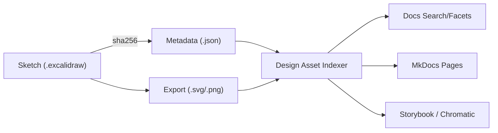

<div align="center">

# 🧾 Kansas Frontier Matrix — Excalidraw Sketch Metadata  
`docs/design/mockups/excalidraw/sketches/metadata/`

**Structured · Provenanced · Discoverable**

[](../../../../../../docs/)
[](../../../../../../docs/design/)
[](../../../../../../docs/standards/metadata-schema.yml)
[](#-accessibility--semantics)
[](../../../../../../LICENSE)

</div>

---

## 📚 Table of Contents
- [📚 Overview](#-overview)
- [🧭 Purpose](#-purpose)
- [🗂️ Directory Structure](#️-directory-structure)
- [🔤 Naming & File Rules](#-naming--file-rules)
- [🧩 Metadata Schema (Field Dictionary)](#-metadata-schema-field-dictionary)
- [📐 JSON Schema (draft-07)](#-json-schema-draft-07)
- [🧪 Validation & CI Integration](#-validation--ci-integration)
- [🧰 CLI Examples](#-cli-examples)
- [🧠 Examples](#-examples)
- [🔗 Functional Context & Data Flow](#-functional-context--data-flow)
- [🔎 Search & Faceting](#-search--faceting)
- [♿ Accessibility & Semantics](#-accessibility--semantics)
- [📈 Telemetry Events](#-telemetry-events)
- [🔐 Provenance & Integrity](#-provenance--integrity)
- [✅ PR Checklist](#-pr-checklist)
- [🧾 Compliance Summary](#-compliance-summary)
- [🗺️ Crosswalks (schema.org / CIDOC CRM)](#️-crosswalks-schemaorg--cidoc-crm)
- [🧭 Navigation](#-navigation)
- [🗓️ Change Log](#-change-log)
- [📜 License & Credits](#-license--credits)

---

## 📚 Overview

This directory holds **metadata JSON** describing each Excalidraw sketch in the KFM design system.  
The metadata layer makes sketches **findable**, **linkable**, and **verifiable** across the repository and docs site.

Each metadata file complements its twin **`.excalidraw` sketch** and **`.svg` export** in `../`.

---

## 🧭 Purpose

- Standardize **design record-keeping** for ideation/mockup artifacts  
- Enable **semantic links** between sketches and related design docs (Figma, architecture)  
- Power **search/facets** in the docs site and design registries  
- Guarantee **reproducibility** and **provenance** (MCP-DL v6.3)

> 💡 *Think of each metadata file as the sketch’s “digital passport.”*

---

## 🗂️ Directory Structure

```text
docs/design/mockups/excalidraw/sketches/metadata/
├── README.md                              # This document
├── 20251006_timeline-scrubber-concept.json
├── 20251010_ai-context-diagram.json
└── checksums.txt                          # Metadata integrity log (sha256)
```

**Mirroring rule:** `YYYYMMDD_topic-shortdesc.json` ↔ `../YYYYMMDD_topic-shortdesc.excalidraw`

---

## 🔤 Naming & File Rules

- **Slug**: `YYYYMMDD_topic-shortdesc` (lowercase, hyphenated, no spaces)
- **One-to-one**: exactly one metadata JSON per sketch
- **Size**: keep JSON ≤ **10 KB** where possible (avoid large blobs)
- **Encoding**: UTF-8, LF line endings
- **Commit message**: include `[sketch-metadata]`, brief purpose, related PR/issue

---

## 🧩 Metadata Schema (Field Dictionary)

| Field | Type | Required | Description | Example |
|---|---|:--:|---|---|
| `id` | string | ✅ | Stable slug (matches filename sans date) | `timeline-scrubber-concept` |
| `title` | string | ✅ | Human-readable title | `Timeline Scrubber Interaction Concept` |
| `author` | string | ✅ | Person/team responsible | `Kansas Frontier Matrix Design Team` |
| `created` | date (YYYY-MM-DD) | ✅ | Creation date | `2025-10-06` |
| `modified` | date |  | Last change date | `2025-10-22` |
| `tags` | string[] | ✅ | Keywords (≤10) | `["timeline","interaction","ui"]` |
| `status` | enum | ✅ | `concept` \| `approved` \| `implemented` \| `archived` | `concept` |
| `description` | string | ✅ | Concise intent (≤ 240 chars) | … |
| `related` | string[] |  | Paths to related docs/components | `["docs/design/mockups/figma/…"]` |
| `license` | string | ✅ | SPDX or human license | `CC-BY-4.0` |
| `checksum` | string | ✅ | SHA256 of paired `.excalidraw` | `sha256-23bd…` |
| `provenance.commit` | string | ✅ | Git short SHA | `d4aef23` |
| `provenance.branch` | string | ✅ | `main` or feature branch | `main` |
| `provenance.reviewed_by` | string |  | GitHub handle | `@kfm-design-lead` |
| `provenance.verified` | boolean |  | Integrity verified | `true` |

---

## 📐 JSON Schema (draft-07)

```json
{
  "$schema": "http://json-schema.org/draft-07/schema#",
  "title": "KFM Excalidraw Sketch Metadata",
  "type": "object",
  "required": ["id", "title", "author", "created", "tags", "status", "description", "license", "checksum", "provenance"],
  "additionalProperties": false,
  "properties": {
    "id": { "type": "string", "pattern": "^[a-z0-9-]+$" },
    "title": { "type": "string", "minLength": 3, "maxLength": 120 },
    "author": { "type": "string", "minLength": 3 },
    "created": { "type": "string", "pattern": "^\\d{4}-\\d{2}-\\d{2}$" },
    "modified": { "type": "string", "pattern": "^\\d{4}-\\d{2}-\\d{2}$" },
    "tags": {
      "type": "array",
      "minItems": 1,
      "maxItems": 10,
      "items": { "type": "string", "pattern": "^[a-z0-9-]+$" },
      "uniqueItems": true
    },
    "status": { "type": "string", "enum": ["concept", "approved", "implemented", "archived"] },
    "description": { "type": "string", "minLength": 10, "maxLength": 240 },
    "related": {
      "type": "array",
      "items": { "type": "string", "minLength": 3 },
      "uniqueItems": true
    },
    "license": { "type": "string", "minLength": 3 },
    "checksum": { "type": "string", "pattern": "^sha256-[A-Fa-f0-9]{3,}$" },
    "provenance": {
      "type": "object",
      "required": ["commit", "branch"],
      "properties": {
        "commit": { "type": "string", "minLength": 5 },
        "branch": { "type": "string" },
        "reviewed_by": { "type": "string" },
        "verified": { "type": "boolean" }
      },
      "additionalProperties": false
    }
  }
}
```

---

## 🧪 Validation & CI Integration

| Gate | What it checks | CI Workflow |
|---|---|---|
| **Schema Validate** | JSON matches schema (types & required fields) | `docs-validate.yml` |
| **Checksum Verify** | `checksum` equals sha256 of `.excalidraw` | `checksum-verify.yml` |
| **Naming Rule** | File naming & slug format | `pre-commit lint` |
| **Completeness** | Minimum fields present and non-empty | `design-assets-lint.yml` |

**Merge policy:** all gates must pass (hard fail).

---

## 🧰 CLI Examples

```bash
# Validate all metadata files
jq -e . docs/design/mockups/excalidraw/sketches/metadata/*.json >/dev/null

# Recompute checksums for sketches and update metadata
python tools/checksums.py --path docs/design/mockups/excalidraw/sketches --update

# Run docs validation suite
make docs-validate
```

---

## 🧠 Examples

### Minimal (valid)
```json
{
  "id": "timeline-scrubber-concept",
  "title": "Timeline Scrubber Interaction Concept",
  "author": "KFM Design Team",
  "created": "2025-10-06",
  "tags": ["timeline","interaction"],
  "status": "concept",
  "description": "Early interaction sketch for timeline scrubbing in Map/Timeline.",
  "license": "CC-BY-4.0",
  "checksum": "sha256-23bd…",
  "provenance": { "commit": "d4aef23", "branch": "main" }
}
```

### Full (recommended)
```json
{
  "id": "timeline-scrubber-concept",
  "title": "Timeline Scrubber Interaction Concept",
  "author": "Kansas Frontier Matrix Design Team",
  "created": "2025-10-06",
  "modified": "2025-10-22",
  "tags": ["timeline","interaction","ui","design"],
  "status": "approved",
  "description": "Explores scrubbing and playback interactions synchronized with map extent.",
  "related": ["docs/design/mockups/figma/components/navigation/README.md"],
  "license": "CC-BY-4.0",
  "checksum": "sha256-23bd…",
  "provenance": {
    "commit": "d4aef23",
    "branch": "main",
    "reviewed_by": "@kfm-design-lead",
    "verified": true
  }
}
```

### Deprecated (archived)
```json
{
  "id": "legacy-archive-filters",
  "title": "Old Archive Filter Layout",
  "author": "KFM Design Team",
  "created": "2025-06-10",
  "tags": ["archive","filters"],
  "status": "archived",
  "description": "Superseded by tokens v2.1 filter system.",
  "license": "CC-BY-4.0",
  "checksum": "sha256-a1b2…",
  "provenance": { "commit": "9c1ab55", "branch": "main" }
}
```

---

## 🔗 Functional Context & Data Flow



---

## 🔎 Search & Faceting

Docs site facets pull from metadata:
- **tags** (topic filters)  
- **status** (concept / approved / implemented / archived)  
- **created** (date range slider)  
- **author** (team/person)  

---

## ♿ Accessibility & Semantics

- Metadata fields `title` and `description` enhance assistive summaries in MkDocs.  
- Exports should include `alt` and `title` where embedded.  
- JSON is machine-readable for tooling used by contributors with AT.

---

## 📈 Telemetry Events

**Event: `assetView`**
```json
{
  "event": "assetView",
  "asset_type": "excalidraw",
  "asset_name": "20251006_timeline-scrubber-concept.svg",
  "referrer": "docs/design/mockups/excalidraw/sketches/metadata/README.md",
  "timestamp": "ISO8601"
}
```

**Event: `assetIndex`**
```json
{
  "event": "assetIndex",
  "count": 24,
  "valid": 24,
  "invalid": 0,
  "timestamp": "ISO8601"
}
```

---

## 🔐 Provenance & Integrity

Example `checksums.txt`:
```
20251006_timeline-scrubber-concept.json  sha256-14be8c...
20251010_ai-context-diagram.json         sha256-9ac3b9...
```

- Checksums are re-generated by CI and compared on every PR.  
- The metadata JSON `checksum` field must match the **sketch** file (.excalidraw), not the export.

---

## ✅ PR Checklist

- [ ] Filename follows `YYYYMMDD_topic-shortdesc.json`  
- [ ] `id` matches filename sans date  
- [ ] Required fields present and valid (see schema)  
- [ ] `checksum` equals sha256 of the `.excalidraw` source  
- [ ] `status` is correct for current lifecycle  
- [ ] `related` links are valid (no broken paths)  
- [ ] CI checks pass: schema, checksum, lint

---

## 🧾 Compliance Summary

| Standard | Status | Verified In | Verified By | Evidence |
|:--|:--|:--|:--|:--|
| MCP-DL v6.3 | ✅ | docs-validate.yml | CI Bot | Metadata schema OK |
| FAIR Principles | ✅ | docs-validate.yml | @kfm-data | Findable/Interoperable |
| CIDOC CRM / schema.org | ✅ | metadata mapping | @kfm-architecture | CreativeWork alignment |
| Provenance Hashing | ✅ | checksums.txt | CI | SHA256 chain verified |
| Data Integrity | ✅ | design-assets-lint.yml | CI | Naming & parity validated |

---

## 🧭 Navigation

> [← Back to Excalidraw Sketches](../README.md) · [↑ Open sketches folder](../) · [→ Excalidraw Mockups Overview](../../README.md)

---

## 🗓️ Change Log

| Date | Version | Description |
|:--|:--|:--|
| **2025-10-22** | v1.1.0 | Added schema, CLI, telemetry, crosswalks, CI gates, PR checklist |
| **2025-10-22** | v1.0.0 | Initial release — directory, field dictionary, examples |

---

## 📜 License & Credits

Metadata © 2025 **Kansas Frontier Matrix Project** — Licensed under **CC BY 4.0**.  
Maintained by **KFM Design & Interaction Team**, following **MCP-DL v6.3**.

**Document checksum:** `sha256:8a7c2f7f5a0a9c3e1f7a6a874cabd2ce6a5b6b4d2e0e9b6ab1c3a4f0ce0d2d9a`  
**PGP Signature:**  
```
-----BEGIN KFM-SIGNATURE-----
bWV0YWRhdGEtZGlyZWN0b3J5LXJlYWRtZS12MS4xLjAKQW5keSBCYXJ0YSwgMjAyNS0xMC0yMg==
-----END KFM-SIGNATURE-----
```