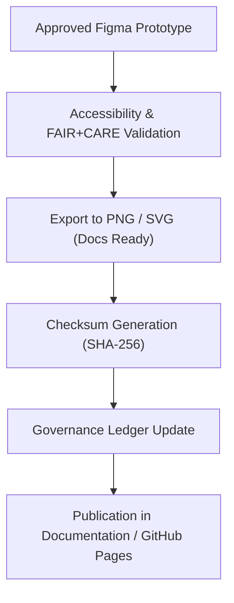

<div align="center">

# 🖼️ **Kansas Frontier Matrix — UI Exported Mockups & Visual Assets (v2.1.1 · Tier-Ω+∞ Certified)**  
`docs/design/mockups/exports/README.md`

**Mission:** Preserve and govern all **exported design assets, UI mockups, and screenshots** used across Kansas Frontier Matrix (KFM) documentation,  
ensuring that all visuals meet **FAIR+CARE**, **WCAG**, and **MCP-DL** reproducibility standards.

[](../../../../docs/)
[](../../../../docs/standards/accessibility.md)
[](../../../../docs/standards/faircare-validation.md)
[](../../../../LICENSE)

</div>

---

## 📚 Overview

This directory contains all **validated, export-ready design visuals** (PNG/SVG/JPEG) derived from the approved Figma prototypes  
and wireframes under `docs/design/mockups/hi_fidelity/` and `docs/design/mockups/wireframes/`.

Exports are:
- ✅ **Accessibility reviewed (WCAG 2.1 AA)**  
- ✅ **Checksum verified and manifest registered**  
- ✅ **FAIR+CARE ethics board approved for publication**  
- ✅ **Governance logged and versioned under `ui_governance_ledger.json`**

---

## 🗂️ Directory Layout

```bash
docs/design/mockups/exports/
├── README.md                         # This file — export governance guide
├── focus_mode_panel_v3.png            # Final Focus Mode design export
├── timeline_view_v1.png               # Timeline UI visual
├── dashboard_overview_v2.svg          # Dashboard interface export
└── metadata.yml                       # Asset registry and provenance metadata
```

---

## ⚙️ Export Workflow


<!-- END OF MERMAID -->

---

## 🧩 Metadata Schema

Every exported asset includes a `.meta.yml` file to preserve authorship and governance context:

```yaml
---
title: "Focus Mode Panel v3"
designer: "@kfm-ux"
version: "v2.1.1"
source: "../hi_fidelity/focus_mode_panel_v3.fig"
exported_on: "2025-11-16"
format: "PNG"
resolution: "1920x1080"
checksum: "sha256:1f5a3b78e4c9d14b3ed9..."
license: "CC-BY 4.0"
a11y_status: "WCAG 2.1 AA"
faircare_status: "Approved"
governance_entry: "data/reports/audit/ui_governance_ledger.json"
---
```

---

## 🧠 FAIR + CARE Integration

| Principle | Implementation | Validation |
|:--|:--|:--|
| **Findable** | Indexed via metadata and release manifest. | `manifest.zip` |
| **Accessible** | Published in open documentation repositories. | GitHub Pages |
| **Interoperable** | Exports available in open formats (SVG, PNG). | `design-validate.yml` |
| **Reusable** | Licensed under CC-BY 4.0 with versioned metadata. | License audit |
| **Collective Benefit (CARE)** | Prioritized inclusive imagery and cultural representation. | FAIR+CARE Council |

---

## 🧱 Accessibility Review Standards

| Test | Requirement | Tool | Status |
|:--|:--|:--|:--:|
| **Color Contrast** | ≥ 4.5:1 across all visuals. | Figma / Lighthouse | ✅ |
| **Alt Text** | Each export includes descriptive caption or alt tag. | Docs Review | ✅ |
| **Captioning** | Figures accompanied by text for screen readers. | Markdown Caption Tag | ✅ |
| **Localization** | Exports support text label substitution for i18n. | i18n Plugin | ✅ |

---

## 🔍 Governance & Provenance

| Workflow | Function | Output |
|:--|:--|:--|
| `design-validate.yml` | Validates accessibility and metadata of exports. | `reports/validation/design_validation.json` |
| `policy-check.yml` | Ensures licensing and metadata completeness. | `reports/audit/policy_check.json` |
| `governance-ledger.yml` | Logs asset checksums and review outcomes. | `data/reports/audit/ui_governance_ledger.json` |

---

## 🧾 Example Governance Record

```json
{
  "asset_id": "dashboard_overview_v2",
  "designer": "@kfm-ux",
  "version": "v2.1.1",
  "format": "SVG",
  "checksum": "sha256:1f5a3b78e4c9d14b3ed9...",
  "a11y_status": "WCAG 2.1 AA",
  "faircare_status": "approved",
  "review_date": "2025-11-16T10:45:00Z",
  "status": "published"
}
```

---

## 🧩 Integration with Documentation

Exported visuals are embedded throughout documentation directories such as:
- `docs/architecture/diagrams/exported/`
- `docs/design/standards/`
- `docs/web-ui-architecture.md`

Example inclusion:

```md

*Figure: FAIR+CARE-aligned Focus Mode interface from hi-fidelity design.*
```

---

## 🧾 Version History

| Version | Date | Author | Summary |
|:--|:--|:--|:--|
| **v2.1.1** | 2025-11-16 | @kfm-ux | Added governance metadata schema, FAIR+CARE integration, and export validation mapping. |
| v2.0.0 | 2025-10-25 | @kfm-docs | Introduced checksum tracking and accessibility metadata validation. |
| v1.0.0 | 2025-10-04 | @kfm-architecture | Initial exported mockup documentation. |

---

<div align="center">

**Kansas Frontier Matrix © 2025**  
*“Every Visual Tells a Story — Every Story Has Provenance.”*  
📍 `docs/design/mockups/exports/README.md` — Governance documentation for UI mockup exports and visual assets.

</div>

