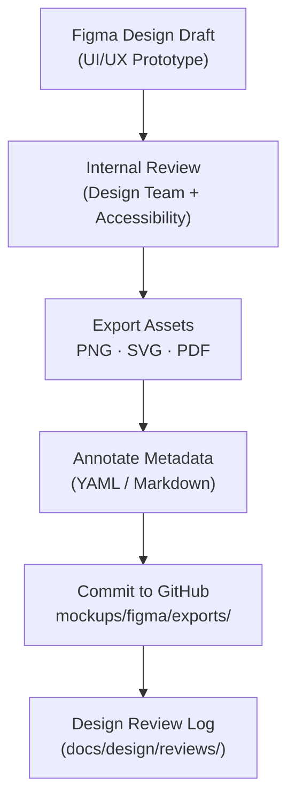

<div align="center">

# 🎨 Kansas Frontier Matrix — Figma Mockups  
`docs/design/mockups/figma/README.md`

**Mission:** Provide a structured, versioned workflow for managing and documenting  
**Figma design prototypes** for the Kansas Frontier Matrix (KFM) — ensuring that  
every frame, component, and interaction is accessible, reproducible, and reviewable.

[](../../)
[](../../)
[](../../../)
[](../../../../LICENSE)

</div>

---

## 🎯 Purpose

The `/docs/design/mockups/figma/` directory archives and documents **all visual design files and exports**  
produced in [**Figma**](https://www.figma.com/) — including interface screens, component libraries,  
interaction prototypes, and visual references for developers.

All assets here must:
- Be traceable to a specific Figma source link or export version.  
- Include metadata documenting authorship, purpose, and accessibility compliance.  
- Reference related design documents (UI Guidelines, Style Guide, Interaction Patterns).  
- Be reproducible by any contributor with repository access.  

---

## 🧭 Directory Structure

```text
docs/design/mockups/figma/
├── README.md                       # Index (this file)
├── exports/                         # PNG / SVG / PDF exports for reference
├── source-links.md                  # Shared Figma URLs (view-only)
├── accessibility-reports/           # Contrast & usability audits from Figma plugins
├── components/                      # Component library frames
├── screens/                         # Full-page layouts (timeline, map, story modes)
└── archive/                         # Previous or deprecated versions
````

---

## 🧩 Versioning Convention

Each exported Figma artifact follows the naming scheme:

```
<feature>_<version>_<author>.png
```

Example:

```
timeline_v2.0_barta.png
map-legend_v1.3_ryan.svg
assistant-drawer_v1.1_team.pdf
```

A **metadata block** must accompany each export, stored as `*.yml` or Markdown front matter.

```yaml
id: map_legend_v1.3
title: Map Legend and Layer Toggle (v1.3)
author: andy.barta
date: 2025-10-05
source: https://www.figma.com/file/ABCDE12345/kansas-frontier-matrix?node-id=456%3A789
description: >
  Revised legend layout with accessible color palette,
  hover tooltips, and synchronized layer toggles for map view.
accessibility:
  contrast: pass
  keyboard_focus: simulated
  reduced_motion: yes
related_docs:
  - ../../../ui-guidelines.md
  - ../../../style-guide.md
license: CC-BY-4.0
status: approved
```

---

## 🧠 Figma Workflow Overview



<!-- END OF MERMAID -->

**Workflow Steps**

1. 🎨 **Design:** Create or update prototype in Figma (document layers and variants).
2. 👀 **Review:** Accessibility & usability review (using Figma plugins like Able or Contrast).
3. 📦 **Export:** Save approved versions as `@1x` (for standard) and `@2x` (retina).
4. 🧾 **Annotate:** Add metadata block (YAML or `.md` file).
5. 🪶 **Commit:** Push to repo under `/exports/` or `/components/`.
6. 🗂️ **Log:** Record design review in `/docs/design/reviews/`.

---

## 🧩 Accessibility Validation

| Check                              | Tool / Plugin                                                                                | Requirement                      |
| :--------------------------------- | :------------------------------------------------------------------------------------------- | :------------------------------- |
| **Contrast Ratios**                | [Figma Contrast Checker](https://www.figma.com/community/plugin/733159460536249875/Contrast) | ≥ 4.5 : 1                        |
| **Focus States**                   | Figma’s Prototype Interaction Mode                                                           | Visible focus outlines           |
| **Keyboard Navigation Simulation** | “Able” or “Stark” plugins                                                                    | All clickable elements navigable |
| **Colorblind Simulation**          | Figma’s built-in preview                                                                     | All states discernible           |
| **Reduced Motion Audit**           | Manual playback review                                                                       | Animations avoid disorientation  |

---

## 🧮 Export Settings (Standardized)

| Type                      | Resolution | Format           | Notes                              |
| :------------------------ | :--------- | :--------------- | :--------------------------------- |
| **UI Screens**            | 1x and 2x  | `.png` or `.pdf` | For documentation and dev handoff. |
| **Icons / Components**    | 1x only    | `.svg`           | Keep vectors editable.             |
| **Diagrams / Flowcharts** | 2x         | `.png` or `.svg` | Used in documentation or slides.   |
| **Interactive Prototype** | Figma link | N/A              | Include read-only URL in metadata. |

---

## 🧭 Relationship to Development

Each Figma component maps directly to a React/TypeScript component or CSS class.
Developers should refer to the corresponding files in `/web/src/components/`.

| Figma Component   | Implementation Path                        | Notes                                  |
| :---------------- | :----------------------------------------- | :------------------------------------- |
| `timeline_slider` | `/web/src/components/timeline/Slider.tsx`  | Horizontal scroll, pinch-zoom support  |
| `map_legend`      | `/web/src/components/map/Legend.tsx`       | Dynamic layer toggles + hover tooltips |
| `ai_drawer`       | `/web/src/components/assistant/Drawer.tsx` | Chat interface + context awareness     |
| `modal_panel`     | `/web/src/components/panels/Modal.tsx`     | Focus trapping and ESC close support   |

---

## 🧾 Example: Figma Export Record

**File:** `timeline_v2.0_barta.png`
**Source:** [Figma Project Link →](https://www.figma.com/file/ABCDE12345/kansas-frontier-matrix?node-id=123%3A456)
**Description:**

> Updated timeline marker spacing for 4K displays, new hover state
> for active years, and improved label contrast.

**Linked Docs:**

* [`ui-guidelines.md`](../../ui-guidelines.md)
* [`style-guide.md`](../../style-guide.md)
* [`interaction-patterns.md`](../../interaction-patterns.md)

---

## 🧰 Accessibility Notes for Exports

* Export images must **include alt text** in associated metadata.
* Figma layer names should match accessible names (e.g., “Map Toggle Button”).
* All exported images should use **non-transparent backgrounds** for contrast testing.
* Ensure all text in prototypes passes **contrast ≥ 4.5:1** and minimum **16px base size**.

---

## 🧮 Change Management

| Step                    | Description                                          | Output                                  |
| :---------------------- | :--------------------------------------------------- | :-------------------------------------- |
| **Design Update**       | Modify component or frame in Figma.                  | `.fig` or `.png` export.                |
| **Accessibility Check** | Run plugin validations (contrast, colorblind).       | Report under `/accessibility-reports/`. |
| **Review**              | Submit for design review in `/docs/design/reviews/`. | Markdown log entry.                     |
| **Merge**               | Export new version to repo + archive old one.        | Increment version number.               |

---

## 🧭 Example Review Log Entry

`/docs/design/reviews/2025-10-06_timeline_v2.0_figma.md`

```yaml
design_id: timeline_v2.0_figma
reviewers:
  - ui_researcher
  - accessibility_expert
status: approved
notes: >
  Timeline marker spacing updated to support high-DPI displays.
  All colors verified WCAG AA contrast ratios.
timestamp: 2025-10-06T14:30:00Z
```

---

<div align="center">

### 🖌️ “Design without documentation is a sketch —

documented design becomes reproducible art.”
**— Kansas Frontier Matrix Design Team**

</div>
