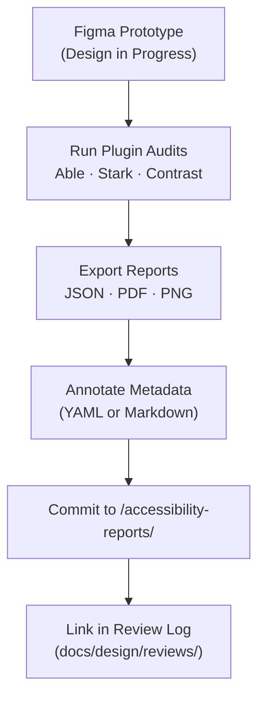

<div align="center">

# ♿ Kansas Frontier Matrix — Figma Accessibility Reports  
`docs/design/mockups/figma/accessibility-reports/README.md`

**Mission:** Centralize, document, and verify all **accessibility audit reports**  
for Figma prototypes used in the **Kansas Frontier Matrix (KFM)** — ensuring that  
every visual design meets **WCAG 2.1 AA**, **ARIA**, and **MCP** reproducibility standards.

[](../../../)
[](../../../)
[](../../../../)
[](../../../../../LICENSE)

</div>

---

## 🎯 Purpose

The `/accessibility-reports/` directory houses **exported audit files and summaries**  
from accessibility plugins used during Figma design reviews — including tools like  
**Able**, **Stark**, **Contrast**, and **Simulvision**.

These reports provide verifiable evidence that each design iteration passes  
accessibility standards prior to integration and public release.

Each report must include:
- Figma project reference (URL + version).  
- Tested criteria (contrast, focus, motion, colorblind).  
- Pass/fail metrics and remediation notes.  
- Reviewer name and validation timestamp.

---

## 🧭 Directory Structure

```text
docs/design/mockups/figma/accessibility-reports/
├── README.md                           # Index (this file)
├── timeline_v2.0_barta_contrast.json   # Plugin export (Able or Stark)
├── map_legend_v1.3_ryan_focus.pdf      # Screenshot or report
├── ai_drawer_v1.1_team_audit.md        # Annotated summary of accessibility test
└── archive/                            # Older or superseded reports
````

---

## 🧩 File Naming Convention

```
<feature>_<version>_<author>_<report-type>.<ext>
```

**Examples:**

```
timeline_v2.0_barta_contrast.json
map_legend_v1.3_ryan_focus.pdf
assistant_drawer_v1.1_team_colorblind.png
```

**Report Types:**
`contrast`, `focus`, `keyboard`, `colorblind`, `motion`, `summary`

---

## 🧾 Metadata Template

Each accessibility report must include a YAML or Markdown header for provenance.

```yaml
id: timeline_v2.0_barta_contrast
title: Timeline UI (v2.0) Contrast Audit
author: andy.barta
date: 2025-10-06
source_figma: https://www.figma.com/file/ABCDE12345/KFM-Timeline
plugin_used: Able (v2.3)
criteria:
  - 1.4.3 Contrast (Minimum)
  - 1.4.11 Non-Text Contrast
result: pass
issues_found: 0
notes: >
  All text and icons met ≥ 4.5:1 contrast ratio.
  Hover state outline color increased to #c77d02 for keyboard visibility.
reviewed_by: accessibility.team
linked_design: ../../../exports/timeline_v2.0_barta.png
review_log: ../../../reviews/2025-10-06_timeline_v2.0_figma.md
license: CC-BY-4.0
```

---

## 🧮 Accessibility Workflow



<!-- END OF MERMAID -->

### Step-by-Step

1. **Run Tests** – Use accessibility plugins inside Figma (Able, Stark, Contrast).
2. **Export Results** – Save JSON or PDF reports to `/accessibility-reports/`.
3. **Annotate** – Add YAML metadata and related links.
4. **Review** – Accessibility team validates and signs off in `/docs/design/reviews/`.
5. **Reference** – Link the report in the corresponding mockup’s metadata.

---

## ♿ Required Audit Categories

| Category                  | WCAG 2.1 Reference | Validation Tool          | Requirement                           |
| :------------------------ | :----------------- | :----------------------- | :------------------------------------ |
| **Contrast**              | 1.4.3 / 1.4.11     | Able, Stark              | ≥ 4.5 : 1 (text) / ≥ 3 : 1 (graphics) |
| **Focus & Keyboard**      | 2.4.7 / 2.1.1      | Manual simulation        | Visible focus ring + full tab reach   |
| **Colorblind Simulation** | 1.4.1              | Figma built-in filters   | Distinct in all color modes           |
| **Reduced Motion**        | 2.3.3              | Manual                   | Fade transitions only                 |
| **Text Scaling**          | 1.4.4              | Browser / Prototype test | Supports 200 % zoom without clipping  |
| **ARIA Mapping**          | 4.1.2              | Manual annotation        | Document roles for dev team           |

---

## 🧾 Example Audit Summary (Markdown)

**File:** `ai_drawer_v1.1_team_audit.md`

> **Design Component:** AI Assistant Drawer (v1.1)
> **Figma Source:** [KFM AI Drawer →](https://www.figma.com/file/XYZ67890/KFM-AI-Drawer)
> **Date:** 2025-10-05
> **Reviewer:** Accessibility Team
>
> * ✅ Contrast: All labels meet 4.6 : 1 minimum ratio.
> * ⚠️ Focus Ring: Missing on hover tooltips; fixed in v1.2.
> * ✅ Keyboard Navigation: Full reach via tab order verified.
> * ✅ Reduced Motion: Drawer animation duration ≤ 200 ms.
>
> **Status:** *Approved with minor fixes → v1.2.*
>
> **Linked Review:** [`docs/design/reviews/2025-10-05_ai_drawer_v1.1.md`](../../../reviews/2025-10-05_ai_drawer_v1.1.md)

---

## 🧠 Report Validation Checklist

| Check                               | Criteria                      | Result |
| :---------------------------------- | :---------------------------- | :----- |
| Metadata present (YAML or Markdown) | Provenance + license included | ✅      |
| Report file (JSON/PDF) attached     | Export verified readable      | ✅      |
| Contrast ratios ≥ 4.5 : 1           | WCAG 1.4.3 compliance         | ✅      |
| Keyboard navigation validated       | Focus outline visible         | ✅      |
| Plugin version recorded             | Matches audit tool used       | ✅      |
| Linked review log exists            | Traceable in `/reviews/`      | ✅      |

---

## 🧩 Review & Retention Policy

| Item                   | Policy                                           | Retention                                        |
| :--------------------- | :----------------------------------------------- | :----------------------------------------------- |
| **Active Reports**     | Current accessibility state of approved designs. | Stored permanently in `/accessibility-reports/`. |
| **Superseded Reports** | Replaced after major design iteration.           | Moved to `/archive/`.                            |
| **Failed Reports**     | Logged but excluded from public site.            | Retained for internal analysis only.             |

CI validation automatically checks that all Figma exports referenced in
`/docs/design/mockups/figma/exports/` have at least one corresponding
accessibility report in this directory.

---

## 🧩 Related Documentation

* [`../README.md`](../README.md) — Figma mockup overview
* [`../exports/README.md`](../exports/README.md) — Exported visual assets
* [`../../ui-guidelines.md`](../../ui-guidelines.md) — Accessibility & interaction design rules
* [`../../style-guide.md`](../../style-guide.md) — Color & typography tokens
* [`../../../reviews/`](../../../reviews/) — Review logs and approvals

---

<div align="center">

### ♿ “Accessibility isn’t a phase —

it’s a design principle written in every layer.”
**— Kansas Frontier Matrix Accessibility & Design Team**

</div>
