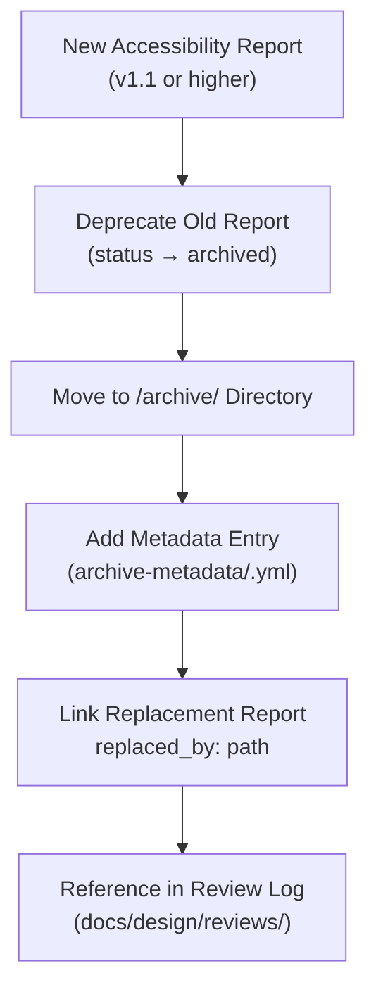

<div align="center">

# 🗃️ Kansas Frontier Matrix — Archived Accessibility Reports  
`docs/design/mockups/figma/accessibility-reports/archive/README.md`

**Mission:** Preserve and document **superseded accessibility audit reports**  
for historical reference, compliance tracking, and continuous accessibility improvement  
within the **Kansas Frontier Matrix (KFM)** design system.

[](../../../../)
[](../../../../)
[](../../../../../)
[](../../../../../../LICENSE)

</div>

---

## 🎯 Purpose

The `/archive/` directory under `accessibility-reports/` stores **previous audit versions**  
that have been replaced by newer design iterations.  

These archived reports:
- Document the **evolution of accessibility compliance** over time.  
- Preserve findings for **retrospective analysis and process improvement**.  
- Support **regulatory transparency** and MCP-based reproducibility.  

Archived reports are never deleted — they are versioned, timestamped, and linked to their replacements.

---

## 🧭 Directory Structure

```text
docs/design/mockups/figma/accessibility-reports/archive/
├── README.md                                     # Index (this file)
├── ai_drawer_v1.0_team_audit.md                  # Superseded accessibility audit
├── timeline_v1.8_barta_contrast.json             # Old contrast test results
├── map_legend_v1.1_ryan_focus.pdf                # Deprecated focus test
└── archive-metadata/                             # YAML metadata entries for each archived report
````

---

## 🧩 Metadata Template (YAML)

Each archived accessibility report must have a matching metadata entry
under `/archive-metadata/`, describing why it was deprecated and what replaced it.

```yaml
id: ai_drawer_v1.0_team_audit
title: AI Drawer Accessibility Audit (v1.0)
date_archived: 2025-10-06
archived_by: accessibility.team
status: deprecated
reason: >
  Replaced by v1.1 audit after contrast and focus fixes.
replaced_by: ../ai_drawer_v1.1_team_audit.md
figma_source: https://www.figma.com/file/XYZ67890/KFM-AI-Drawer
accessibility_issues:
  - insufficient contrast in message input placeholder (ratio 3.9:1)
  - missing focus outline on “Close” button
linked_review: ../../../../reviews/2025-09-20_ai_drawer_v1.0_figma.md
license: CC-BY-4.0
notes: >
  This report captured early accessibility testing results for the AI Drawer prototype.
  Kept for historical traceability of design compliance.
```

---

## 🧮 Archival Workflow



<!-- END OF MERMAID -->

### Steps

1. 🧾 **Replace Old Report:** Move the superseded version into `/archive/`.
2. 🧩 **Add Metadata:** Document the reason for deprecation, the replacement file, and accessibility deltas.
3. ♿ **Compare Results:** Note which WCAG criteria improved in the newer version.
4. 🧠 **Log Review:** Reference the change in `/docs/design/reviews/`.
5. 🗂️ **Preserve Permanently:** Never delete archived reports — they are part of KFM’s compliance ledger.

---

## 🧠 Accessibility Regression Tracking

Each archived report should indicate the **improvements or unresolved issues** carried forward.

| WCAG Criterion           | v1.0 Result  | v1.1 Result  | Status           |
| :----------------------- | :----------- | :----------- | :--------------- |
| 1.4.3 Contrast (Minimum) | Fail (3.9:1) | Pass (4.8:1) | ✅ Fixed          |
| 2.4.7 Focus Visible      | Fail         | Pass         | ✅ Fixed          |
| 2.1.1 Keyboard Access    | Pass         | Pass         | 🟢 Unchanged     |
| 1.4.11 Non-Text Contrast | Pass         | Pass         | 🟢 Unchanged     |
| 2.3.3 Motion Reduction   | N/A          | Pass         | 🟢 Added Support |

---

## 🧩 Archival Review Policy

| Review Type              | Frequency     | Reviewer             | Output                             |
| :----------------------- | :------------ | :------------------- | :--------------------------------- |
| **Quarterly Audit**      | 4x per year   | `accessibility.team` | Report summary of deltas           |
| **Annual Retrospective** | Once per year | `design.board`       | Accessibility improvement metrics  |
| **CI Validation**        | Continuous    | Automation Bot       | Checks metadata schema consistency |
| **License Check**        | Per commit    | Pre-commit hook      | Ensures CC-BY-4.0 attached         |

---

## ♿ Accessibility Lessons Learned

Archived reports are used to **teach accessibility best practices**.
Each report includes a brief summary of what was corrected in the subsequent version.

| Issue                  | Resolution                                              | Improvement Summary               |
| :--------------------- | :------------------------------------------------------ | :-------------------------------- |
| Low contrast text      | Adjusted text color from `#999` to `#2c2c2c`            | Ratio improved from 3.9:1 → 4.8:1 |
| Missing focus ring     | Added visible `outline: 2px solid var(--color-accent);` | Passed 2.4.7 Focus Visible        |
| Keyboard trap on modal | Fixed tab order using `focus-trap-react`                | Passes 2.1.1 Keyboard Navigation  |
| Motion sensitivity     | Introduced `prefers-reduced-motion` CSS flag            | Prevents disorientation           |

---

## 🧾 Example Archived Audit (Summary)

**File:** `ai_drawer_v1.0_team_audit.md`
**Archived:** 2025-10-06
**Replaced By:** [`../ai_drawer_v1.1_team_audit.md`](../ai_drawer_v1.1_team_audit.md)
**Key Notes:**

> Early prototype failed two WCAG checkpoints (contrast and focus).
> These issues were remediated in version 1.1 following accessibility team review.

---

## 🧩 Validation Checklist (CI)

| Check                                 | Validation Method                | Status |
| :------------------------------------ | :------------------------------- | :----- |
| Metadata YAML schema valid            | `yamllint` + CI                  | ✅      |
| Linked `replaced_by` path exists      | `python tools/validate_links.py` | ✅      |
| License and provenance fields present | `pre-commit` hook                | ✅      |
| WCAG comparison included              | CI auto-check                    | ✅      |

---

## 🗂️ Related Documentation

* [`../README.md`](../README.md) — Active accessibility reports
* [`../../exports/README.md`](../../exports/README.md) — Current design exports
* [`../../../../reviews/`](../../../../reviews/) — Full MCP review logs
* [`../../../../ui-guidelines.md`](../../../../ui-guidelines.md) — Accessibility standards
* [`../../../../style-guide.md`](../../../../style-guide.md) — Design tokens and color palette

---

<div align="center">

### 🗃️ “Each audit is a story of progress —

archived, preserved, and ready to teach the next iteration.”
**— Kansas Frontier Matrix Accessibility Team**

</div>
