<div align="center">

# 🧾 Kansas Frontier Matrix — Archived Accessibility Report Metadata  
`docs/design/mockups/figma/accessibility-reports/archive/archive-metadata/README.md`

**Mission:** Define and maintain **metadata conventions** for all archived  
Figma accessibility reports under the **Kansas Frontier Matrix (KFM)**, preserving  
audit provenance and ensuring MCP-grade reproducibility.

[](../../../../../)
[](../../../../../)
[](../../../../../../)
[](../../../../../../../LICENSE)

</div>

---

## 🎯 Purpose

This directory contains **YAML metadata files** that describe each  
archived accessibility report within `/accessibility-reports/archive/`.  

These metadata entries form a **structured historical record** of:
- The **original audit context** (Figma source, date, author, plugin used).  
- The **reason for deprecation** and link to the replacement version.  
- The **WCAG criteria** that failed or changed between versions.  
- The **review logs** and linked design exports for provenance.  

This information feeds into automated validation pipelines and MCP provenance exports.

---

## 🧭 Directory Structure

```text
docs/design/mockups/figma/accessibility-reports/archive/archive-metadata/
├── README.md                                 # Index (this file)
├── ai_drawer_v1.0_team_audit.yml             # Example metadata entry
├── timeline_v1.8_barta_contrast.yml          # Deprecated timeline audit metadata
└── map_legend_v1.1_ryan_focus.yml            # Old focus-state audit metadata
````

Each YAML file represents one archived audit and must follow the schema below.

---

## 🧩 Metadata Schema (YAML)

```yaml
id: ai_drawer_v1.0_team_audit
title: AI Assistant Drawer Accessibility Audit (v1.0)
archived_on: 2025-10-06
archived_by: accessibility.team
status: deprecated
reason: >
  Replaced by v1.1 audit after contrast and focus corrections.
replaced_by: ../ai_drawer_v1.1_team_audit.md
figma_source: https://www.figma.com/file/XYZ67890/KFM-AI-Drawer
accessibility_issues:
  - insufficient text contrast in placeholder (3.9:1)
  - missing focus ring on tooltip and close button
  - low divider contrast under dark mode
wcag_criteria:
  - 1.4.3 Contrast (Minimum)
  - 1.4.11 Non-Text Contrast
  - 2.4.7 Focus Visible
linked_review: ../../../../../reviews/2025-09-20_ai_drawer_v1.0_figma.md
linked_export: ../../../../exports/archive/ai_drawer_v1.0_team.pdf
license: CC-BY-4.0
notes: >
  This metadata entry documents the original audit context for the AI Drawer v1.0 prototype.
  It provides provenance links for the archived report and highlights key accessibility
  deficiencies addressed in v1.1.
```

---

## 🧮 Validation Workflow

```mermaid
flowchart TD
    A["New Audit Deprecated\n(vX.Y → vX.Y+1)"] --> B["Create Metadata File\n(archive-metadata/<id>.yml)"]
    B --> C["Run Schema Validation\n(CI · yamllint)"]
    C --> D["Link to Review Log\n(docs/design/reviews/)"]
    D --> E["Commit to Repo\n(accessibility-reports/archive/archive-metadata/)"]
```



<!-- END OF MERMAID -->

**Validation Checks**

* ✅ YAML syntax validated via `yamllint`.
* ✅ Fields `id`, `status`, `archived_on`, `reason`, and `license` are mandatory.
* ✅ File names must match `id` exactly (`<id>.yml`).
* ✅ CI verifies all `replaced_by` and `linked_review` paths exist.

---

## ♿ Accessibility Lessons Metadata Fields

Each metadata file should summarize accessibility insights in two sections:

```yaml
accessibility_lessons:
  fixed_in_new_version:
    - Improved text contrast from 3.9:1 → 4.8:1
    - Added focus rings to tooltips and icons
  outstanding_issues:
    - None
```

This ensures knowledge continuity for the accessibility and design teams.

---

## 🧠 Governance & Review Policy

| Action                              | Frequency                | Responsible          | Output                         |
| :---------------------------------- | :----------------------- | :------------------- | :----------------------------- |
| **Metadata Schema Audit**           | Quarterly                | `design.board`       | Report on metadata integrity   |
| **Cross-Reference Check**           | Continuous (CI)          | Automation Bot       | Broken link detection          |
| **Accessibility Regression Review** | Annual                   | `accessibility.team` | Historical improvement summary |
| **Backup & Retention**              | Continuous (Git history) | Repo Maintainers     | Immutable archive              |

---

## 🧩 Example Metadata Entry

**File:** `ai_drawer_v1.0_team_audit.yml`

```yaml
id: ai_drawer_v1.0_team_audit
title: AI Drawer Accessibility Audit v1.0 (Archived)
archived_on: 2025-10-06
archived_by: accessibility.team
status: deprecated
reason: >
  Deprecated after low contrast and missing focus states found.
  Addressed in v1.1 after accessibility re-review.
replaced_by: ../ai_drawer_v1.1_team_audit.md
wcag_criteria:
  - 1.4.3
  - 2.4.7
linked_review: ../../../../../reviews/2025-09-20_ai_drawer_v1.0_figma.md
license: CC-BY-4.0
```

---

## 🧾 Automated Validation (CI / Pre-Commit)

| Check               | Tool                             | Output                       |
| :------------------ | :------------------------------- | :--------------------------- |
| YAML Syntax         | `yamllint`                       | Pass/Fail                    |
| Schema Completeness | `jsonschema`                     | Compliance log               |
| Broken Links        | `python tools/validate_links.py` | Warnings report              |
| License Field       | `pre-commit hook`                | Must equal `CC-BY-4.0`       |
| WCAG Criteria List  | Regex validation                 | Ensures valid checkpoint IDs |

---

## 🗂️ Related Documentation

* [`../README.md`](../README.md) — Overview of archived accessibility reports
* [`../../README.md`](../../README.md) — Active accessibility audits
* [`../../../../exports/README.md`](../../../../exports/README.md) — Design exports for reference
* [`../../../../../reviews/`](../../../../../reviews/) — Design & accessibility review logs
* [`../../../../../ui-guidelines.md`](../../../../../ui-guidelines.md) — Accessibility design standards
* [`../../../../../style-guide.md`](../../../../../style-guide.md) — Visual tokens and theming

---

<div align="center">

### 🧾 “Metadata is memory —

it keeps every audit accountable and every improvement traceable.”
**— Kansas Frontier Matrix Accessibility & MCP Governance Team**

</div>
