Excellent — here’s a **complete, GitHub-rendering, MCP-compliant**
`docs/design/mockups/figma/components/README.md` file for your Kansas Frontier Matrix repository.

This document establishes the **structure, standards, and versioning rules** for all Figma component libraries used in the Kansas Frontier Matrix — ensuring that every button, panel, card, and timeline element is reusable, accessible, and traceable from Figma design through React implementation.
</div>

---

## 🎯 Purpose

The `/components/` directory holds all **modular Figma component exports and metadata** —  
the building blocks that make up the visual and functional identity of the Kansas Frontier Matrix.  

Each component represents a **verified and reusable design unit**, such as buttons, tooltips, panels, or markers.  
These components are maintained as part of the KFM **design system**, ensuring parity between design files and live React components.

---

## 🧭 Directory Structure

```text
docs/design/mockups/figma/components/
├── README.md                           # Index (this file)
├── buttons/                            # Primary and secondary button sets
├── panels/                             # Side panels, modals, drawers
├── timeline/                           # Timeline markers, slider, scale
├── map/                                # Map markers, tooltips, legend elements
├── inputs/                             # Form fields, toggles, dropdowns
├── icons/                              # Shared icon sets and variants
├── navigation/                         # Header, footer, tab controls
└── archive/                            # Deprecated or replaced components
````

Each subdirectory contains:

* Component visuals (`.png`, `.svg`, `.pdf`)
* Metadata (`.yml` or `.md`)
* Accessibility reports (if applicable)

---

## 🧩 Component Metadata Schema

Each component must include a `metadata.yml` file following this structure:

```yaml
id: button_primary_v2.1
title: Primary Button Component (v2.1)
author: design.system.team
date: 2025-10-06
source_figma: https://www.figma.com/file/ABCDE12345/KFM-Component-Library?node-id=112%3A212
description: >
  Standardized primary action button with accessible color contrast,
  focus outline, and consistent padding for all viewport sizes.
version: v2.1
category: button
status: active
accessibility:
  contrast_ratio: 5.0 : 1
  keyboard_focus: true
  reduced_motion: true
linked_docs:
  - ../../../../ui-guidelines.md
  - ../../../../style-guide.md
  - ../../../../interaction-patterns.md
license: CC-BY-4.0
```

---

## 🧮 Component Lifecycle Workflow

```mermaid
flowchart TD
    A["Design Component in Figma"] --> B["Accessibility Review\n(WCAG + Contrast)"]
    B --> C["Export + Annotate\n(PNG · SVG · Metadata)"]
    C --> D["Commit to /components/"]
    D --> E["Link to Implementation\n(web/src/components/)"]
    E --> F["Review Board Approval\n(docs/design/reviews/)"]
    F --> G["Archive Older Version"]
```



<!-- END OF MERMAID -->

**Workflow Notes**

* Each new component or update must pass **accessibility validation** before commit.
* Older versions are moved to `/components/archive/` with metadata for provenance.
* Approved components are documented in both Figma and this repository for reproducibility.

---

## ♿ Accessibility Requirements

| Criterion                 | WCAG Ref | Description                                   | Validation Tool    |
| :------------------------ | :------- | :-------------------------------------------- | :----------------- |
| **Color Contrast**        | 1.4.3    | ≥ 4.5:1 ratio for text and icons.             | Able / Stark       |
| **Focus Visibility**      | 2.4.7    | Clear focus rings on all actionable elements. | Manual / Plugin    |
| **Keyboard Reachability** | 2.1.1    | Fully navigable via `Tab` and `Shift+Tab`.    | Manual test        |
| **Motion Safety**         | 2.3.3    | Respect `prefers-reduced-motion`.             | Browser simulation |
| **ARIA Labels**           | 4.1.2    | Documented ARIA roles for developers.         | Manual annotation  |

---

## 🧱 Component Categories

| Category              | Description                                     | Example ID             | Related Docs              |
| :-------------------- | :---------------------------------------------- | :--------------------- | :------------------------ |
| **Buttons**           | Primary, secondary, outline, icon-only buttons. | `button_primary_v2.1`  | `style-guide.md`          |
| **Panels**            | Sidebars, drawers, modals with focus trapping.  | `panel_drawer_v1.3`    | `interaction-patterns.md` |
| **Timeline Elements** | Event markers, date ticks, zoom handles.        | `timeline_marker_v1.5` | `ui-guidelines.md`        |
| **Map UI**            | Markers, legends, layer toggles.                | `map_marker_v1.2`      | `style-guide.md`          |
| **Inputs**            | Text fields, selects, checkboxes, sliders.      | `input_text_v2.0`      | `ui-guidelines.md`        |
| **Navigation**        | Headers, footers, breadcrumb bars.              | `nav_header_v1.4`      | `storytelling.md`         |
| **Icons**             | Standardized iconography system.                | `icon_close_v1.0`      | `style-guide.md`          |

---

## 🧾 Example Component Documentation

### 🟧 Primary Button (v2.1)

**File:** `buttons/button_primary_v2.1.png`
**Figma Source:** [KFM Component Library →](https://www.figma.com/file/ABCDE12345/KFM-Component-Library?node-id=112%3A212)
**Description:**

> The default action button for UI interactions. Includes hover, focus, and disabled states.
> Accessible in both light and dark themes.

**Accessibility Notes:**

* Text contrast 5.0 : 1
* Focus outline visible with `outline-offset: 3px;`
* Border radius consistent at `8px`
* Hover transition ≤ 150 ms

**Linked Docs:**

* [`../../../../ui-guidelines.md`](../../../../ui-guidelines.md)
* [`../../../../style-guide.md`](../../../../style-guide.md)

---

## 🧠 Mapping to Frontend Components

| Figma Component ID     | React Component      | Location                                     | Notes                                   |
| :--------------------- | :------------------- | :------------------------------------------- | :-------------------------------------- |
| `button_primary_v2.1`  | `<ButtonPrimary />`  | `/web/src/components/ButtonPrimary.tsx`      | Follows KFM theme tokens.               |
| `panel_drawer_v1.3`    | `<DrawerPanel />`    | `/web/src/components/panels/DrawerPanel.tsx` | Includes ESC and focus trap.            |
| `timeline_marker_v1.5` | `<TimelineMarker />` | `/web/src/components/timeline/Marker.tsx`    | Syncs with D3 timeline data.            |
| `map_marker_v1.2`      | `<MapMarker />`      | `/web/src/components/map/Marker.tsx`         | Integrated with MapLibre layer toggles. |

Each mapping is verified during **design-to-dev sync** sessions and logged in `/docs/design/reviews/`.

---

## 🧩 Versioning & Archival

| Status           | Description                          | Action                           |
| :--------------- | :----------------------------------- | :------------------------------- |
| **Active**       | Current version in use.              | Stored in `/components/`.        |
| **Deprecated**   | Replaced by newer version.           | Moved to `/components/archive/`. |
| **Experimental** | In testing phase; subject to change. | Clearly marked in metadata.      |

All component updates must trigger a **review log entry** with details about accessibility and design deltas.

---

## 🧾 Example Review Log Reference

**File:** `docs/design/reviews/2025-10-06_button_primary_v2.1.md`

```yaml
design_id: button_primary_v2.1
reviewers:
  - ui_researcher
  - frontend_dev
status: approved
notes: >
  Verified 5:1 contrast ratio; focus outlines consistent.
  Exported to Figma component library and synced with React component.
timestamp: 2025-10-06T21:00:00Z
```

---

## 🧰 Tools & Validation

| Tool                      | Purpose                                              | Output                          |
| :------------------------ | :--------------------------------------------------- | :------------------------------ |
| **Figma**                 | Component design & prototyping.                      | `.fig`, `.png`, `.svg` exports. |
| **Able / Stark Plugins**  | Accessibility and contrast testing.                  | JSON or screenshot reports.     |
| **yamllint / jsonschema** | Validate metadata structure.                         | CI validation log.              |
| **Playwright**            | Automated interaction test for React implementation. | Accessibility coverage report.  |
| **Pre-commit hooks**      | Enforce consistent metadata and naming.              | Pass/fail before commit.        |

---

## 🧩 Related Files

* [`../README.md`](../README.md) — Main Figma mockups index
* [`../../../../ui-guidelines.md`](../../../../ui-guidelines.md) — Accessibility and structure rules
* [`../../../../style-guide.md`](../../../../style-guide.md) — Color, typography, and spacing tokens
* [`../../../../interaction-patterns.md`](../../../../interaction-patterns.md) — Interactive behaviors
* [`../../../../reviews/`](../../../../reviews/) — Design review logs and MCP governance

---

<div align="center">

### 🧩 “Components are the DNA of design —

document them well, and the system lives forever.”
**— Kansas Frontier Matrix Design System Team**

</div>
