<div align="center">

# 🔘 Kansas Frontier Matrix — Button Components  
`docs/design/mockups/figma/components/buttons/README.md`

**Mission:** Document and maintain all **button styles, states, and accessibility behaviors**  
for the **Kansas Frontier Matrix (KFM)** — ensuring design-system consistency between  
Figma mockups and React implementation.

[](../../../)
[](../../../)
[](../../../../)
[](../../../../../LICENSE)

</div>

---

## 🎯 Purpose

The `/buttons/` directory contains the **visual definitions, exports, and metadata**  
for all button components designed in Figma and implemented in the Frontier Matrix web UI.

Each button variant represents a **modular, reusable, and accessible** interface element,  
adhering to the project’s **Master Coder Protocol (MCP)** and **WCAG 2.1 AA** standards.

---

## 🧭 Directory Structure

```text
docs/design/mockups/figma/components/buttons/
├── README.md                         # Index (this file)
├── button_primary_v2.1.png            # Primary button export
├── button_secondary_v2.0.png          # Secondary button export
├── button_outline_v1.3.png            # Outline button export
├── button_icon_v1.2.svg               # Icon-only button (no text)
├── metadata/                          # YAML metadata for each button
└── archive/                           # Deprecated or older button versions
````

---

## 🧩 Button Variants

| Type                 | Description                                         | Accessibility Notes                       | Example ID              |
| :------------------- | :-------------------------------------------------- | :---------------------------------------- | :---------------------- |
| **Primary Button**   | Default call-to-action, high-contrast accent color. | Must meet ≥ 4.5:1 text contrast ratio.    | `button_primary_v2.1`   |
| **Secondary Button** | Low-contrast action or cancel state.                | Focus ring visible and distinguishable.   | `button_secondary_v2.0` |
| **Outline Button**   | Transparent background with accent border.          | Maintain ≥ 3:1 border contrast.           | `button_outline_v1.3`   |
| **Icon Button**      | Compact button with icon only.                      | Requires `aria-label` for screen readers. | `button_icon_v1.2`      |

---

## 🧾 Metadata Template

Each button component must have a `metadata.yml` file under `/metadata/`:

```yaml
id: button_primary_v2.1
title: Primary Button (v2.1)
author: design.system.team
date: 2025-10-06
category: button
status: active
version: v2.1
source_figma: https://www.figma.com/file/ABCDE12345/KFM-Component-Library?node-id=112%3A212
description: >
  The main call-to-action button used throughout Kansas Frontier Matrix.
  Features an accent background, white text, and accessible hover/focus states.
accessibility:
  contrast_ratio: 5.1 : 1
  keyboard_focus: true
  reduced_motion: true
  aria_label_required: false
linked_docs:
  - ../../../../../ui-guidelines.md
  - ../../../../../style-guide.md
license: CC-BY-4.0
```

---

## 🧠 Component Lifecycle Workflow

```mermaid
flowchart TD
    A["Design Button in Figma\n(Primary · Secondary · Outline · Icon)"] --> B["Accessibility Validation\nContrast · Focus · Motion"]
    B --> C["Export Assets\nPNG · SVG · PDF"]
    C --> D["Annotate Metadata\n(YAML / Markdown)"]
    D --> E["Commit to /components/buttons/"]
    E --> F["Implement in React\n(web/src/components/Button.tsx)"]
    F --> G["Design Review Log\n(docs/design/reviews/)"]
```



<!-- END OF MERMAID -->

---

## ♿ Accessibility Standards

| Check                              | WCAG Ref | Target                          | Validation Tool        | Status |
| :--------------------------------- | :------- | :------------------------------ | :--------------------- | :----- |
| **Contrast Ratio (Text)**          | 1.4.3    | ≥ 4.5 : 1                       | Able / Stark           | ✅      |
| **Focus Visibility**               | 2.4.7    | Clear 2px outline, 3:1 contrast | Manual / Plugin        | ✅      |
| **Keyboard Activation**            | 2.1.1    | Enter + Space triggers          | Manual test            | ✅      |
| **Reduced Motion**                 | 2.3.3    | Hover/focus ≤ 150 ms            | Figma Prototype Review | ✅      |
| **ARIA Compliance (Icon Buttons)** | 4.1.2    | `aria-label` required           | Manual                 | ✅      |

---

## 🎨 Design Tokens (from `/docs/design/style-guide.md`)

| Token                | Value              | Applies To                  |
| :------------------- | :----------------- | :-------------------------- |
| `--color-accent`     | `#c77d02`          | Primary button background   |
| `--color-accent-alt` | `#a96a00`          | Hover state                 |
| `--color-text-light` | `#ffffff`          | Text on primary button      |
| `--color-bg`         | `#f9f9f9`          | Secondary button background |
| `--radius`           | `8px`              | Button corner radius        |
| `--transition`       | `0.3s ease-in-out` | Hover and focus transitions |

---

## 🧮 Interaction States

| State                | Visual Change                               | Accessibility Requirement    |
| :------------------- | :------------------------------------------ | :--------------------------- |
| **Default**          | Accent background + white text              | Must meet contrast ratio     |
| **Hover**            | Slightly darker tone (`--color-accent-alt`) | Maintain ≥ 3:1 contrast      |
| **Focus**            | Outline ring (2px solid accent)             | Visible under all conditions |
| **Active / Pressed** | Background darkens 10 %                     | No motion blur               |
| **Disabled**         | 50 % opacity + cursor not-allowed           | Still readable (≥ 3:1)       |

---

## 🧩 Example: Primary Button Design Spec

**File:** `button_primary_v2.1.png`
**Source Figma:** [Component Library →](https://www.figma.com/file/ABCDE12345/KFM-Component-Library?node-id=112%3A212)
**Description:**

> Used for primary actions (Submit, Save, Continue).
> Features rounded corners, subtle shadow, and accessible hover transition.

**Accessibility Summary:**

* Text contrast = **5.1 : 1**
* Focus outline visible in all themes
* Supports keyboard triggers (`Enter` / `Space`)
* Honors `prefers-reduced-motion`

**Implementation Reference:**

* React Component: `/web/src/components/ButtonPrimary.tsx`
* Token Reference: `/web/src/styles/tokens.css`

---

## 🧱 Implementation Mapping (Design → Code)

| Figma ID                | React Component       | Path                                      | Description              |
| :---------------------- | :-------------------- | :---------------------------------------- | :----------------------- |
| `button_primary_v2.1`   | `<ButtonPrimary />`   | `/web/src/components/ButtonPrimary.tsx`   | Accent-colored button.   |
| `button_secondary_v2.0` | `<ButtonSecondary />` | `/web/src/components/ButtonSecondary.tsx` | Low emphasis action.     |
| `button_outline_v1.3`   | `<ButtonOutline />`   | `/web/src/components/ButtonOutline.tsx`   | Transparent with border. |
| `button_icon_v1.2`      | `<IconButton />`      | `/web/src/components/IconButton.tsx`      | Icon-only control.       |

---

## 🧾 Example Review Log Entry

**File:** `/docs/design/reviews/2025-10-06_button_primary_v2.1.md`

```yaml
design_id: button_primary_v2.1
reviewers:
  - accessibility.team
  - frontend_dev
status: approved
notes: >
  Verified text contrast 5:1 and keyboard accessibility.
  Added hover and focus consistency across themes.
timestamp: 2025-10-06T20:45:00Z
```

---

## 🧩 Archival Policy

| Status           | Action                          | Location            |
| :--------------- | :------------------------------ | :------------------ |
| **Active**       | Current version used across UI. | `/buttons/`         |
| **Deprecated**   | Replaced by a newer version.    | `/buttons/archive/` |
| **Experimental** | Prototype under review.         | Mark in metadata.   |

Archived buttons retain metadata and audit logs for reproducibility.

---

## 🧩 Testing & Validation

| Test                    | Method            | Expected Result           |
| :---------------------- | :---------------- | :------------------------ |
| **Contrast Audit**      | Figma Able plugin | ≥ 4.5 : 1                 |
| **Keyboard Navigation** | Playwright        | Tab sequence correct      |
| **Hover/Focus States**  | Manual            | Color transition verified |
| **ARIA Roles**          | Screen Reader     | Announced name + role     |
| **Reduced Motion**      | Browser Pref.     | Animations disabled       |

---

## 🧩 Related Files

* [`../README.md`](../README.md) — Figma components index
* [`../../../../ui-guidelines.md`](../../../../ui-guidelines.md) — Accessibility & navigation logic
* [`../../../../style-guide.md`](../../../../style-guide.md) — Design tokens & visual identity
* [`../../../../interaction-patterns.md`](../../../../interaction-patterns.md) — Button & map interactions
* [`../../../../reviews/`](../../../../reviews/) — MCP design review records

---

<div align="center">

### 🔘 “Buttons are the heartbeat of interaction —

each click should feel human, purposeful, and accessible.”
**— Kansas Frontier Matrix Design System Team**

</div>
