<div align="center">

# 🗃️ Kansas Frontier Matrix — Archived Button Components  
`docs/design/mockups/figma/components/buttons/archive/README.md`

**Mission:** Preserve and document **previous versions of button components**  
from the **Kansas Frontier Matrix (KFM)** design system — capturing accessibility audits,  
design rationale, and visual history under the **Master Coder Protocol (MCP)**.

[](../../../)
[](../../../)
[](../../../../)
[](../../../../../LICENSE)

</div>

---

## 🎯 Purpose

The `/archive/` directory contains **deprecated button component files** — including  
Figma exports, metadata, and accessibility reports that have been replaced by newer versions.  

These archives are **never deleted**. They serve as the **historical record** of:
- Design and accessibility evolution.  
- Provenance of interface improvements.  
- Audit trails for MCP compliance and WCAG verification.  

Each archived version must include:
- A **metadata YAML** file documenting version, reason for replacement, and links.  
- An optional **export file** (PNG, SVG, or PDF).  
- Cross-references to its replacement and review logs.  

---

## 🧭 Directory Structure

```text
docs/design/mockups/figma/components/buttons/archive/
├── README.md                                # Index (this file)
├── button_primary_v2.0.png                   # Deprecated export
├── button_secondary_v1.8.png                 # Superseded version
├── button_icon_v1.0.svg                      # First icon-only variant
├── metadata/                                 # Metadata YAML entries for archived versions
└── accessibility-reports/                    # Audit records tied to each version
````

---

## 🧩 Archival Schema

Each archived button component must follow the YAML schema stored in
`/metadata/archive/` and include these required fields:

```yaml
id: button_primary_v2.0
title: Primary Button (v2.0)
archived_on: 2025-10-06
archived_by: design.board
status: deprecated
reason: >
  Superseded by v2.1 after accessibility improvements
  (focus ring visibility and contrast ratio updates).
replaced_by: ../metadata/button_primary_v2.1.yml
source_figma: https://www.figma.com/file/ABCDE12345/KFM-Component-Library?node-id=98%3A150
linked_review: ../../../../../reviews/2025-09-20_button_primary_v2.0.md
linked_export: button_primary_v2.0.png
accessibility_issues:
  - Missing visible focus outline.
  - Contrast ratio 4.2 : 1 (below WCAG threshold).
license: CC-BY-4.0
notes: >
  Retained for archival and comparison. Corrected in v2.1
  following accessibility and design review board meeting.
```

---

## 🧮 Archival Workflow

```mermaid
flowchart TD
    A["New Button Version (vX.Y+1)"] --> B["Deprecate Old Version\n(status → deprecated)"]
    B --> C["Move Export + Metadata to /archive/"]
    C --> D["Add YAML Metadata\n(archived_on, reason, replaced_by)"]
    D --> E["Link to Review Log + Accessibility Report"]
    E --> F["Validate Schema via CI\n(yamllint · jsonschema)"]
```



<!-- END OF MERMAID -->

### Workflow Summary

1. 🧾 Create new button version (e.g., `v2.1`).
2. 📦 Move previous version assets into `/archive/`.
3. 🧩 Add metadata YAML with all provenance fields.
4. ♿ Link related accessibility reports and review notes.
5. 🧠 Confirm validation via automated CI checks.

---

## ♿ Accessibility Regression Tracking

| WCAG Checkpoint           | Deprecated Version | Replacement Version | Status       |
| :------------------------ | :----------------- | :------------------ | :----------- |
| 1.4.3 Contrast (Minimum)  | 4.2 : 1 (Fail)     | 5.1 : 1 (Pass)      | ✅ Fixed      |
| 2.4.7 Focus Visible       | Missing            | Present             | ✅ Fixed      |
| 2.1.1 Keyboard Navigation | Pass               | Pass                | 🟢 Unchanged |
| 2.3.3 Reduced Motion      | N/A                | Supported           | 🟢 Added     |

Each table entry must be updated in the archived metadata to track design evolution.

---

## 🧠 Archival Example — Primary Button (v2.0)

**File:** `button_primary_v2.0.png`
**Replaced By:** `button_primary_v2.1.png`
**Archived:** 2025-10-06
**Reason:**

> Early version failed WCAG 2.1 contrast testing. Fixed hover and active states in v2.1.

**Accessibility Findings:**

* Text contrast: 4.2 : 1 (Fail).
* Hover transition colors: too low contrast for light theme.
* Focus outline not visible; fixed in newer version.

**Metadata File:** `metadata/button_primary_v2.0.yml`
**Linked Review:** `reviews/2025-09-20_button_primary_v2.0.md`

---

## 🧾 Validation & CI Checks

| Check                  | Tool                | Description                            |
| :--------------------- | :------------------ | :------------------------------------- |
| **YAML Schema Valid**  | `yamllint`          | Pass/Fail                              |
| **Broken Links**       | `validate_links.py` | Confirms references resolve            |
| **License Field**      | Pre-commit hook     | Must equal `CC-BY-4.0`                 |
| **WCAG Notes Present** | Regex audit         | Ensures accessibility context recorded |
| **Replacement Exists** | CI cross-check      | Verifies `replaced_by` file present    |

---

## 🧩 Retention & Governance Policy

| Action                         | Frequency  | Responsible          | Outcome                 |
| :----------------------------- | :--------- | :------------------- | :---------------------- |
| Archive Integrity Check        | Quarterly  | `design.board`       | Archive summary report  |
| Metadata Validation            | Continuous | CI Bot               | Automated compliance    |
| Accessibility Audit Comparison | Annual     | `accessibility.team` | WCAG improvement report |
| Permanent Retention            | Always     | Maintainers          | Immutable MCP record    |

---

## 🧩 Related Documentation

* [`../README.md`](../README.md) — Active button component documentation
* [`../metadata/README.md`](../metadata/README.md) — Button metadata schema
* [`../../README.md`](../../README.md) — Component library overview
* [`../../../../../ui-guidelines.md`](../../../../../ui-guidelines.md) — Accessibility + UX standards
* [`../../../../../style-guide.md`](../../../../../style-guide.md) — Color tokens & typography
* [`../../../../../reviews/`](../../../../../reviews/) — Design & accessibility review logs

---

<div align="center">

### 🗃️ “Every deprecated button is a data point —

archived with care, it maps our progress toward perfect accessibility.”
**— Kansas Frontier Matrix Design System Team**

</div>
