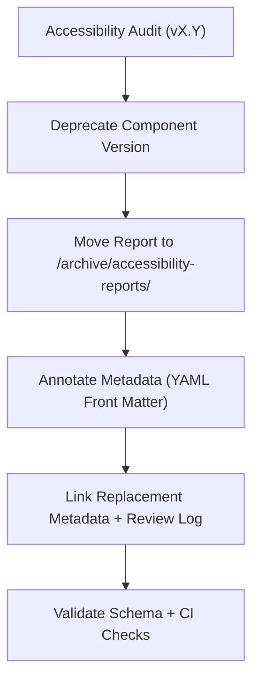

<div align="center">

# ♿ Kansas Frontier Matrix — Archived Button Accessibility Reports  
`docs/design/mockups/figma/components/buttons/archive/accessibility-reports/README.md`

**Mission:** Maintain an organized archive of **accessibility audit reports**  
for deprecated button components within the **Kansas Frontier Matrix (KFM)** design system,  
preserving all WCAG compliance data, provenance, and remediation history  
as required by the **Master Coder Protocol (MCP)**.

[](../../../../../../)
[](../../../../../../)
[](../../../../../../../)
[](../../../../../../../../LICENSE)

</div>

---

## 🎯 Purpose

The `/archive/accessibility-reports/` directory stores **accessibility audits**  
and **validation summaries** for button designs that have since been replaced  
or updated in newer versions of the Frontier Matrix design system.  

Each report captures:
- WCAG 2.1 test results at time of deprecation.  
- Contrast, focus, and keyboard navigation metrics.  
- Corrective actions and outcomes in the replacement version.  
- Provenance: links to review logs, metadata, and Figma exports.

These archived reports form the **accessibility heritage ledger** for KFM,  
ensuring all design improvements are traceable and auditable.

---

## 🧭 Directory Structure

```text
docs/design/mockups/figma/components/buttons/archive/accessibility-reports/
├── README.md                                   # Index (this file)
├── button_primary_v2.0_team_audit.md           # Archived accessibility report
├── button_secondary_v1.8_team_audit.md         # Previous accessibility test
├── button_icon_v1.0_team_audit.md              # Icon button accessibility review
└── archive-metadata/                           # YAML metadata for each archived report
````

---

## 🧩 File Naming Convention

```
<component>_<version>_<author>_audit.md
```

**Examples:**

```
button_primary_v2.0_team_audit.md
button_secondary_v1.8_team_audit.md
button_icon_v1.0_team_audit.md
```

---

## 🧾 Audit Metadata Template (YAML Front Matter)

Each audit file begins with standardized YAML metadata:

```yaml
id: button_primary_v2.0_team_audit
title: Primary Button (v2.0) — Archived Accessibility Audit
author: accessibility.team
date: 2025-09-20
source_figma: https://www.figma.com/file/ABCDE12345/KFM-Component-Library?node-id=98%3A150
plugin_used:
  - Able v2.3
  - Stark v4.1
criteria:
  - 1.4.3 Contrast (Minimum)
  - 2.4.7 Focus Visible
  - 2.1.1 Keyboard Navigation
result: fail
issues_found: 3
status: archived
archived_on: 2025-10-06
archived_by: design.board
replaced_by: ../../../metadata/button_primary_v2.1.yml
review_log: ../../../../../../../reviews/2025-09-20_button_primary_v2.0.md
linked_export: ../../../exports/archive/button_primary_v2.0.png
license: CC-BY-4.0
```

---

## 🧠 Audit Structure

### Example: `button_primary_v2.0_team_audit.md`

```markdown
# ♿ Archived Accessibility Audit — Primary Button (v2.0)

**Date:** September 20, 2025  
**Reviewed by:** Accessibility Team  
**Status:** Deprecated — replaced by v2.1  

---

## Summary
Version 2.0 failed WCAG 2.1 AA contrast and focus visibility standards.
Corrections were implemented in v2.1 following accessibility board review.

---

## Results

| WCAG Ref | Check | Result | Notes |
|:--|:--|:--|:--|
| 1.4.3 | Contrast (Text) | ❌ Fail | Text on accent background only 4.2 : 1 |
| 2.4.7 | Focus Visible | ❌ Fail | No visible focus ring on hover/active |
| 2.1.1 | Keyboard Navigation | ✅ Pass | Fully tab-navigable |

---

## Accessibility Notes
- **Contrast:** Insufficient ratio for white-on-orange button.  
- **Focus:** Missing outline ring; corrected in v2.1.  
- **Motion:** All hover transitions under 150 ms, compliant.  
- **Keyboard Navigation:** Maintained across versions.  

---

## Regression Tracking

| Category | v2.0 | v2.1 | Status |
|:--|:--|:--|:--|
| Text Contrast | 4.2 : 1 | 5.1 : 1 | ✅ Fixed |
| Focus Outline | None | Added accent ring | ✅ Fixed |
| Keyboard Access | Pass | Pass | 🟢 Unchanged |
| Reduced Motion | Partial | Full | 🟢 Improved |

---

## Linked Files
- **Replacement Metadata:** [`../../../metadata/button_primary_v2.1.yml`](../../../metadata/button_primary_v2.1.yml)
- **Design Export:** [`../../../exports/archive/button_primary_v2.0.png`](../../../exports/archive/button_primary_v2.0.png)
- **Review Log:** [`../../../../../../../reviews/2025-09-20_button_primary_v2.0.md`](../../../../../../../reviews/2025-09-20_button_primary_v2.0.md)

---

## Reviewer Sign-Off
| Role | Name | Date | Signature |
|:--|:--|:--|:--|
| Accessibility Lead | M. Jordan | 2025-09-20 | ✅ |
| UI Engineer | L. Daniels | 2025-09-20 | ✅ |
| Design Reviewer | A. Barta | 2025-09-20 | ✅ |

---

> **License:** CC-BY-4.0  
> **Status:** Archived for provenance and comparison with v2.1 accessibility improvements.
```

---

## 🧮 Archival Workflow



<!-- END OF MERMAID -->

---

## ♿ Accessibility Improvement Log

| Component             | Issue                | WCAG Ref | Fixed In | Status |
| :-------------------- | :------------------- | :------- | :------- | :----- |
| Primary Button v2.0   | Low contrast text    | 1.4.3    | v2.1     | ✅      |
| Primary Button v2.0   | Missing focus ring   | 2.4.7    | v2.1     | ✅      |
| Secondary Button v1.8 | Border contrast fail | 1.4.11   | v2.0     | ✅      |
| Icon Button v1.0      | Missing aria-label   | 4.1.2    | v1.1     | ✅      |

---

## 🧾 Validation & CI Rules

| Check                    | Tool                     | Description                        |
| :----------------------- | :----------------------- | :--------------------------------- |
| **YAML Schema Validity** | `yamllint`, `jsonschema` | Ensures structured compliance.     |
| **Broken Links**         | `validate_links.py`      | Checks cross-references.           |
| **WCAG Pattern**         | Regex (`^\d\.\d+\.\d+$`) | Validates WCAG IDs.                |
| **License Field**        | Pre-commit hook          | Must equal `CC-BY-4.0`.            |
| **Replacement Exists**   | CI                       | Confirms `replaced_by` path valid. |

---

## 🧠 Governance & Retention Policy

| Action                   | Frequency       | Responsible          | Output             |
| :----------------------- | :-------------- | :------------------- | :----------------- |
| Archive Validation       | Continuous (CI) | Automation Bot       | Validation log     |
| Accessibility Comparison | Quarterly       | `accessibility.team` | Regression summary |
| Schema Audit             | Quarterly       | `design.board`       | YAML report        |
| Permanent Retention      | Always          | Maintainers          | Immutable archive  |

---

## 🧩 Related Files

* [`../README.md`](../README.md) — Button archive overview
* [`../../metadata/README.md`](../../metadata/README.md) — Metadata schema
* [`../../../../../ui-guidelines.md`](../../../../../ui-guidelines.md) — Accessibility rules
* [`../../../../../style-guide.md`](../../../../../style-guide.md) — Color token reference
* [`../../../../../reviews/`](../../../../../reviews/) — Design review logs

---

<div align="center">

### ♿ “Each archived audit tells a story —

of progress, empathy, and the craft of inclusive design.”
**— Kansas Frontier Matrix Accessibility & Design Board**

</div>
