<div align="center">

# 🧾 Kansas Frontier Matrix — Archived Button Accessibility Report Metadata  
`docs/design/mockups/figma/components/buttons/archive/accessibility-reports/archive-metadata/README.md`

**Mission:** Define the **metadata structure and retention policy**  
for archived button accessibility audit reports within the  
**Kansas Frontier Matrix (KFM)** design system — ensuring  
long-term provenance, WCAG traceability, and compliance  
with the **Master Coder Protocol (MCP)**.

[](../../../../../../../)
[](../../../../../../../)
[](../../../../../../../../)
[](../../../../../../../../../LICENSE)

</div>

---

## 🎯 Purpose

This directory houses **YAML metadata descriptors** for archived accessibility audits  
of button components. Each metadata file records the **audit context**,  
**WCAG outcomes**, **linked design files**, and **remediation lineage**,  
providing an immutable record of accessibility evolution in the Frontier Matrix.

These descriptors:
- Maintain traceability between Figma, audits, and reviews.  
- Capture **WCAG 2.1 checkpoints** and outcomes over time.  
- Provide **machine-readable audit provenance** for CI validation and public transparency.  

---

## 🧭 Directory Structure

```text
docs/design/mockups/figma/components/buttons/archive/accessibility-reports/archive-metadata/
├── README.md                                   # Index (this file)
├── button_primary_v2.0_audit.yml               # Metadata for v2.0 archived audit
├── button_secondary_v1.8_audit.yml             # Metadata for v1.8 archived audit
└── button_icon_v1.0_audit.yml                  # Metadata for v1.0 archived audit
````

---

## 🧩 Metadata Schema

Each metadata file must follow this YAML structure:

```yaml
id: button_primary_v2.0_audit
title: Primary Button Accessibility Audit (v2.0)
archived_on: 2025-10-06
archived_by: design.board
status: deprecated
replaced_by: ../button_primary_v2.1_audit.yml
source_figma: https://www.figma.com/file/ABCDE12345/KFM-Component-Library?node-id=98%3A150
review_log: ../../../../../../../reviews/2025-09-20_button_primary_v2.0.md
linked_audit: ../button_primary_v2.0_team_audit.md
linked_export: ../../../../../exports/archive/button_primary_v2.0.png
wcag_criteria:
  - 1.4.3 Contrast (Minimum)
  - 2.4.7 Focus Visible
  - 2.1.1 Keyboard Accessibility
  - 2.3.3 Animation from Interactions
issues_summary:
  - Low text contrast (4.2 : 1) failed minimum 4.5 : 1 threshold.
  - Focus ring missing in light theme (no visible outline).
  - Hover transition lacked reduced-motion compliance.
resolution_summary: >
  All failures addressed in v2.1 through color token updates and visible focus outlines.
license: CC-BY-4.0
notes: >
  Metadata retained for regression comparison between v2.0 and v2.1.
  Serves as audit provenance within MCP archival workflow.
```

---

## 🧮 Archival Metadata Workflow

```mermaid
flowchart TD
    A["Accessibility Audit Completed (vX.Y)"] --> B["Deprecate Version\n(status → archived)"]
    B --> C["Create YAML Metadata Descriptor\n(in /archive-metadata/)"]
    C --> D["Annotate WCAG Criteria + Issues Summary"]
    D --> E["Link to Replacement Audit + Review Log"]
    E --> F["Validate Schema via CI (yamllint · jsonschema)"]
```



<!-- END OF MERMAID -->

---

## ♿ Accessibility Regression Reference

| WCAG Ref                          | Deprecated Version | Replacement Version | Status       |
| :-------------------------------- | :----------------- | :------------------ | :----------- |
| 1.4.3 Contrast (Minimum)          | Fail (4.2 : 1)     | Pass (5.1 : 1)      | ✅ Fixed      |
| 2.4.7 Focus Visible               | Fail               | Pass                | ✅ Fixed      |
| 2.1.1 Keyboard Navigation         | Pass               | Pass                | 🟢 Unchanged |
| 2.3.3 Animation from Interactions | Partial            | Full                | 🟢 Improved  |

---

## 🧩 Example Metadata File

**File:** `button_secondary_v1.8_audit.yml`

```yaml
id: button_secondary_v1.8_audit
title: Secondary Button Accessibility Audit (v1.8)
archived_on: 2025-10-06
archived_by: design.board
status: archived
replaced_by: ../button_secondary_v2.0_audit.yml
source_figma: https://www.figma.com/file/HIJKL67890/KFM-Component-Library?node-id=210%3A450
review_log: ../../../../../../../reviews/2025-09-25_button_secondary_v1.8.md
linked_audit: ../button_secondary_v1.8_team_audit.md
linked_export: ../../../../../exports/archive/button_secondary_v1.8.png
wcag_criteria:
  - 1.4.11 Non-Text Contrast
  - 2.4.7 Focus Visible
issues_summary:
  - Border contrast (2.8 : 1) below 3:1 threshold.
  - Focus ring color lacked sufficient visibility in dark theme.
resolution_summary: >
  Updated border color and focus ring in v2.0 to meet 1.4.11 and 2.4.7 compliance.
license: CC-BY-4.0
notes: >
  This metadata documents the archived accessibility report for v1.8.
  Retained for longitudinal accessibility trend analysis.
```

---

## 🧾 Validation & CI Rules

| Validation                  | Tool                      | Purpose                                 |
| :-------------------------- | :------------------------ | :-------------------------------------- |
| **Schema Syntax**           | `yamllint` + `jsonschema` | Ensures YAML structural integrity.      |
| **Cross-Link Integrity**    | `validate_links.py`       | Verifies all linked paths exist.        |
| **WCAG Criteria Format**    | Regex (`^\d\.\d+\.\d+$`)  | Validates WCAG reference IDs.           |
| **License Field**           | Pre-commit hook           | Must be `CC-BY-4.0`.                    |
| **Replacement File Exists** | CI pipeline               | Confirms valid `replaced_by` reference. |

---

## 🧠 Governance & Retention

| Task                     | Frequency       | Responsible          | Output                   |
| :----------------------- | :-------------- | :------------------- | :----------------------- |
| Metadata Audit           | Quarterly       | `design.board`       | YAML integrity report    |
| Accessibility Comparison | Annual          | `accessibility.team` | WCAG progress report     |
| Cross-Link Validation    | Continuous (CI) | Automation Bot       | Pass/Fail log            |
| Retention Policy         | Permanent       | Maintainers          | Immutable design archive |

---

## 🧩 Related Documentation

* [`../README.md`](../README.md) — Archived audit reports overview
* [`../../README.md`](../../README.md) — Button archive structure
* [`../../../metadata/README.md`](../../../metadata/README.md) — Active button metadata schema
* [`../../../../../../ui-guidelines.md`](../../../../../../ui-guidelines.md) — Accessibility & usability rules
* [`../../../../../../style-guide.md`](../../../../../../style-guide.md) — Design token specifications
* [`../../../../../../reviews/`](../../../../../../reviews/) — MCP review logs and validation records

---

<div align="center">

### ♿ “Accessibility memory builds accountability —

each archived audit is a data point in the pursuit of inclusion.”
**— Kansas Frontier Matrix Accessibility & Design Council**

</div>
