<div align="center">

# 🧾 Kansas Frontier Matrix — Archived Button Metadata  
`docs/design/mockups/figma/components/buttons/archive/metadata/README.md`

**Mission:** Define and manage **metadata standards** for archived button component versions  
in the **Kansas Frontier Matrix (KFM)** design system, ensuring that each deprecated  
version remains reproducible, accessible, and traceable through **Master Coder Protocol (MCP)** documentation.

[](../../../../../../)
[](../../../../../../)
[](../../../../../../../)
[](../../../../../../../../LICENSE)

</div>

---

## 🎯 Purpose

This directory contains **YAML metadata files** describing archived button components.  
Each metadata entry captures **version lineage**, **deprecation context**, and **accessibility outcomes**,  
serving as the **historical record** of button evolution within the Frontier Matrix.

The metadata is critical for:
- MCP **provenance tracking** between design, accessibility, and implementation.  
- **WCAG regression analysis** across versions.  
- Transparent documentation of **design rationale** and **accessibility improvements**.  

---

## 🧭 Directory Structure

```text
docs/design/mockups/figma/components/buttons/archive/metadata/
├── README.md                              # Index (this file)
├── button_primary_v2.0.yml                 # Metadata for deprecated v2.0
├── button_secondary_v1.8.yml               # Metadata for replaced v1.8
├── button_icon_v1.0.yml                    # Metadata for early icon-only version
└── archive-metadata/                       # Context descriptors for archived YAML entries
````

---

## 🧩 Metadata Schema

Each archived YAML metadata file follows this schema:

```yaml
id: button_primary_v2.0
title: Primary Button (v2.0)
version: v2.0
status: deprecated
archived_on: 2025-10-06
archived_by: design.board
replaced_by: ../../metadata/button_primary_v2.1.yml
reason: >
  Replaced due to insufficient text contrast and missing focus outlines.
source_figma: https://www.figma.com/file/ABCDE12345/KFM-Component-Library?node-id=98%3A150
linked_review: ../../../../../../../reviews/2025-09-20_button_primary_v2.0.md
linked_export: ../../exports/archive/button_primary_v2.0.png
accessibility_issues:
  - Focus ring missing in light mode.
  - Hover state below 3.0 : 1 contrast threshold.
wcag_criteria:
  - 1.4.3 Contrast (Minimum)
  - 2.4.7 Focus Visible
license: CC-BY-4.0
notes: >
  This metadata describes the deprecated v2.0 button prior to accessibility fixes in v2.1.
  Used as reference for accessibility regression tracking.
```

---

## 🧮 Metadata Workflow

```mermaid
flowchart TD
    A["Deprecate Old Button\n(status → deprecated)"] --> B["Create YAML Metadata\n(in /archive/metadata/)"]
    B --> C["Annotate Accessibility Issues\n(WCAG References)"]
    C --> D["Link Replacement File\n(replaced_by)"]
    D --> E["Reference Review Log\n(docs/design/reviews/)"]
    E --> F["Validate Schema via CI\n(yamllint · jsonschema)"]
```



<!-- END OF MERMAID -->

### Step Summary

1. **Move deprecated version** to `/archive/metadata/`.
2. **Annotate** with reason, replaced file, and accessibility issues.
3. **Cross-link** to Figma source, exports, and reviews.
4. **Validate** metadata through automated CI.

---

## ♿ Accessibility Regression Tracking

Each archived metadata file must contain measurable accessibility changes between versions.

| WCAG Criterion                    | v2.0 Result    | v2.1 Result                  | Status       |
| :-------------------------------- | :------------- | :--------------------------- | :----------- |
| 1.4.3 Contrast (Minimum)          | 4.2 : 1 (Fail) | 5.1 : 1 (Pass)               | ✅ Fixed      |
| 2.4.7 Focus Visible               | Missing        | Added                        | ✅ Fixed      |
| 2.1.1 Keyboard Navigation         | Pass           | Pass                         | 🟢 Unchanged |
| 2.3.3 Animation from Interactions | N/A            | Added reduced-motion support | 🟢 Improved  |

---

## 🧩 Example Metadata File

**File:** `button_secondary_v1.8.yml`

```yaml
id: button_secondary_v1.8
title: Secondary Button (v1.8)
version: v1.8
status: deprecated
archived_on: 2025-10-06
archived_by: design.board
replaced_by: ../../metadata/button_secondary_v2.0.yml
reason: >
  Superseded by v2.0 after accessibility review revealed insufficient border contrast
  and poor visibility in dark theme mode.
source_figma: https://www.figma.com/file/HIJKL67890/KFM-Component-Library?node-id=210%3A450
linked_review: ../../../../../../../reviews/2025-09-25_button_secondary_v1.8.md
linked_export: ../../exports/archive/button_secondary_v1.8.png
accessibility_issues:
  - Border contrast 2.8 : 1 (below minimum).
  - Keyboard focus outline inconsistent across themes.
wcag_criteria:
  - 1.4.3
  - 1.4.11
license: CC-BY-4.0
notes: >
  Retained for educational reference and provenance validation. Corrected in v2.0 redesign.
```

---

## 🧾 Validation Requirements

| Validation Type        | Tool / Method       | Description                                       |
| :--------------------- | :------------------ | :------------------------------------------------ |
| **YAML Syntax**        | `yamllint`          | Ensures schema integrity.                         |
| **Field Completeness** | `jsonschema`        | Confirms required keys exist.                     |
| **Cross-Links**        | `validate_links.py` | Verifies `replaced_by` and `linked_review` paths. |
| **License Field**      | Pre-commit hook     | Must be `CC-BY-4.0`.                              |
| **WCAG References**    | Regex check         | Validates `x.x.x` format for all listed criteria. |

---

## 🧠 Archival Policy

| Type             | Definition                                             | Action                             |
| :--------------- | :----------------------------------------------------- | :--------------------------------- |
| **Deprecated**   | Superseded but relevant for historical context.        | Keep YAML in `/archive/metadata/`. |
| **Obsolete**     | Functionally removed, replaced by new design paradigm. | Mark with `status: obsolete`.      |
| **Experimental** | Not approved for release; used for testing.            | Archive after closure.             |

All archived files are **immutable** — changes require a new version record.

---

## 🧩 Governance & Audit Policy

| Action                          | Frequency  | Responsible          | Output                      |
| :------------------------------ | :--------- | :------------------- | :-------------------------- |
| Metadata Audit                  | Quarterly  | `design.board`       | Integrity report            |
| Accessibility Regression Review | Annually   | `accessibility.team` | Compliance summary          |
| Schema Validation               | Continuous | CI Automation        | CI logs                     |
| Retention                       | Permanent  | Maintainers          | Immutable provenance record |

---

## 🧩 Related Documentation

* [`../README.md`](../README.md) — Archive index
* [`../../metadata/README.md`](../../metadata/README.md) — Active button metadata schema
* [`../../../../README.md`](../../../../README.md) — Component index
* [`../../../../../../ui-guidelines.md`](../../../../../../ui-guidelines.md) — Accessibility rules
* [`../../../../../../style-guide.md`](../../../../../../style-guide.md) — Color & typography standards
* [`../../../../../../reviews/`](../../../../../../reviews/) — MCP design review logs

---

<div align="center">

### 🗃️ “Even deprecated buttons have stories —

archived metadata keeps their lessons alive.”
**— Kansas Frontier Matrix Design System Team**

</div>
