<div align="center">

# 🧾 Kansas Frontier Matrix — Deep Archive: Button Metadata Descriptors  
`docs/design/mockups/figma/components/buttons/archive/metadata/archive-metadata/README.md`

**Mission:** Maintain **long-term metadata descriptors** for deprecated button components  
within the **Kansas Frontier Matrix (KFM)** design system, ensuring full provenance,  
accessibility traceability, and compliance with the **Master Coder Protocol (MCP)**.

[](../../../../../../../)
[](../../../../../../../)
[](../../../../../../../../)
[](../../../../../../../../../LICENSE)

</div>

---

## 🎯 Purpose

The `/archive-metadata/` directory acts as the **final provenance layer** for button components —  
recording the context and lineage of designs that have passed through multiple archival cycles.  

Each YAML file describes:
- The **design history** of a deprecated component.  
- **Accessibility outcomes** from original and replacement versions.  
- **WCAG criteria** tested and results at time of deprecation.  
- **Provenance links** to Figma, exports, and design review logs.  

This ensures **traceable design archaeology** for the Frontier Matrix —  
preserving accessibility progress as part of the project’s scientific record.

---

## 🧭 Directory Structure

```text
docs/design/mockups/figma/components/buttons/archive/metadata/archive-metadata/
├── README.md                                   # Index (this file)
├── button_primary_v1.5.yml                     # Early archived version record
├── button_primary_v2.0.yml                     # Deprecated pre-v2.1 record
└── button_secondary_v1.7.yml                   # Early secondary button metadata
````

---

## 🧩 YAML Descriptor Schema

Each archived metadata descriptor follows this structure:

```yaml
id: button_primary_v2.0
title: Primary Button (v2.0)
archived_on: 2025-10-06
archived_by: design.board
status: deprecated
replaced_by: ../../../../metadata/button_primary_v2.1.yml
figma_source: https://www.figma.com/file/ABCDE12345/KFM-Component-Library?node-id=98%3A150
reason: >
  Superseded by v2.1 after accessibility improvements and visual refinements.
  Updated focus ring and contrast ratio corrected to meet WCAG 2.1 AA.
accessibility_issues:
  - Missing visible focus ring in hover state.
  - Low contrast for white text on accent background.
wcag_criteria:
  - 1.4.3 Contrast (Minimum)
  - 2.4.7 Focus Visible
linked_review: ../../../../../../../../reviews/2025-09-20_button_primary_v2.0.md
linked_export: ../../../../../exports/archive/button_primary_v2.0.png
license: CC-BY-4.0
notes: >
  This metadata file acts as the definitive descriptor for the deprecated
  Primary Button v2.0 design. It connects historical audits with the
  improved v2.1 component to support accessibility regression analysis.
```

---

## 🧮 Descriptor Workflow

```mermaid
flowchart TD
    A["Deprecate Component Metadata (vX.Y)"] --> B["Create Deep Archive Descriptor\n(in /archive-metadata/)"]
    B --> C["Annotate Accessibility Issues + WCAG IDs"]
    C --> D["Cross-Link Replacement (replaced_by)"]
    D --> E["Validate YAML Schema\n(yamllint · jsonschema)"]
    E --> F["Reference in Review Log\n(docs/design/reviews/)"]
```



<!-- END OF MERMAID -->

**Step Summary**

1. Move metadata for deprecated component into `/archive/metadata/archive-metadata/`.
2. Add provenance data (`archived_on`, `archived_by`, `reason`).
3. Include links to replacement component, Figma source, and review file.
4. Validate schema via CI; commit once all links and licenses pass.

---

## ♿ Accessibility Regression Summary

| WCAG Criterion            | Deprecated Result | Replacement Result | Status      |
| :------------------------ | :---------------- | :----------------- | :---------- |
| 1.4.3 Contrast (Minimum)  | 4.2 : 1           | 5.1 : 1            | ✅ Fixed     |
| 2.4.7 Focus Visible       | Absent            | Added outline      | ✅ Fixed     |
| 2.1.1 Keyboard Navigation | Partial           | Complete           | 🟢 Improved |
| 1.4.11 Non-Text Contrast  | Pass              | Pass               | 🟢 Stable   |

---

## 🧠 Descriptor Example — Secondary Button (v1.7)

```yaml
id: button_secondary_v1.7
title: Secondary Button (v1.7)
archived_on: 2025-09-15
archived_by: design.system.team
status: deprecated
replaced_by: ../../../../metadata/button_secondary_v1.8.yml
figma_source: https://www.figma.com/file/QWERT67890/KFM-Component-Library?node-id=210%3A410
reason: >
  Replaced due to border contrast issues under dark theme and missing ARIA
  descriptions for icon-only variant. Corrected in v1.8 with tokenized colors.
accessibility_issues:
  - Border color failed 3:1 non-text contrast requirement.
  - Tooltip lacked `aria-describedby` attribute.
wcag_criteria:
  - 1.4.3
  - 1.4.11
linked_review: ../../../../../../../../reviews/2025-09-15_button_secondary_v1.7.md
linked_export: ../../../../../exports/archive/button_secondary_v1.7.png
license: CC-BY-4.0
notes: >
  Archived for audit completeness and color token comparison between v1.7 and v1.8.
```

---

## 🧩 Validation & CI Rules

| Validation             | Tool                      | Expected Result             |
| :--------------------- | :------------------------ | :-------------------------- |
| **YAML Schema**        | `yamllint` / `jsonschema` | Valid structure             |
| **Link Consistency**   | `validate_links.py`       | No broken paths             |
| **License Compliance** | Pre-commit hook           | CC-BY-4.0 required          |
| **WCAG Format**        | Regex (`^\d\.\d+\.\d+$`)  | Valid pattern               |
| **Replacement Exists** | CI                        | `replaced_by` path verified |

All CI jobs automatically check the descriptor’s structure and its references to ensure archival integrity.

---

## 🧭 Governance & Retention

| Task                            | Frequency       | Responsible          | Output                   |
| :------------------------------ | :-------------- | :------------------- | :----------------------- |
| Metadata Integrity Audit        | Quarterly       | `design.board`       | YAML compliance report   |
| Cross-Link Validation           | Continuous (CI) | Automation Bot       | Validation log           |
| Accessibility Regression Report | Annual          | `accessibility.team` | WCAG improvement summary |
| Permanent Retention             | Continuous      | Repo Maintainers     | Immutable archive record |

---

## 🧩 Related Documentation

* [`../README.md`](../README.md) — Archive metadata overview
* [`../../README.md`](../../README.md) — Button archive index
* [`../../../../../metadata/README.md`](../../../../../metadata/README.md) — Active button metadata schema
* [`../../../../../../../../ui-guidelines.md`](../../../../../../../../ui-guidelines.md) — Accessibility standards
* [`../../../../../../../../style-guide.md`](../../../../../../../../style-guide.md) — Color tokens & typography
* [`../../../../../../../../reviews/`](../../../../../../../../reviews/) — Design review and MCP records

---

<div align="center">

### 🧾 “Design history is only useful when it’s documented —

archived metadata turns evolution into evidence.”
**— Kansas Frontier Matrix Design Governance Team**

</div>

