<div align="center">

# 🧾 Kansas Frontier Matrix — Button Component Metadata  
`docs/design/mockups/figma/components/buttons/metadata/README.md`

**Mission:** Establish and maintain the **metadata schema** for all  
button components within the **Kansas Frontier Matrix (KFM)** design system —  
providing clear provenance, accessibility metrics, and MCP documentation consistency.

[](../../../../)
[](../../../../)
[](../../../../../)
[](../../../../../../LICENSE)

</div>

---

## 🎯 Purpose

This directory stores all **YAML metadata files** describing button component versions.  
Metadata entries form a **bridge between Figma designs, accessibility audits, and React implementation**, ensuring traceability and reproducibility across disciplines.

Every file captures:
- Component details (ID, version, type, Figma source).  
- Accessibility metrics (contrast, focus, keyboard reach).  
- Implementation links (React path, token references).  
- Review and provenance information per the **Master Coder Protocol (MCP)**.

---

## 🧭 Directory Structure

```text
docs/design/mockups/figma/components/buttons/metadata/
├── README.md                          # Index (this file)
├── button_primary_v2.1.yml            # Active version metadata
├── button_secondary_v2.0.yml          # Current secondary button metadata
├── button_outline_v1.3.yml            # Outline button metadata
├── button_icon_v1.2.yml               # Icon-only button metadata
└── archive/                           # Deprecated versions
````

---

## 🧩 YAML Metadata Schema

Each metadata file must adhere to the following schema:

```yaml
id: button_primary_v2.1
title: Primary Button Component (v2.1)
author: design.system.team
date: 2025-10-06
version: v2.1
category: button
status: active
source_figma: https://www.figma.com/file/ABCDE12345/KFM-Component-Library?node-id=112%3A212
description: >
  Primary call-to-action button for Kansas Frontier Matrix.
  Includes light/dark theme support, hover/focus animations, and ARIA compliance.
accessibility:
  contrast_ratio: 5.1 : 1
  keyboard_focus: true
  reduced_motion: true
  aria_label_required: false
  wcag_criteria:
    - 1.4.3 Contrast (Minimum)
    - 2.4.7 Focus Visible
    - 2.1.1 Keyboard Navigation
linked_docs:
  - ../../../../../ui-guidelines.md
  - ../../../../../style-guide.md
  - ../../../../../interaction-patterns.md
react_mapping: /web/src/components/ButtonPrimary.tsx
review_log: ../../../../../reviews/2025-10-06_button_primary_v2.1.md
license: CC-BY-4.0
```

---

## 🧮 Metadata Lifecycle Workflow

```mermaid
flowchart TD
    A["Design Button in Figma"] --> B["Export + Annotate Metadata (YAML)"]
    B --> C["Accessibility Validation\n(WCAG · Plugins)"]
    C --> D["Commit Metadata → /metadata/"]
    D --> E["Map to React Component\n(web/src/components/Button.tsx)"]
    E --> F["Design Review & MCP Log\n(docs/design/reviews/)"]
    F --> G["Archive Superseded Versions"]
```



<!-- END OF MERMAID -->

---

## ♿ Accessibility Metadata Requirements

| Field                 | Description                                      | Example          |
| :-------------------- | :----------------------------------------------- | :--------------- |
| `contrast_ratio`      | Measured text-to-background ratio.               | `5.1 : 1`        |
| `keyboard_focus`      | Boolean; true if visible focus outline provided. | `true`           |
| `reduced_motion`      | Boolean; respects user’s OS motion settings.     | `true`           |
| `aria_label_required` | True for icon buttons; false for text buttons.   | `true`           |
| `wcag_criteria`       | List of applied WCAG checkpoints.                | `1.4.3`, `2.4.7` |

All button variants must maintain **minimum 4.5 : 1** text contrast and a visible **focus ring**.

---

## 🧾 Validation Rules

| Check                   | Tool            | Description                                   |
| :---------------------- | :-------------- | :-------------------------------------------- |
| **YAML Syntax**         | `yamllint`      | Ensures valid indentation & schema structure. |
| **Field Completeness**  | `jsonschema`    | Confirms all mandatory fields exist.          |
| **Linked Docs**         | Custom CI       | Validates referenced files are present.       |
| **License Compliance**  | Pre-commit hook | Checks license equals `CC-BY-4.0`.            |
| **Version Consistency** | CI job          | Verifies version strings match Figma exports. |

---

## 🧠 Archival Policy

| Status           | Action                         | Location                             |
| :--------------- | :----------------------------- | :----------------------------------- |
| **Active**       | Current version; used in code. | `/metadata/`                         |
| **Deprecated**   | Replaced by newer version.     | `/metadata/archive/`                 |
| **Experimental** | Prototype; in testing.         | Tagged `experimental: true` in YAML. |

When archiving a button version, include `replaced_by` and `reason` fields:

```yaml
status: deprecated
replaced_by: ../button_primary_v2.1.yml
reason: >
  Replaced with improved accessibility focus ring and refined padding.
```

---

## 🧩 Example Metadata Entry

**File:** `button_outline_v1.3.yml`

```yaml
id: button_outline_v1.3
title: Outline Button (v1.3)
author: ui.researcher
date: 2025-10-05
version: v1.3
category: button
status: active
source_figma: https://www.figma.com/file/ABCDE67890/KFM-Component-Library?node-id=445%3A671
description: >
  Outline variant with transparent background and accent border for secondary actions.
accessibility:
  contrast_ratio: 4.8 : 1
  keyboard_focus: true
  reduced_motion: true
  aria_label_required: false
linked_docs:
  - ../../../../../style-guide.md
  - ../../../../../ui-guidelines.md
react_mapping: /web/src/components/ButtonOutline.tsx
license: CC-BY-4.0
```

---

## 🧾 CI Validation Checklist

| Validation     | Tool                             | Output    |
| :------------- | :------------------------------- | :-------- |
| Schema Syntax  | `yamllint`                       | Pass/Fail |
| Version Format | Regex (`^v\d+\.\d+$`)            | Verified  |
| License Field  | Pre-commit                       | Pass      |
| WCAG List      | Regex check (`^\d\.\d+\.\d+`)    | Pass      |
| Links Exist    | `python tools/validate_links.py` | Pass      |

---

## 🧩 Related Documentation

* [`../README.md`](../README.md) — Button component index
* [`../../README.md`](../../README.md) — Component library overview
* [`../../../../../ui-guidelines.md`](../../../../../ui-guidelines.md) — Accessibility standards
* [`../../../../../style-guide.md`](../../../../../style-guide.md) — Visual tokens & colors
* [`../../../../../interaction-patterns.md`](../../../../../interaction-patterns.md) — Interactive design logic
* [`../../../../../reviews/`](../../../../../reviews/) — MCP review logs

---

<div align="center">

### 🧾 “Metadata is the heartbeat of the design system —

without it, components lose their memory.”
**— Kansas Frontier Matrix Design System Team**

</div>
