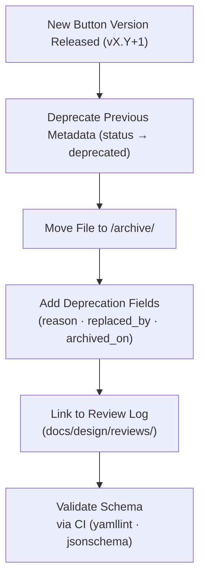

<div align="center">

# 🗃️ Kansas Frontier Matrix — Archived Button Metadata  
`docs/design/mockups/figma/components/buttons/metadata/archive/README.md`

**Mission:** Preserve the **historical metadata of deprecated button components**  
from the **Kansas Frontier Matrix (KFM)** design system — ensuring that  
every design iteration remains reproducible, auditable, and traceable under  
the **Master Coder Protocol (MCP)**.

[](../../../../../)
[](../../../../../)
[](../../../../../../)
[](../../../../../../../LICENSE)

</div>

---

## 🎯 Purpose

The `/archive/` directory under `metadata/` stores **deprecated button metadata entries** that  
have been replaced by newer component versions.  

Archived metadata:
- Documents **what changed** and **why a version was replaced**.  
- Preserves **accessibility compliance history** and **review lineage**.  
- Enables full **provenance tracking** across Figma, documentation, and codebases.  

No file in this directory should be deleted — archived metadata serves as an **immutable record of design evolution**.

---

## 🧭 Directory Structure

```text
docs/design/mockups/figma/components/buttons/metadata/archive/
├── README.md                               # Index (this file)
├── button_primary_v2.0.yml                  # Deprecated (replaced by v2.1)
├── button_secondary_v1.8.yml                # Replaced version
├── button_icon_v1.0.yml                     # Superseded icon-only button
└── metadata/                        # YAML descriptors of archival context
````

---

## 🧩 Metadata Schema for Archived Versions

Each archived YAML file follows the same schema as active metadata
with additional fields for deprecation details.

```yaml
id: button_primary_v2.0
title: Primary Button (v2.0)
author: design.system.team
date: 2025-09-20
version: v2.0
status: deprecated
archived_on: 2025-10-06
archived_by: design.board
replaced_by: ../button_primary_v2.1.yml
reason: >
  Deprecated following accessibility improvements to focus outlines and 
  text contrast (WCAG 2.1 AA compliance verified in v2.1).
source_figma: https://www.figma.com/file/ABCDE12345/KFM-Component-Library?node-id=98%3A150
accessibility:
  contrast_ratio: 4.2 : 1
  keyboard_focus: false
  reduced_motion: true
linked_review: ../../../../../../../reviews/2025-09-20_button_primary_v2.0.md
license: CC-BY-4.0
notes: >
  Version 2.0 failed to meet minimum contrast for text-on-accent in dark mode.
  Improvements logged and implemented in 2.1.
```

---

## 🧮 Archival Workflow



<!-- END OF MERMAID -->

### Steps

1. **Move Old Metadata:** When a button is replaced, move its YAML file here.
2. **Annotate Fields:** Add `replaced_by`, `reason`, and `archived_on`.
3. **Cross-Link:** Connect to replacement version and review logs.
4. **Validate:** CI ensures structural integrity and link correctness.

---

## ♿ Accessibility Regression Tracking

Each archived entry should highlight accessibility improvements made in the next version.

| WCAG Criterion            | v2.0 Result    | v2.1 Result    | Status       |
| :------------------------ | :------------- | :------------- | :----------- |
| 1.4.3 Contrast (Minimum)  | Fail (4.2 : 1) | Pass (5.1 : 1) | ✅ Fixed      |
| 2.4.7 Focus Visible       | Fail           | Pass           | ✅ Fixed      |
| 2.1.1 Keyboard Navigation | Pass           | Pass           | 🟢 Unchanged |
| 1.4.11 Non-Text Contrast  | Pass           | Pass           | 🟢 Unchanged |

---

## 🧠 Archival Metadata Example

**File:** `button_primary_v2.0.yml`

```yaml
id: button_primary_v2.0
title: Primary Button (v2.0)
version: v2.0
status: deprecated
archived_on: 2025-10-06
archived_by: design.board
replaced_by: ../button_primary_v2.1.yml
reason: >
  Superseded by v2.1 after accessibility revalidation.
  Updated focus ring styling and improved hover color contrast.
source_figma: https://www.figma.com/file/ABCDE12345/KFM-Component-Library?node-id=98%3A150
linked_review: ../../../../../../../reviews/2025-09-20_button_primary_v2.0.md
license: CC-BY-4.0
accessibility_issues:
  - Focus ring not visible on hover.
  - Hover state color contrast 3.7 : 1.
  - No reduced-motion fallback.
```

---

## 🧾 Validation & CI Checks

| Validation           | Tool                       | Output                 |
| :------------------- | :------------------------- | :--------------------- |
| Schema Completeness  | `yamllint` + `jsonschema`  | ✅                      |
| Link Consistency     | Custom `validate_links.py` | ✅                      |
| WCAG Comparison      | `compare_accessibility.py` | Δ Report               |
| License Field        | Pre-commit hook            | Must equal `CC-BY-4.0` |
| Replaced File Exists | CI Script                  | Confirmed              |

---

## 🧭 Governance & Retention Policy

| Action                     | Frequency       | Owner                | Output                    |
| :------------------------- | :-------------- | :------------------- | :------------------------ |
| Archive Audit              | Quarterly       | `design.board`       | Archive summary report    |
| Metadata Validation        | Continuous (CI) | Automation Bot       | YAML compliance logs      |
| Accessibility Trend Review | Annual          | `accessibility.team` | Improvement overview      |
| Permanent Retention        | Always          | Repo Maintainers     | Immutable version history |

---

## 🧩 Archive-Metadata Entries

All archived button versions must include a secondary YAML descriptor file
in `/archive-metadata/` for validation and reporting consistency.

| Metadata File               | Description                                             |
| :-------------------------- | :------------------------------------------------------ |
| `button_primary_v2.0.yml`   | Documents deprecation and accessibility notes for v2.0. |
| `button_secondary_v1.8.yml` | Records early focus outline tests and WCAG fixes.       |
| `button_icon_v1.0.yml`      | Details first icon-only version’s ARIA label testing.   |

---

## 🧩 Related Files

* [`../README.md`](../README.md) — Active metadata documentation
* [`../../README.md`](../../README.md) — Component overview
* [`../../../../../ui-guidelines.md`](../../../../../ui-guidelines.md) — Accessibility standards
* [`../../../../../style-guide.md`](../../../../../style-guide.md) — Visual token system
* [`../../../../../interaction-patterns.md`](../../../../../interaction-patterns.md) — Interaction behavior logic
* [`../../../../../reviews/`](../../../../../reviews/) — MCP review logs

---

<div align="center">

### 🗃️ “Each deprecated design carries a lesson —

archiving it keeps progress transparent and science reproducible.”
**— Kansas Frontier Matrix Design System Team**

</div>
