<div align="center">

# 🧾 Kansas Frontier Matrix — Archived Button Metadata Descriptors  
`docs/design/mockups/figma/components/buttons/metadata/archive/archive-metadata/README.md`

**Mission:** Document and manage the **YAML metadata descriptors** for archived  
button component versions within the **Kansas Frontier Matrix (KFM)** design system —  
ensuring provenance, reproducibility, and accessibility traceability in compliance with  
the **Master Coder Protocol (MCP)**.

[](../../../../../../)
[](../../../../../../)
[](../../../../../../../)
[](../../../../../../../../LICENSE)

</div>

---

## 🎯 Purpose

The `/archive-metadata/` directory contains **YAML descriptor files** that document  
the archival context for deprecated or replaced button components.  

Each file captures:
- When and why the button was deprecated.  
- Which new version replaced it.  
- Accessibility issues discovered and resolved.  
- Links to design review logs, Figma sources, and React implementations.  

These descriptors serve as the **historical DNA of the KFM design system**,  
preserving transparency, accountability, and reproducibility.

---

## 🧭 Directory Structure

```text
docs/design/mockups/figma/components/buttons/metadata/archive/archive-metadata/
├── README.md                               # Index (this file)
├── button_primary_v2.0.yml                 # Metadata for deprecated v2.0
├── button_secondary_v1.8.yml               # Metadata for deprecated v1.8
└── button_icon_v1.0.yml                    # Metadata for superseded icon-only version
````

---

## 🧩 Metadata Schema

Each YAML file must conform to this schema:

```yaml
id: button_primary_v2.0
title: Primary Button (v2.0)
archived_on: 2025-10-06
archived_by: design.board
status: deprecated
replaced_by: ../button_primary_v2.1.yml
reason: >
  Superseded by v2.1 for improved WCAG 2.1 AA focus contrast and spacing adjustments.
figma_source: https://www.figma.com/file/ABCDE12345/KFM-Component-Library?node-id=98%3A150
accessibility_issues:
  - Focus ring not visible in dark theme.
  - Hover color contrast below 3.0 : 1 threshold.
wcag_criteria:
  - 1.4.3 Contrast (Minimum)
  - 2.4.7 Focus Visible
linked_review: ../../../../../../../../reviews/2025-09-20_button_primary_v2.0.md
linked_export: ../../../../../exports/archive/button_primary_v2.0.png
license: CC-BY-4.0
notes: >
  This metadata documents version 2.0 of the Primary Button prior to accessibility refinements.
  Retained for provenance and future regression comparisons.
```

---

## 🧮 Archival Metadata Workflow

```mermaid
flowchart TD
    A["New Button Metadata (vX.Y+1)"] --> B["Deprecate Old Version (status: deprecated)"]
    B --> C["Move to /archive/ and create descriptor"]
    C --> D["Add YAML metadata in /archive-metadata/"]
    D --> E["Run Validation\n(yamllint · jsonschema)"]
    E --> F["Cross-Link Replacement & Review Logs"]
```



<!-- END OF MERMAID -->

---

## 🧠 Required Fields

| Field           | Description                               | Example                                 |
| :-------------- | :---------------------------------------- | :-------------------------------------- |
| `id`            | Unique identifier matching the file name. | `button_primary_v2.0`                   |
| `archived_on`   | Date of archival.                         | `2025-10-06`                            |
| `archived_by`   | Reviewer or design board entity.          | `design.board`                          |
| `status`        | Always `deprecated` or `obsolete`.        | `deprecated`                            |
| `replaced_by`   | Path to new version’s metadata.           | `../button_primary_v2.1.yml`            |
| `reason`        | Brief explanation of why replaced.        | “Improved focus ring + hover contrast.” |
| `wcag_criteria` | Accessibility rules impacted.             | `1.4.3`, `2.4.7`                        |
| `linked_review` | Path to review log.                       | `../../../../../../../reviews/...`      |
| `license`       | Always `CC-BY-4.0`.                       | `CC-BY-4.0`                             |

---

## ♿ Accessibility Regression Table

| WCAG Checkpoint           | Deprecated Version Result | Replacement Version Result | Status       |
| :------------------------ | :------------------------ | :------------------------- | :----------- |
| 1.4.3 Contrast (Minimum)  | Fail (4.2 : 1)            | Pass (5.1 : 1)             | ✅ Fixed      |
| 2.4.7 Focus Visible       | Fail                      | Pass                       | ✅ Fixed      |
| 2.1.1 Keyboard Navigation | Pass                      | Pass                       | 🟢 Unchanged |

---

## 🧾 Validation & CI Rules

| Check                     | Tool                             | Purpose                              |
| :------------------------ | :------------------------------- | :----------------------------------- |
| **Schema Validation**     | `yamllint` + `jsonschema`        | Ensure all mandatory fields exist.   |
| **Cross-Link Integrity**  | `python tools/validate_links.py` | Confirm all file paths resolve.      |
| **License Enforcement**   | Pre-commit hook                  | Must equal `CC-BY-4.0`.              |
| **WCAG Criteria Pattern** | Regex (`^\d\.\d+\.\d+$`)         | Prevents malformed entries.          |
| **Replaced File Exists**  | Custom CI Job                    | Ensures `replaced_by` file is valid. |

---

## 🧩 Example Archived Metadata Entry

**File:** `button_secondary_v1.8.yml`

```yaml
id: button_secondary_v1.8
title: Secondary Button (v1.8)
archived_on: 2025-10-05
archived_by: design.board
status: deprecated
replaced_by: ../button_secondary_v2.0.yml
reason: >
  Deprecated after Figma contrast review; color tokens updated for consistency.
figma_source: https://www.figma.com/file/HIJKL67890/KFM-Component-Library?node-id=205%3A450
accessibility_issues:
  - Contrast ratio failed for dark theme labels (3.8 : 1).
  - Border visibility insufficient at small sizes.
wcag_criteria:
  - 1.4.3
  - 1.4.11
linked_review: ../../../../../../../../reviews/2025-09-25_button_secondary_v1.8.md
license: CC-BY-4.0
notes: >
  This version failed initial accessibility validation and informed the redesign
  of secondary button states in v2.0.
```

---

## 🧠 Governance & Review Policy

| Action                           | Frequency       | Responsible          | Output                         |
| :------------------------------- | :-------------- | :------------------- | :----------------------------- |
| **Schema Audit**                 | Quarterly       | `design.board`       | Integrity summary              |
| **Link Validation**              | Continuous (CI) | Automation Bot       | Broken link report             |
| **Accessibility Review Summary** | Annual          | `accessibility.team` | Historical improvement metrics |
| **Permanent Retention**          | Always          | Repo Maintainers     | Immutable history snapshot     |

---

## 🧩 Related Files

* [`../README.md`](../README.md) — Archive metadata overview
* [`../../README.md`](../../README.md) — Deprecated metadata directory index
* [`../../../README.md`](../../../README.md) — Active metadata guidelines
* [`../../../../../../ui-guidelines.md`](../../../../../../ui-guidelines.md) — Accessibility design rules
* [`../../../../../../style-guide.md`](../../../../../../style-guide.md) — Token and visual style references
* [`../../../../../../reviews/`](../../../../../../reviews/) — MCP review logs

---

<div align="center">

### 🧾 “Every archived component is a footnote in progress —

documenting it ensures the next design begins on solid ground.”
**— Kansas Frontier Matrix Design System Governance Team**

</div>
