<div align="center">

# 🗺️ Kansas Frontier Matrix — Map Components  
`docs/design/mockups/figma/components/map/README.md`

**Mission:** Document and govern the **Map UI Component System** for the  
**Kansas Frontier Matrix (KFM)** — ensuring reproducibility, accessibility,  
and interoperability between design (Figma), code (MapLibre/React), and data (STAC + GeoJSON).  

[](../../)
[](../../)
[](../../../)
[](../../../../LICENSE)

</div>

---

## 🎯 Purpose

The `/map/` directory documents all **map-related UI components**  
designed in Figma and implemented in the web UI.  

The KFM Map System forms the core visualization layer, integrating:
- 🗺️ **Basemaps & Terrain Layers**  
- 🧭 **Interactive Controls** (zoom, pan, compass, layer toggles)  
- 🧩 **Overlays** (boundaries, markers, time-linked data)  
- 🕰️ **Temporal Sync** with the Timeline component  
- ♿ **Accessible Interaction Models** following WCAG + ARIA guidelines  

Each file and metadata record ensures MCP-grade reproducibility and provenance.  

---

## 🧭 Directory Structure

```text
docs/design/mockups/figma/components/map/
├── README.md                         # Index (this file)
├── map_view_v2.1.png                 # Primary map viewport design
├── map_overlay_v1.8.png              # Overlay and legend layout
├── map_controls_v2.0.png             # Zoom, compass, and layer toggle UI
├── metadata/                         # YAML metadata for each map component
├── accessibility-reports/            # WCAG and ARIA compliance audits
└── archive/                          # Deprecated map component versions
````

---

## 🧩 Core Components

| Component           | Description                                                                   | Example ID          | Accessibility Features                                       |
| :------------------ | :---------------------------------------------------------------------------- | :------------------ | :----------------------------------------------------------- |
| **Map Viewport**    | Main interactive map canvas rendering STAC imagery, layers, and GeoJSON data. | `map_view_v2.1`     | Keyboard panning, ARIA region labels, high contrast basemap. |
| **Overlay Layers**  | Panels for legends, layer toggles, and spatial metadata summaries.            | `map_overlay_v1.8`  | Focusable, collapsible, keyboard accessible.                 |
| **Map Controls**    | Zoom, compass, and reset controls for navigation.                             | `map_controls_v2.0` | Large touch targets, keyboard shortcuts (`+`, `-`, `r`).     |
| **Tooltip / Popup** | Dynamic map info cards displayed on marker or layer interaction.              | `map_tooltip_v1.2`  | Screen reader-readable with ARIA live region updates.        |
| **Scalebar**        | Displays dynamic map scale in metric and imperial units.                      | `map_scalebar_v1.1` | High contrast, semantic role `status`.                       |

---

## 🧾 Metadata Schema

Each component includes a YAML metadata file under `/metadata/`.

```yaml
id: map_controls_v2.0
title: Map Controls Component (v2.0)
author: design.system.team
date: 2025-10-08
version: v2.0
status: active
type: map
source_figma: https://www.figma.com/file/KFM_MAP_COMPONENTS/Library?node-id=350%3A480
description: >
  Interactive control cluster including zoom buttons, compass rotation, and layer toggle.
  Optimized for accessibility, keyboard navigation, and high-contrast display.
accessibility:
  aria_roles: ["button", "region"]
  keyboard_shortcuts: ["+", "-", "r"]
  focusable: true
  reduced_motion: true
  contrast_ratio: 4.9 : 1
  wcag_criteria:
    - 1.4.3 Contrast (Minimum)
    - 2.1.1 Keyboard Accessibility
    - 2.4.7 Focus Visible
linked_docs:
  - ../../../../ui-guidelines.md
  - ../../../../interaction-patterns.md
  - ../../../../style-guide.md
react_mapping: /web/src/components/map/MapControls.tsx
review_log: ../../../../reviews/2025-10-08_map_controls_v2.0.md
license: CC-BY-4.0
```

---

## 🧮 Design Workflow

```mermaid
flowchart TD
    A["Design Map Components in Figma\n(View, Controls, Overlays)"] --> B["Run Accessibility Audit\n(Able · Stark)"]
    B --> C["Export Visuals (PNG · SVG · PDF)"]
    C --> D["Create Metadata Files (YAML)"]
    D --> E["Integrate with React Components\n(web/src/components/map/)"]
    E --> F["Document + Review\n(docs/design/reviews/)"]
    F --> G["Archive Old Versions\n(docs/design/mockups/figma/components/map/archive/)"]
```



<!-- END OF MERMAID -->

---

## ♿ Accessibility Compliance

| Criterion               | WCAG Ref | Requirement                                        | Validation Tool         |
| :---------------------- | :------- | :------------------------------------------------- | :---------------------- |
| **Keyboard Navigation** | 2.1.1    | All map controls navigable via `Tab` / `Enter`.    | Manual + Axe            |
| **Focus Visibility**    | 2.4.7    | Visible 2 px outline with ≥ 3:1 contrast ratio.    | Stark Plugin            |
| **Contrast Ratio**      | 1.4.3    | ≥ 4.5:1 text contrast across basemap and overlays. | Able Plugin             |
| **ARIA Labeling**       | 4.1.2    | Descriptive names for all interactive regions.     | Figma Inspector         |
| **Motion Safety**       | 2.3.3    | Transitions ≤ 200 ms; supports reduced motion.     | Browser Preference Test |

---

## 🧩 Integration Notes

* All map components sync with the **Timeline System** through temporal layer controls.
* STAC items (GeoTIFFs, COGs, and vector tiles) visualized via MapLibre GL JS.
* All components use **CSS tokens** (`--map-bg`, `--map-control-accent`) for theme consistency.
* Tooltips and popups are rendered with **ARIA live regions** for dynamic screen reader feedback.
* Basemap brightness adjusts automatically based on system color scheme.

---

## 🧾 CI Validation Rules

| Validation                 | Tool                     | Purpose                                          |
| :------------------------- | :----------------------- | :----------------------------------------------- |
| **YAML Schema Validation** | `yamllint`, `jsonschema` | Checks structure and fields.                     |
| **Accessibility Coverage** | `axe-core`               | Ensures WCAG 2.1 AA compliance.                  |
| **Link Verification**      | `validate_links.py`      | Confirms all internal documentation paths exist. |
| **License Verification**   | Pre-commit Hook          | Confirms `CC-BY-4.0` license compliance.         |
| **Version Consistency**    | CI Automation            | Ensures Figma and React versions match.          |

---

## 🧠 Governance & Retention Policy

| Action                   | Frequency    | Responsible          | Output                                    |
| :----------------------- | :----------- | :------------------- | :---------------------------------------- |
| Design Audit             | Quarterly    | `design.board`       | Accessibility & visual consistency report |
| Accessibility Validation | Each Release | `accessibility.team` | WCAG verification summary                 |
| Schema Validation        | Continuous   | CI Automation        | YAML & link validation log                |
| Archival Rotation        | Annual       | Maintainers          | Immutable MCP Archive Snapshot            |

---

## 🧩 Related Documentation

* [`../README.md`](../README.md) — Component index overview
* [`../../timeline/README.md`](../../timeline/README.md) — Timeline system design
* [`../../panels/README.md`](../../panels/README.md) — Panel components documentation
* [`../../../../ui-guidelines.md`](../../../../ui-guidelines.md) — Accessibility design framework
* [`../../../../style-guide.md`](../../../../style-guide.md) — Design tokens & visual identity
* [`../../../../interaction-patterns.md`](../../../../interaction-patterns.md) — Map and timeline interactions
* [`../../../../reviews/`](../../../../reviews/) — MCP review and validation logs

---

<div align="center">

### 🗺️ “Maps tell stories, but accessible maps let everyone read them.”

**— Kansas Frontier Matrix Design & Accessibility Council**

</div>
