<div align="center">

# ♿ Kansas Frontier Matrix — Map Accessibility Reports  
`docs/design/mockups/figma/components/map/accessibility-reports/README.md`

**Mission:** Conduct, record, and maintain **WCAG 2.1 AA-compliant accessibility audits**  
for all map-related components in the **Kansas Frontier Matrix (KFM)** — ensuring  
transparent, reproducible, and inclusive design under the **Master Coder Protocol (MCP)**.

[](../../../../../../)
[](../../../../../../)
[](../../../../../../../)
[](../../../../../../../../LICENSE)

</div>

---

## 🎯 Purpose

This directory contains **formal accessibility audit reports** for map interface components:  

- 🗺️ **Map Viewport** (interactive canvas)  
- 🎛️ **Map Controls** (zoom, compass, reset)  
- 🧭 **Overlays & Legends** (layer toggles, metadata panels)  
- 💬 **Tooltips & Popups** (interactive spatial info)  
- 📏 **Scalebars & Indicators**

Each audit documents:
- WCAG 2.1 AA criteria and results  
- Accessibility test methods and plugins used  
- Provenance links (metadata, Figma source, review logs)  
- Regression comparisons between versions  

These records ensure every design decision and remediation is auditable and reproducible.

---

## 🧭 Directory Structure

```text
docs/design/mockups/figma/components/map/accessibility-reports/
├── README.md                                   # Index (this file)
├── map_controls_v2.0_team_audit.md             # Map control accessibility audit
├── map_overlay_v1.8_team_audit.md              # Overlay / legend audit
├── map_view_v2.1_team_audit.md                 # Viewport accessibility audit
└── archive/                                    # Superseded or deprecated audit reports
````

---

## 🧩 YAML Metadata Schema (Audit Front Matter)

Each audit begins with YAML front matter describing provenance and compliance details.

```yaml
id: map_controls_v2.0_team_audit
title: Map Controls Component (v2.0) — Accessibility Audit
author: accessibility.team
date: 2025-10-08
status: active
source_figma: https://www.figma.com/file/KFM_MAP_COMPONENTS/Library?node-id=350%3A480
plugin_used:
  - Able v2.3
  - Stark v4.2
criteria:
  - 1.4.3 Contrast (Minimum)
  - 2.1.1 Keyboard Navigation
  - 2.4.7 Focus Visible
  - 2.3.3 Animation from Interactions
result: pass
issues_found: 0
license: CC-BY-4.0
review_log: ../../../../../../../../../reviews/2025-10-08_map_controls_v2.0.md
linked_export: ../../../exports/map_controls_v2.0.png
linked_metadata: ../../../metadata/map_controls_v2.0.yml
related_docs:
  - ../../../../../../../../ui-guidelines.md
  - ../../../../../../../../style-guide.md
  - ../../../../../../../../interaction-patterns.md
```

---

## 🧮 Accessibility Audit Workflow

```mermaid
flowchart TD
    A["Design in Figma (Map Viewport · Controls · Overlays)"]
      --> B["Run Accessibility Plugins (Able · Stark)"]
      --> C["Manual Keyboard & Motion Testing"]
      --> D["Document Findings → Markdown Audit + YAML Front Matter"]
      --> E["Cross-link Metadata & Review Logs"]
      --> F["Archive Deprecated Versions → /Archive/"]
```



<!-- END OF MERMAID -->

---

## ♿ WCAG 2.1 AA Criteria Checklist

| Category                | WCAG Ref | Requirement                              | Validation Tool       |
| :---------------------- | :------- | :--------------------------------------- | :-------------------- |
| **Contrast Ratio**      | 1.4.3    | ≥ 4.5 : 1 text / 3 : 1 UI elements       | Able · Stark          |
| **Keyboard Navigation** | 2.1.1    | All interactive elements tab-accessible  | Axe · Manual          |
| **Focus Visible**       | 2.4.7    | 2 px minimum outline ≥ 3 : 1 contrast    | Stark                 |
| **Reduced Motion**      | 2.3.3    | Obeys `prefers-reduced-motion`           | Browser Simulation    |
| **ARIA Roles / Labels** | 4.1.2    | Descriptive roles for controls & regions | Figma Inspector / Axe |

---

## 🧩 Example Audit Summary — Map Overlay (v1.8)

**Audit Date:** October 8 2025
**Reviewed By:** Accessibility Team (`accessibility.team`)
**Result:** ✅ Pass — WCAG 2.1 AA Compliant

| WCAG Ref  | Criterion           | Result | Notes                                         |
| :-------- | :------------------ | :----- | :-------------------------------------------- |
| **1.4.3** | Contrast (Minimum)  | ✅ Pass | Text/Background contrast 5.0 : 1.             |
| **2.1.1** | Keyboard Navigation | ✅ Pass | All overlay sections reachable via Tab.       |
| **2.4.7** | Focus Visible       | ✅ Pass | High-contrast outline visible in both themes. |
| **4.1.2** | Name, Role, Value   | ✅ Pass | ARIA roles accurately defined.                |
| **2.3.3** | Reduced Motion      | ✅ Pass | Animation ≤ 150 ms; honors user settings.     |

---

## 📊 Accessibility Metrics

| Metric              | Measured Value | WCAG Target | Status |
| :------------------ | :------------- | :---------- | :----- |
| Text Contrast       | 5.0 : 1        | ≥ 4.5 : 1   | ✅      |
| Keyboard Reach      | 100 %          | 100 %       | ✅      |
| Focus Ring Contrast | 3.4 : 1        | ≥ 3 : 1     | ✅      |
| Motion Duration     | 150 ms         | ≤ 200 ms    | ✅      |

---

## 🧾 CI Validation Rules

| Validation                  | Tool                      | Description                                   |
| :-------------------------- | :------------------------ | :-------------------------------------------- |
| **YAML Schema Validation**  | `yamllint` / `jsonschema` | Checks required fields and syntax.            |
| **WCAG Pattern Validation** | Regex (`^\d\.\d+\.\d+$`)  | Verifies WCAG IDs.                            |
| **Cross-Link Check**        | `validate_links.py`       | Confirms all paths exist.                     |
| **License Compliance**      | Pre-commit Hook           | Enforces `CC-BY-4.0`.                         |
| **Replacement Reference**   | CI Automation             | Ensures deprecated audits link to successors. |

---

## 🧠 Governance & Retention Policy

| Action              | Frequency          | Responsible          | Deliverable             |
| :------------------ | :----------------- | :------------------- | :---------------------- |
| Accessibility Audit | Each major release | `accessibility.team` | WCAG report + scorecard |
| Schema Validation   | Continuous         | CI Bot               | Validation logs         |
| Audit Review        | Quarterly          | `design.board`       | Compliance summary      |
| Archive Rotation    | Annual             | Maintainers          | Immutable MCP snapshot  |

---

## 🧩 Related Documentation

* [`../README.md`](../README.md) — Map components overview
* [`../../metadata/README.md`](../../metadata/README.md) — Map metadata schema
* [`../../metadata/archive/README.md`](../../metadata/archive/README.md) — Archived metadata index
* [`../../../../../../../../ui-guidelines.md`](../../../../../../../../ui-guidelines.md) — Accessibility best practices
* [`../../../../../../../../style-guide.md`](../../../../../../../../style-guide.md) — Design tokens & color standards
* [`../../../../../../../../interaction-patterns.md`](../../../../../../../../interaction-patterns.md) — Map interaction patterns
* [`../../../../../../../../reviews/`](../../../../../../../../reviews/) — MCP review and audit logs

---

<div align="center">

### 🗺️ “Every accessible map reveals more than land —

it reveals the care behind design.”
**— Kansas Frontier Matrix Accessibility & Design Governance Council**

</div>
