Here’s the **ready-to-commit, GitHub-rendering, MCP-compliant** documentation file for your repository:
`docs/design/mockups/figma/components/map/accessibility-reports/archive/README.md`

<div align="center">

# 🗃️ Kansas Frontier Matrix — Archived Map Accessibility Reports  
`docs/design/mockups/figma/components/map/accessibility-reports/archive/README.md`

**Mission:** Maintain and preserve all **archived accessibility audits**  
for **Map components** (viewport, overlays, controls, and tooltips) within the  
**Kansas Frontier Matrix (KFM)** — ensuring long-term accessibility lineage  
and provenance transparency under the **Master Coder Protocol (MCP)**.

[](../../../../../../../../../)
[](../../../../../../../../../)
[](../../../../../../../../../../)
[](../../../../../../../../../../../LICENSE)

</div>

---

## 🎯 Purpose

The `/archive/` directory stores all **deprecated accessibility audits**  
for map-related components that have been superseded by newer versions.  

Each archived audit includes:
- 🧩 **Full WCAG 2.1 AA evaluation results**  
- ♿ **Accessibility issue descriptions and resolutions**  
- 🔗 **Cross-links** to metadata, replacement audits, and Figma sources  
- 🧾 **Permanent provenance records** for MCP compliance  

These audits form the **historical accessibility timeline** of KFM’s map interface —  
demonstrating how inclusivity evolved through iterative design and review.

---

## 🧭 Directory Structure

```text
docs/design/mockups/figma/components/map/accessibility-reports/archive/
├── README.md                                  # Index (this file)
├── map_controls_v1.9_team_audit.md            # Archived audit for controls cluster
├── map_overlay_v1.7_team_audit.md             # Archived audit for overlays/legends
├── map_view_v2.0_team_audit.md                # Archived audit for viewport component
└── archive-metadata/                          # YAML descriptors for deep provenance tracking
````

---

## 🧩 YAML Metadata Schema (for `/archive-metadata/`)

Each archived audit includes a YAML descriptor summarizing its provenance.

```yaml
id: map_controls_v1.9_team_audit
title: Map Controls (v1.9) — Accessibility Audit (Archived)
archived_on: 2025-10-08
archived_by: accessibility.team
status: archived
replaced_by: ../../map_controls_v2.0_team_audit.md
source_figma: https://www.figma.com/file/KFM_MAP_COMPONENTS/Library?node-id=350%3A400
review_log: ../../../../../../../../../../reviews/2025-09-25_map_controls_v1.9.md
linked_export: ../../../exports/archive/map_controls_v1.9.png
wcag_criteria:
  - 1.4.3 Contrast (Minimum)
  - 2.1.1 Keyboard Navigation
  - 2.4.7 Focus Visible
issues_summary:
  - Focus ring contrast 2.3 : 1 in dark mode.
  - Compass toggle missing ARIA label.
resolution_summary: >
  Fixed in v2.0 with new focus tokens, added ARIA roles, and improved keyboard support.
license: CC-BY-4.0
notes: >
  This report remains archived under MCP governance for regression tracking and documentation transparency.
```

---

## 🧮 Archival Workflow

```mermaid
flowchart TD
    A["Release New Map Audit (vX.Y+1)"] --> B["Deprecate Old Audit (status → archived)"]
    B --> C["Move File → /archive/accessibility-reports/"]
    C --> D["Create YAML Descriptor in /archive-metadata/"]
    D --> E["Add WCAG Results + Provenance Links"]
    E --> F["Validate Schema + Paths via CI (yamllint · validate_links)"]
```



<!-- END OF MERMAID -->

### Workflow Steps

1. Mark the previous audit version as `status: archived`.
2. Move the markdown file into `/archive/accessibility-reports/`.
3. Generate YAML descriptor in `/archive-metadata/` with WCAG findings and links.
4. Validate using automated CI pipelines and YAML schema validators.
5. Retain record permanently for historical accessibility reference.

---

## ♿ Accessibility Regression Example

| WCAG Criterion            | Deprecated Version | Replacement Version | Status  |
| :------------------------ | :----------------- | :------------------ | :------ |
| 1.4.3 Contrast (Minimum)  | 3.8 : 1            | 4.9 : 1             | ✅ Fixed |
| 2.1.1 Keyboard Navigation | Partial            | Full                | ✅ Fixed |
| 2.4.7 Focus Visible       | Fail               | Pass                | ✅ Fixed |
| 4.1.2 Name, Role, Value   | Partial            | Full                | ✅ Fixed |

---

## 🧩 Example Archived Audit — Map Overlay (v1.7)

**File:** `map_overlay_v1.7_team_audit.md`
**Archived:** 2025-10-08
**Replaced By:** `map_overlay_v1.8_team_audit.md`

> Audit for the map overlay component (v1.7) documenting contrast failures
> and lack of focus visibility within legend panels. Replaced by v1.8 after
> remediation using updated tokens and keyboard accessibility improvements.

---

## 🧾 CI Validation Rules

| Validation                | Tool                     | Description                                              |
| :------------------------ | :----------------------- | :------------------------------------------------------- |
| **Schema Validation**     | `yamllint`, `jsonschema` | Validates YAML structure and required fields.            |
| **WCAG Pattern Check**    | Regex (`^\d\.\d+\.\d+$`) | Ensures valid WCAG identifiers.                          |
| **Cross-Link Validation** | `validate_links.py`      | Confirms linked audit, metadata, and review paths exist. |
| **License Field**         | Pre-commit Hook          | Must equal `CC-BY-4.0`.                                  |
| **Replacement Exists**    | CI Workflow              | Verifies `replaced_by` path is valid.                    |

---

## 🧠 Governance & Retention Policy

| Action              | Frequency  | Responsible          | Deliverable                  |
| :------------------ | :--------- | :------------------- | :--------------------------- |
| Archive Validation  | Continuous | CI Automation        | Validation logs              |
| Regression Tracking | Quarterly  | `accessibility.team` | WCAG improvement report      |
| Schema Audit        | Annual     | `design.board`       | MCP integrity summary        |
| Retention Policy    | Permanent  | Maintainers          | Immutable MCP Archive Record |

---

## 🧩 Related Documentation

* [`../README.md`](../README.md) — Active accessibility audit index
* [`../../metadata/README.md`](../../metadata/README.md) — Map metadata schema
* [`../../metadata/archive/README.md`](../../metadata/archive/README.md) — Archived metadata structure
* [`../../../../../../../../ui-guidelines.md`](../../../../../../../../ui-guidelines.md) — Accessibility and design standards
* [`../../../../../../../../style-guide.md`](../../../../../../../../style-guide.md) — Visual design tokens and contrast settings
* [`../../../../../../../../reviews/`](../../../../../../../../reviews/) — MCP accessibility review logs

---

<div align="center">

### ♿ “Accessibility is a continuous journey —

archived audits remind us how far inclusion has traveled.”
**— Kansas Frontier Matrix Accessibility & Design Governance Council**

</div>
