<div align="center">

# 🧾 Kansas Frontier Matrix — Deep Archive: Map Accessibility Report Metadata  
`docs/design/mockups/figma/components/map/accessibility-reports/archive/archive-metadata/README.md`

**Mission:** Preserve the **final provenance descriptors** for all  
**archived Map component accessibility audits** in the  
**Kansas Frontier Matrix (KFM)** — ensuring every audit, issue, and fix  
remains reproducible, verifiable, and MCP-compliant.

[](../../../../../../../../../../../)
[](../../../../../../../../../../../)
[](../../../../../../../../../../../../)
[](../../../../../../../../../../../../../LICENSE)

</div>

---

## 🎯 Purpose

The `/archive-metadata/` directory stores **deep-archive YAML descriptors**  
for deprecated accessibility audits of map components (viewport, controls, overlays, etc.).  

Each descriptor provides:
- 🧩 Version provenance (date, author, audit linkage).  
- ♿ WCAG 2.1 AA criteria tested and results summary.  
- 🧾 Audit findings and resolution documentation.  
- 🔗 Cross-links to metadata, Figma exports, and replacement audits.  

This ensures **permanent audit traceability** and MCP-grade reproducibility  
across the evolution of the KFM map system.

---

## 🧭 Directory Structure

```text
docs/design/mockups/figma/components/map/accessibility-reports/archive/archive-metadata/
├── README.md                                  # Index (this file)
├── map_controls_v1.9_audit.yml                # Deep metadata for archived controls audit
├── map_overlay_v1.7_audit.yml                 # Deep metadata for overlay accessibility audit
└── map_view_v2.0_audit.yml                    # Deep metadata for viewport accessibility audit
````

---

## 🧩 YAML Descriptor Schema

Each file must contain complete provenance information for reproducibility.

```yaml
id: map_controls_v1.9_audit
title: Map Controls Accessibility Audit (v1.9)
archived_on: 2025-10-08
archived_by: accessibility.team
status: archived
replaced_by: ../../../../map_controls_v2.0_team_audit.md
source_figma: https://www.figma.com/file/KFM_MAP_COMPONENTS/Library?node-id=350%3A400
review_log: ../../../../../../../../../../reviews/2025-09-25_map_controls_v1.9.md
linked_audit: ../map_controls_v1.9_team_audit.md
linked_export: ../../../exports/archive/map_controls_v1.9.png
wcag_criteria:
  - 1.4.3 Contrast (Minimum)
  - 2.1.1 Keyboard Navigation
  - 2.4.7 Focus Visible
  - 4.1.2 Name, Role, Value
issues_summary:
  - Buttons failed minimum contrast (3.8 : 1) under dark theme.
  - Compass control skipped in keyboard sequence.
  - Missing `aria-pressed` for layer toggle buttons.
resolution_summary: >
  All issues corrected in v2.0 with color token updates, ARIA labeling, and
  improved tab order validation. Certified WCAG 2.1 AA compliant.
license: CC-BY-4.0
notes: >
  This descriptor serves as an immutable accessibility provenance record
  under the Kansas Frontier Matrix Master Coder Protocol (MCP).
```

---

## 🧮 Descriptor Workflow

```mermaid
flowchart TD
    A["Deprecate Audit Report (vX.Y)"] --> B["Create YAML Descriptor → /archive-metadata/"]
    B --> C["Add WCAG Criteria, Issues, and Resolution Summary"]
    C --> D["Cross-Link Review Log + Replacement Audit"]
    D --> E["Validate Schema + References via CI"]
    E --> F["Commit to Immutable MCP Archive"]
```



<!-- END OF MERMAID -->

### Workflow Summary

1. When an accessibility audit is deprecated, create a YAML record in `/archive-metadata/`.
2. Document all WCAG findings and issue resolutions.
3. Cross-reference Figma, audits, metadata, and replacement versions.
4. Validate structure and links through CI.
5. Preserve permanently for accessibility and compliance tracking.

---

## ♿ Accessibility Regression Example

| WCAG Ref                  | v1.9 Result    | v2.0 Result    | Status  |
| :------------------------ | :------------- | :------------- | :------ |
| 1.4.3 Contrast (Minimum)  | Fail (3.8 : 1) | Pass (4.9 : 1) | ✅ Fixed |
| 2.1.1 Keyboard Navigation | Partial        | Full           | ✅ Fixed |
| 2.4.7 Focus Visible       | Fail           | Pass           | ✅ Fixed |
| 4.1.2 ARIA Roles          | Partial        | Full           | ✅ Fixed |

---

## 🧩 Example Descriptor — Map Overlay (v1.7 Audit)

```yaml
id: map_overlay_v1.7_audit
title: Map Overlay Accessibility Audit (v1.7)
archived_on: 2025-10-08
archived_by: accessibility.team
status: archived
replaced_by: ../../../../map_overlay_v1.8_team_audit.md
source_figma: https://www.figma.com/file/KFM_MAP_COMPONENTS/Library?node-id=480%3A520
review_log: ../../../../../../../../../../reviews/2025-09-18_map_overlay_v1.7.md
linked_audit: ../map_overlay_v1.7_team_audit.md
linked_export: ../../../exports/archive/map_overlay_v1.7.png
wcag_criteria:
  - 1.4.3 Contrast (Minimum)
  - 2.4.7 Focus Visible
  - 2.1.1 Keyboard Navigation
issues_summary:
  - Legend text contrast below 4.5 : 1.
  - Focus indicator missing for collapsible sections.
  - Tab traversal inconsistent across panels.
resolution_summary: >
  Remediated in v1.8 with color token updates, visible focus styles, and
  improved keyboard accessibility. Passed full WCAG 2.1 AA review.
license: CC-BY-4.0
notes: >
  Maintained as part of the MCP accessibility lineage record for regression tracking.
```

---

## 🧾 CI Validation Rules

| Validation                   | Tool                     | Description                              |
| :--------------------------- | :----------------------- | :--------------------------------------- |
| **YAML Schema Validation**   | `yamllint`, `jsonschema` | Ensures required fields and data types.  |
| **WCAG Pattern Validation**  | Regex (`^\d\.\d+\.\d+$`) | Validates correct WCAG reference IDs.    |
| **Cross-Link Integrity**     | `validate_links.py`      | Verifies all referenced paths are valid. |
| **License Check**            | Pre-commit Hook          | Must equal `CC-BY-4.0`.                  |
| **Replacement Verification** | CI Pipeline              | Confirms replacement audit exists.       |

---

## 🧠 Governance & Retention Policy

| Action                          | Frequency  | Responsible          | Deliverable                      |
| :------------------------------ | :--------- | :------------------- | :------------------------------- |
| Descriptor Validation           | Continuous | CI Bot               | Validation logs                  |
| MCP Compliance Review           | Quarterly  | `design.board`       | Accessibility provenance report  |
| Accessibility Regression Review | Annual     | `accessibility.team` | WCAG trend analysis              |
| Permanent Retention             | Always     | Repo Maintainers     | Immutable MCP Provenance Archive |

---

## 🧩 Related Documentation

* [`../README.md`](../README.md) — Archived accessibility report index
* [`../../README.md`](../../README.md) — Active map accessibility audits
* [`../../../metadata/archive/README.md`](../../../metadata/archive/README.md) — Archived metadata schema
* [`../../../../../../../../ui-guidelines.md`](../../../../../../../../ui-guidelines.md) — Accessibility guidelines
* [`../../../../../../../../style-guide.md`](../../../../../../../../style-guide.md) — Design tokens and color contrast rules
* [`../../../../../../../../reviews/`](../../../../../../../../reviews/) — MCP accessibility and design reviews

---

<div align="center">

### ♿ “Accessibility archives are the footprints of progress —

deep metadata keeps every step visible.”
**— Kansas Frontier Matrix Accessibility & Design Governance Council**

</div>
