<div align="center">

# 🗃️ Kansas Frontier Matrix — Archived Map Components  
`docs/design/mockups/figma/components/map/archive/README.md`

**Mission:** Preserve and document **deprecated Map components**  
within the **Kansas Frontier Matrix (KFM)** — ensuring that every iteration  
of the map’s design, accessibility, and interaction model is permanently  
traceable under the **Master Coder Protocol (MCP)**.

[](../../../../../../)
[](../../../../../../)
[](../../../../../../../)
[](../../../../../../../LICENSE)

</div>

---

## 🎯 Purpose

The `/archive/` directory stores **previous versions** of Map UI components —  
such as viewports, controls, overlays, and layer panels — that have been  
replaced or deprecated in newer design iterations.  

Each archived component includes:
- 🧾 YAML metadata for versioning and provenance.  
- ♿ Accessibility audits (WCAG 2.1 AA).  
- 🖼️ Figma design exports and screenshots.  
- 🔗 Cross-links to replacement versions and audit records.  

This enables the KFM design team to maintain a **complete, reproducible record**  
of how the map’s accessibility and interaction capabilities evolved through time.

---

## 🧭 Directory Structure

```text
docs/design/mockups/figma/components/map/archive/
├── README.md                                   # Index (this file)
├── map_controls_v1.9.png                       # Archived map control design
├── map_overlay_v1.7.png                        # Archived overlay and legend design
├── map_view_v2.0.png                           # Deprecated viewport design
├── metadata/                                   # YAML metadata for archived map components
├── accessibility-reports/                      # Archived WCAG audit reports
└── archive-metadata/                           # Deep provenance descriptors for MCP retention
````

---

## 🧩 Metadata Schema (for Archived Map Components)

Each archived YAML file follows this structure:

```yaml
id: map_overlay_v1.7
title: Map Overlay Component (v1.7)
version: v1.7
status: deprecated
archived_on: 2025-10-08
archived_by: accessibility.team
replaced_by: ../metadata/map_overlay_v1.8.yml
reason: >
  Superseded by v1.8 following accessibility audit findings on legend text contrast
  and keyboard focus inconsistencies. Updated tokens improved WCAG compliance.
source_figma: https://www.figma.com/file/KFM_MAP_COMPONENTS/Library?node-id=480%3A520
linked_review: ../../../../../../../reviews/2025-09-18_map_overlay_v1.7.md
linked_export: ../../exports/archive/map_overlay_v1.7.png
accessibility_issues:
  - Legend contrast ratio 4.0 : 1 (below 4.5 : 1).
  - Missing focus indicators on collapsible layer sections.
  - Inconsistent tab order across panel components.
wcag_criteria:
  - 1.4.3 Contrast (Minimum)
  - 2.4.7 Focus Visible
  - 2.1.1 Keyboard Navigation
license: CC-BY-4.0
notes: >
  Retained under MCP Accessibility Archive for historical regression tracking.
```

---

## 🧮 Archival Workflow

```mermaid
flowchart TD
    A["New Map Component Version Released (vX.Y+1)"] --> B["Deprecate Previous Version (status → deprecated)"]
    B --> C["Move Exports, Metadata, and Audits → /archive/"]
    C --> D["Annotate Metadata (reason · replaced_by · archived_on)"]
    D --> E["Cross-Link Replacement, Audit, and Review Records"]
    E --> F["Validate Structure & Schema via CI (yamllint · jsonschema)"]
```



<!-- END OF MERMAID -->

**Workflow Summary**

1. Identify map component version marked as deprecated.
2. Move related metadata, exports, and audits into `/archive/`.
3. Annotate metadata with reasons, replacements, and accessibility notes.
4. Cross-link all related MCP documentation.
5. Validate through automated CI and retain under MCP’s immutable archive.

---

## ♿ Accessibility Regression Table

| WCAG Criterion               | Deprecated Version | Replacement Version | Status  |
| :--------------------------- | :----------------- | :------------------ | :------ |
| 1.4.3 Contrast (Minimum)     | 4.0 : 1            | 4.9 : 1             | ✅ Fixed |
| 2.1.1 Keyboard Accessibility | Partial            | Full                | ✅ Fixed |
| 2.4.7 Focus Visible          | Fail               | Pass                | ✅ Fixed |
| 4.1.2 ARIA Roles             | Partial            | Full                | ✅ Fixed |

---

## 🧩 Example Archived Component — Map Controls (v1.9)

**File:** `map_controls_v1.9.png`
**Replaced By:** `map_controls_v2.0.png`
**Archived On:** 2025-10-08

> Map Controls v1.9 failed minimum contrast and focus visibility requirements.
> Version 2.0 remediated all accessibility issues with updated design tokens and keyboard navigation improvements.

**Reference Links**

* Audit: [`accessibility-reports/archive/map_controls_v1.9_team_audit.md`](accessibility-reports/archive/map_controls_v1.9_team_audit.md)
* Metadata: [`metadata/archive/map_controls_v1.9.yml`](metadata/archive/map_controls_v1.9.yml)
* Review Log: [`../../../../../../../reviews/2025-09-25_map_controls_v1.9.md`](../../../../../../../reviews/2025-09-25_map_controls_v1.9.md)

---

## 🧾 CI Validation Rules

| Validation                | Tool                     | Description                                                    |
| :------------------------ | :----------------------- | :------------------------------------------------------------- |
| **Schema Check**          | `yamllint`, `jsonschema` | Validates YAML fields and file structure.                      |
| **Link Integrity**        | `validate_links.py`      | Ensures references to audits, metadata, and exports are valid. |
| **WCAG Criteria Format**  | Regex (`^\d\.\d+\.\d+$`) | Confirms valid WCAG identifiers.                               |
| **License Verification**  | Pre-commit Hook          | Must include `CC-BY-4.0`.                                      |
| **Replacement Existence** | CI                       | Confirms replacement version is documented.                    |

---

## 🧠 Governance & Retention Policy

| Action                          | Frequency  | Responsible          | Deliverable                   |
| :------------------------------ | :--------- | :------------------- | :---------------------------- |
| Archive Validation              | Continuous | CI Automation        | Build logs                    |
| Schema & Link Review            | Quarterly  | `design.board`       | MCP Compliance Report         |
| Accessibility Regression Review | Annual     | `accessibility.team` | WCAG Trend Analysis           |
| Retention                       | Permanent  | Maintainers          | Immutable MCP Record Snapshot |

---

## 🧩 Related Documentation

* [`../README.md`](../README.md) — Map components overview
* [`../metadata/README.md`](../metadata/README.md) — Active Map metadata schema
* [`../accessibility-reports/README.md`](../accessibility-reports/README.md) — Active accessibility audits
* [`../../../../../../../ui-guidelines.md`](../../../../../../../ui-guidelines.md) — Accessibility principles
* [`../../../../../../../style-guide.md`](../../../../../../../style-guide.md) — Visual design token library
* [`../../../../../../../interaction-patterns.md`](../../../../../../../interaction-patterns.md) — Keyboard & navigation patterns
* [`../../../../../../../reviews/`](../../../../../../../reviews/) — MCP audit and review logs

---

<div align="center">

### 🗺️ “Design evolves — archives prove how accessibility grows with it.”

**— Kansas Frontier Matrix Accessibility & Design Governance Council**

</div>
