<div align="center">

# 🗃️ Kansas Frontier Matrix — Archived Map Accessibility Reports  
`docs/design/mockups/figma/components/map/archive/accessibility-reports/README.md`

**Mission:** Archive and preserve all **superseded accessibility audits**  
for Map components within the **Kansas Frontier Matrix (KFM)** — ensuring  
that each iteration’s accessibility evaluation and remediation history  
is traceable, verifiable, and reproducible under the **Master Coder Protocol (MCP)**.

[](../../../../../../../../../)
[](../../../../../../../../../)
[](../../../../../../../../../../)
[](../../../../../../../../../../../LICENSE)

</div>

---

## 🎯 Purpose

The `/archive/accessibility-reports/` directory retains **deprecated or replaced accessibility audits**  
for map components that have since been updated to new, compliant versions.  

Each archived audit:
- Records **WCAG 2.1 AA** evaluation results.  
- Lists **accessibility issues and resolutions**.  
- Provides **cross-links** to the replacement audit, review logs, and Figma sources.  
- Preserves full **MCP provenance** for historical and compliance purposes.  

These reports provide a transparent record of how the KFM map interface evolved  
toward inclusive, accessible, and verifiable design standards.

---

## 🧭 Directory Structure

```text
docs/design/mockups/figma/components/map/archive/accessibility-reports/
├── README.md                                # Index (this file)
├── map_controls_v1.9_team_audit.md          # Archived Map Controls audit
├── map_overlay_v1.7_team_audit.md           # Archived Map Overlay audit
├── map_view_v2.0_team_audit.md              # Archived Map View audit
└── archive-metadata/                        # YAML descriptors for deep provenance
````

---

## 🧩 YAML Metadata Schema (in `/archive-metadata/`)

Each archived audit has an accompanying YAML metadata descriptor that captures provenance details:

```yaml
id: map_controls_v1.9_team_audit
title: Map Controls (v1.9) — Accessibility Audit (Archived)
archived_on: 2025-10-08
archived_by: accessibility.team
status: archived
replaced_by: ../../../../accessibility-reports/map_controls_v2.0_team_audit.md
source_figma: https://www.figma.com/file/KFM_MAP_COMPONENTS/Library?node-id=350%3A400
review_log: ../../../../../../../../../../reviews/2025-09-25_map_controls_v1.9.md
linked_export: ../../../exports/archive/map_controls_v1.9.png
wcag_criteria:
  - 1.4.3 Contrast (Minimum)
  - 2.1.1 Keyboard Navigation
  - 2.4.7 Focus Visible
issues_summary:
  - Focus outline contrast below 3:1 in dark mode.
  - Missing ARIA role for compass toggle.
resolution_summary: >
  Fixed in v2.0 with improved contrast tokens, added ARIA attributes,
  and sequential tab order compliance.
license: CC-BY-4.0
notes: >
  Retained for historical WCAG tracking and MCP accessibility lineage.
```

---

## 🧮 Archival Workflow

```mermaid
flowchart TD
    A["New Audit (vX.Y+1) Released"] --> B["Deprecate Old Audit (status → archived)"]
    B --> C["Move Audit File → /archive/accessibility-reports/"]
    C --> D["Create Metadata Descriptor in /archive-metadata/"]
    D --> E["Add WCAG Results, Provenance Links, and Review References"]
    E --> F["Validate Schema + Cross-Links via CI"]
```



<!-- END OF MERMAID -->

**Workflow Summary**

1. When a new accessibility audit replaces an older one, mark the previous version as archived.
2. Move the audit markdown file to `/archive/accessibility-reports/`.
3. Create a metadata descriptor in `/archive-metadata/`.
4. Link to replacement version, review log, and Figma source.
5. Validate via continuous integration (CI) and retain permanently under MCP policy.

---

## ♿ Accessibility Regression Example

| WCAG Ref                     | Deprecated Version | Replacement Version | Status  |
| :--------------------------- | :----------------- | :------------------ | :------ |
| 1.4.3 Contrast (Minimum)     | 3.8 : 1            | 4.9 : 1             | ✅ Fixed |
| 2.1.1 Keyboard Accessibility | Partial            | Full                | ✅ Fixed |
| 2.4.7 Focus Visible          | Fail               | Pass                | ✅ Fixed |
| 4.1.2 Name, Role, Value      | Partial            | Full                | ✅ Fixed |

---

## 🧩 Example Archived Report — Map View (v2.0)

**File:** `map_view_v2.0_team_audit.md`
**Archived:** 2025-10-08
**Replaced By:** `map_view_v2.1_team_audit.md`

> Version 2.0 of the Map View component failed to meet focus and overlay contrast standards.
> These issues were corrected in v2.1 with enhanced tokens and improved ARIA role assignments.
> This audit remains archived for MCP accessibility regression documentation.

---

## 🧾 CI Validation Rules

| Validation                 | Tool                      | Description                                  |
| :------------------------- | :------------------------ | :------------------------------------------- |
| **YAML Schema Validation** | `yamllint` / `jsonschema` | Ensures valid structure and required fields. |
| **WCAG Format Validation** | Regex (`^\d\.\d+\.\d+$`)  | Validates WCAG identifiers.                  |
| **Cross-Link Validation**  | `validate_links.py`       | Ensures referenced files exist.              |
| **License Check**          | Pre-commit Hook           | Confirms license equals `CC-BY-4.0`.         |
| **Replacement Check**      | CI Automation             | Ensures valid `replaced_by` audit exists.    |

---

## 🧠 Governance & Retention Policy

| Action                          | Frequency  | Responsible          | Deliverable                |
| :------------------------------ | :--------- | :------------------- | :------------------------- |
| Audit Archive Validation        | Continuous | CI Bot               | Validation Logs            |
| Accessibility Regression Review | Quarterly  | `accessibility.team` | WCAG Improvement Report    |
| Metadata Schema Check           | Annual     | `design.board`       | MCP Compliance Summary     |
| Permanent Retention             | Always     | Maintainers          | Immutable Archive Snapshot |

---

## 🧩 Related Documentation

* [`../README.md`](../README.md) — Active map accessibility reports
* [`../../metadata/archive/README.md`](../../metadata/archive/README.md) — Archived map metadata schema
* [`../../archive/README.md`](../../archive/README.md) — Archived map components overview
* [`../../../../../../../../ui-guidelines.md`](../../../../../../../../ui-guidelines.md) — Accessibility best practices
* [`../../../../../../../../style-guide.md`](../../../../../../../../style-guide.md) — Design tokens and visual identity
* [`../../../../../../../../reviews/`](../../../../../../../../reviews/) — MCP accessibility and design review logs

---

<div align="center">

### ♿ “Accessibility grows by remembering —

each archived audit is a step forward documented in full.”
**— Kansas Frontier Matrix Accessibility & Design Governance Council**

</div>
