<div align="center">

# 🧾 Kansas Frontier Matrix — Deep Archive: Map Accessibility Report Metadata  
`docs/design/mockups/figma/components/map/archive/accessibility-reports/archive-metadata/README.md`

**Mission:** Maintain **deep-archive YAML descriptors** for all  
**archived Map accessibility audits** (viewports, overlays, controls, etc.)  
within the **Kansas Frontier Matrix (KFM)** — guaranteeing complete provenance,  
WCAG compliance history, and reproducible audit lineage under the  
**Master Coder Protocol (MCP)**.

[](../../../../../../../../../../)
[](../../../../../../../../../../)
[](../../../../../../../../../../../)
[](../../../../../../../../../../../../../LICENSE)

</div>

---

## 🎯 Purpose

The `/archive-metadata/` directory contains **YAML descriptor files**  
for all archived Map accessibility audits.  

Each descriptor ensures that the context, findings, and remediations  
of previous accessibility audits remain traceable, testable, and  
permanently preserved in compliance with MCP reproducibility standards.

These records capture:
- 🧩 **Audit provenance:** dates, authors, tools, WCAG criteria.  
- ♿ **Accessibility issues:** specific failures and resolutions.  
- 🔗 **Cross-links:** replacement audits, metadata, reviews, and Figma sources.  
- 🗃️ **Retention metadata:** for permanent MCP accessibility tracking.

---

## 🧭 Directory Structure

```text
docs/design/mockups/figma/components/map/archive/accessibility-reports/archive-metadata/
├── README.md                                   # Index (this file)
├── map_controls_v1.9_audit.yml                 # Deep archive descriptor — Map Controls
├── map_overlay_v1.7_audit.yml                  # Deep archive descriptor — Map Overlay
└── map_view_v2.0_audit.yml                     # Deep archive descriptor — Map View
````

---

## 🧩 YAML Descriptor Schema

Each descriptor must follow this format:

```yaml
id: map_overlay_v1.7_audit
title: Map Overlay Accessibility Audit (v1.7)
archived_on: 2025-10-08
archived_by: accessibility.team
status: archived
replaced_by: ../../../../map_overlay_v1.8_team_audit.md
source_figma: https://www.figma.com/file/KFM_MAP_COMPONENTS/Library?node-id=480%3A520
review_log: ../../../../../../../../../../reviews/2025-09-18_map_overlay_v1.7.md
linked_audit: ../map_overlay_v1.7_team_audit.md
linked_export: ../../../exports/archive/map_overlay_v1.7.png
wcag_criteria:
  - 1.4.3 Contrast (Minimum)
  - 2.1.1 Keyboard Navigation
  - 2.4.7 Focus Visible
issues_summary:
  - Legend text contrast 4.0 : 1, below 4.5 : 1 minimum.
  - Focus ring not visible in light mode.
  - Inconsistent keyboard tab order for layer toggles.
resolution_summary: >
  Fixed in v1.8 through new color tokens (`--legend-fg`, `--legend-bg`),
  standardized keyboard focus management, and updated ARIA labeling.
license: CC-BY-4.0
notes: >
  Maintained under MCP archival standards for accessibility regression and lineage tracking.
```

---

## 🧮 Descriptor Workflow

```mermaid
flowchart TD
    A["Deprecate Audit (vX.Y)"] --> B["Create YAML Descriptor → /archive-metadata/"]
    B --> C["Include WCAG Findings, Resolutions, and Provenance"]
    C --> D["Link Replacement Audit + Review Logs"]
    D --> E["Validate Schema + Paths via CI (yamllint · validate_links)"]
    E --> F["Commit to MCP Immutable Archive"]
```



<!-- END OF MERMAID -->

### Workflow Summary

1. When a new audit supersedes an old one, a YAML descriptor is generated.
2. The descriptor documents WCAG results, key issues, and their resolution.
3. All relevant reviews, exports, and replacement audits are linked.
4. Validation occurs automatically through CI/CD pipelines.
5. File is retained permanently for MCP compliance verification.

---

## ♿ Accessibility Regression Example

| WCAG Ref                  | v1.7 Result | v1.8 Result | Status  |
| :------------------------ | :---------- | :---------- | :------ |
| 1.4.3 Contrast (Minimum)  | 4.0 : 1     | 5.0 : 1     | ✅ Fixed |
| 2.4.7 Focus Visible       | Fail        | Pass        | ✅ Fixed |
| 2.1.1 Keyboard Navigation | Partial     | Full        | ✅ Fixed |
| 4.1.2 ARIA Roles          | Partial     | Full        | ✅ Fixed |

---

## 🧩 Example Descriptor — Map Controls (v1.9 Audit)

```yaml
id: map_controls_v1.9_audit
title: Map Controls Accessibility Audit (v1.9)
archived_on: 2025-10-08
archived_by: accessibility.team
status: archived
replaced_by: ../../../../map_controls_v2.0_team_audit.md
source_figma: https://www.figma.com/file/KFM_MAP_COMPONENTS/Library?node-id=350%3A400
review_log: ../../../../../../../../../../reviews/2025-09-25_map_controls_v1.9.md
linked_audit: ../map_controls_v1.9_team_audit.md
linked_export: ../../../exports/archive/map_controls_v1.9.png
wcag_criteria:
  - 1.4.3
  - 2.4.7
  - 2.1.1
issues_summary:
  - Focus indicator contrast 2.3 : 1 (below standard).
  - Missing ARIA roles for layer toggle buttons.
resolution_summary: >
  Addressed in v2.0 via new focus token (`--focus-outline-accent`) and proper ARIA roles.
license: CC-BY-4.0
notes: >
  Retained as an immutable record for accessibility lineage analysis under MCP review.
```

---

## 🧾 CI Validation Rules

| Validation                    | Tool                     | Description                                   |
| :---------------------------- | :----------------------- | :-------------------------------------------- |
| **YAML Schema Validation**    | `yamllint`, `jsonschema` | Ensures key/value structure correctness.      |
| **WCAG Pattern Verification** | Regex (`^\d\.\d+\.\d+$`) | Validates proper WCAG ID formatting.          |
| **Cross-Link Integrity**      | `validate_links.py`      | Confirms linked files exist and resolve.      |
| **License Check**             | Pre-commit Hook          | Enforces `CC-BY-4.0`.                         |
| **Replacement Verification**  | CI Automation            | Confirms referenced replacement audits exist. |

---

## 🧠 Governance & Retention Policy

| Action                          | Frequency  | Responsible          | Deliverable                      |
| :------------------------------ | :--------- | :------------------- | :------------------------------- |
| Metadata Validation             | Continuous | CI Bot               | Validation logs                  |
| MCP Provenance Review           | Quarterly  | `design.board`       | Compliance summary               |
| Accessibility Regression Report | Annual     | `accessibility.team` | WCAG improvement documentation   |
| Permanent Retention             | Always     | Maintainers          | Immutable MCP Provenance Archive |

---

## 🧩 Related Documentation

* [`../README.md`](../README.md) — Archived audit index
* [`../../README.md`](../../README.md) — Active Map accessibility audits
* [`../../../metadata/archive/README.md`](../../../metadata/archive/README.md) — Archived metadata schema
* [`../../../../../../../../ui-guidelines.md`](../../../../../../../../ui-guidelines.md) — Accessibility framework
* [`../../../../../../../../style-guide.md`](../../../../../../../../style-guide.md) — Design tokens & contrast rules
* [`../../../../../../../../reviews/`](../../../../../../../../reviews/) — MCP audit and review logs

---

<div align="center">

### ♿ “Accessibility archives aren’t just history —

they’re evidence of improvement, iteration, and intent.”
**— Kansas Frontier Matrix Accessibility & Design Governance Council**

</div>
