<div align="center">

# 🧾 Kansas Frontier Matrix — Deep Archive: Map Component Metadata  
`docs/design/mockups/figma/components/map/archive/archive-metadata/README.md`

**Mission:** Maintain **deep-archive metadata descriptors** for all  
**deprecated Map components** (viewports, overlays, controls, tooltips)  
in the **Kansas Frontier Matrix (KFM)** — preserving accessibility, provenance,  
and reproducibility under the **Master Coder Protocol (MCP)**.

[](../../../../../../../../../../../)
[](../../../../../../../../../../../)
[](../../../../../../../../../../)
[](../../../../../../../../../../../../../LICENSE)

</div>

---

## 🎯 Purpose

The `/archive-metadata/` directory contains **final provenance YAML descriptors**  
for all archived map component versions — ensuring that their design history,  
accessibility lineage, and remediation records are permanently preserved.  

Each descriptor serves as a **permanent MCP provenance record**, documenting:
- 🧭 Component lineage (version, date, author, replacements).  
- ♿ Accessibility compliance (WCAG criteria + results).  
- 🔗 Linked audits, reviews, Figma exports, and design metadata.  
- 🧩 Retention and provenance notes for MCP governance.

---

## 🧭 Directory Structure

```text
docs/design/mockups/figma/components/map/archive/archive-metadata/
├── README.md                                 # Index (this file)
├── map_controls_v1.9.yml                     # Deep archive descriptor (Map Controls)
├── map_overlay_v1.7.yml                      # Deep archive descriptor (Map Overlay)
└── map_view_v2.0.yml                         # Deep archive descriptor (Map Viewport)
````

---

## 🧩 YAML Descriptor Schema

Each descriptor follows the MCP standard for design + accessibility provenance:

```yaml
id: map_view_v2.0
title: Map View Component (v2.0)
archived_on: 2025-10-08
archived_by: accessibility.team
status: deprecated
replaced_by: ../../../../metadata/map_view_v2.1.yml
figma_source: https://www.figma.com/file/KFM_MAP_COMPONENTS/Library?node-id=300%3A420
reason: >
  Map View v2.0 archived after accessibility audit identified insufficient
  contrast (4.1 : 1), poor focus visibility, and incomplete keyboard navigation.
accessibility_issues:
  - Overlay line contrast 4.1 : 1 (below threshold).
  - Focus indicator faint in both light and dark themes.
  - Missing ARIA region label for interactive map.
wcag_criteria:
  - 1.4.3 Contrast (Minimum)
  - 2.4.7 Focus Visible
  - 2.1.1 Keyboard Accessibility
linked_review: ../../../../../../../../../../reviews/2025-09-20_map_view_v2.0.md
linked_audit: ../../accessibility-reports/archive/map_view_v2.0_team_audit.md
linked_export: ../../../../../exports/archive/map_view_v2.0.png
license: CC-BY-4.0
notes: >
  Preserved as a complete provenance record under MCP compliance, documenting
  accessibility improvements leading to v2.1 WCAG 2.1 AA certification.
```

---

## 🧮 Descriptor Workflow

```mermaid
flowchart TD
    A["Deprecate Map Component (vX.Y)"] --> B["Move Metadata → /archive/metadata/"]
    B --> C["Create Deep Descriptor → /archive-metadata/"]
    C --> D["Annotate Accessibility Issues + Provenance Links"]
    D --> E["Validate Schema + References (yamllint · jsonschema)"]
    E --> F["Preserve Under MCP Permanent Retention Policy"]
```



<!-- END OF MERMAID -->

### Workflow Summary

1. When a map component is deprecated, its metadata is moved to `/archive/metadata/`.
2. A deep-archive YAML descriptor is created under `/archive-metadata/`.
3. Include WCAG 2.1 AA criteria, accessibility issues, and links to audits + reviews.
4. Validate YAML schema and paths through CI automation.
5. Retain permanently under MCP archival compliance.

---

## ♿ Accessibility Regression Example

| WCAG Criterion               | v2.0 Result | v2.1 Result | Status  |
| :--------------------------- | :---------- | :---------- | :------ |
| 1.4.3 Contrast (Minimum)     | 4.1 : 1     | 5.1 : 1     | ✅ Fixed |
| 2.4.7 Focus Visible          | 2.5 : 1     | 3.2 : 1     | ✅ Fixed |
| 2.1.1 Keyboard Accessibility | Partial     | Full        | ✅ Fixed |
| 4.1.2 ARIA Roles             | Partial     | Full        | ✅ Fixed |

---

## 🧩 Example Descriptor — Map Overlay (v1.7)

```yaml
id: map_overlay_v1.7
title: Map Overlay Component (v1.7)
archived_on: 2025-10-08
archived_by: design.board
status: deprecated
replaced_by: ../../../../metadata/map_overlay_v1.8.yml
figma_source: https://www.figma.com/file/KFM_MAP_COMPONENTS/Library?node-id=480%3A520
reason: >
  Map Overlay v1.7 deprecated after accessibility audit revealed insufficient
  legend text contrast and non-visible focus rings on collapsible panels.
accessibility_issues:
  - Legend contrast 4.0 : 1 (below 4.5 : 1 threshold).
  - Focus outline invisible in light mode.
  - Collapsible panel lacked keyboard focus states.
wcag_criteria:
  - 1.4.3 Contrast (Minimum)
  - 2.4.7 Focus Visible
linked_review: ../../../../../../../../../../reviews/2025-09-18_map_overlay_v1.7.md
linked_audit: ../../accessibility-reports/archive/map_overlay_v1.7_team_audit.md
linked_export: ../../../../../exports/archive/map_overlay_v1.7.png
license: CC-BY-4.0
notes: >
  Serves as historical documentation for accessibility progress in KFM’s UI evolution.
```

---

## 🧾 CI Validation Rules

| Validation                 | Tool                     | Purpose                                          |
| :------------------------- | :----------------------- | :----------------------------------------------- |
| **Schema Validation**      | `yamllint`, `jsonschema` | Confirms YAML file integrity and structure.      |
| **WCAG Reference Format**  | Regex (`^\d\.\d+\.\d+$`) | Ensures proper WCAG ID formatting.               |
| **Cross-Link Validation**  | `validate_links.py`      | Verifies links to reviews, audits, and metadata. |
| **License Compliance**     | Pre-commit Hook          | Checks for valid `CC-BY-4.0` license entry.      |
| **Replacement Path Check** | CI Pipeline              | Ensures `replaced_by` target exists.             |

---

## 🧠 Governance & Retention Policy

| Action                          | Frequency  | Responsible          | Deliverable                  |
| :------------------------------ | :--------- | :------------------- | :--------------------------- |
| Descriptor Validation           | Continuous | CI Bot               | Schema validation logs       |
| Provenance Audit                | Quarterly  | `design.board`       | MCP Provenance Summary       |
| Accessibility Regression Review | Annual     | `accessibility.team` | WCAG compliance report       |
| Retention                       | Permanent  | Maintainers          | Immutable MCP Archive Record |

---

## 🧩 Related Documentation

* [`../README.md`](../README.md) — Archived Map component overview
* [`../../metadata/archive/README.md`](../../metadata/archive/README.md) — Archived metadata schema
* [`../../accessibility-reports/archive/README.md`](../../accessibility-reports/archive/README.md) — Archived accessibility audits
* [`../../../../../../../../ui-guidelines.md`](../../../../../../../../ui-guidelines.md) — Accessibility and design guidelines
* [`../../../../../../../../style-guide.md`](../../../../../../../../style-guide.md) — Token and color contrast documentation
* [`../../../../../../../../reviews/`](../../../../../../../../reviews/) — MCP accessibility reviews

---

<div align="center">

### 🗺️ “Designs fade, but documentation preserves the path —

accessibility archives keep inclusion permanent.”
**— Kansas Frontier Matrix Accessibility & Design Governance Council**

</div>
