<div align="center">

# 🧾 Kansas Frontier Matrix — Archived Map Metadata  
`docs/design/mockups/figma/components/map/archive/metadata/README.md`

**Mission:** Preserve and document **deprecated map component metadata**  
to ensure full accessibility lineage, design provenance, and MCP reproducibility  
across all historical versions of the **Kansas Frontier Matrix (KFM)**.

[](../../../../../../../../)
[](../../../../../../../../)
[](../../../../../../../../../)
[](../../../../../../../../../../../LICENSE)

</div>

---

## 🎯 Purpose

The `/archive/metadata/` directory serves as a permanent **metadata repository**  
for all deprecated map components (viewports, overlays, controls, and other map UI elements).  

Each YAML metadata file:
- Records **version lineage** (author, dates, version numbers).  
- Captures **accessibility compliance data** (WCAG 2.1 AA).  
- Links to related Figma designs, exports, and audit reports.  
- Documents **deprecation rationale** and replacement paths.  

This ensures that every past map iteration remains fully auditable and  
measurable against MCP design and accessibility standards.

---

## 🧭 Directory Structure

```text
docs/design/mockups/figma/components/map/archive/metadata/
├── README.md                                  # Index (this file)
├── map_controls_v1.9.yml                      # Archived control metadata
├── map_overlay_v1.7.yml                       # Archived overlay metadata
├── map_view_v2.0.yml                          # Archived viewport metadata
└── archive-metadata/                          # Deep provenance descriptors for MCP archival
````

---

## 🧩 YAML Schema (for Archived Map Metadata)

Each archived metadata file must follow this structure:

```yaml
id: map_view_v2.0
title: Map View Component (v2.0)
version: v2.0
status: deprecated
archived_on: 2025-10-08
archived_by: design.board
replaced_by: ../map_view_v2.1.yml
reason: >
  Deprecated following accessibility review identifying insufficient overlay contrast,
  limited keyboard navigation support, and missing ARIA attributes. All issues resolved in v2.1.
source_figma: https://www.figma.com/file/KFM_MAP_COMPONENTS/Library?node-id=300%3A420
linked_review: ../../../../../../../../../reviews/2025-09-20_map_view_v2.0.md
linked_export: ../../../../exports/archive/map_view_v2.0.png
accessibility_issues:
  - Overlay contrast 4.1 : 1 (below 4.5 : 1).
  - Missing `aria-label` for layer group containers.
  - Incomplete keyboard panning implementation.
wcag_criteria:
  - 1.4.3 Contrast (Minimum)
  - 2.1.1 Keyboard Navigation
  - 4.1.2 Name, Role, Value
license: CC-BY-4.0
notes: >
  Archived under MCP documentation policy for long-term accessibility provenance tracking.
```

---

## 🧮 Archival Workflow

```mermaid
flowchart TD
    A["New Map Component Released (vX.Y+1)"] --> B["Deprecate Prior Version (status → deprecated)"]
    B --> C["Move YAML Metadata → /archive/metadata/"]
    C --> D["Add Fields (archived_on · replaced_by · reason)"]
    D --> E["Cross-Link Figma Source · Audit · Review"]
    E --> F["Validate Schema via CI (yamllint · jsonschema)"]
```



<!-- END OF MERMAID -->

### Workflow Summary

1. Move old map metadata to `/archive/metadata/`.
2. Add `archived_on`, `reason`, and `replaced_by` fields.
3. Link to audit reports, exports, and review logs.
4. Validate structure and provenance using CI tools.
5. Retain metadata permanently under MCP archival retention policy.

---

## ♿ Accessibility Regression Reference

| WCAG Ref                     | Deprecated Version | Replacement Version | Status  |
| :--------------------------- | :----------------- | :------------------ | :------ |
| 1.4.3 Contrast (Minimum)     | 4.1 : 1            | 5.1 : 1             | ✅ Fixed |
| 2.1.1 Keyboard Accessibility | Partial            | Full                | ✅ Fixed |
| 2.4.7 Focus Visible          | Fail               | Pass                | ✅ Fixed |
| 4.1.2 ARIA Roles             | Partial            | Full                | ✅ Fixed |

---

## 🧩 Example Archived Metadata — Map Controls (v1.9)

```yaml
id: map_controls_v1.9
title: Map Controls Component (v1.9)
version: v1.9
status: deprecated
archived_on: 2025-10-08
archived_by: accessibility.team
replaced_by: ../map_controls_v2.0.yml
reason: >
  Superseded by v2.0 after accessibility audit found insufficient contrast and
  inconsistent tab sequencing. Updated design tokens and ARIA roles implemented.
source_figma: https://www.figma.com/file/KFM_MAP_COMPONENTS/Library?node-id=350%3A400
linked_review: ../../../../../../../../../reviews/2025-09-25_map_controls_v1.9.md
linked_export: ../../../../exports/archive/map_controls_v1.9.png
accessibility_issues:
  - Zoom controls 3.8 : 1 contrast ratio (below threshold).
  - Focus indicator invisible under dark theme.
wcag_criteria:
  - 1.4.3
  - 2.4.7
license: CC-BY-4.0
notes: >
  Retained as an MCP record demonstrating accessibility improvement between v1.9 and v2.0.
```

---

## 🧾 CI Validation Rules

| Validation                   | Tool                     | Description                              |
| :--------------------------- | :----------------------- | :--------------------------------------- |
| **YAML Schema Validation**   | `yamllint`, `jsonschema` | Ensures structural and field integrity.  |
| **WCAG Reference Check**     | Regex (`^\d\.\d+\.\d+$`) | Confirms valid WCAG reference format.    |
| **Cross-Link Validation**    | `validate_links.py`      | Verifies that all cross-links resolve.   |
| **License Enforcement**      | Pre-commit Hook          | Ensures all records use `CC-BY-4.0`.     |
| **Replacement Verification** | CI Workflow              | Checks `replaced_by` paths for validity. |

---

## 🧠 Governance & Retention Policy

| Action              | Frequency    | Responsible          | Output                        |
| :------------------ | :----------- | :------------------- | :---------------------------- |
| Metadata Validation | Continuous   | CI Automation        | Build & Validation Logs       |
| Accessibility Audit | Each Release | `accessibility.team` | WCAG compliance report        |
| Schema Review       | Quarterly    | `design.board`       | YAML compliance summary       |
| Retention Policy    | Permanent    | Maintainers          | Immutable MCP Record Snapshot |

---

## 🧩 Related Documentation

* [`../README.md`](../README.md) — Archived Map component overview
* [`../../metadata/README.md`](../../metadata/README.md) — Active Map metadata schema
* [`../../accessibility-reports/README.md`](../../accessibility-reports/README.md) — Map accessibility audit documentation
* [`../../../../../../../../ui-guidelines.md`](../../../../../../../../ui-guidelines.md) — Accessibility and interaction standards
* [`../../../../../../../../style-guide.md`](../../../../../../../../style-guide.md) — Color tokens & visual design guidelines
* [`../../../../../../../../reviews/`](../../../../../../../../reviews/) — MCP design and audit review logs

---

<div align="center">

### 🗺️ “Metadata is memory —

archived versions keep the map of progress intact.”
**— Kansas Frontier Matrix Accessibility & Design Governance Council**

</div>
